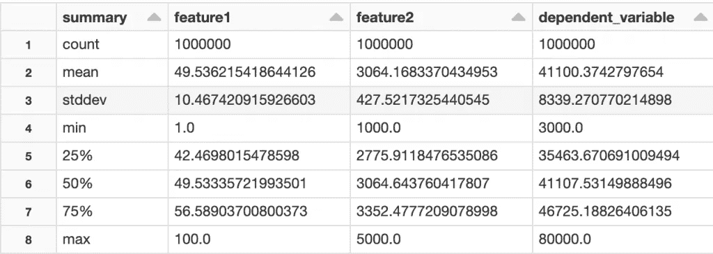
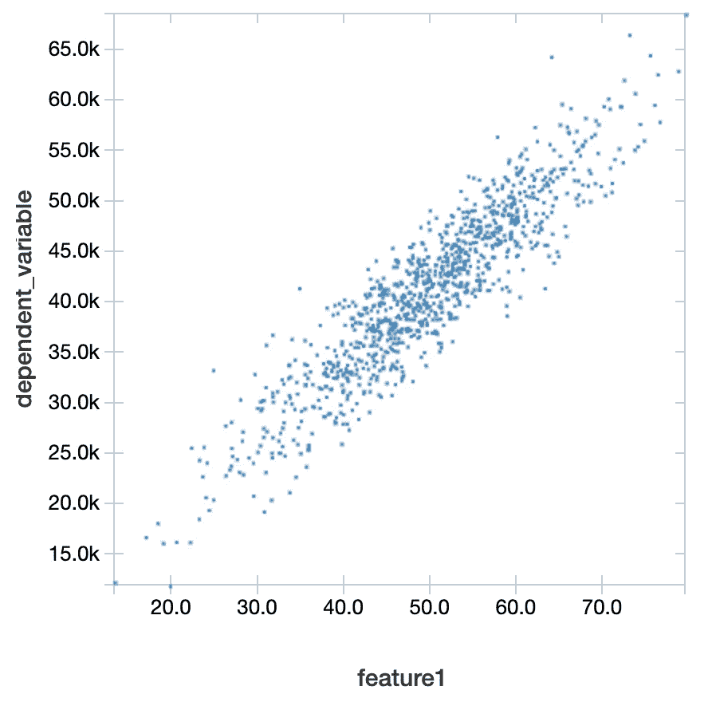
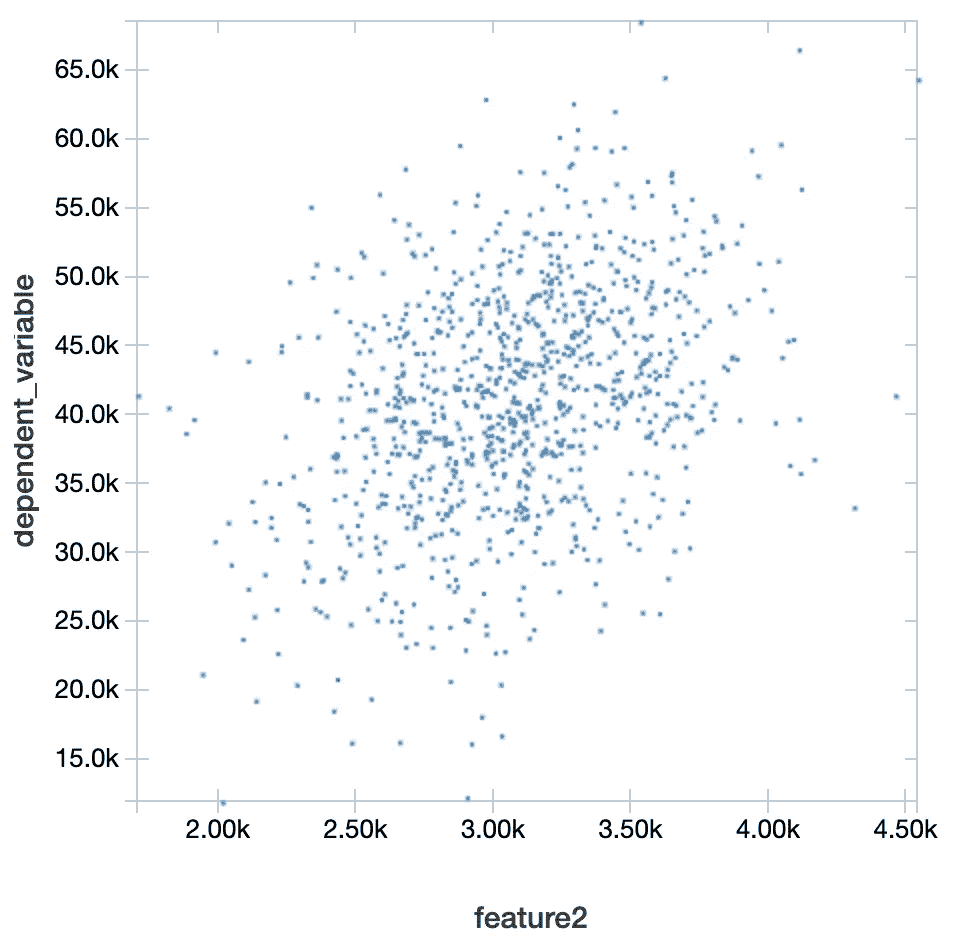
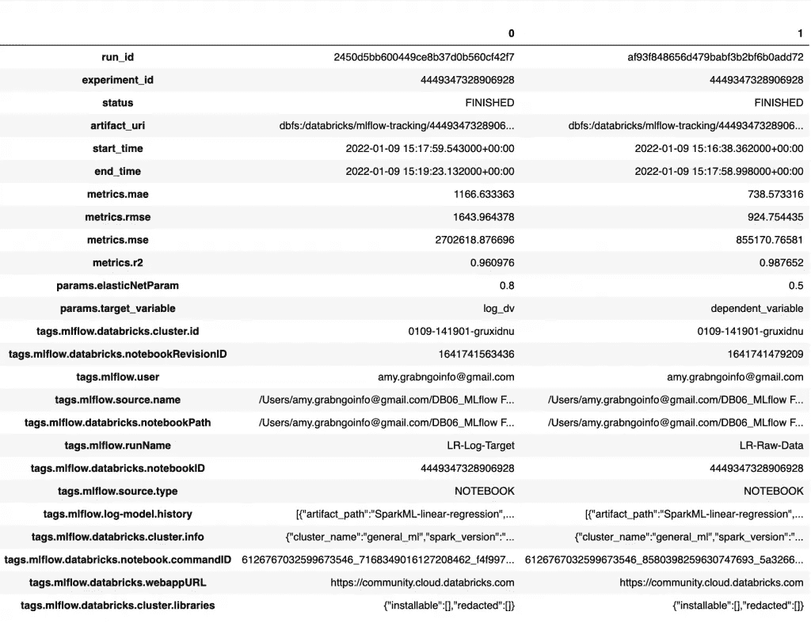
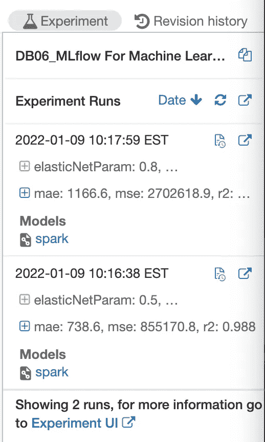
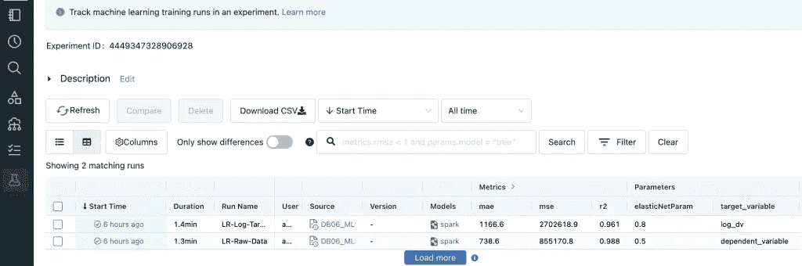

# 线性回归模型的数据块 ml 流跟踪

> 原文：<https://pub.towardsai.net/databricks-mlflow-tracking-for-linear-regression-model-8585d5f5f8a2?source=collection_archive---------1----------------------->

如何使用 MLflow 跟踪不同的模型版本，检索实验信息？


Solen Feyissa 在 [Unsplash](https://unsplash.com?utm_source=medium&utm_medium=referral) 上拍摄的照片

MLflow 是一个用于机器学习生命周期管理的开源平台。Databricks 上的 MLflow 提供了运行、跟踪和服务机器学习模型的集成体验。在本教程中，我们将涵盖:

*   如何使用 MLflow 跟踪不同的模型版本？
*   如何编程检索 MLflow 实验信息？
*   如何使用 Databricks UI 检索 MLflow 信息？

**本帖资源:**

*   YouTube[上这篇文章的视频教程](https://www.youtube.com/watch?v=yHDVYpEupHU&list=PLVppujud2yJrb5CCEu0gqgI_W0YuCygIc&index=8)
*   带代码的笔记本
*   关于 [Databricks 和 PySpark 的更多视频教程](https://www.youtube.com/playlist?list=PLVppujud2yJrb5CCEu0gqgI_W0YuCygIc)
*   更多关于 [Databricks 和 PySpark 的博客文章](https://medium.com/@AmyGrabNGoInfo/list/databricks-and-pyspark-7b59768e202d)

我们开始吧！

# 步骤 1:导入库

在步骤 1 中，我们将导入库。`pandas`、`numpy`和 pyspark SQL 函数用于数据处理。

`matplotlib`是为了形象化。

`make_regression`用于创建合成建模数据集。

从`pyspark.ml`库中，我们导入了用于特征格式化的`VectorAssembler`，用于模型训练的`LinearRegression`，用于模型评估的`RegressionEvaluator`，以及用于管道创建和加载的`Pipeline`。

我们还导入了`mlflow`、`mlflow.spark`用于 spark flavor、`MlflowClient`用于查询型号信息。如果使用 Databricks 运行时进行机器学习，则安装 MLflow。否则，可以从 PyPI 安装 MLflow 包。

```
# Data processing
import pandas as pd
import numpy as np
from pyspark.sql.functions import log, col, exp# Visulaization
import matplotlib.pyplot as plt# Create synthetic dataset
from sklearn.datasets import make_regression# Modeling
from pyspark.ml.feature import VectorAssembler
from pyspark.ml.regression import LinearRegression
from pyspark.ml.evaluation import RegressionEvaluator
from pyspark.ml import Pipeline# MLflow
import mlflow
import mlflow.spark
from mlflow.tracking import MlflowClient
```

# 步骤 2:为线性回归创建数据集

在步骤 2 中，我们将为线性回归模型创建一个合成数据集。

使用`make_regression`，创建了一个包含一百万条记录的数据集。该数据集有两个特征，并且这两个特征都是信息性的。它的噪声为 10，偏差为 2。`random_state`确保随机创建的数据集可重现。随机状态不一定是 42。它可以是任何数字。

```
# Create a synthetic dataset
X, y = make_regression(n_samples=1000000, 
                       n_features=2, 
                       n_informative=2,
                       noise=10, 
                       bias=2, 
                       random_state=42)
```

创建数据集后，我们可以将值调整到所需的范围。在此示例中，第一个要素的值被缩放到 1 到 100 之间，第二个要素的值被缩放到 1000 到 5000 之间，目标的值被缩放到 3000 到 80，000 之间。

```
# Scale feature 1 to values between 1 and 100
X[:, 0] = np.interp(X[:, 0], (X[:, 0].min(), X[:, 0].max()), (1, 100))# Scale feature 2 to values between 1000 and 5000
X[:, 1] = np.interp(X[:, 1], (X[:, 1].min(), X[:, 1].max()), (1000, 5000))# Scale dependent variable to values between 3000 and 80000
y = np.interp(y, (y.min(), y.max()), (3000, 80000))
```

`make_regression`的输出是数组格式。我们将其转换成熊猫数据帧，然后熊猫数据帧被转换成火花数据帧。

```
# Convert the data from numpy array to a pandas dataframe
pdf = pd.DataFrame({'feature1': X[:, 0], 'feature2': X[:, 1], 'dependent_variable': y})# Convert pandas dataframe to spark dataframe
sdf = spark.createDataFrame(pdf)# Check data summary statistics
display(sdf.summary())
```

`summary()`给出了数据集的汇总统计数据。



线性回归的合成数据—来自 GrabNGoInfo.com 的图像

接下来，让我们检查特征和因变量之间的散点图。可视化是使用 Databricks 笔记本内置功能创建的。要了解更多信息，请查看我之前关于大数据[Data bricks Dashboard](https://grabngoinfo.com/databricks-dashboard-for-big-data/)的教程。

```
display(sdf.select('dependent_variable', 'feature1'))
```



特征 1 和因变量之间的散点图—来自 GrabNGoInfo.com 的图像

```
display(sdf.select('dependent_variable', 'feature2'))
```



特征 2 和因变量之间的散点图—来自 GrabNGoInfo.com 的图像

我们可以看到，两种功能的散点图都显示出积极的趋势，但它们的形状和斜率不同。

# 步骤 3:训练测试分割

在创建建模数据集之后，在步骤 3 中，我们将进行训练测试分割。

使用`randomSplit`，我们将数据集分成 80%的训练和 20%的验证。`seed=42`使随机分割结果可重复。但是，我们需要确保在复制分割时使用相同的集群和分区号。

分割后，我们在训练数据集中得到 800，299，在测试数据集中得到 199，701。

```
# Train test split
trainDF, testDF = sdf.randomSplit([.8, .2], seed=42)# Print the number of records
print(f'There are {trainDF.cache().count()} records in the training dataset.')
print(f'There are {testDF.cache().count()} records in the testing dataset.')
```

# 步骤 4:原始数据的线性回归—模型 1

在第 4 步中，我们将使用线性回归创建第一个模型。在此模型中，将直接使用合成数据集中创建的要素和因变量。所以我们给它起个运行名`LR-Raw-Data`。

首先，使用 spark ML 训练线性回归模型。要了解更多细节，请查看我之前关于使用 Spark ML 的 [Databricks 线性回归的教程。](https://grabngoinfo.com/databricks-linear-regression-with-spark-ml/)

然后记录模型的参数。对于这个实验，我们计划创建两个版本的模型，一个使用原始因变量，另一个使用因变量的对数。模型 1 使用原始因变量。为了记录这些信息，我们将因变量的名称保存到一个名为`target_variable`的参数中。

我们还记录了弹性网的参数。0.5 表示 50%的拉索(L1)正则化和 50%的岭(L2)正则化。要了解更多关于正则化，请查看我以前的教程[拉索(L1) Vs 山脊(L2) Vs 弹性网正则化](https://grabngoinfo.com/lasso-l1-vs-ridge-l2-vs-elastic-net-regularization-for-classification-model/)。

之后，我们为这次运行记录了模型，对测试数据集进行了预测，并将预测 CSV 文件保存为工件。

在进行模型性能评估时，我们计算了 RMSE、R 平方、MSE 和 MAE。并且它们被记录为实验度量。

最后，创建因变量分布图，并将其记录为工件。

```
with mlflow.start_run(run_name="LR-Raw-Data") as run:
    # Define pipeline
    vecAssembler = VectorAssembler(inputCols=["feature1", "feature2"], outputCol="features")
    lr = LinearRegression(featuresCol="features", labelCol="dependent_variable", predictionCol="prediction",elasticNetParam=0.5)
    pipeline = Pipeline(stages=[vecAssembler, lr])
    pipelineModel = pipeline.fit(trainDF) # Log parameters
    mlflow.log_param("target_variable", "dependent_variable")
    mlflow.log_param("elasticNetParam", 0.5) # Log the model for this run
    mlflow.spark.log_model(pipelineModel, "SparkML-linear-regression") # Make predictions
    predDF = pipelineModel.transform(testDF)    

    # Save the prediction as csv
    predDF.toPandas().to_csv('predictions.csv', index=False)

    # Log the saved prediction as artifact
    mlflow.log_artifact("predictions.csv")

    # Evaluate predictions
    regressionEvaluator = RegressionEvaluator(predictionCol="prediction", labelCol="dependent_variable")
    rmse = regressionEvaluator.setMetricName("rmse").evaluate(predDF)
    r2 = regressionEvaluator.setMetricName("r2").evaluate(predDF)
    mse = regressionEvaluator.setMetricName("mse").evaluate(predDF)
    mae = regressionEvaluator.setMetricName("mae").evaluate(predDF)

    # Log metrics
    mlflow.log_metric("rmse", rmse)
    mlflow.log_metric("r2", r2)    
    mlflow.log_metric("mse", mse)    
    mlflow.log_metric("mae", mae)    # Create a plot for the testing dataset
    testDF.toPandas().hist(column="dependent_variable", bins=100)

    # Log artifact
    plt.savefig("dependent_variable.png")
    mlflow.log_artifact("dependent_variable.png")
```

# 步骤 5:使用对数目标的线性回归—模型 2

取对数是一种常用的数据转换技术。它通常用于将非正态分布数据转换为正态分布。我们的合成数据已经是正态分布，所以它不需要对数。但是为了便于说明，我们想创建一个带有对数转换的模型版本。

首先，我们将运行命名为`LR-Log-Target`，表明目标变量是原始数据的对数变换。

然后，为训练数据集和测试数据集创建因变量的对数。

代码的其余部分与前面的模型非常相似，除了三处变化。第一个变化是与因变量相关的信息更新为对数版本。第二个变化是 elasticNetParam 从 0.5 变为 0.8。第三个变化与模型预测有关。因为模型训练的目标标签是对数形式的，所以预测值也是对数形式的。因此，在进行模型性能评估之前，我们需要计算预测的指数。

```
with mlflow.start_run(run_name="LR-Log-Target") as run:
    # Take the log of the target variable
    logTrainDF = trainDF.withColumn("log_dv", log(col("dependent_variable")))
    logTestDF = testDF.withColumn("log_dv", log(col("dependent_variable"))) # Define pipeline
    vecAssembler = VectorAssembler(inputCols=["feature1", "feature2"], outputCol="features")
    lr = LinearRegression(featuresCol="features", labelCol="log_dv", predictionCol="log_prediction", elasticNetParam=0.8)
    pipeline = Pipeline(stages=[vecAssembler, lr])
    pipelineModel = pipeline.fit(logTrainDF) # Log parameters
    mlflow.log_param("target_variable", "log_dv")
    mlflow.log_param("elasticNetParam", 0.8) # Log model
    mlflow.spark.log_model(pipelineModel, "SparkML-linear-regression") # Make predictions
    predDF = pipelineModel.transform(logTestDF)
    expDF = predDF.withColumn("prediction", exp(col("log_prediction")))

    # Save the prediction as csv
    predDF.toPandas().to_csv('predictions.csv', index=False)

    # Log the samved prediction as artifact
    mlflow.log_artifact("predictions.csv")

    # Evaluate predictions
    regressionEvaluator = RegressionEvaluator(predictionCol="prediction", labelCol="dependent_variable")
    rmse = regressionEvaluator.setMetricName("rmse").evaluate(expDF)
    r2 = regressionEvaluator.setMetricName("r2").evaluate(expDF)
    mse = regressionEvaluator.setMetricName("mse").evaluate(expDF)
    mae = regressionEvaluator.setMetricName("mae").evaluate(expDF)

    # Log metrics
    mlflow.log_metric("rmse", rmse)
    mlflow.log_metric("r2", r2)    
    mlflow.log_metric("mse", mse)    
    mlflow.log_metric("mae", mae)    

    # Create a plot for the testing dataset
    logTestDF.toPandas().hist(column="log_dv", bins=100)

    # Log artifact
    figPath = 'grabngoinfo_' + "logDv.png" 
    plt.savefig("log_dependent_variable.png")
    mlflow.log_artifact("log_dependent_variable.png")
```

# 步骤 6:以编程方式获取模型实验信息

在步骤 6 中，我们将通过编程获得模型实验信息。

`MlflowClient()`中的`list_experiments()`列出了所有的实验及其 id。

```
# List MLflow experiments
MlflowClient().list_experiments()
```

实验有两种，工作空间实验和笔记本实验。

*   工作空间实验是从 Databricks 机器学习 UI 或 MLflow API 创建的。任何笔记本都可以通过实验 ID 或实验名称将运行记录到工作区实验中。我们可以从工作区菜单访问工作区实验。
*   笔记本实验与特定的笔记本相关联。实验是由 Databricks 自动创建的。我们可以从笔记本上访问笔记本实验。

本教程中的实验是一个笔记本实验。

要获得一个实验的所有运行，使用`mlflow.search_runs`并传入`experiment_id`。

```
# Get all runs for a given experiment
experiment_id = run.info.experiment_id
runs_df = mlflow.search_runs(experiment_id)# Display information
runs_df.T
```



数据块获取 MLflow 实验的所有运行结果—图片来自 GrabNGoInfoc.om

我们可以看到，具有原始数据的模型比数据的日志版本具有更好的性能。

当一个实验中有很多次运行时，我们可能希望按时间降序排列这些运行，并获取最新运行的信息。`max_results`控制要保持的运行次数。

```
# Get the the latest run
runs = MlflowClient().search_runs(experiment_id, order_by=["attributes.start_time desc"], max_results=1)# Get the metrics from the latest run
runs[0].data.metrics
```

输出

```
Out[33]: {'mae': 1166.6333634351645,
 'mse': 2702618.876696308,
 'r2': 0.9609755978839164,
 'rmse': 1643.9643781713485}
```

# 步骤 7:使用用户界面获取模型实验信息

在第 7 步中，我们将讨论如何使用 Databricks UI 来检索实验信息。

## 步骤 7.1:访问笔记本中的实验信息

要查看笔记本内的实验信息，我们可以点击笔记本右上角的**实验**图标。笔记本右侧边栏显示了这两种型号。



访问 Databricks 笔记本中的实验信息—图片来自 GrabNGoInfo.com

## 步骤 7.2:进入实验界面

要在新页面上打开完整的实验 UI，请点击侧边栏底部的蓝色**实验 UI** 。



访问 Databricks 笔记本中的实验信息—图片来自 GrabNGoInfo.com

## 步骤 7.3:访问实验运行信息

要查看跑步详情，请点击蓝色的**开始时间**(本例中为 6 小时前)或跑步的**型号**下的蓝色火花。


Databricks MLflow 实验运行界面—图片来自 GrabNGoInfo.com

通过单击 UI 左侧的选项列表，我们可以获得关于这次运行的详细信息。它还提供了使用 Spark 和 pandas dataframe 进行预测的代码。

# 摘要

在本教程中，我们讨论了如何使用 MLflow 来跟踪 spark ML 线性回归模型。我们涵盖了:

*   如何使用 MLflow 跟踪不同的模型版本？
*   如何编程检索 MLflow 实验信息？
*   如何使用 Databricks UI 检索 MLflow 信息？

更多教程可在 GrabNGoInfo [YouTube 频道](https://www.youtube.com/channel/UCmbA7XB6Wb7bLwJw9ARPcYg)和[GrabNGoInfo.com](https://grabngoinfo.com/tutorials/)获得

# 推荐给你

*   [GrabNGoInfo 机器学习教程盘点](https://medium.com/grabngoinfo/grabngoinfo-machine-learning-tutorials-inventory-9b9d78ebdd67)
*   [用于异常检测的单级 SVM](https://medium.com/p/one-class-svm-for-anomaly-detection-6c97fdd6d8af)
*   [利用 Python 中的 Prophet 进行具有季节性和假日效应的多元时间序列预测](https://medium.com/p/multivariate-time-series-forecasting-with-seasonality-and-holiday-effect-using-prophet-in-python-d5d4150eeb57)
*   [XGBoost](https://medium.com/p/hyperparameter-tuning-for-xgboost-91449869c57e)的超参数调谐
*   [推荐系统:基于用户的协同过滤](https://medium.com/p/recommendation-system-user-based-collaborative-filtering-a2e76e3e15c4)
*   [使用 Python 实现不平衡分类的四种过采样和欠采样方法](https://medium.com/p/four-oversampling-and-under-sampling-methods-for-imbalanced-classification-using-python-7304aedf9037)
*   [如何检测离群值|数据科学面试问答](https://medium.com/p/how-to-detect-outliers-data-science-interview-questions-and-answers-1e400284f6b4)
*   [LASSO (L1) Vs Ridge (L2) Vs 分类模型的弹性网正则化](https://medium.com/@AmyGrabNGoInfo/lasso-l1-vs-ridge-l2-vs-elastic-net-regularization-for-classification-model-409c3d86f6e9)

# 参考

*   [MLflow 文档](https://mlflow.org/docs/latest/index.html)
*   [数据块上的 ml 流动指南](https://docs.databricks.com/applications/mlflow/index.html)
*   [MLflow 快速启动](https://docs.databricks.com/applications/mlflow/quick-start-python.html#language-PySpark)
*   [Apache Spark MLlib 分类和回归文档](https://spark.apache.org/docs/latest/ml-classification-regression.html)
*   [MLlib 线性回归 Python API 文档](https://spark.apache.org/docs/latest/api/python/reference/api/pyspark.ml.regression.LinearRegression.html#pyspark.ml.regression.LinearRegression)
*   [跟踪机器学习训练运行文档](https://docs.databricks.com/applications/mlflow/tracking.html#view-notebook-experiment)

[](https://medium.com/@AmyGrabNGoInfo/membership) [## 通过我的推荐链接加入媒体-艾米 GrabNGoInfo

### 作为一个媒体会员，你的会员费的一部分会给你阅读的作家，你可以完全接触到每一个故事…

medium.com](https://medium.com/@AmyGrabNGoInfo/membership)