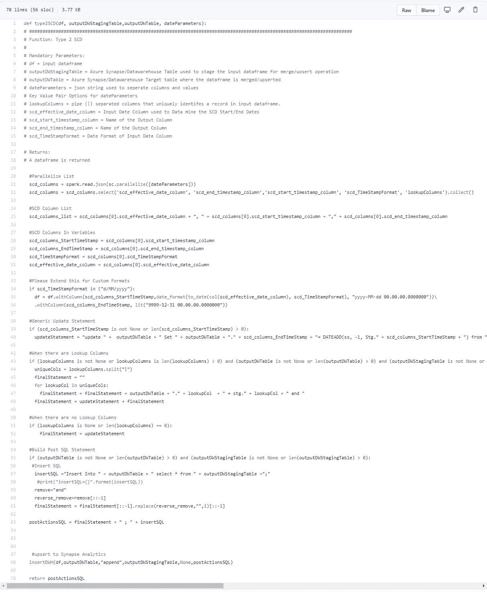

# 用于 Azure Synapse 分析的 Databricks PySpark Type 2 SCD 函数

> 原文：<https://pub.towardsai.net/databricks-pyspark-type-2-scd-function-for-azure-synapse-analytics-8c0ff8862a11?source=collection_archive---------4----------------------->

## [云计算](https://towardsai.net/p/category/cloud-computing)

渐变维度(SCD)是数据仓库中常用的维度建模技术，用于捕捉维度内随时间变化的数据(图 1)。三种最常用的 SCD 类型是 0、1、2。

大多数 DW/BI 项目都有类型 2 维度，其中属性的更改会导致当前维度记录终止，并创建一个新记录，以提供数据更改的完整历史记录。参见下面的例子

**之前的数据**

**在**之后

我在与一家电力配送公司的最新项目中使用了这种方法，目的是跟踪澳大利亚能源监管机构批准的电价随时间的变化。

今天，我将与大家分享如何创建一个可重用的 PySpark 函数，它可以在 Databricks 工作流中重用，而且只需很少的工作。

# 2 型 SCD PySpark 函数

在我们开始编写代码之前，我们必须了解 Databricks Azure Synapse 分析连接器。它支持读/写操作，并在写入表之前或之后的操作前或操作后操作中接受有效的 SQL 语句。因此，要创建这个函数，代码必须形成传递给连接器的有效 SQL 语句。

**先决条件**

*   必须创建 Azure Synapse 暂存和目标表，以获得最佳性能和存储

**功能**

*   该函数接受输入数据帧
*   当查找列被传递给函数时，它们用于连接临时表和目标表。查找列提供了仅关闭来自输入数据帧的行的功能，这些数据帧当前在目标表中打开，有效结束日期为 9999–12–31，当前日期-时间
*   如果没有传递查找列，则不使用连接条件，所有当前记录都被关闭，所有新的输入记录都是打开的记录
*   该功能能够处理不同的输入日期\日期时间格式，并将输出与业务一致的统一日期时间格式。下面的例子:

输入格式:2020 年 1 月 1 日或 2010 年 1 月 1 日

输出格式:2020–01–01 00:00:00.000

*   关闭当前打开的记录—取决于提供的查找列
*   插入新数据集，设置新记录的开放日期时间为“9999–12–31 00 . 00 . 00 . 000”

**输入参数**

*   数据帧 df
*   outputDWTable:输出 Synapse 分析表的名称，例如 DW。关税
*   outputDWStagingTable:输出 Synapse Analytics 临时表的名称，例如 DW。StagingTariffs
*   dateParameters:接受 Json 键值对中的以下内容

{

" SCD _ effective _ date _ column ":"<enter here="" input="" date="" column="">"，</enter>

" SCD _ end _ timestamp _ column ":"<enter here="" scd="" enddate="" column="" name="">"，</enter>

" SCD _ start _ timestamp _ column ":"<enter here="" scd="" startdate="" column="" name="">"，-</enter>

" scd_TimeStampFormat":" <enter here="" source="" date="" format="" this="" is="" used="" to="" convert="" destination="" datetype="">"，</enter>

" lookupColumns":" <enter lookupcolumn="" pipe="" seperated="">"</enter>

}

**代号**

请查看每个代码块的注释以获得解释。

# 结论

如果你想要一本，请给我留言，我可以给你发一个链接到我的私人 GIT 回购。

我希望您发现这很有帮助，通过使用它，将节省您编写 PySpark Type 2 SCD 函数的时间。任何想法，问题，更正和建议都非常欢迎:)

如果你发现了这个有用的#数据工程#分享#社区#数据砖#PySpark #Type2 #SCD，请在 LinkedIn 上分享

 [## 数据掌握| LinkedIn

### Azure 数据平台| Databricks |大数据| Power BI |分析行业信息技术和服务…

au.linkedin.com](https://au.linkedin.com/company/data-mastery?trk=public_profile_experience-item_profile-section-card_subtitle-click) 

# 如果你喜欢这篇文章，这里有一些你可能喜欢的其他文章:

 [## Databricks:使用 PySpark 升级到 Azure SQL

### Upsert 是 RDBMS 的一个特性，它允许 DML 语句的作者自动插入一行，或者如果该行…

rorymcmanus.medium.com](https://rorymcmanus.medium.com/databricks-upsert-to-azure-sql-using-pyspark-5937e8303fbf)  [## Azure 认知服务情感分析 V3—使用 PySpark

### 什么是 Azure 认知服务-文本分析？

pub.towardsai.net](/azure-cognitive-services-sentiment-analysis-v3-using-pyspark-b38bfcfd20fb)