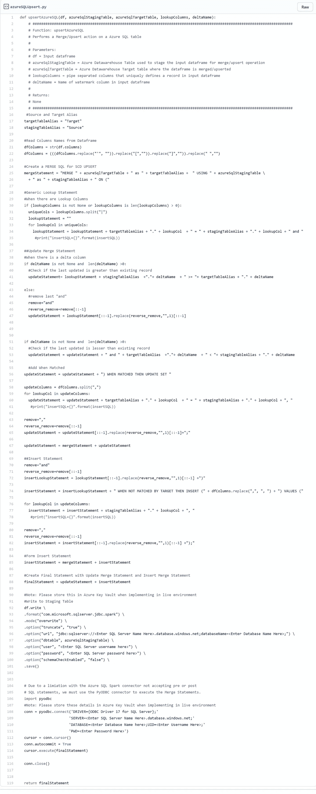

# Databricks:使用 PySpark 升级到 Azure SQL

> 原文：<https://pub.towardsai.net/databricks-upsert-to-azure-sql-using-pyspark-5937e8303fbf?source=collection_archive---------1----------------------->

## [云计算](https://towardsai.net/p/category/cloud-computing)

Upsert 是一种 RDBMS 特性，它允许 DML 语句的作者自动插入一行，或者如果该行已经存在，则更新该现有行。

根据我构建多个 Azure 数据平台的经验，我已经能够开发可重用的 ELT 函数，可以在项目之间使用，其中一个是 Azure SQL upsert 函数。

今天我将和你分享如何使用 PySpark 创建一个 Azure SQL Upsert 函数。它可以在 Databricks 工作流中重用，只需最少的工作量和灵活性。


基本上插逻辑

1.  创建了两个表，一个临时表和一个目标表
2.  数据被加载到分段表中
3.  这些表在查找列和/或增量列上联接，以标识匹配项
4.  如果临时表中的记录存在于目标表中，则在目标表中更新该记录
5.  如果临时表中的记录在目标表中不存在，则将它插入到目标表中

# Azure SQL Upsert PySpark 函数

功能

*   输入数据帧被写入 Azure SQL 上的临时表
*   该函数接受多个查找列和/或可选增量列的参数，以连接临时表和目标表
*   如果将增量列传递给函数，则只有当临时表记录比目标表记录新时，它才会更新目标表中的记录
*   该函数将动态读取数据帧列，以形成 SQL Merge upsert 和 insert 语句的一部分

在编写代码之前，理解 Spark Azure SQL 数据库连接器至关重要。连接器不支持写入表后的 preUpdate 或 postUpdate 语句。因此，我们需要将数据帧写入 staging 表，然后将有效的 SQL merge 语句传递给 PyODBC 连接器以执行 upsert。

**先决条件**

*   使用正确的数据类型和索引创建 Azure SQL 目标和临时表，以提高连接性能
*   在您的集群上安装 Apache Spark connector for SQL Server 和 Azure SQL:【https://github.com/microsoft/sql-spark-connector】T4
*   在集群上运行以下代码来安装 PyODBC

```
%sh
curl [https://packages.microsoft.com/keys/microsoft.asc](https://packages.microsoft.com/keys/microsoft.asc) | apt-key add -
curl [https://packages.microsoft.com/config/ubuntu/](https://packages.microsoft.com/config/ubuntu/)**16.04**/prod.list > /etc/apt/sources.list.d/mssql-release.list 
apt-get update
ACCEPT_EULA=Y apt-get install msodbcsql17
apt-get -y install unixodbc-dev
sudo apt-get install python3-pip -y
pip3 install --upgrade pyodbc
```

注意:当您重新启动集群或创建新的集群时，这些设置将会丢失，您需要再次运行。省去麻烦，把它放到一个[初始化脚本](https://docs.databricks.com/user-guide/clusters/init-scripts.html)中。这样你就不用重复这种痛苦了。

**输入参数**

*   df:输入数据帧
*   Azure SQL stagingtable:Azure SQL 目标表的名称
*   azureSqlDWTable:Azure SQL 目标 DW 表的名称
*   lookupColumns:在输入数据帧中唯一定义记录的管道分隔列，例如 CustomerId 或 CustomerId|FirstName
*   deltaColumn:输入数据帧中水印列的名称

**代码**

请查看每个代码块的注释以获得解释。



# 结论

如果你想要一本，请在 [LinkedIn](https://www.linkedin.com/in/rorymcmanus/) 上给我留言。

我希望这对您有所帮助，并在编写 upsert 函数时节省您的时间。任何想法，问题，更正和建议都非常欢迎:)

如果你觉得这个有用，请在 LinkedIn 上分享#数据工程#分享#社区#数据砖#PySpark #AzureSQL #SQL #ELT

 [## Rory McManus —数据架构师—数据掌握| LinkedIn

### Azure 数据工厂、Spark Databricks 和 AI 领域的 Azure 数据架构师专家。构建平台的丰富经验…

www.linkedin.com](https://www.linkedin.com/in/rorymcmanus/) 

# 如果你喜欢这篇文章，这里有一些你可能喜欢的其他文章:

[](/databricks-pyspark-type-2-scd-function-for-azure-synapse-analytics-8c0ff8862a11) [## 用于 Azure Synapse 分析的 Databricks PySpark Type 2 SCD 函数

### 渐变维度(SCD)是数据仓库中一种常用的维度建模技术，用于捕获…

pub.towardsai.net](/databricks-pyspark-type-2-scd-function-for-azure-synapse-analytics-8c0ff8862a11) [](/azure-cognitive-services-sentiment-analysis-v3-using-pyspark-b38bfcfd20fb) [## Azure 认知服务情感分析 V3—使用 PySpark

### 什么是 Azure 认知服务-文本分析？

pub.towardsai.net](/azure-cognitive-services-sentiment-analysis-v3-using-pyspark-b38bfcfd20fb)