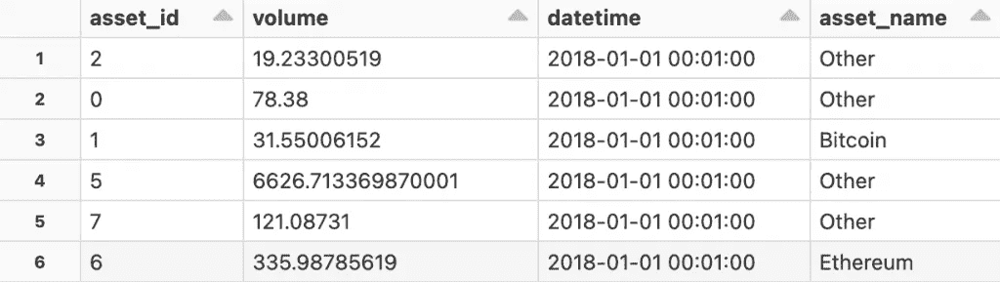
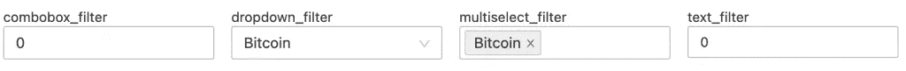
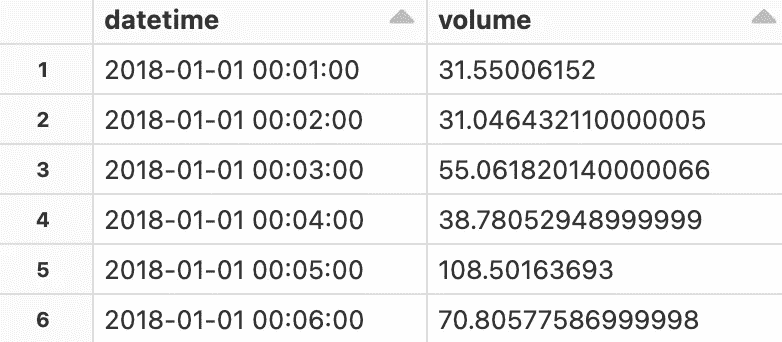
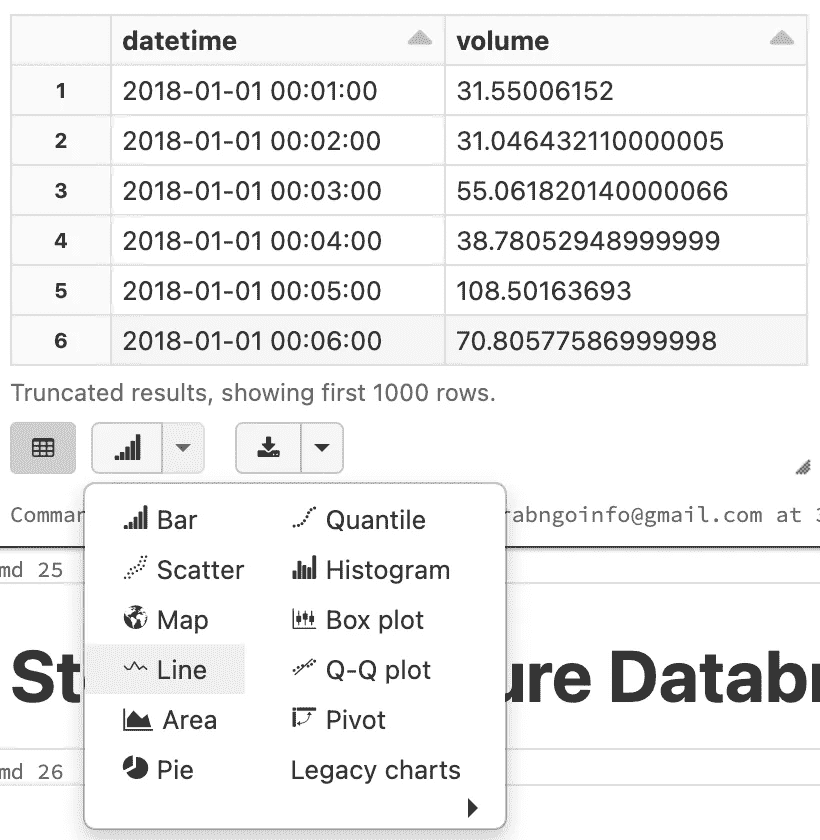
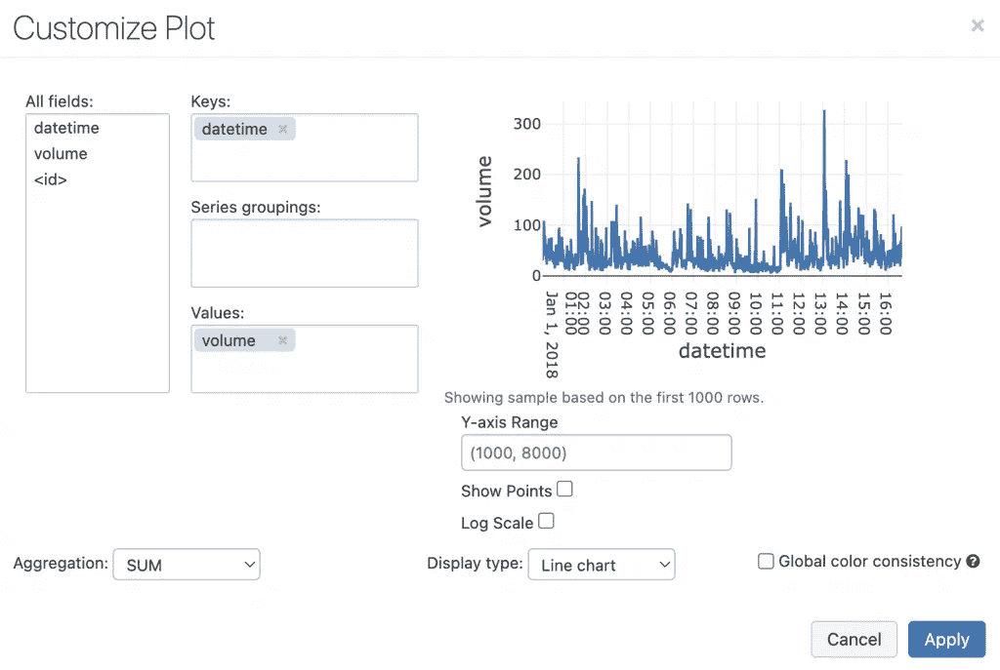
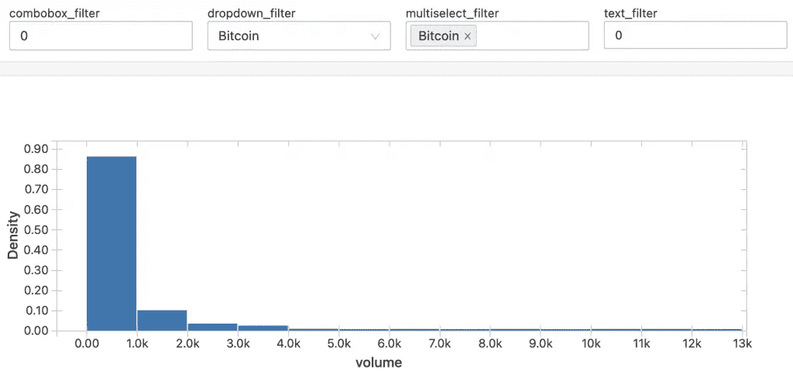
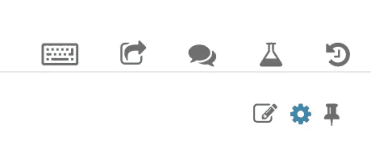
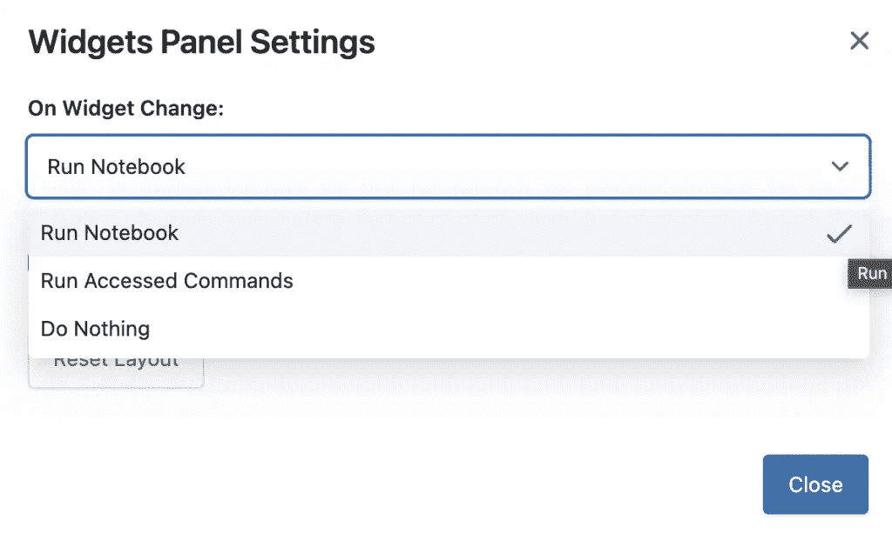
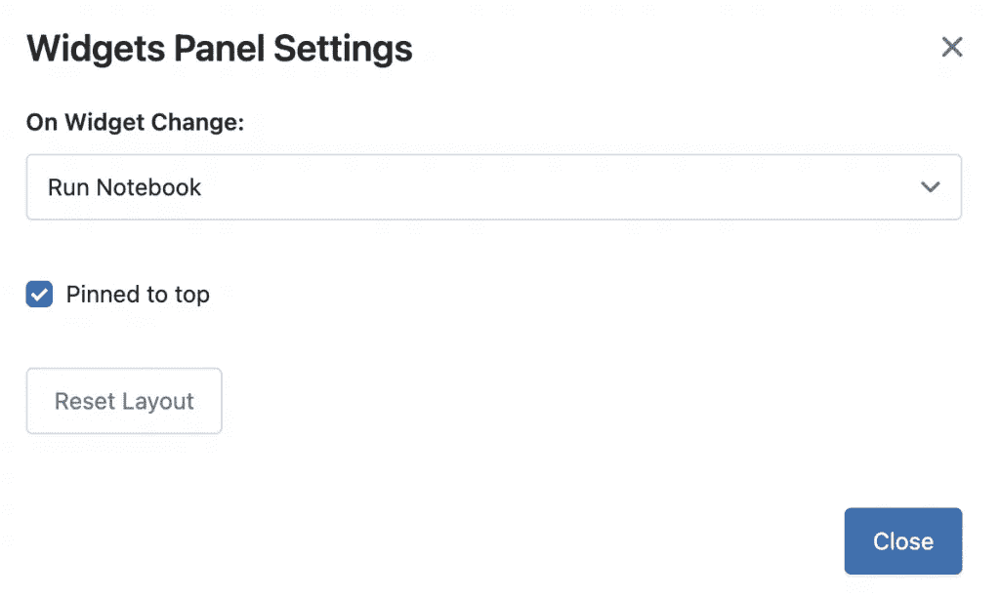

# SQL 记事本中的数据块小部件

> 原文：<https://pub.towardsai.net/databricks-widgets-in-sql-notebook-6c7cdbe47402?source=collection_archive---------2----------------------->

## 使用 SQL 代码对数据块中的笔记本和仪表板应用不同的参数


Igor Tudoran 在 [Unsplash](https://unsplash.com?utm_source=medium&utm_medium=referral) 上拍摄的照片

Databricks 小部件 API 使用户能够为笔记本和仪表板应用不同的参数。最好是使用不同的参数值重新运行相同的代码。在仪表板中使用时，它会为仪表板图表创建筛选器。

Databricks 支持小部件 API 的 python 和 SQL 代码。在本教程中，我们将讨论如何使用 SQL 创建小部件。我们将涵盖:

*   如何使用 SQL 创建不同类型的小部件？
*   如何将 widget 值传递给笔记本和仪表盘？
*   如何配置 widget 设置？
*   如何删除 widgets？

**本帖资源:**

*   YouTube 上的视频教程
*   带代码的数据块[笔记本](https://mailchi.mp/456c6d0fa21e/5b452tfxg4)
*   关于[数据块的更多视频教程](https://www.youtube.com/playlist?list=PLVppujud2yJrb5CCEu0gqgI_W0YuCygIc)
*   更多关于[数据块的博客文章](https://medium.com/@AmyGrabNGoInfo/list/databricks-and-pyspark-7b59768e202d)

要了解 python 小部件，请参考我在 Python 笔记本上的教程 [Databricks 小部件。](https://grabngoinfo.com/databricks-widgets-in-python-notebook/)

我们开始吧！

# 步骤 0:数据块小部件类型

有四种类型的 Databricks 小部件:

*   `text`将文本作为输入。
*   `dropdown`创建一个带有值的下拉列表。
*   `combobox`是文本和下拉菜单的组合。用户可以从下拉列表中选择值，也可以输入自己的值。
*   `multiselect`创建一个值列表。用户可以从列表中选择一个或多个值。

要获得关于 widgets 的帮助信息，请使用`dbutils.widgets.help()`。我们需要在单元格的开头添加`%python`，因为笔记本的默认语言是 SQL。输出中有可用于小部件的方法及其语法。

```
%python
# Get documentation about widgets
dbutils.widgets.help()
```

输出:

```
dbutils.widgets provides utilities for working with notebook widgets. You can create different types of widgets and get their bound value. For more info about a method, use dbutils.widgets.help("methodName").
combobox(name: String, defaultValue: String, choices: Seq, label: String): void -> Creates a combobox input widget with a given name, default value and choices
dropdown(name: String, defaultValue: String, choices: Seq, label: String): void -> Creates a dropdown input widget a with given name, default value and choices
get(name: String): String -> Retrieves current value of an input widget
getArgument(name: String, optional: String): String -> (DEPRECATED) Equivalent to get
multiselect(name: String, defaultValue: String, choices: Seq, label: String): void -> Creates a multiselect input widget with a given name, default value and choices
remove(name: String): void -> Removes an input widget from the notebook
removeAll: void -> Removes all widgets in the notebook
text(name: String, defaultValue: String, label: String): void -> Creates a text input widget with a given name and default value
```

要获得关于特定小部件方法的帮助信息，请使用`dbutils.widgets.help(methodName)`。例如，我可以使用`dbutils.widgets.help('combobox')`来获取关于`combobox`方法的信息。

```
%python
# Get help informatuon for one method
dbutils.widgets.help('combobox')
```

输出:

```
/**
* Creates a combobox input widget with a given name, default value and choices. Optionally, you
* can provide a label for the combobox widget that will be rendered in place of the name. If a
* widget with a given name already exists, its properties will be overwritten. The default
* value does not have to be one choices.
*
* Example: dbutils.widgets.combobox("product", "Other", Seq("Camera", "GPS", "Smartphone"))
*
* @param name unique name identifying the widget
* @param defaultValue value value which widget is populated by default
* @param choices possible choices for the dropdown menu
* @param label optional widget label
*/
combobox(name: java.lang.String, defaultValue: java.lang.String, choices: scala.collection.Seq, label: java.lang.String): void
```

# 步骤 1:读入数据集

在步骤 1 中，从安装的 S3 桶中读取关于加密货币价格的 CSV 数据集。该数据集是 [Kaggle G-Research 加密预测数据集](https://www.kaggle.com/competitions/g-research-crypto-forecasting/data)的子集。要了解如何将 AWS S3 铲斗安装到数据块，请参考我之前的教程[将数据块安装到 AWS S3 并导入数据](https://medium.com/@AmyGrabNGoInfo/databricks-mount-to-aws-s3-and-import-data-4100621a63fd)。

```
-- mode "FAILFAST" will abort file parsing with a RuntimeException if any malformed lines are encountered
CREATE OR REPLACE TEMPORARY VIEW crypto_100k_records
USING CSV
OPTIONS (path "/mnt/demo4tutorial/data/crypto_100k_records.csv", header "true", mode "FAILFAST");-- Take a look at the data
SELECT * FROM crypto_100k_records
```

看完数据后，我们会做一些数据处理。时间戳采用 UNIX 纪元格式，即自 1970 年 1 月 1 日协调世界时(UTC)以来的秒数。使用`from_unixtime`，我们将其更改为日期时间格式。可视化中不使用的列将被删除。我们还为资产名称创建了一个新列。

```
-- Data processing
CREATE OR REPLACE TEMPORARY VIEW df AS
SELECT 
  asset_id,
  volume,
  --Change epoch to datetime format
  from_unixtime(timestamp) AS datetime, 
  -- Create asset name
  CASE WHEN asset_id = 1 THEN 'Bitcoin' WHEN asset_id = 6 THEN 'Ethereum' ELSE 'Other' END AS asset_name
FROM crypto_100k_records;-- Take a look at the data
SELECT * FROM df
```

输出:



Databricks SQL 微件的数据集-来自 GrabNGoInfo.com 的图像

# 步骤 2:使用 SQL 创建 Databricks 小部件

在第 2 步中，我们使用 SQL 创建不同类型的 Databricks 小部件。

*   下拉小部件用于`Asset_Name`列。其名称为`dropdown_filter`，默认值为`Bitcoin`。下拉列表中有四个选项。`Bitcoin`、`Ethereum`、`Other`和`All`。`All`表示选择所有资产名称。
*   multiselect 小部件也基于`Asset_Name`列。其名称为`multiselect_filter`，默认值为`Bitcoin`。三个选项`Bitcoin`、`Ethereum`和`Other`是`Asset_Name`列的三个唯一值。我们可以使用 multiselect 小部件选择多值。
*   combobox 小部件基于`Asset_ID`列。其名称为`combobox_filter`，默认值为`0`。使用 SELECT DISTINCT 提取`Asset_ID`列的唯一值。
*   文本小部件也基于`Asset_ID`列。它的名称为`text_filter`，默认值为`0`。用户可以在框中输入资产 ID。

```
-- Create a dropdown widget
CREATE WIDGET DROPDOWN dropdown_filter DEFAULT "Bitcoin"  CHOICES (VALUES 'Bitcoin', 'Ethereum', 'Other', 'All');-- Create a multiselect widget
CREATE WIDGET MULTISELECT multiselect_filter DEFAULT "Bitcoin"  CHOICES (VALUES 'Bitcoin', 'Ethereum', 'Other');-- Create a combobox widget
CREATE WIDGET COMBOBOX combobox_filter DEFAULT "0"  CHOICES SELECT DISTINCT asset_id FROM df;-- Create a text widget
CREATE WIDGET TEXT text_filter DEFAULT "0";
```

运行代码后，小部件显示在笔记本的顶部。



Databricks SQL 小部件—图片来自 GrabNGoInfo.com

# 步骤 3:在 SQL 代码中传递小部件值

创建小部件后，在步骤 3 中，我们将讨论如何使用 SQL 传递小部件值。可以通过将小部件名称传递给`getArgument()`函数来检索小部件值。

```
-- Pass widget value to SQL code
SELECT * 
FROM df
WHERE asset_id = getArgument('text_filter')
```

输出:


数据块在 SQL 代码中传递小部件值—图片来自 GrabNGoInfo.com

当 dropdown 小部件将`All`作为选项时，我们需要区别对待`All`和其他选项，因为`All`不是 dataframe 列中的值。一种方法是，如果 dropdown widget 值为`All`，则使用`CASE WHEN`条件来包含所有记录，否则按 widget 值进行过滤。

```
-- Dropdown widget with All as one option
SELECT 
  datetime,
  volume
FROM df
WHERE CASE getArgument('dropdown_filter') WHEN 'Bitcoin' THEN asset_name = 'Bitcoin'
                                          WHEN 'Ethereum' THEN asset_name = 'Ethereum'
                                          WHEN 'Other' THEN asset_name = 'Other'    
                                          ELSE asset_name IN (SELECT DISTINCT asset_name FROM df) END
```

输出:



Databricks SQL 小部件下拉列表，选项为“全部”——图片来自 GrabNGoInfo.com

# 步骤 4:使用小部件作为仪表板的过滤器

在第 4 步中，我们将讨论如何使用小部件作为 Databricks dashboard 的过滤器。

首先，让我们使用 Databricks 的内置工具创建一个图表。

```
-- Dropdown widget with All as one option
SELECT 
  datetime,
  volume
FROM df
WHERE CASE getArgument('dropdown_filter') WHEN 'Bitcoin' THEN asset_name = 'Bitcoin'
                                          WHEN 'Ethereum' THEN asset_name = 'Ethereum'
                                          WHEN 'Other' THEN asset_name = 'Other'    
                                          ELSE asset_name IN (SELECT DISTINCT asset_name FROM df) END
```

点按条形图图标旁边的向下三角形，然后选择图表类型。



Databricks SQL Widgets 仪表板—来自 GrabNGoInfo.com 的图片

接下来，点击**绘图选项**图标，检查图表设置是否正确，必要时进行更改。



Databricks SQL Widgets 仪表板—来自 GrabNGoInfo.com 的图片

要创建仪表板，单击单元格右上角的条形图图标，然后单击**添加到新仪表板**。


Databricks SQL 小部件创建新的仪表板—图片来自 GrabNGoInfo.com

这将打开仪表板。我们可以看到仪表板顶部的过滤器。



作为仪表板过滤器的数据块 SQL 部件—图片来自 GrabNGoInfo.com

# 步骤 5:配置数据块部件

在第 5 步中，我们将通过单击笔记本右上角的齿轮图标来配置 Databricks 小部件。



数据块配置数据块部件—图片来自 GrabNGoInfo.com

将弹出**微件面板设置**窗口。在**微件更改**下，有三个选项。

*   **运行访问的命令**表示当小部件值改变时，仅重新运行直接检索改变的小部件的单元。这是默认设置，但它不适用于 SQL 单元格。
*   **什么都不做**表示笔记本不会根据新的小部件值重新运行。
*   **运行笔记本**表示重新运行整个笔记本。我建议选择这个选项，以防止遗漏代码中的一些重要步骤。



Databricks Widgets 面板设置—图片来自 GrabNGoInfo.com

默认情况下，widgets 面板固定在笔记本的顶部，但是我们可以取消固定到顶部选项，使其显示在第一个单元格的上方。



Databricks Pin 部件—图片来自 GrabNGoInfo.com

# 步骤 6:将值传递给另一个笔记本中的小部件

有时，我们可能需要使用另一个笔记本中的特定参数来运行该笔记本。在这种情况下，我们可以使用`%run`来运行笔记本，同时传递参数。下面的示例代码来自小部件的 Databricks 文档。

```
%python
# Pass parameters to widgets in another notebook
%run /path/to/notebook $X="10" $Y="1"
```

# 步骤 7:删除数据块部件

在第 7 步中，我们将讨论如何删除 Databricks 小部件。要删除一个小部件，请使用`REMOVE WIDGET widget_name`。

```
-- Remove one widget
REMOVE WIDGET text_filter
```

要移除所有的小部件，我们需要使用 python 代码`dbutils.widgets.removeAll()`。

```
%python
# Remove all widgets
dbutils.widgets.removeAll()
```

# 摘要

在本教程中，我们讨论了如何使用 SQL 创建小部件。你学到了:

*   如何使用 SQL 创建不同类型的小部件？
*   如何将 widget 值传递给笔记本和仪表盘？
*   如何配置 widget 设置？
*   如何删除 widgets？

请注意，您不能使用小部件在笔记本中的不同语言之间传递参数，并在计划的作业中运行它。因此，当在 SQL 中创建小部件时，小部件的值需要由 SQL 检索。要了解如何运行数据块作业，请参考我的教程[数据块多任务作业调度](https://grabngoinfo.com/databricks-multi-task-job-scheduling/)

# 推荐教程

*   [GrabNGoInfo 机器学习教程盘点](https://medium.com/grabngoinfo/grabngoinfo-machine-learning-tutorials-inventory-9b9d78ebdd67)
*   [用于异常检测的单级 SVM](https://medium.com/p/one-class-svm-for-anomaly-detection-6c97fdd6d8af)
*   [使用 Python 中的 Prophet 进行多时间序列预测的 3 种方法](https://medium.com/p/3-ways-for-multiple-time-series-forecasting-using-prophet-in-python-7a0709a117f9)
*   [使用 Python 实现不平衡分类的四种过采样和欠采样方法](https://medium.com/p/four-oversampling-and-under-sampling-methods-for-imbalanced-classification-using-python-7304aedf9037)
*   [利用 Python 中的 Prophet 进行具有季节性和假日效应的多元时间序列预测](https://medium.com/p/multivariate-time-series-forecasting-with-seasonality-and-holiday-effect-using-prophet-in-python-d5d4150eeb57)
*   [如何检测离群值|数据科学面试问答](https://medium.com/p/how-to-detect-outliers-data-science-interview-questions-and-answers-1e400284f6b4)
*   [利用 Python 中的 Prophet 进行时间序列异常检测](https://medium.com/p/time-series-anomaly-detection-using-prophet-in-python-877d2b7b14b4)

# 参考

*   [Databricks widgets 文档](https://docs.databricks.com/notebooks/widgets.html#use-widgets-with-run)
*   [关于读取任何语言文件的数据块文档](https://docs.databricks.com/data/data-sources/read-csv.html#read-file-in-any-language)
*   [Kaggle G-Research 加密预测数据](https://www.kaggle.com/competitions/g-research-crypto-forecasting/data)

[](https://medium.com/@AmyGrabNGoInfo/membership) [## 通过我的推荐链接加入媒体-艾米 GrabNGoInfo

### 作为一个媒体会员，你的会员费的一部分会给你阅读的作家，你可以完全接触到每一个故事…

medium.com](https://medium.com/@AmyGrabNGoInfo/membership)