# 用 Python 进行日期时间操作

> 原文：<https://pub.towardsai.net/datetime-manipulations-with-python-de57aa7e3439?source=collection_archive---------0----------------------->

## [编程](https://towardsai.net/p/category/programming)， [Python](https://towardsai.net/p/category/programming/python)

# Python 日期时间、时间增量、Strftime(格式)及示例

在 Python 中， **date、time 和 DateTime** 类提供了许多函数来处理日期、时间和时间间隔。Date 和 DateTime 是 Python 中的一个对象，因此当您操作它们时，您实际上是在操作对象，而不是字符串或时间戳。无论何时操作日期或时间，都需要导入 DateTime 函数。

Python 中的 DateTime 类主要分为 5 类。

*   日期—只处理日期(月、日、年)
*   时间—独立于一天的时间(小时、分钟、秒、微秒)
*   日期时间—时间和日期的组合(月、日、年、小时、秒、微秒)
*   时间增量—用于操作日期的持续时间
*   tz info——处理时区的抽象类

**第 1 步**)在运行 DateTime 代码之前，导入日期-时间模块很重要，如下面的屏幕截图所示。

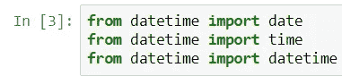

这些导入语句是 Python 库中预定义的功能，允许您操作日期和时间，而无需编写任何代码。

接下来，我们创建一个日期对象的实例。

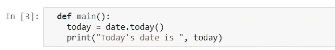

**步骤 3** 接下来，我们打印日期并运行代码。

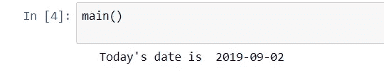

# 使用 date.today()打印日期

函数有几个相关的属性。我们可以打印个别的日/月/年和许多其他东西

让我们看一个例子

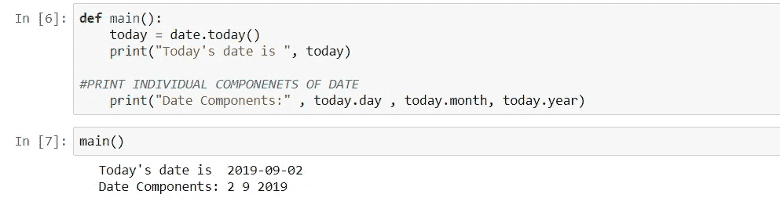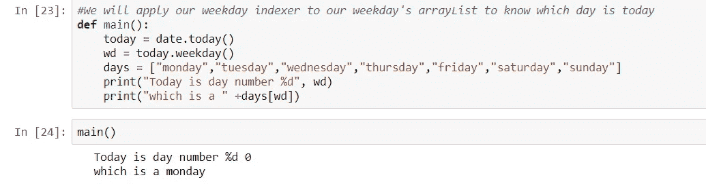

# Python 当前日期和时间:现在()今天()

**步骤 1)** 和日期对象一样，我们也可以在 Python 中使用**“日期时间对象”**。它以**小时、分钟、秒和毫秒显示日期和时间。**

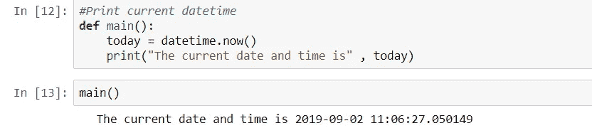

**步骤 2)** 用“DATETIME 对象”，还可以调用 TIME 类。

假设我们想只打印当前时间而不打印日期。

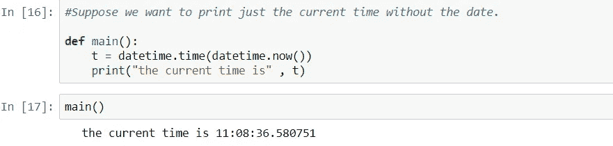

**步骤 3)** 我们将把我们的工作日索引器应用到工作日的数组列表中，以知道今天是哪一天

*   根据当前星期几，为星期几的操作员(wd)分配(0–6)号。这里我们声明了天数的列表数组(周一，周二，周三…周日)。
*   使用该索引值可以知道今天是哪一天。在我们的例子中，它是#0，代表星期一，所以在输出中，它将打印出“这是星期一。”

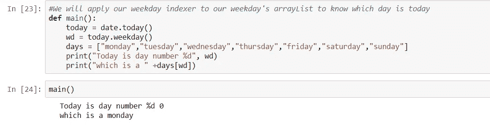

# 如何用 Strftime()格式化日期和时间输出

到目前为止，我们已经学会了如何在 Python 中使用 DateTime 和 Date 对象。我们将进一步学习如何使用格式化函数来格式化时间和日期。

首先，我们将看到一个如何设置年份格式的简单步骤。最好用一个例子来理解。

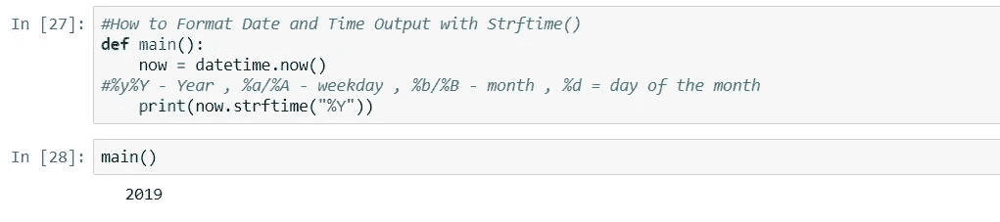

*   我们使用了“ **strftime 函数”**进行格式化。
*   该功能使用不同的**控制代码**来输出。
*   每个控制代码类似于不同的参数，如年、月、工作日和日期 **[(%y/%Y —年)、(% A/% A—工作日)、(% B/% B—月)、(%d —月中的某一天)]。**
*   在我们的例子中，它是 **("%Y")** ，类似于年份，它打印出带有世纪的完整年份(例如，2018)。

**步骤 2)** 现在，如果您将(" %Y ")替换为小写，即(" %y ")，并执行代码，输出将只显示(18)而不显示(2018)。不会显示该年的世纪，如下图所示

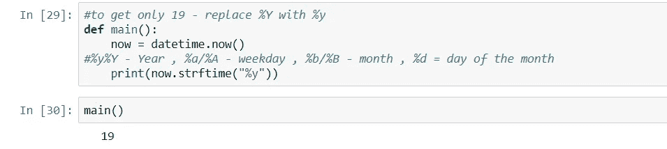

**步骤 3)** Strf 函数可以分别声明日期、日、月、年。同样，通过对 strftime 函数中的控制代码进行小的修改，您可以格式化文本的样式。

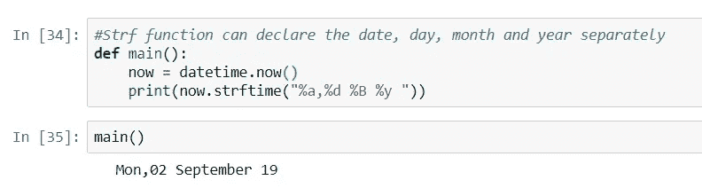

在 strftime 函数中，如果将(%a)替换为大写字母 A，即(%A)，输出将显示为“Friday ”,而不仅仅是缩写“Fri”。

**步骤 4)** 在“strftime”功能的帮助下，我们还可以检索本地系统时间和/或日期。

1.  %C-表示本地日期和时间
2.  %x-表示本地日期
3.  %X-表示当地时间

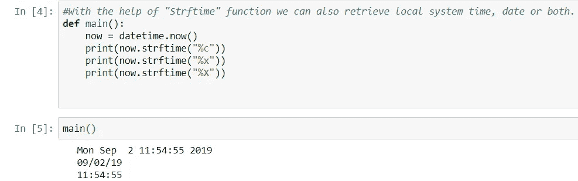

**步骤 5)**“strftime 函数”允许您调用 24 小时制或 12 小时制的时间。

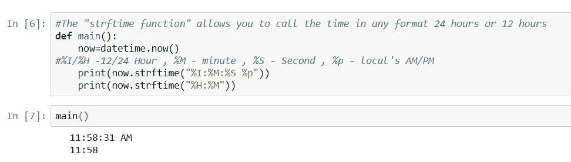

# 如何使用 Timedelta 对象

**使用 timedelta 对象，您可以估计未来和过去的时间。**换句话说，它是一个预测任何特殊日子、日期或时间的时间跨度。

记住这个函数不是用来打印时间或日期的，而是用来计算未来或过去的事情。让我们看一个例子来更好地理解它。

**步骤 1)** 要运行 Timedelta 对象，您需要首先声明 import 语句，然后执行代码

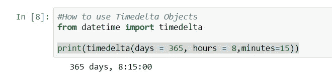

让我们获取今天的日期和时间，以检查我们的 import 语句是否运行良好。当执行代码时，它打印出今天的日期，这意味着我们的 import 语句运行良好

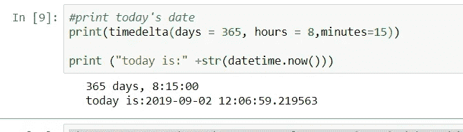

我们将看到如何通过 delta 对象从 *now()* 中检索一年的日期。当我们运行代码时，它给出了预期的输出。

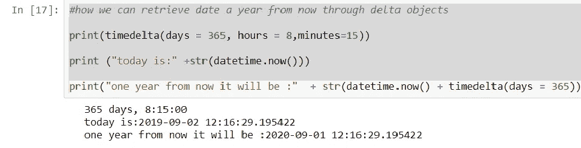

**步骤 4)** 另一个如何使用时间增量从当前日期和时间计算未来日期的示例

让我们看一个更复杂的例子。我想确定新年过去了多少天。下面是我们将如何进行

*   使用 today= date.today()我们将获得今天的日期
*   我们知道新年总是在 1 月 1 日，但今年可能会有所不同。使用 nyd= date(today.year，1，1 ),我们将新年存储在变量 nyd 中
*   如果 nyd < today: compares whether the current date is greater than the new year. If yes, it enters the while loop
*   ((today-nyd).days) gives the difference between the current date and new year in DAYS

# Summary

For manipulating dates and times in both simple and complex ways, DateTime module supplies different classes or categories like

*   date — Manipulate just date ( Month, day, year)
*   time — Time independent of the day (Hour, minute, second, microsecond)
*   DateTime — Combination of time and date (Month, day, year, hour, second, microsecond)
*   timedelta — A duration of time used for manipulating dates
*   tzinfo — An abstract class for dealing with timezones

**使用日期时间对象**

*   在执行代码之前导入日期时间对象是强制性的
*   使用 date.today 功能打印个人日期/月份/年份以及索引日期
*   使用 date.time 对象获取以小时、分钟、秒和毫秒表示的时间

**用“strftime 函数”格式化超时**

*   使用“strftime 函数”更改年份的格式
*   分别打印日、日、月、年，
*   任何形式的呼叫时间为 12 小时或 24 小时

**时间增量对象**

*   使用 timedelta 对象，您可以估计未来和过去的时间
*   计算从当前时间到特殊日子(生日)的总剩余天数
*   计算从当前时间到特殊日子(生日)的总天数

上述代码的 Jupyter 文件可从以下链接获得:

[https://github.com/BindhuVinodh/Datemanipulationswithpython](https://github.com/BindhuVinodh/Datemanipulationswithpython)