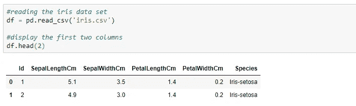
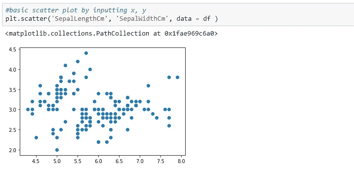
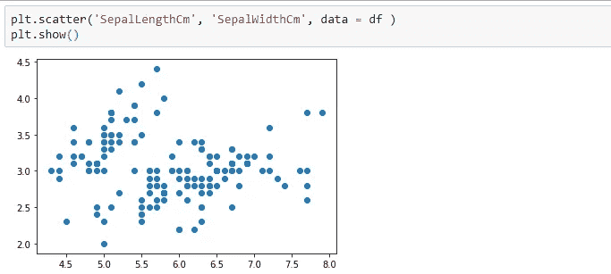
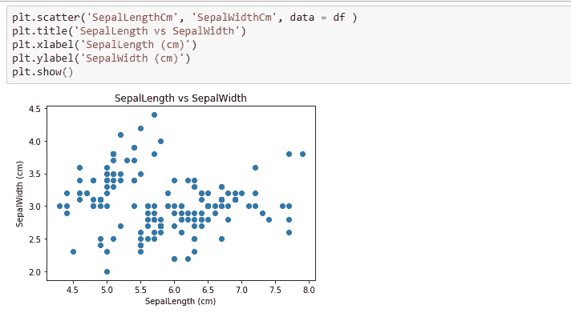
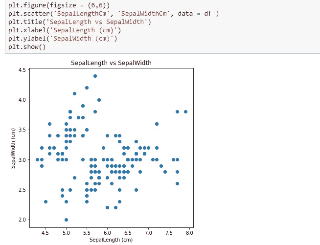

# Matplotlib 基础知识入门| Python

> 原文：<https://pub.towardsai.net/day-1-of-matplotlib-e942923a10ae?source=collection_archive---------0----------------------->

## Matplotlib 在 30 天内变得简单

照片由[乔丹·桑切斯](https://unsplash.com/@jordaneil?utm_source=unsplash&utm_medium=referral&utm_content=creditCopyText)在 [Unsplash](https://unsplash.com/s/photos/day-1?utm_source=unsplash&utm_medium=referral&utm_content=creditCopyText) 上拍摄

> “成功是日复一日重复努力的总和”——罗伯特·科利尔

数据可视化是数据科学领域中最重要的技能之一，尽管我们没有人是完美的，但如果我们正确地接触各种问题并拥有解决这些问题的相关工具，我们每天都会变得越来越好。

所以我每天的 matplotlib 挑战从今天开始！

**我们今天要讲的内容:**

*   导入所需的库
*   绘制基本图形
*   添加标题、x 轴和 y 轴标签
*   调整绘图区的大小

让我们首先导入所有需要的库:

现在我们已经导入了库，加载数据集。对于这个例子，我选择了最简单的“虹膜”数据集。

现在，让我们开始这个系列的第一个情节，更多的情节还在后面！

我们看到有一个对象<matplottlib.collections>,我们可以使用 plt.show()去掉它</matplottlib.collections>

好了，这看起来更干净，现在我们将添加标题，x 轴和 y 轴标签

这看起来更详细。今天的最后一件事，一切看起来都很好，但我们能调整我们的情节吗？是的，我们可以，plt.figure()让我们调整绘图区域的大小。

今天到此为止，明天见另一个情节:)

*Matplotlib 官方文档:*[*https://matplotlib.org/3.1.1/contents.html*](https://matplotlib.org/3.1.1/contents.html)

*下载数据集链接:*[*https://www.kaggle.com/uciml/iris*](https://www.kaggle.com/uciml/iris)

*源代码:*