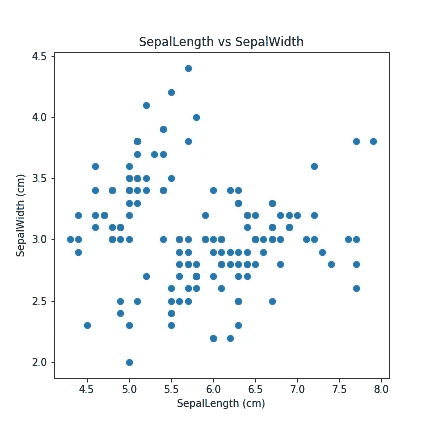
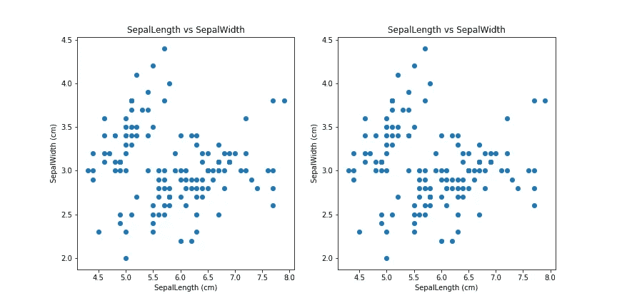
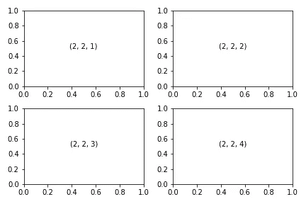
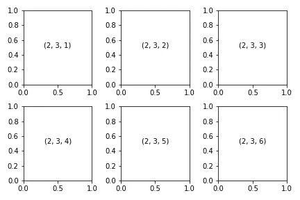

# Matplotlib 在同一窗口中放置多个子情节| Python

> 原文：<https://pub.towardsai.net/day-2-of-matplotlib-how-to-fit-multiple-subplots-in-the-same-window-c964f49ee503?source=collection_archive---------0----------------------->


由 [Aurélien 拍摄的照片——在](https://unsplash.com/@wildspot?utm_source=unsplash&utm_medium=referral&utm_content=creditCopyText) [Unsplash](https://unsplash.com/s/photos/wide-angle?utm_source=unsplash&utm_medium=referral&utm_content=creditCopyText) 上的野生景点

## Matplotlib 在 30 天内变得简单

# 让我们快速回忆一下第一天:



分离长度与分离宽度的散点图(Iris 数据集)

1.  导入库
2.  绘制基本图形
3.  添加标题、x 轴和 y 轴标签
4.  调整绘图大小

我们经常看到两个或更多的图被组合在一起，这样的图给我们一个单一图中多个变量的概览。如果我们的数据中有分类变量，这些是非常有用的。

# 今天我们将讨论以下主题:

*   什么是支线剧情？
*   如何在同一个窗口中适应多个图？
*   额外收获:将绘图导出为 PNG/JPEG 格式

简单来说，如果我们有 2 个或更多的情节，而不是主要情节，那么它被称为次要情节。让我们从一个窗口中的两个图开始

```
plt.figure(figsize = (12,6))plt.subplot(121)
plt.scatter('SepalLengthCm', 'SepalWidthCm', data = df )
plt.title('SepalLength vs SepalWidth')
plt.xlabel('SepalLength (cm)')
plt.ylabel('SepalWidth (cm)')plt.subplot(122)
plt.scatter('SepalLengthCm', 'SepalWidthCm', data = df )
plt.title('SepalLength vs SepalWidth')
plt.xlabel('SepalLength (cm)')
plt.ylabel('SepalWidth (cm)')plt.show()
```

输出:



单个窗口中的两个图

这里使用的函数是:

**plt.subplot(xyz)** *其中 x =行数，y =列数，z =绘图号*。

**plt.subplot(221)** *表示 2*2 矩阵和 1 号图。*



2 行 2 列= 2*2 矩阵，带 4 个图



2 行 3 列= 2*3 矩阵，带 6 个图

上图的代码:

```
for i in range (1, 7):
    plt.subplot(2, 3, i)
    plt.text(0.5,0.5, str((2, 3, i)), ha='center', fontsize = 10)
    plt.tight_layout()
```


设置光圈的多个支线剧情示例

# 奖金

Matplotlib 允许我们使用 **plt.savefig()** 导出我们的图

```
plt.savefig('plot.png')#For a transperant background
plt.savefig('plot.png', transperant = True)
```

今天到此为止！在下面找到完整的源代码。明天见:)

上述文章的完整源代码