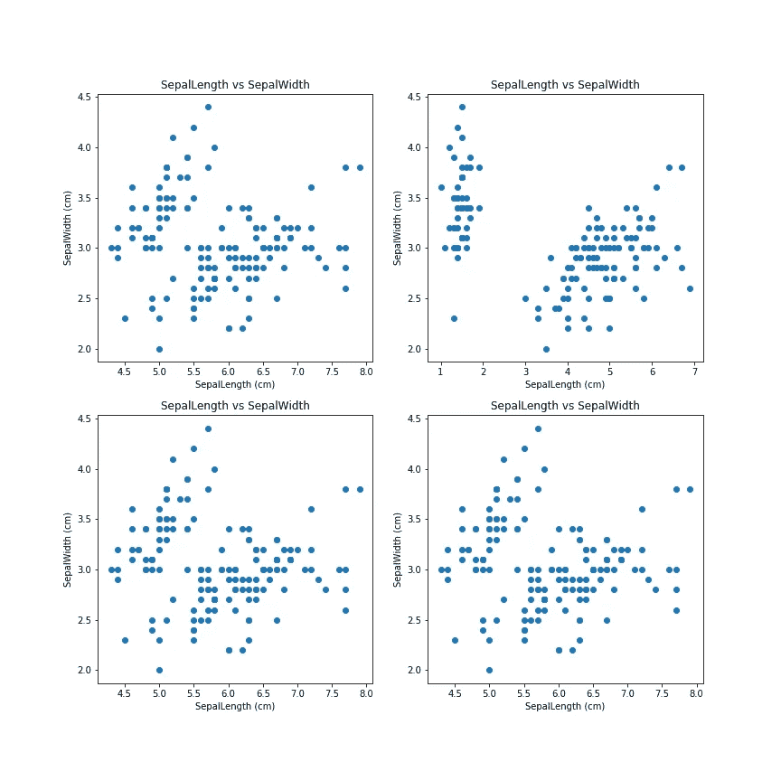
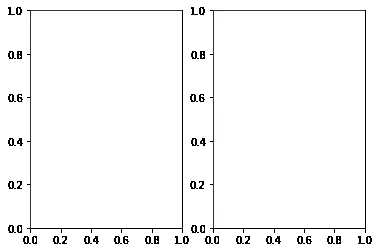
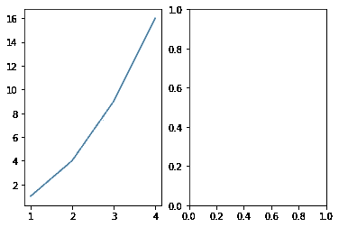
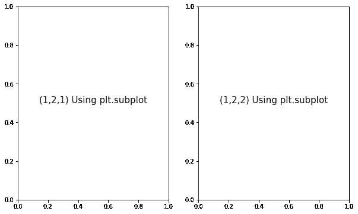
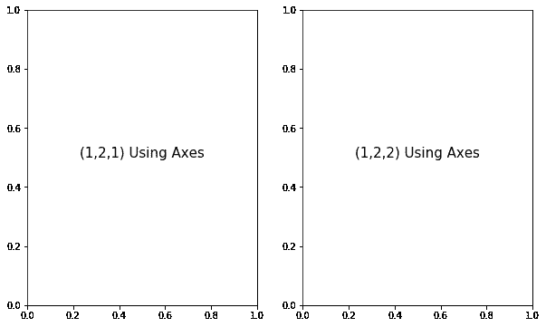
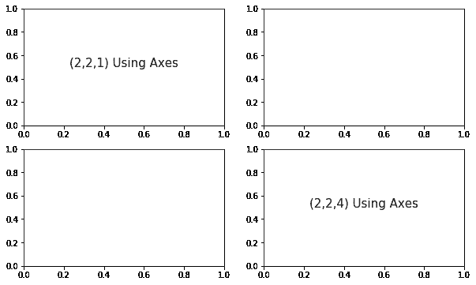

# Matplotlib 图形和轴详细说明| Python

> 原文：<https://pub.towardsai.net/day-3-of-matplotlib-figure-axes-explained-in-detail-d6e98f7cd4e7?source=collection_archive---------0----------------------->

## Matplotlib 在 30 天内变得简单


由 [Khadeeja Yasser](https://unsplash.com/@k_yasser?utm_source=unsplash&utm_medium=referral&utm_content=creditCopyText) 在 [Unsplash](https://unsplash.com/s/photos/3?utm_source=unsplash&utm_medium=referral&utm_content=creditCopyText) 上拍摄的照片

# 第二天的快速回顾:



第二天的概要图

*   子情节定义
*   使用矩阵技术拟合多个支线剧情
*   将绘图导出到 PNG/JPEG
*   如果你错过了之前的，在这里找到它们:[第一天](https://medium.com/@davidgladson5/day-1-of-matplotlib-e942923a10ae)，[第二天](https://medium.com/@davidgladson5/day-2-of-matplotlib-how-to-fit-multiple-subplots-in-the-same-window-c964f49ee503)

**今天的主题是 Matplotlib 中使用最多的，但对我们许多人来说仍然是一个令人困惑的主题。这是关于图&轴的，我们将涉及以下内容:**

1.  什么是图形和轴？
2.  如何在任何情节中使用它们？
3.  特别是对于多个支线剧情，如何使用它们？

> 图:这是剧情的最顶层(大图)

图由支线剧情，副轴，标题，副标题，图例，除了总览以外的所有内容组成。

> 斧头:这是人物的一部分，只是一个次要情节

轴定义了一个子图，我们可以写自己的 x 轴极限，y 轴极限，它们的标签，图形的类型。它控制着支线剧情里面的每一个细节。

让我们用数据来弄脏我们的手:

```
#importing matplotlib to plot the graphs
import matplotlib.pyplot as plt#to avoid pop-ups & show graphs inline with the code
%matplotlib inline#pandas is required to read the input dataset
import pandas as pd
```

对于本教程，我们将使用 plt.subplots()函数一起使用 Figure，Axes，因为这是最常用的方法。

```
#subplot with 1 row & 2 cols
fig, ax = plt.subplots(1,2)
```



plt.subplots()有一个默认的[0，1] x-y 限制

我们可以重写轴限制:

```
fig, ax = plt.subplots(1,2)x = [1,2,3,4]
y = [1,4,9,16]ax[0].plot(x,y)
plt.show()
```



plt.subplots()，一边是定义的轴限制，另一边是默认值

从[上一篇文章](https://medium.com/@davidgladson5/day-2-of-matplotlib-how-to-fit-multiple-subplots-in-the-same-window-c964f49ee503)中，我们看到使用 plt.subplot(xyz)使 subplot 变得非常容易。

但是我们为什么需要图形和轴呢？它们会让我们的生活更容易吗？是的，让我们看看这两种方法的区别。

**方法 1:** [通常的方法](https://medium.com/@davidgladson5/day-2-of-matplotlib-how-to-fit-multiple-subplots-in-the-same-window-c964f49ee503)

```
plt.figure(figsize = (10,6))plt.subplot(121)
plt.text(0.5,0.5,’(1,2,1) Using plt.subplot’,ha = ‘center’, fontsize = 15)plt.subplot(122)
plt.text(0.5,0.5,’(1,2,2) Using plt.subplot’,ha = ‘center’, fontsize = 15)plt.show()
```



使用方法 1 绘图

**方法二:**使用图&轴

```
fig, (ax1, ax2) = plt.subplots(1,2, figsize = (10,6))ax1.text(0.5,0.5,’(1,2,1) Using Axes’,ha = ‘center’, fontsize = 15)
ax2.text(0.5,0.5,’(1,2,2) Using Axes’,ha = ‘center’, fontsize = 15)plt.show()
```

或者

```
fig, ax = plt.subplots(1,2, figsize = (10,6))ax[0].text(0.5,0.5,’(1,2,1) Using Axes’,ha = ‘center’, fontsize = 15)
ax[1].text(0.5,0.5,’(1,2,2) Using Axes’,ha = ‘center’, fontsize = 15)plt.show()
```



使用方法 2 绘图(使用代码 1/代码 2)

这很简单，我们可以在代码中的任何地方使用 ax1 和 ax2，同时定义界限、标签、图例，但对于传统的方法来说，这不是你需要在每个子情节中定义情节细节的情况。

因此，Fig & Axes 对象在处理支线剧情及其细节时给了我们很大的安慰。

**小注:**对于具有 2 行或更多轴的图，应称为矩阵 ax1，ax2，ax3，ax4= ax[0，0]，ax[0，1]，ax[1，0]，ax[1，1]

```
fig, ax = plt.subplots(2,2, figsize = (10,6))ax[0,0].text(0.5,0.5,’(2,2,1) Using Axes’,ha = ‘center’, fontsize = 15)
ax[1,1].text(0.5,0.5,’(2,2,4) Using Axes’,ha = ‘center’, fontsize = 15)plt.show()
```



今天到此为止！明天见，Matplotlib 中的另一个有趣的主题。

*来源:*

[](https://matplotlib.org/3.1.1/api/_as_gen/matplotlib.pyplot.subplots.html) [## Matplotlib . py plot . subplots-Matplotlib 3 . 1 . 1 文档

### 编辑描述

matplotlib.org](https://matplotlib.org/3.1.1/api/_as_gen/matplotlib.pyplot.subplots.html) [](https://matplotlib.org/3.1.1/api/_as_gen/matplotlib.figure.Figure.html) [## Matplotlib . figure . figure-Matplotlib 3 . 1 . 1 文档

### 所有绘图元素的顶层容器。Figure 实例通过回调属性支持回调…

matplotlib.org](https://matplotlib.org/3.1.1/api/_as_gen/matplotlib.figure.Figure.html) [](https://matplotlib.org/3.1.1/api/_as_gen/matplotlib.pyplot.axes.html) [## Matplotlib . py plot . axes-Matplotlib 3 . 1 . 1 文档

### 4 元组浮点 rect =。添加了一个新的轴，其尺寸为使用当前…的归一化(0，1)单位的矩形

matplotlib.org](https://matplotlib.org/3.1.1/api/_as_gen/matplotlib.pyplot.axes.html)