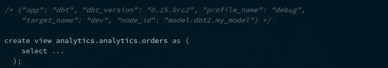
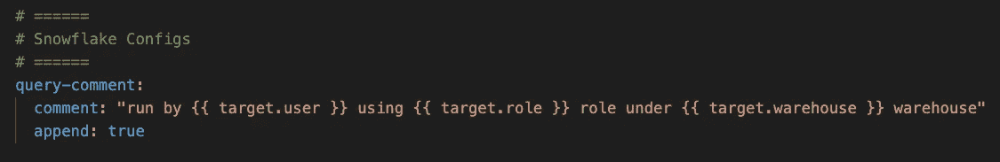
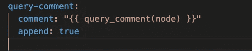

# [DBT]添加查询注释以便更好地调试[提示 3]

> 原文：<https://pub.towardsai.net/dbt-add-query-comments-for-better-debugging-tip-3-255f02a848dd?source=collection_archive---------3----------------------->

## [软件工程](https://towardsai.net/p/category/software-engineering)

定制从 dbt 触发的每个查询中的查询注释


在 dbt 中使用`query_comment`,我们可以定制注释以注入到每个由 dbt 触发的查询中。比如查询由哪个`user/role`，在哪个`warehouse`和什么`profile`上运行等。

## dbt 的默认注释



来源:[https://docs . get dbt . com/reference/project-configs/query-comment](https://docs.getdbt.com/reference/project-configs/query-comment)

默认情况下，注释将被添加到查询的前面，以防您希望注释位于查询的末尾。在`dbt_project.yml`中设置`append`模式



## 使用宏自定义注释

在 dbt 项目的宏部分下的`query_comment.sql`中添加下面的宏

并将宏添加到`dbt_project.yml`



下面的注释将被附加到从 dbt 触发的所有查询中。您可以在雪花历史选项卡的查询历史下看到这一点。

```
/* {"app": "dbt", "dbt_version": "0.21.0", "profile_name": "transformer_profile", "target_name": "dev", "target_database": "silver", "target_warehouse": "transform_wh", "target_user": "transform_user", "target_role": "transformer", "target_account": "dev-account", "file": "models/silver/fin/silver__fin__invest.sql", "node_id": "model.transformer.silver__fin__invest", "node_name": "silver__fin__invest", "resource_type": "model", "package_name": "transformer", "relation": {"database": "silver", "schema": "fin", "identifier": "invest"}} */
```

上面相同的代码也维护在这个不断增长的 git 存储库中。

[](https://github.com/karthikeyan-sivabaskaran/dbt-tips-and-tricks-series) [## GitHub-karthikeyan-sivabaskaran/dbt-tips-and-tricks-series:这个回购将继续增长以演示…

### 此时您不能执行该操作。您已使用另一个标签页或窗口登录。您已在另一个选项卡中注销，或者…

github.com](https://github.com/karthikeyan-sivabaskaran/dbt-tips-and-tricks-series) 

> 我希望这篇文章能帮助你定制查询注释。如果你喜欢这个博客，请分享给你的队友，朋友，鼓掌👏在 1 到 50 英寸的范围内。[每篇帖子最多可以鼓掌 50 次](https://help.medium.com/hc/en-us/articles/115011350967-Claps)。


照片由威尔·麦克马汉在 [Unsplash](https://unsplash.com?utm_source=medium&utm_medium=referral) 上拍摄

> **快乐评论！**
> 
> 这篇文章是 DBT 提示和技巧系列的一部分。以前的文章如下:

[](https://medium.com/@kar9475/dbt-override-default-schema-with-custom-schema-name-tip-1-2e6ec59141b7) [## [DBT]用自定义模式名覆盖默认模式[提示-1]

### 问题

medium.com](https://medium.com/@kar9475/dbt-override-default-schema-with-custom-schema-name-tip-1-2e6ec59141b7) [](https://medium.com/@kar9475/dbt-set-snowflake-query-tag-for-each-dbt-model-tip-2-665a3e557d6e) [## [DBT]为每个 DBT 模型设置雪花查询标签[提示-2]

### DBT 的查询标记特性是一种特定于数据库的配置。在本文中，让我们看看如何为…定制它

medium.com](https://medium.com/@kar9475/dbt-set-snowflake-query-tag-for-each-dbt-model-tip-2-665a3e557d6e)