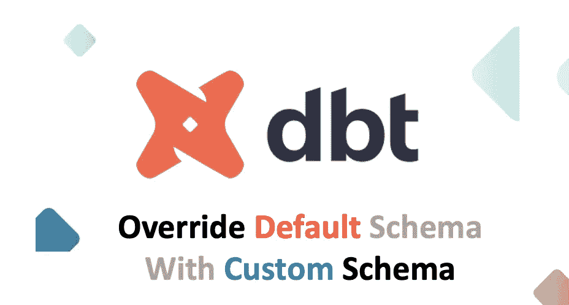
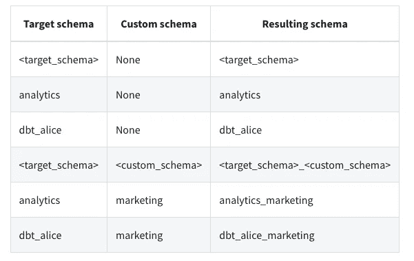
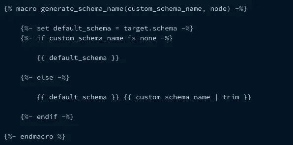

# [DBT]用自定义模式名覆盖默认模式[提示-1]

> 原文：<https://pub.towardsai.net/dbt-override-default-schema-with-custom-schema-name-tip-1-2e6ec59141b7?source=collection_archive---------0----------------------->

## [软件工程](https://towardsai.net/p/category/software-engineering)

## 问题

默认情况下，`DBT`在由`target_schema`和`custom_schema`组合而成的模式下创建一个模型。但是，有些情况下，您希望只使用`custom_schema`来创建模式，为了处理这个问题，我们需要覆盖创建模式的默认宏。默认情况下，dbt 使用`generate_schema_name`宏来生成模式。

`Target Schema`:在`Profiles.yml`下定义。如果没有为模型定义定制模式，目标模式表示 dbt 将构建对象的`default schema` 。

`Custom Schema`:在`dbt_project.yml`下定义。您可以在 dbt 中使用定制模式在目标模式之外的模式中构建模型。

来源:[https://docs . get dbt . com/docs/building-a-dbt-project/building-models/using-custom-schemas](https://docs.getdbt.com/docs/building-a-dbt-project/building-models/using-custom-schemas)

## 默认`generate_schema_name Macro`

# 解决办法

## 自定义`generate_schema_name Macro`

在**宏**文件夹下创建一个名为**override _ default _ macros . sql**的文件，输入下面的 SQL。

如果`custom_schema`不适用于指定的型号，则将使用`profiles.yml`中的`default_schema`。

上面相同的代码也维护在这个不断增长的 git 存储库中。

 [## GitHub-karthikeyan-sivabaskaran/dbt-tips-and-tricks-series:这个回购将继续增长以演示…

### 此时您不能执行该操作。您已使用另一个标签页或窗口登录。您已在另一个选项卡中注销，或者…

github.com](https://github.com/karthikeyan-sivabaskaran/dbt-tips-and-tricks-series) 

> 我希望这篇文章能帮助您定制模式名。如果你喜欢这个博客，请分享给你的队友，朋友，鼓掌👏在 1 到 50 英寸的范围内。[每个帖子最多可以鼓掌 50 次](https://help.medium.com/hc/en-us/articles/115011350967-Claps)。

[GR Stocks](https://unsplash.com/@grstocks?utm_source=medium&utm_medium=referral) 在 [Unsplash](https://unsplash.com?utm_source=medium&utm_medium=referral) 上拍照

> **快乐压倒一切！**
> 
> 这篇文章是 DBT 提示和技巧系列的一部分。