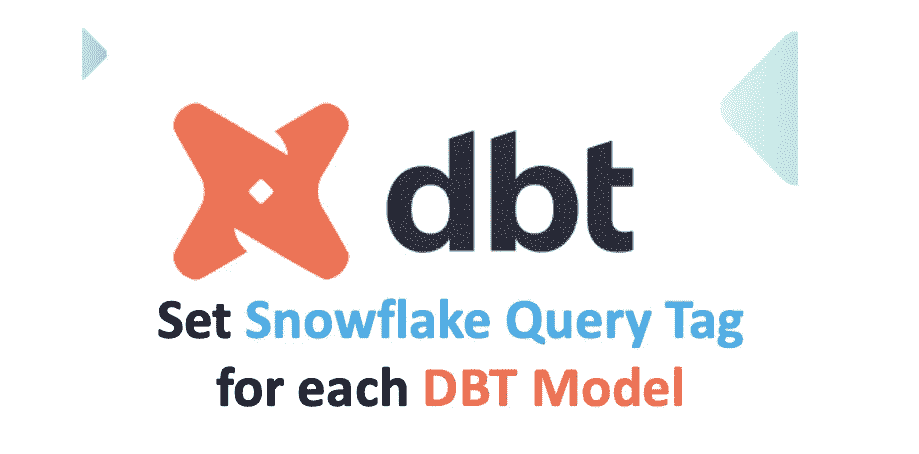
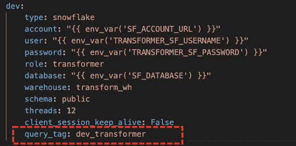
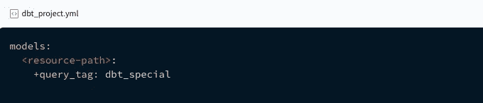
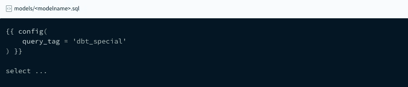
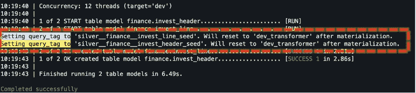
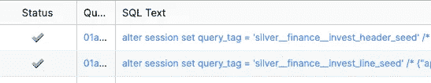

# [DBT]为每个 DBT 模型设置雪花查询标签[提示-2]

> 原文：<https://pub.towardsai.net/dbt-set-snowflake-query-tag-for-each-dbt-model-tip-2-665a3e557d6e?source=collection_archive---------2----------------------->

## [软件工程](https://towardsai.net/p/category/software-engineering)



DBT 的查询标记特性是一种特定于数据库的配置。在本文中，让我们看看如何为雪花定制它。

[查询标签](https://docs.snowflake.com/en/sql-reference/parameters.html#query-tag)是一个雪花参数，稍后在 [QUERY_HISTORY 视图](https://docs.snowflake.com/en/sql-reference/account-usage/query_history.html)中搜索时会非常有用。

## 默认查询标签可以在 Profiles.yml 中设置



这将适用于从 DBT 到雪花触发的所有查询。

## 3 种配置查询标签的方法

1.  在`dbt_project.yml`中配置，这种方法的**缺点**是**只能添加字符串**，**不能用当前的 dbt 版本执行宏**。目前，DBT 只支持 YAML 项目文件中的几个上下文列表。



来源:[https://docs . get dbt . com/reference/resource-configs/snow flake-configs](https://docs.getdbt.com/reference/resource-configs/snowflake-configs)

2.在每个型号配置下配置它，**缺点**是**在所有型号**中重复相同的配置，这不是一个好的做法。



来源:[https://docs . get dbt . com/reference/resource-configs/snow flake-configs](https://docs.getdbt.com/reference/resource-configs/snowflake-configs)

## 解决办法

3.覆盖默认的查询标记宏，并根据需求对其进行定制。

在每个模型之前，雪花会话级`query tags`将被更新。一旦模型运行完成，它将自动复位到`profiles.yml`中设置的`default query tag`

```
alter session set query_tag = ‘dbt_model_name’
```

DBT 日志输出当为演示启用了“登录到控制台”时，



雪花历史查询如下，



上面相同的代码也维护在这个不断增长的 git 存储库中。

[](https://github.com/karthikeyan-sivabaskaran/dbt-tips-and-tricks-series) [## GitHub-karthikeyan-sivabaskaran/dbt-tips-and-tricks-series:这个回购将继续增长以演示…

### 此时您不能执行该操作。您已使用另一个标签页或窗口登录。您已在另一个选项卡中注销，或者…

github.com](https://github.com/karthikeyan-sivabaskaran/dbt-tips-and-tricks-series) 

> 我希望这篇文章能帮助您定制查询标签。如果你喜欢这个博客，请分享给你的队友，朋友，鼓掌👏在 1 到 50 英寸的范围内。[每篇帖子最多可以鼓掌 50 次](https://help.medium.com/hc/en-us/articles/115011350967-Claps)。


在 [Unsplash](https://unsplash.com?utm_source=medium&utm_medium=referral) 上[静止不动](https://unsplash.com/@stillnes_in_motion?utm_source=medium&utm_medium=referral)拍摄

> **快乐压倒一切！**
> 
> 这篇文章是 DBT 提示和技巧系列的一部分。以前的文章如下:

[](https://medium.com/@kar9475/dbt-override-default-schema-with-custom-schema-name-tip-1-2e6ec59141b7) [## [DBT]用自定义模式名覆盖默认模式[提示-1]

### 本文是 DBT 提示和技巧系列的一部分

medium.com](https://medium.com/@kar9475/dbt-override-default-schema-with-custom-schema-name-tip-1-2e6ec59141b7)