# 去神秘化的神经网络压缩

> 原文：<https://pub.towardsai.net/de-mystifying-neural-network-compression-9bbaf936cb57?source=collection_archive---------2----------------------->

## [深度学习](https://towardsai.net/p/category/machine-learning/deep-learning)

理解修剪深度神经网络的具体细节

[𝓴𝓘𝓡𝓚 𝕝𝔸𝕀](https://unsplash.com/@kirklai?utm_source=unsplash&utm_medium=referral&utm_content=creditCopyText) 在 [Unsplash](https://unsplash.com/s/photos/mystery?utm_source=unsplash&utm_medium=referral&utm_content=creditCopyText) 上拍照

# 议程

极简主义的生活方式已经触及了神经网络。我们正在寻找方法来减小深度神经网络的大小，希望将它们托管在嵌入式设备中，而不是将它们放在巨大的服务器中，然后请求预测和分类。然而，在研究方法和实际实施之间存在知识差距。我们可以找到很多关于修剪神经网络的资源，但是很少有人解释它背后的代码。这篇文章是一步一步的 **PyTorch 为基础的**使用常用技术修剪神经网络的指南。我使用了 Oleg Polivin 的[文章](https://olegpolivin.medium.com/experiments-in-neural-network-pruning-in-pytorch-c18d5b771d6d)作为参考资料之一。论文[神经网络剪枝是什么状态？](https://arxiv.org/abs/2003.03033)及其源代码 [shrinkbench](https://github.com/JJGO/shrinkbench) 也提供了急需的指导。

## 背景

下面是非常流行的剪枝机制。你有一个有很多连接的神经网络。修剪是去除这些连接以减小网络规模的过程。从神经网络的角度来看，连接只不过是每个神经元的权重。(对于卷积层，它们是过滤器的值)。从数学表示的角度来看，这些权重仅仅是表示神经网络的矩阵中存在的值

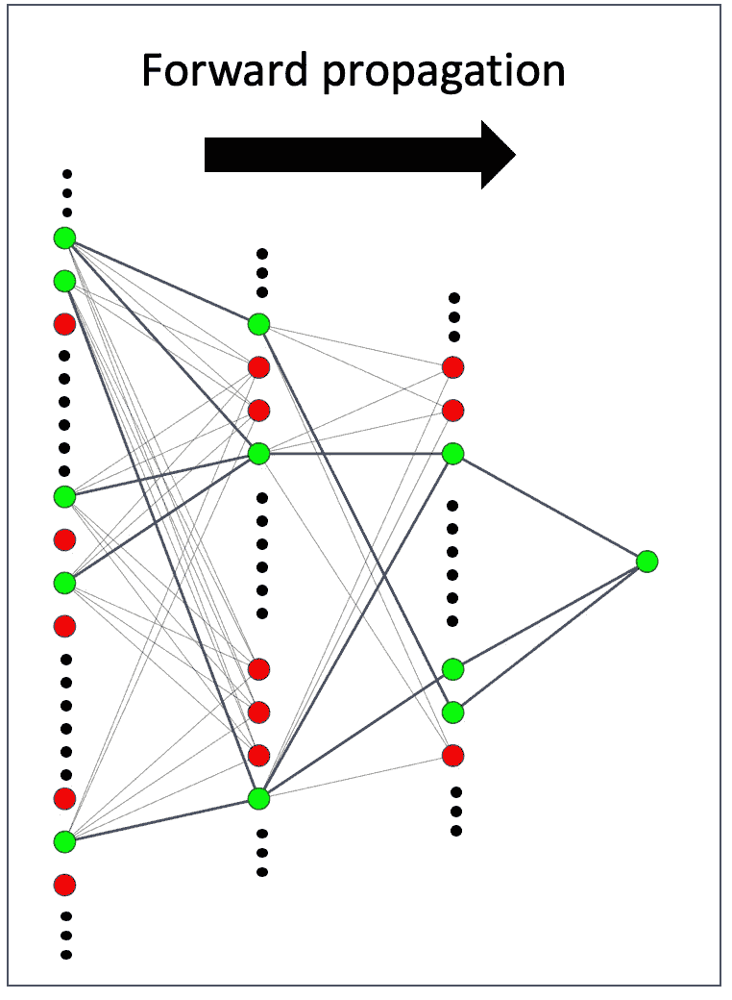

具有修剪权值的神经网络。图片作者。

**神经元中权重的表示**

让我们创建一个简单的神经网络来了解权重是如何存储在其中的。

创建模型的类

上面是一个简单的代码来创建一个完全连接的 4 层神经网络。该模型可以如下初始化，并且可以检查其配置。

显示模型配置

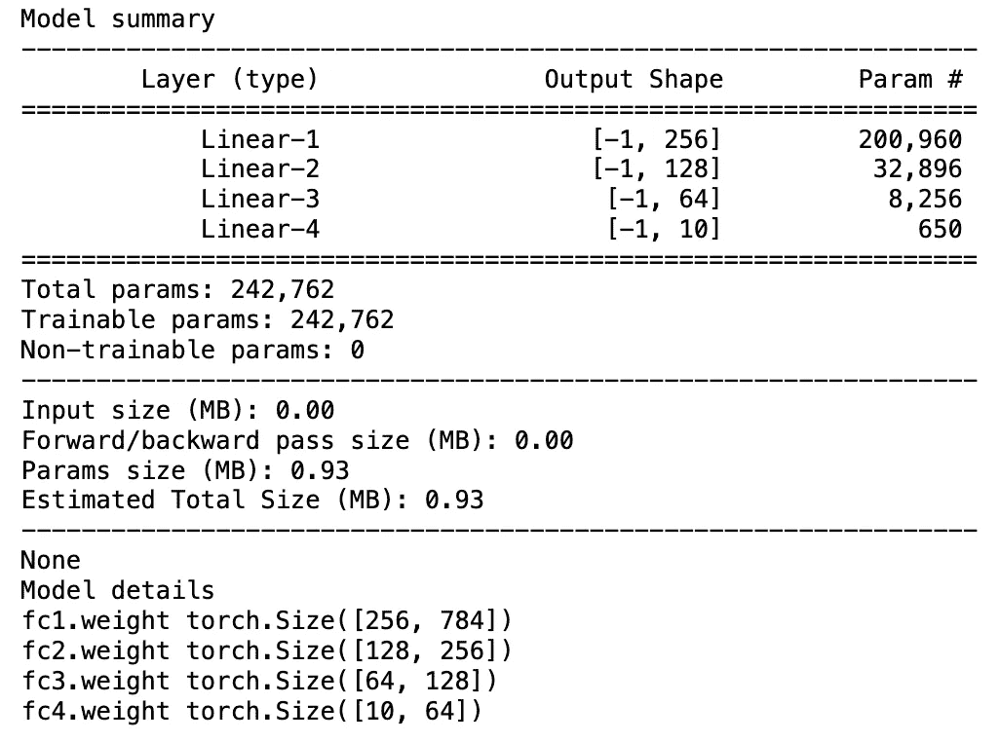

显示模型参数

可以看出，该模型有 4 层，第一层有 256 个神经元，第二层有 128 个，第三层有 64 个，第四层有 10 个神经元。

各层的具体情况、权重值

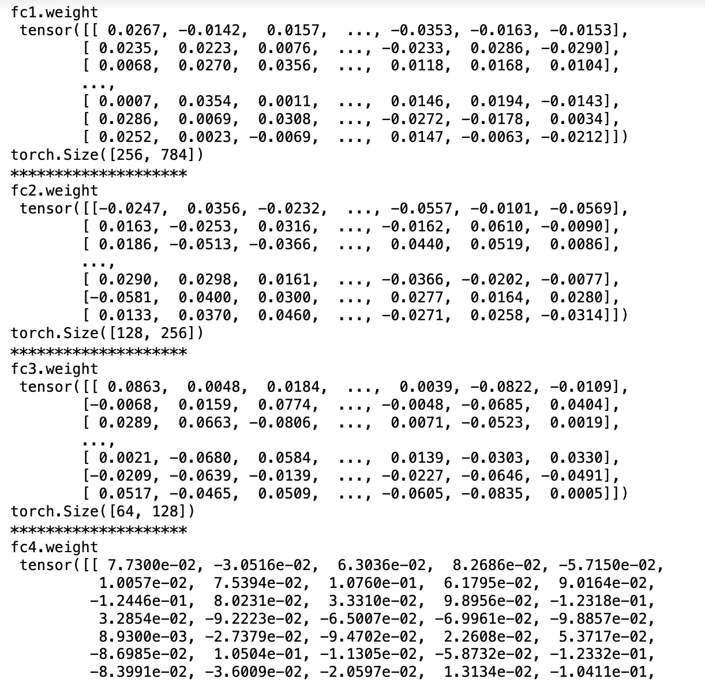

每层的权重值

上图显示了每一层的权重值。它们是形状为 256X784、128X256、64X128 和 10X64 的矩阵。

## 火车

为了应用剪枝，我们需要首先训练模型。使用 PyTorch 进行训练不像 Keras 那么直接，所以需要写一些函数。让我们把它分解成几个部分来理解它们。

必要的进口

我们将代码的下一部分(设置)分成 3 个部分——数据部分、评估部分和模型部分。

# A.设置

## **1。数据部分**

将数据加载到 GPU/CPU 的函数

不要担心上面的这些函数，它们是用于将数据传输到活动设备 RAM/GPU 的标准函数。

## 2.评估

这些函数用于计算准确性指标。这将有助于了解模型的精度如何随着模型压缩率的增加而变化。

## 3.模型

最后，我们定义模型本身和拟合函数。在 Pytorch 中，需要将模型定义为实现了一些默认功能的类。

请注意，fit 函数与类是分开的。它们被放在一起是为了保持连贯性。有了所有这些代码，我们现在就可以加载数据并训练模型了。

# B.执行

## 1.数据准备

这一部分创建将用于训练模型的训练和测试数据集。Pytorch 有一些加载数据的标准方法，这里已经使用过了。

## 2.培养

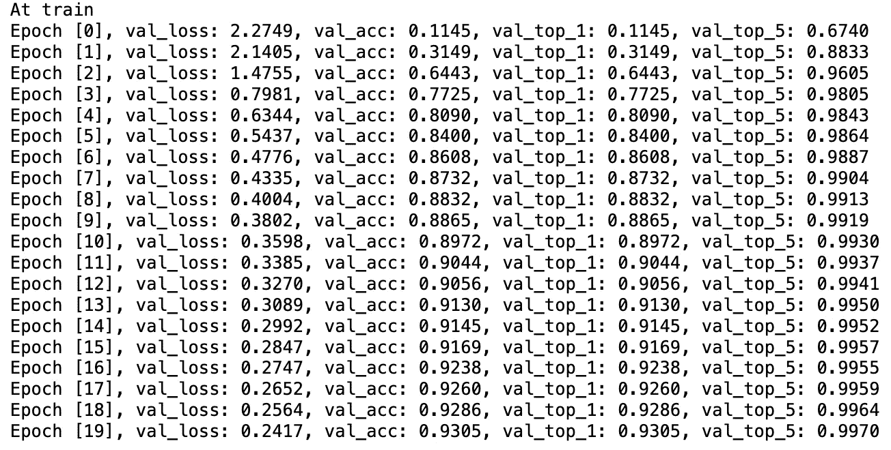

上面的代码片段为 20 个时期训练模型。

既然训练已经完成，让我们看看重量的分布。还记得这篇文章的第一部分吗？在那一部分中，权重只不过是矩阵中的值。让我们重温一下。

各层的具体情况、权重值

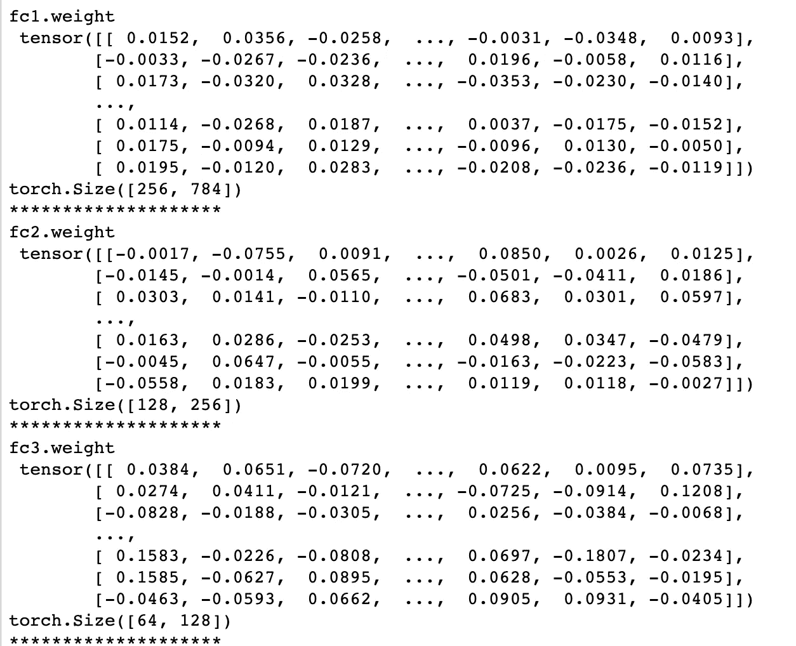

修剪后的权重值

为了了解重量值分布，让我们绘制一个重量直方图。

在这个代码片段中，我们遍历模型的每一层，并将权重存储在一个平面列表中。因此，我们将它们全部绘制成柱状图。

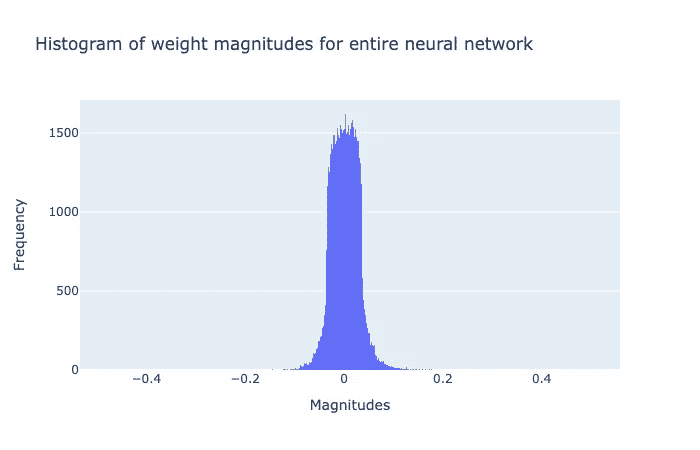

权重直方图

上图显示了经过**训练的**神经网络的权重分布。核心论点来源于这个情节。围绕 0 值有大量的权重，正如宋寒在他的开创性[作品](https://arxiv.org/abs/1506.02626)中所声称的，我们可以取消这些权重，保留更高量值的权重。让我们看看当我们这样做时会发生什么。

## 修剪方法

有不同的方法来修剪网络的权重。我们要做的是取一个剪枝率(x)并乘以权重分布的标准偏差。这个值将成为我们的门槛。低于该阈值的所有权重将被设置为 0。让我们看一下代码。

但是在我们做任何事情之前，让我们保存未修剪模型的权重并重新加载模型。

保存模型权重，因为我们将很快修改模型

**修剪步骤**

1.  得到剪枝率 *(p)*
2.  阈值 *(t) = p*stdev(所有权重)*
3.  将所有低于 *t* 的重量设置为 0

下面的代码片段是针对步骤 1 和 2 的。

步骤 1 和 2

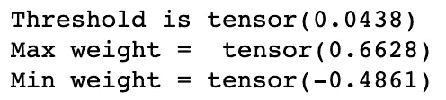

网络中存在的输出阈值和最小、最大权重

当修剪率选择为 2.25 时，结果阈值是 0.0438。这意味着-0.0438 和+0.0438 之间的所有权重都将被移除。因此，最大正值和+0.0438 之间的权重以及最大负值和-0.0438 之间的权重将被保留。现在让我们执行第 3 步，删除权重。

上面这段代码遍历各层，将绝对值低于阈值的所有权重设置为 0。当我们打印重量时，可以看到效果。

各层的具体情况、权重值

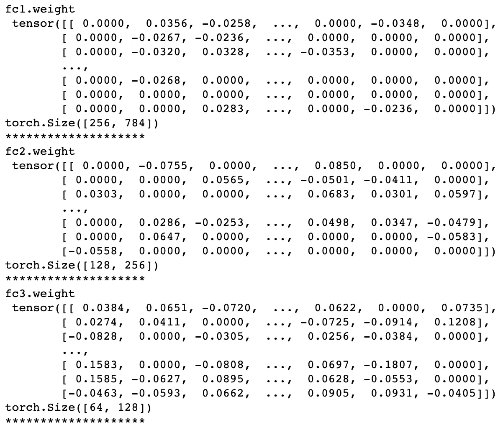

权重变为 0

可以看到，很多权重都变成了 0。特别是那些绝对值低于阈值 0.0438 的权重。使用以下代码可以在加权直方图中进一步看到这种效果。

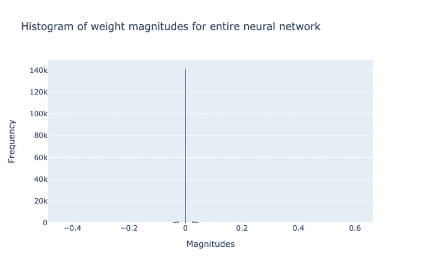

最大重量已变为 0

上图有点难理解。您可能期望中间有一个大洞，但是，您得到的是一个长条状图，显示了大量被设置为 0 的权重。让我们试着从可视化中移除 0 个权重。

出于可视化目的，第 8 行从权重列表中过滤所有 0

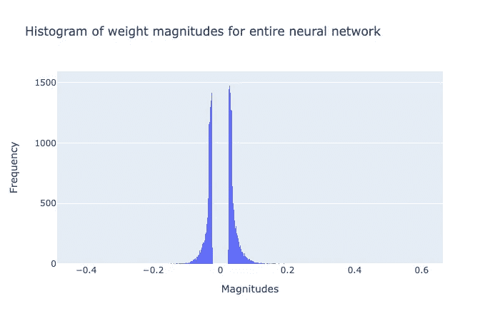

预期的

这个直方图和预期的一样。中间有一大块空间显示已经“无效”的权重。让我们试着计算修剪后模型的压缩和精度。

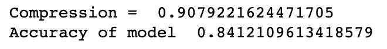

合成压缩和准确性

所以模型理论上被压缩了 90%，但是精度也降低了。这是修剪的第二部分——微调。文献上说，重新训练模型，同时保持 0 权重为 0。这意味着需要存储器组件来记住哪些权重被设为 0，因为在每批数据的每个优化步骤之后，神经网络的权重被改变。我们想要做的是，记住哪些权重被设为 0，并且在每个优化步骤之后，将这些权重设置回 0。在文献中很难找到对这一过程的明确解释。为了节省你的麻烦，我举例说明了使用屏蔽微调的常用方法。

**掩蔽**

让我们回到修剪步骤。我们不是直接将权重值设置为 0，而是维护一个单独的数据结构，其形状与权重的形状相同，我们称之为掩码。掩码在开始时被初始化为 1。

我们简单地记下权重的大小小于阈值的指数。然后，我们转到掩码，在该特定索引处将其设置为 0。

设置遮罩。

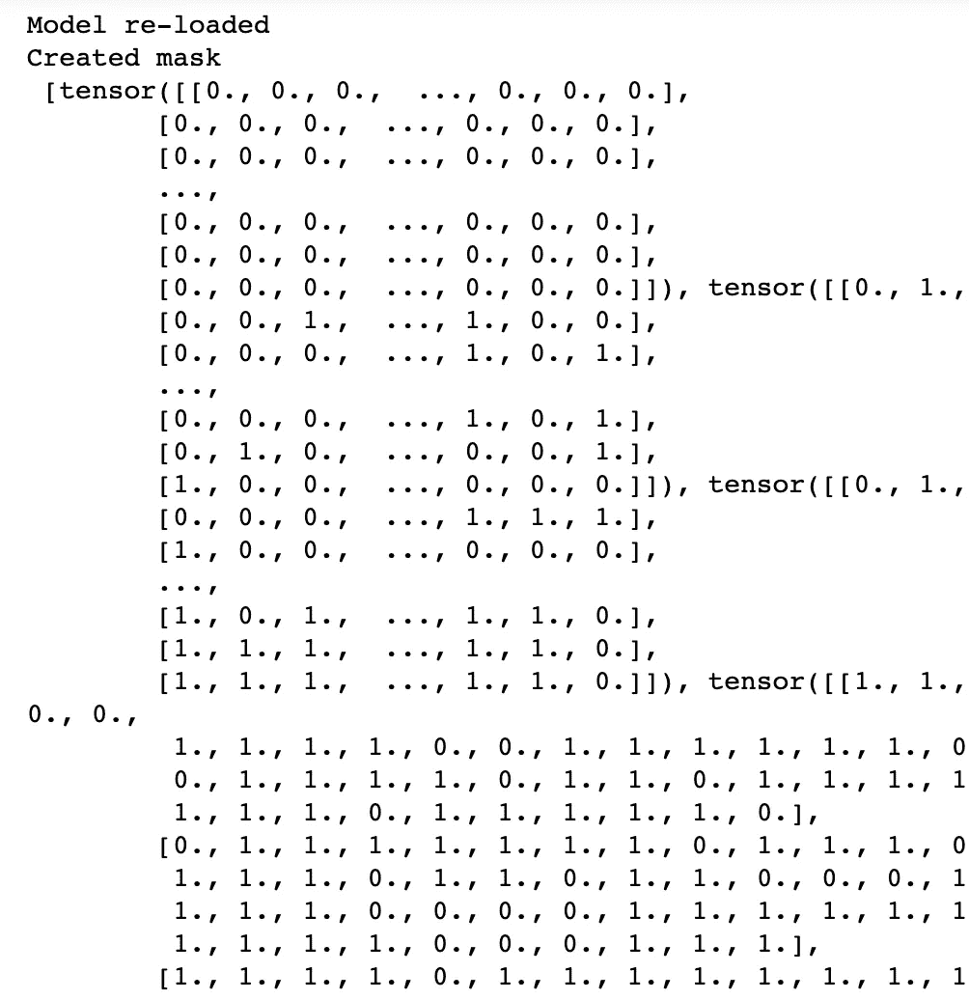

掩码矩阵，0 将强制权重为 0，1 将保留权重值

一旦面具制作完成，我们的工作就变得简单了。在每一批中，一旦权重被优化，我们就用权重乘以掩码，并确保已经变为 0 的权重保持为 0。我们还需要一个函数来将模型权重与掩码结合起来，然后我们修改拟合函数，在每批之后添加矩阵乘法。

5 个时期的微调

我们用 *fit_prune()* 函数重新训练该模型 5 个时期。这几乎与 *fit()* 函数相同，除了在第 28 行，就在权重优化之后，我们在模型上应用相同的掩码，因此，即使一些修剪的权重变为非零，apply_mask_model 函数也将掩码与模型权重相乘，并将修剪的权重设置回 0。因为模型已经被训练，所以训练在较少的时期内完成。

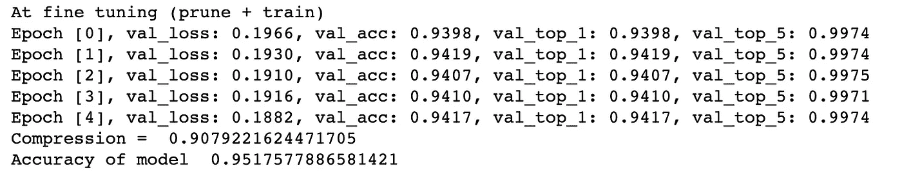

与未修剪模型具有相同性能的修剪模型

输出显示了即使当大量(90%)权重设置为 0 时，模型如何快速恢复到原始精度。

我希望这给你一个进入网络修剪世界的起点。为了方便起见，本教程的源代码保存在 [github](https://github.com/ashhadulislam/simplePyTorchPruning) 的一个笔记本中。如果你想讨论更多，请随时与我在 ashhadulislam@gmail.com 取得联系，因为这是我在论文中研究的领域之一。