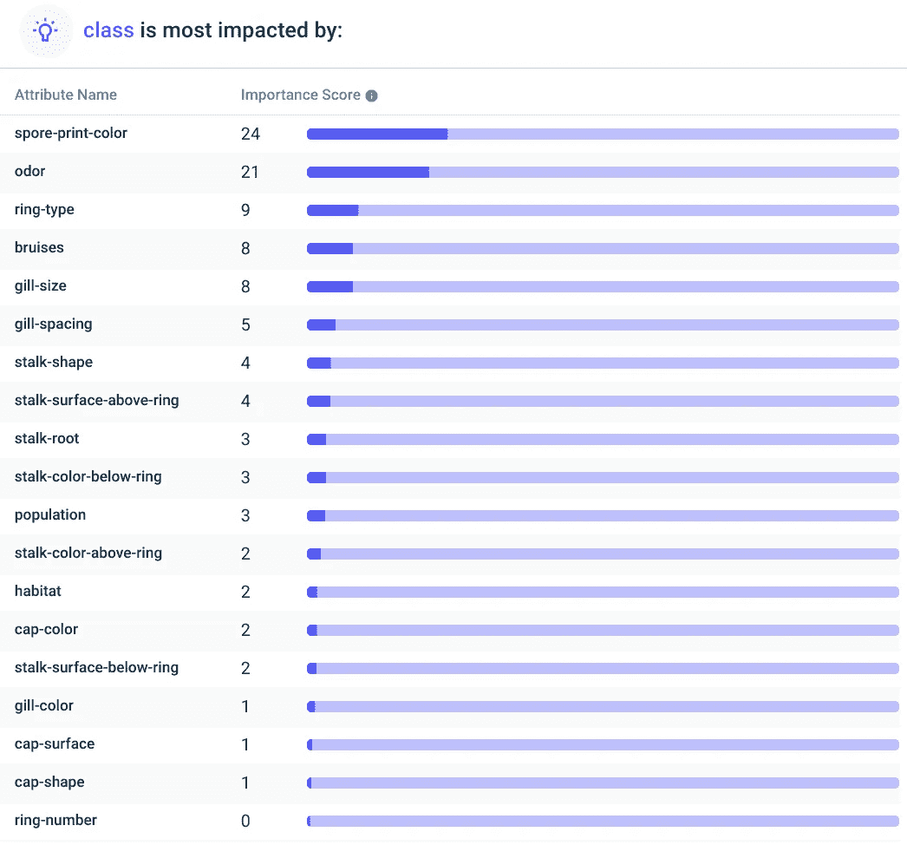

# 致命还是愉悦——人工智能预测蘑菇毒性

> 原文：<https://pub.towardsai.net/deadly-or-delightful-ai-to-predict-mushroom-toxicity-2aaa81c98f7a?source=collection_archive---------1----------------------->

## [预测分析](https://towardsai.net/p/category/predictive-analytics)

## 一个简单的预测分析用例。


[安德鲁·里德利](https://unsplash.com/@aridley88?utm_source=medium&utm_medium=referral)和[马库斯·斯皮斯克](https://unsplash.com/@markusspiske?utm_source=unsplash&utm_medium=referral&utm_content=creditCopyText)在 [Unsplash](https://unsplash.com?utm_source=medium&utm_medium=referral) 上的照片。

为了寻找有趣的人工智能用例，我找到了有毒和可食用蘑菇的 UCI 数据。

只有 8124 行和一个明确的目标(找到指示有毒蘑菇的特征并建立一个预测模型)，这是我们如何利用小数据使用人工智能的完美例子。

我使用[无代码工具 Apteo](http://apteo.co) 分析了数据集。

# 探索数据集

该数据集包含 8，124 行(或 8，124 个独特的蘑菇)和 23 列。

这些栏目基本上包括了蘑菇的每一个主要特征，包括菌盖、菌褶、菌柄的特征，以及它的气味、种群和栖息地等。

以下是完整列表:

```
cap-shape: bell=b,conical=c,convex=x,flat=f, knobbed=k,sunken=scap-surface: fibrous=f,grooves=g,scaly=y,smooth=scap-color: brown=n,buff=b,cinnamon=c,gray=g,green=r,pink=p,purple=u,red=e,white=w,yellow=ybruises: bruises=t,no=fodor: almond=a,anise=l,creosote=c,fishy=y,foul=f,musty=m,none=n,pungent=p,spicy=sgill-attachment: attached=a,descending=d,free=f,notched=ngill-spacing: close=c,crowded=w,distant=dgill-size: broad=b,narrow=ngill-color: black=k,brown=n,buff=b,chocolate=h,gray=g, green=r,orange=o,pink=p,purple=u,red=e,white=w,yellow=ystalk-shape: enlarging=e,tapering=tstalk-root: bulbous=b,club=c,cup=u,equal=e,rhizomorphs=z,rooted=r,missing=?stalk-surface-above-ring: fibrous=f,scaly=y,silky=k,smooth=sstalk-surface-below-ring: fibrous=f,scaly=y,silky=k,smooth=sstalk-color-above-ring: brown=n,buff=b,cinnamon=c,gray=g,orange=o,pink=p,red=e,white=w,yellow=ystalk-color-below-ring: brown=n,buff=b,cinnamon=c,gray=g,orange=o,pink=p,red=e,white=w,yellow=yveil-type: partial=p,universal=uveil-color: brown=n,orange=o,white=w,yellow=yring-number: none=n,one=o,two=tring-type: cobwebby=c,evanescent=e,flaring=f,large=l,none=n,pendant=p,sheathing=s,zone=zspore-print-color: black=k,brown=n,buff=b,chocolate=h,green=r,orange=o,purple=u,white=w,yellow=ypopulation: abundant=a,clustered=c,numerous=n,scattered=s,several=v,solitary=yhabitat: grasses=g,leaves=l,meadows=m,paths=p,urban=u,waste=w,woods=d
```

# 二元分类问题

有两类:P(有毒)和 E(可食用)，使这成为一个简单的二元分类问题。给定的蘑菇有毒还是可食用？

幸运的是，数据集在这两个类之间平均分配，因此我们不需要做任何预处理(不像二进制分类问题那样存在不平衡数据，比如信用卡欺诈数据集)。


通过 [Apteo](http://apteo.co) 。

# 有毒蘑菇的特征是什么？

将 CSV 上传到 Apteo，我们选择`class`列(有毒或可食用)作为我们想要测量的 KPI。

这自动告诉我们哪些属性是毒蘑菇的标志。



由 [Apteo](http://apteo.co) 提供。

正如我们所看到的，像孢子印的颜色和气味这样的属性高度表明蘑菇是否有毒。

[](http://americanmushrooms.com/odors.htm#:~:text=The%20tree%20parasite%20commonly%20called,odor%20similar%20to%20rotting%20flesh.) [## “有味道”的蘑菇——AmericanMushrooms.com

### 分享蘑菇的“气味”重要注意事项这一资源是张贴没有担保的绝对分类学…

americanmushrooms.com](http://americanmushrooms.com/odors.htm#:~:text=The%20tree%20parasite%20commonly%20called,odor%20similar%20to%20rotting%20flesh.) 

这与蘑菇采集者的发现相吻合，他们报告有毒的蘑菇闻起来像“坏火腿”或“腐烂的肉”。与此同时，许多可食用的蘑菇闻起来让人想起杏、黄瓜或西瓜皮等令人愉悦的气味。

此外，孢子印痕能告诉我们很多关于蘑菇是否有毒的信息。这些是通过切下蘑菇的茎，并将其盖放在纸上几个小时而获得的。你留下的颜色通常是特定物种的警示标志(例如，白色孢子印通常来自鹅膏属物种，而假阳伞留下绿色孢子印)。

# 做预测

蘑菇狩猎有着悠久的历史。今天它在许多地方仍然流行，尤其是在农村地区。


作者 Franciszek Kostrzewski——公共领域，【https://commons.wikimedia.org/w/index.php?curid=283404 

然而，这并不意味着我们都擅长于此。从 1999 年到 2016 年，仅在美国，就有高达 133，700 例毒蘑菇摄入*。可悲的是，其中 704 起导致重大伤害，52 人死亡。*

[](https://pubmed.ncbi.nlm.nih.gov/30062915/) [## 美国蘑菇中毒流行病学- PubMed

### 在美国和世界上许多其他地方，食用野生的和潜在有毒的蘑菇是很常见的。我们…

pubmed.ncbi.nlm.nih.gov](https://pubmed.ncbi.nlm.nih.gov/30062915/) 

我们可以将一种新蘑菇的特征输入 Apteo，并得到它有毒或可食用的可能性的预测。

例如，假设我们收集了一个看起来不寻常的蘑菇——它的茎上有一个环，白色的腮，白色的孢子印，闻起来有点像肥皂。

将这些属性插入我们的预测模型，它可以正确预测毒性。最好离远点！

# 摘要

有一个普遍的误解，即人工智能需要大量的计算能力、数据和专业知识。

如果你试图创建一个像 [GPT-3](https://towardsdatascience.com/will-gpt-3-kill-coding-630e4518c04d) 这样的艺术级模型，或者正在构建一个像 [BrainOS](https://towardsdatascience.com/brainos-the-most-brain-like-ai-61b334c7658b) 这样的新颖架构，你确实需要这些东西。

然而，大多数公司处理的不是数十亿个数据点，而是数千个数据点，并且可以从决策树和随机森林等更简单的模型中获得大量价值，而不需要专业技术知识。