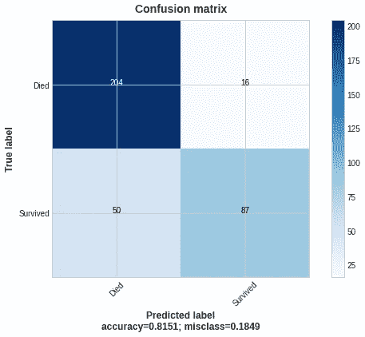
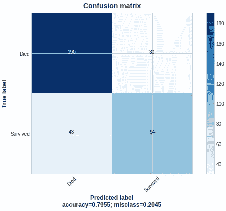
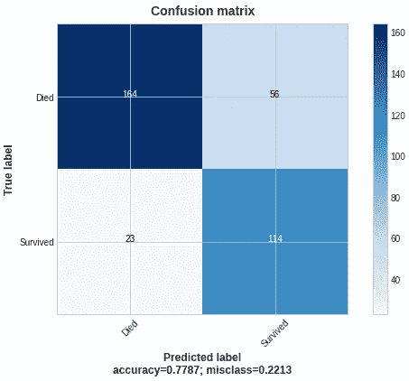
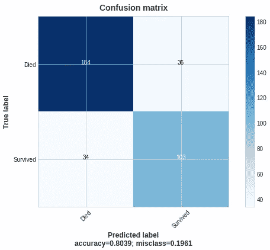
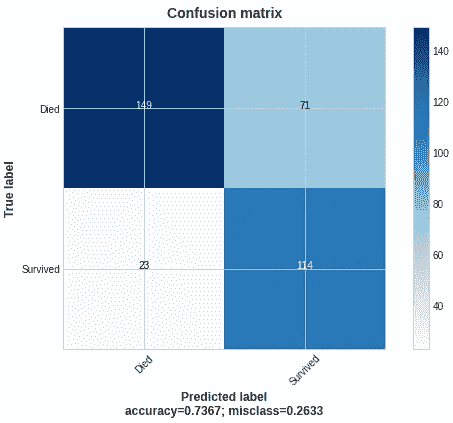

# 使用 TensorFlow、LightGBM 和 CatBoost 处理不平衡数据集

> 原文：<https://pub.towardsai.net/deal-with-an-imbalanced-dataset-with-tensorflow-lightgbm-and-catboost-b2476996d145?source=collection_archive---------1----------------------->

## 定制模型时，向工具箱中添加新仪器

来源:照片由 flickr.com[的](http://flickr.com)[布雷特·乔丹](https://www.flickr.com/photos/x1brett/)拍摄

您的数据集不平衡；您希望减少假阴性(FN)甚至假阳性(FP)的数量。也许你喜欢定制的东西，想练习给标准模型增加变化。如果是这样，这篇文章是给你的。

一种方法是用特定的系数定制模型的损失函数。本文旨在展示 TensorFlow、LightGBM 和 Catboost 中的定制方法。如果你想用相关的数学对整体概念有个大概的感觉，对 XGBoost 也看到同样的概念，看看我在 Medium 上的 [**文章**](/outline-a-smaller-class-with-the-custom-loss-function-94ff00359698) 。

此外，我的目标是提供一种将自定义超参数嵌入到自定义函数中的方法，这为像普通参数一样对新参数进行高级调优打开了大门。

我使用泰坦尼克号数据集进行演示，因为它是可接近的和不平衡的。基本款，还有定制款，都在我的 [**GitHub 库**](https://github.com/kpluzhnikov/binary_classification_custom_loss) **里。**

## **LightGBM**

这是微软开发的最有效的梯度推进算法之一。它在速度上超过 XGBoost，在精度上不相上下。更多详情，请查看 BexBoost 的 [**这篇文章**](https://medium.com/towards-data-science/how-to-beat-the-heck-out-of-xgboost-with-lightgbm-comprehensive-tutorial-5eba52195997) **。** LightGBM 是 XGBoost 的弟弟，所以有它所有的成就。

我已经使用嵌入式用户定义函数引入了`beta`作为 logloss 函数的核心部分(它不再是一个外部超参数)。

您可以看到外部函数将`beta`呈现给内部函数，内部函数计算导数。这同样适用于自定义指标。现在，您可以使用其他带有特殊包(如 Optuna 库)的超参数对其进行调优。

> `beta`应该是< 1.0 来惩罚 FN。要惩罚 FP，应该是 1.0 以上。详情请看我的 [**文章**](/outline-a-smaller-class-with-the-custom-loss-function-94ff00359698) 上媒。

与 XGBoost 自定义损失函数相比有一些不同。首先，LightGBM 将`y_pred`放入 logit_raw 格式，需要进行 logit 转换。其次，LightGBM 定制度量输出三个结果(定制度量的名称(例如，“logreg_error”)、度量的值以及应该设置的布尔参数`False`，因为我们的目标是减少定制度量值)。

在`predt`的一个 logit 转换中还有一个更有趣的细节；在处理负数 logit_raw 时，我使用了`np.where`函数来保证稳定性和避免溢出。在 Stackoverflow 和模型文档的不同例子中，它被作为最佳实践提到。

让我们绘制一个标准 LightGBM 模型和一个有定制损耗的模型的结果的混淆矩阵:

(**左**)基本 LightGBM 模型| ( **右**)beta = 0.4 的定制 LightGBM 模型，来源:图片由作者提供

与`beta`1 的自定义丢失导致了 FPs 和 TPs 的增长；到 FN 和 TN 的耗尽。

## CatBoost

全称是 Categorical boosting，由 Yandex 开发。与其他算法相比，它具有巨大的优势，因为您不需要对数据集的分类特征进行编码；您将它们列在模型中，它会自己处理它们。 [Dmytro Iakubovskyi](https://medium.com/u/cc9b2dac6f8b?source=post_page-----b2476996d145--------------------------------) 在他对不同数据集(IMDB、葡萄酒、啤酒和更多带有统计数据的表格)的分析中广泛使用了它。CatBoost 继承了 XGBoost 和 LightGBM 的大部分额外功能。

您可以看到 Catboost(使用面向对象编程)和 LightGBM(一个标准的用户定义函数)实现之间的区别。我从官方文档中获取了 CatBoost 类的代码。我只将`beta`添加到类的初始化中。你可以用你喜欢的任何形式(OOP 或 UDF)为这些函数编写代码。选择权在你！

绘制结果:

(**左**基本 CatBoost 模型| ( **右**)beta = 0.4 的定制 CatBoost 模型，来源:图片由作者提供

结果的逻辑与 LightGBM 模型相同。

## 张量流

它是谷歌著名的超级强大的算法家族。在这里建立一个自定义损失是一个不同的故事。你不需要明确地写下导数和自定义指标；不再有' beta '了(`beta`已死，`pos_weight`万岁！).TF 有一个合适的功能，`tf.nn.weighted_cross_entropy_with_logits`让事情变得容易管理得多。

> `pos_weight`应该是> 1.0 惩罚 FN，< 1.0 惩罚 FP。和`beta`相比是相反的情况。`pos_weight`是 logloss 的 FN 部分相乘的系数，而`beta`是 FP 部分的因子。

绘制结果:

(**左**)基本张量流模型| ( **右**)定制的张量流模型，pos_weight = 3.5，来源:图片由作者提供

我的定制模型表现相当差，而 TF 标准模型表现很好；我希望你原谅我糟糕的结果，因为这里的主要目标是演示。

**结论**

所有模型的总体结果都是可比的。FN 和 FP 之间的权衡也很到位。但是如果减少 FN 是你的目标，这些自定义损失由你支配。

**优点**

*   易于快速应用(使用四个用户定义的函数和测试版，仅此而已)。
*   在建模之前，不需要对底层数据进行操作(如果数据集不是高度不平衡的话)
*   它可以作为数据探索的一部分或模型叠加的一部分来应用。
*   我们可以将它添加到最流行的机器学习包中。
*   通过嵌入的`beta`或`pos_weight`，我们可以像往常一样调整它们的超参数。

**快捷键**

*   我们应该调整`beta`以获得最佳的 FN 到 FP 的平衡。
*   当数据集高度不平衡时(次要类别少于所有样本的 10%的数据集)，它可能不会提供有意义的结果。探索性数据分析对于模型的运行至关重要。
*   如果我们惩罚新生力量，它通常会导致大量的 FP 增长，反之亦然。您可能需要额外的资源来弥补这种增长。

希望这篇文章对用 UDF 和 OOPs 编写自定义损耗甚至改编 Tensorflow 官方实现有所指导。此外，您可以使用这些示例作为函数开发的起点。

保持安全和健康。不允许战争。

## **参考文献**

1.  关于如何在 Stackoverflow 上实现 LightGBM 的讨论-->[https://stack overflow . com/questions/58572495/how-to-implementation-custom-log loss-with-identical-behavior-to-binary-objective-in-l/58573112 # 58573112](https://stackoverflow.com/questions/58572495/how-to-implement-custom-logloss-with-identical-behavior-to-binary-objective-in-l/58573112#58573112)
2.  自定义 loss -> [官方 CatBoost 文档 https://CatBoost . ai/en/docs/concepts/python-usages-examples #用户自定义 loss-function](https://catboost.ai/en/docs/concepts/python-usages-examples#user-defined-loss-function)
3.  自定义指标的 CatBoost 官方文档-->[https://CatBoost . ai/en/docs/concepts/python-usages-examples # custom-loss-function-eval-metric](https://catboost.ai/en/docs/concepts/python-usages-examples#custom-loss-function-eval-metric)
4.  带逻辑的加权交叉熵的 TensorFlow 官方文档->[https://www . tensor flow . org/API _ docs/python/TF/nn/weighted _ cross _ entropy _ with _ logits](https://www.tensorflow.org/api_docs/python/tf/nn/weighted_cross_entropy_with_logits)
5.  关于如何在 TensorFlow 中组装自定义损失函数的优秀文章->[https://medium . com/swlh/custom-loss-and-custom-metrics-using-keras-sequential-model-API-D5 BCD 3 a4 ff 28](https://medium.com/swlh/custom-loss-and-custom-metrics-using-keras-sequential-model-api-d5bcd3a4ff28)
6.  我的 GitHub 储存库，包含所有提到的自定义损失->[https://GitHub . com/kpluzhnikov/binary _ classification _ custom _ loss](https://github.com/kpluzhnikov/binary_classification_custom_loss)

如果你喜欢这篇文章，请毫不犹豫地喜欢、评论并分享它。或者甚至:

 [## 通过我的推荐链接-康斯坦丁·普鲁申尼科夫加入媒体

### 阅读康斯坦丁·普鲁申尼科夫的每一个故事(以及媒体上成千上万的其他作家)。您的会员费直接…

medium.co](https://medium.com/@kplz/membership)