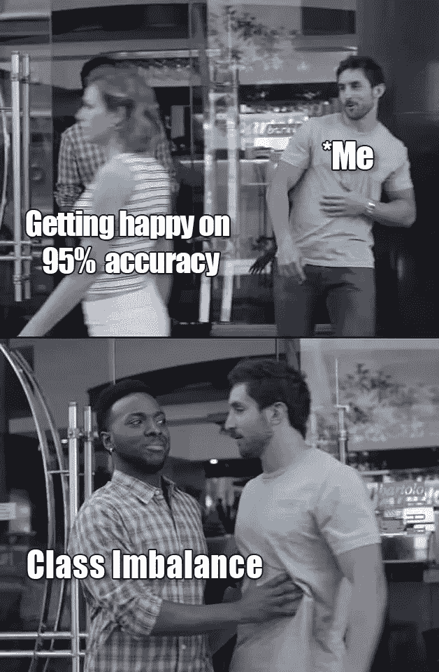
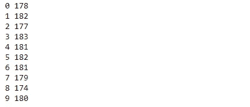
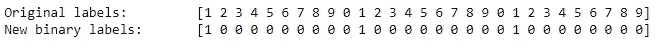
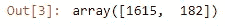
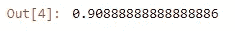
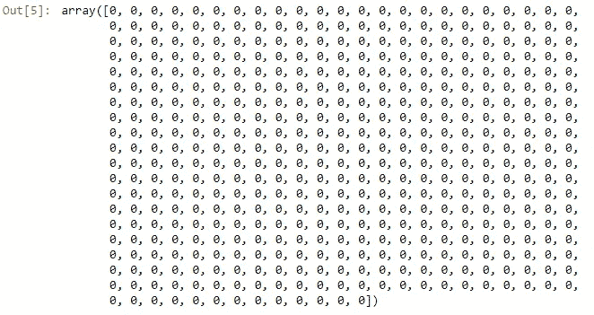
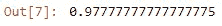

# 处理类别不平衡—虚拟分类器

> 原文：<https://pub.towardsai.net/dealing-with-class-imbalance-dummy-classifiers-f9ca516567af?source=collection_archive---------0----------------------->

## [数据科学](https://towardsai.net/p/category/data-science)

图片来源:[https://datascience.aero/](https://datascience.aero/)

L 让我为您描绘一幅画面，您是数据科学领域的初学者，已经开始制作您的第一个预测 ML 模型，并发现使用`model.score()`的准确率为 95%。你跳来跳去，认为你成功了，也许你注定要成为一名数据科学家。嗯，我不想戳破这个泡沫，但你可能会大错特错。你知道为什么吗？—因为准确性是衡量分类器性能的一个非常糟糕的指标，尤其是在不平衡数据集的情况下。不平衡的数据集在许多领域和部门都很普遍。从欺诈性交易、识别罕见疾病、窃电到对电子商务网站中的搜索相关项目进行分类，数据科学家在许多情况下都会遇到这些问题。当我们必须建立一个可以对训练数据集中非常罕见的案例进行分类的机器学习模型时，挑战就出现了。由于变量中类别的不相称性，没有考虑类别不相称性或平衡的传统 ML 算法倾向于分类到具有更多实例的类别中，即**主要**类别，同时给我们一个极其精确的模型的错误概念。预测罕见事件的无能和误导性的准确性都会毁掉我们制作预测模型的整个动机。

由**作者**设计

我举个例子，假设你开发了一个预测欺诈交易的分类器。在你完成开发之后，你在测试集上测量它的准确率为 97%。起初，这似乎好得难以置信，对吗？

现在，让我们将其与一个虚拟分类器进行比较，该分类器总是只预测最有可能是非欺诈性交易的类别。也就是说，不管实际的实例是什么，伪分类器将总是预测交易是非欺诈性的。假设我们有包含 1，000 个交易细节的测试数据，平均来说，其中大约 999 个是非欺诈性交易。因此，我们的虚拟分类器将正确预测所有 999 笔交易的非欺诈标签。因此虚拟分类器的准确度将是 99.9%。因此，我们自己的分类器的性能一点也不像我们想象和庆祝的那样好。这并不比总是在不看数据的情况下猜测多数类好多少。

还不服气哈！然后，让我们用一个真实的数据集制作一个分类器来阐述它。我们将使用 digits 数据集，它包含从 0 到 9(即 10 类)标记的手写数字图像。

首先，我们应该导入必要的库，然后是 load_digits 数据集。现在，为了检查我们的数据集是否平衡，我们使用 numpy 的 bin count 方法来计算每个类中实例的数量。

结果的导入和宁滨代码

显示不同数字类别中数据点计数的输出

正如我们所看到的，每个类中的实例数量或多或少是相似的，因此它是一个平衡的数据集，对吧！！但是为了向您展示虚拟分类器的应用，我们将把这个数据集转换成一个不平衡的数据集。为此，我们将用标签 0 将所有不是数字 1 的数字标记为负类，用标签 1 将为 1 的数字标记为正类。

用于使数据集不平衡的代码

原始与修改后的标签使数据集不平衡

绑定类以显示每个类的计数的代码

显示每个类中实例计数的输出

现在我们已经将所有 1 指定为正类，将所有其他 1 指定为负类，当我们使用 bincount 时，我们可以看到有 1615 个负例，但只有 182 个正例。事实上，我们成功地制作了一个不平衡的数据集。现在，像往常一样，我们首先在不平衡数据集上创建一个训练测试分割。然后我们用这些二值标签训练了一个支持向量机分类器，以径向基函数为核。

实现 SVC 作为预测模型

显示精确度的输出

我们用。score()方法，我们可以看到这个值在 90%左右。该死的。！！百分之九十，这已经足够了。让我给你一个比较，根据 2019 年的报告，我们使用的谷歌人工智能助手的准确率为 88%。那么我们是否成功地做出了分类的最佳模型呢？为此，应该有一些标准来衡量它，对不对！尤其是当你在一个分类器上花费了如此多的资源…想象一下，你费尽心机收集数据，清理数据，理解数据，然后建立模型，但最后，你的一个朋友出现了，他开始猜测一个新数据点的每个标签是多数类，并且具有与你的模型相似的准确性。你不认为这会很令人失望和尴尬吗？因此，为了让你免于尴尬，sci-kit learn 有一种叫做虚拟分类器的东西，它会模拟一个系统，这个系统会根据最大频率或分布等进行猜测。我一会儿就会谈到这一点。让我们首先为我们的数字分类器实现它，看看 90%的准确率实际上是否令人印象深刻。

生成“最频繁”策略的虚拟分类器的代码

显示虚拟分类器预测 all 为负类的输出

由于我们使用了最大频率策略，您可以看到它总是预测测试集中每个实例的 0 或负类(具有最大频率)。

检查准确性的代码

显示虚拟分类器准确性的输出

因此，我们得到的精度比 SVC 模型稍低。因此，我们发现我们的分类器具有非常接近虚拟分类器的准确度，但是它代表什么呢？这可能是由于以下两个原因之一:第一，我们用于分类器的特征非常随机且无效；第二，我们采用了非常糟糕的核或超参数选择，如 SVM 的 C 和 sigma 或 KNN 模型中的 k 参数。例如，如果我将支持向量分类器的核参数从 RBF 改为 linear。然后再次计算重新训练的模型的准确性，我们可以看到，与最常见的 90%的战略 DummyClassifier 基线相比，这导致了几乎 97.8%的更好的性能。

SVC 中用线性代替 RBF 核的实现

线性 SVC 的精度

这里我只是展示了“最常见”的虚拟分类器策略类型。让我详细说明一下虚拟分类器及其类型。

## **虚拟分类器**

虚拟分类器基本上是一种分类器，它在分类时甚至不查看训练数据，而是遵循我们在分类时指导它使用的经验规则或策略。这是通过在 DummyClassifier 的策略参数中包含我们想要的策略来实现的。在上面的例子中，我们使用了“最频繁”。在一天结束时，我们用它作为基线，并期望我们的模型比这个基线分类得更好。这是基于一个显而易见的概念，即我们希望我们的基于分析方法的分类器比随机猜测方法做得更好。

**可以使用的策略类型**

***最频繁:*** 它总是预测最频繁的标签。例子:如前面的例子所示，虚拟分类器只预测最频繁出现的否定类别。

***分层:*** 基于训练数据集的类别分布进行预测。例如，如果负类在训练集中大约 80%的时间出现，那么伪分类器将以 80%的概率输出负类。

***均匀:*** 随机均匀预测类别。也就是说，所有类别都有相同的机会被分类器输出，而不是取决于它在训练数据集中出现的频率。

***常量:*** 总是预测用户指示的同一类别。对于度量来说，评估非多数类是有用的。

嘿！我知道还有其他指标，如 AUC、F1 得分等。，我将在另一篇媒体文章中讨论，敬请关注。但是我想把这篇文章献给 DummyClassifier，因为它是我们许多人可能不知道的东西。我希望我能够公正地对待这个话题。

参考资料:

*   [https://scikit learn . org/stable/modules/generated/sk learn . dummy . dummy classifier . html](https://scikit-learn.org/stable/modules/generated/sklearn.dummy.DummyClassifier.html)
*   【https://www.coursera.org/learn/python-machine 学习/主页/欢迎 T3

——来自一个初学者犯了同样的错误，过早地庆祝获得 90+的准确率😅