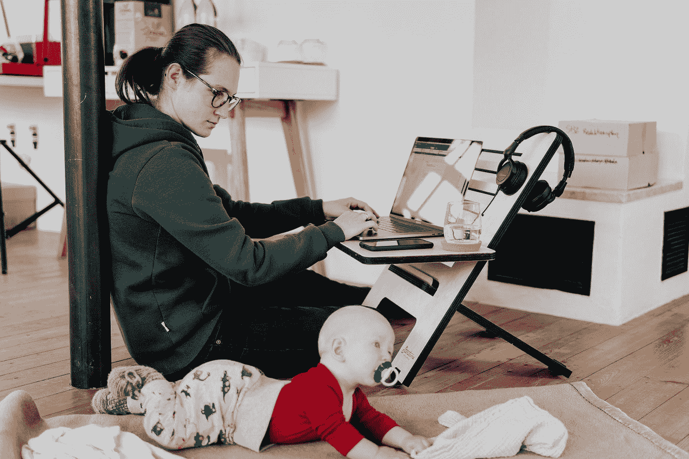
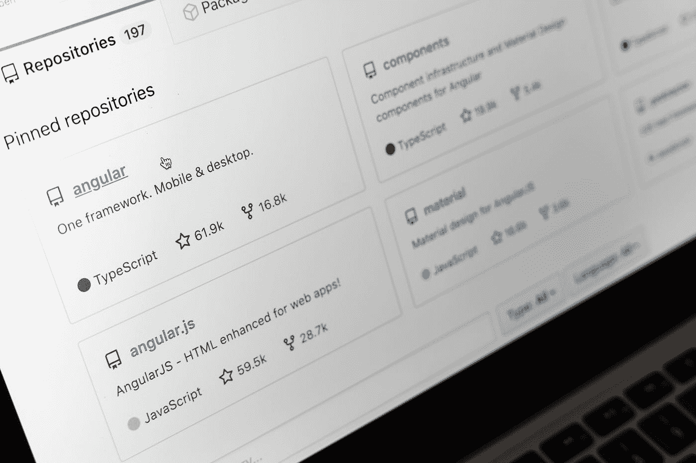

# 亲爱的招聘经理，请停止使用带回家的作业！

> 原文：<https://pub.towardsai.net/dear-hiring-manager-please-stop-using-take-home-assignments-fa0ebae0a4e0?source=collection_archive---------1----------------------->

## [职业生涯](https://towardsai.net/p/category/careers)、[数据科学](https://towardsai.net/p/category/data-science)、[观点](https://towardsai.net/p/category/opinion)

## 关于您可以在数据科学/分析师访谈中使用哪些内容的意见。

由[上](https://unsplash.com?utm_source=medium&utm_medium=referral)的[间隔](https://unsplash.com/@headwayio?utm_source=medium&utm_medium=referral)拍摄

*免责声明:本文观点仅代表我个人，与我的雇主无关。*

数据科学和数据分析是 2021 年市场上最热门的工作。这个领域如此受欢迎，工作描述如此宽泛，以至于大多数职位空缺都会收到数百甚至数千份申请，因为大多数男性知道，即使他们没有达到 100%的要求，他们也可以申请一个职位。出于某种原因，女性更加保守[ [链接](https://hbr.org/2014/08/why-women-dont-apply-for-jobs-unless-theyre-100-qualified) ]。

随着如此多的申请涌入，数据科学/分析成为许多这些公司的新领域，招聘经理已经开始使用可怕的“带回家”任务来筛选候选人。

在带回家的作业中，候选人会得到一个数据集，在大多数情况下，候选人会得到一张空白支票，让他/她从数据中找到任何见解。

# 为什么带回家作业是个糟糕的主意:

## 你最好的候选人没有时间。

这么多事要做，时间却这么少。照片由 [Aron 视觉效果](https://unsplash.com/@aronvisuals?utm_source=medium&utm_medium=referral)在 [Unsplash](https://unsplash.com?utm_source=medium&utm_medium=referral) 上拍摄

想想吧。你现在的高绩效员工不就是最努力的一群人吗？同样的道理也适用于你未来的候选人。如果他/她在目前的公司表现出色，他们会在目前的工作岗位上工作繁忙，努力工作。他们抽不出平均 10 多个小时的课后作业。因此，他们带回家的作业可能看起来不像同一家公司中有更多空闲时间的普通员工那样完美。我相信所有的招聘经理都想雇佣表现最好的人，那么为什么要在面试过程中让他们处于劣势呢？

## 在商业中，目标很少是模糊不清的。

模糊目标，模糊结果。由 [Gabriel Santiago](https://unsplash.com/@whileimout?utm_source=medium&utm_medium=referral) 在 [Unsplash](https://unsplash.com?utm_source=medium&utm_medium=referral) 上拍摄的照片

许多(如果不是全部的话)带回家的作业没有具体的目标，而是采取一种“尽你所能”的方法。这是一种评估潜在候选人的低劣方式，除非你的企业也在如此巨大的灰色地带运营。在很大程度上，商业目标是具体的。增加 X 数量的收入，或者用你的模型达到 Y%的最低精确度，等等。模糊不清的目标会伤害你，因为

1.  这传达了一个信息:你不知道你在寻找什么，这是对优秀候选人的一个警告。
2.  当你没有具体理由就拒绝一个候选人时，会损害你公司的形象。顶尖候选人对自己的工作非常自豪，并希望自己的时间受到尊重。如果你可以用一个简单的“不合适”的回答来浪费某人 10 多个小时的时间，这充分说明你以后会多么珍惜他们作为员工的时间。

## 这是歧视性的

职业父母的挑战。照片由 [Unsplash](https://unsplash.com?utm_source=medium&utm_medium=referral) 上 [Standsome Worklifestyle](https://unsplash.com/@standsome?utm_source=medium&utm_medium=referral) 拍摄

我是一个蹒跚学步的孩子的父亲，一个丈夫，一个年迈父母的儿子。带回家的作业歧视那些在工作之外的生活中负有责任的人。他们尤其歧视有孩子的女性，因为大多数孩子出于这样或那样的原因每隔 5 分钟就想要他们的“妈妈”。这使得职业母亲很难在家里花 10 多个小时完成你的家庭作业，这可能会使她们的提交看起来更差，并加剧已经困扰技术团队的性别差距。

出于这些原因，我认为任何招聘经理都不应该把带回家的任务作为招聘过程的一部分。如果你正在使用一个，我强烈建议考虑我下面提出的一些选择，以最大限度地发挥你雇用最好的，高性能的候选人的潜力。

# 你可以做以下事情来代替带回家的作业:

## 缩小你的工作描述范围

专注！照片由[photo-nic.co.uk NIC](https://unsplash.com/@chiro?utm_source=medium&utm_medium=referral)在 [Unsplash](https://unsplash.com?utm_source=medium&utm_medium=referral)

许多数据科学家/分析师的职位描述是这样的:精通 Python、R、Java、C++、Scala、科学计算(Pandas、Numpy、Tensorflow、Pytorch、OpenCV、Sklearn)、大数据(Hadoop、Hive、Spark、MapReduce)、ETL、数据库(MS SQL、Oracle、MySQL、Teradata、BigQuery)、无 SQL (HBASE、Cassandra、MongoDB)、仪表板(Tableau、PowerBI)、云计算(AWS、GCP、Azure)、ElasticSearch、Kubernetes，甚至一些)如此宽的 JDs 的问题是，你会得到许多稀释你正在寻找的最佳候选人的申请人。

在我看来，一个更好的选择是查看你当前团队的组成，发布多个 JD，每个都有一个对某个领域的强烈关注。我敢肯定，在你目前的团队中，没有一个人对所有这些技术的熟悉程度达到了你希望聘用的水平。相反，你会有一些懂 Python 和科学计算的人。一些擅长数据库和云计算的人，一些仪表板专家，等等。为什么不把你的 JD 分成三个 JD 来反映这些行呢？这样，申请的候选人也将集中在你想雇用的领域，你更容易筛选出好的候选人，减少了带回家筛选阶段的需要。

## GitHub 投资组合评论

投资组合审查。照片由[马库斯·温克勒](https://unsplash.com/@markuswinkler?utm_source=medium&utm_medium=referral)在 [Unsplash](https://unsplash.com?utm_source=medium&utm_medium=referral) 上拍摄

大多数真实世界的数据科学工作需要数周，甚至数月。为了自信地评估候选人在一段时间内解决现实世界问题的能力，有必要让申请人分享他们的 Github(或任何其他代码库配置文件)作为作品集。对于数据分析师，你可以要求公开他们的 Tableau 或任何其他已发表的作品。这是评估他们解决现实世界问题的能力的一个更好的方法，因为这种投资组合不可能在一夜之间建立起来。此外，它还帮助您评估候选人是否具备版本控制知识，这在大规模协作数据项目中是绝对重要的！

## 出版物/Kaggle 项目评论

出版物。在 [Unsplash](https://unsplash.com?utm_source=medium&utm_medium=referral) 上由 [Austin Distel](https://unsplash.com/@austindistel?utm_source=medium&utm_medium=referral) 拍摄的照片

如果你的候选人发表过作品，你也可以评估一下，而不是 Github 作品集评论！论文、会议、期刊、媒体文章、Kaggle 项目等。，是你可以回顾的例子，以了解候选人的技术和解决问题的技能。

## 在线编码测试

编码测试。照片由[丹尼尔·里卡洛斯](https://unsplash.com/@ricaros?utm_source=medium&utm_medium=referral)在 [Unsplash](https://unsplash.com?utm_source=medium&utm_medium=referral) 上拍摄

我喜欢这种形式，因为它既有时间限制，又有明确的任务目标。像 [HackerRank](https://www.hackerrank.com/) 和 [Codility](https://www.codility.com/) 这样的各种在线测试平台如今很流行，它们可以建立一个简明的编码测试来评估潜在候选人的编程和解决问题的技能。反馈是即时的，候选人带着成就感离开。如果你不能花时间去查看某个人的 Github 简介或出版物，在线编码测试可能是一个合适的选择。

## 同行和/或利益相关者访谈

同行面试。Amy Hirschi 在 [Unsplash](https://unsplash.com?utm_source=medium&utm_medium=referral) 上拍摄的照片

大多数数据科学和数据分析师的工作都是高度协作的。最好是那些不仅技术过硬，而且善于沟通并能与他人合作的人。软技能比一个人在 10 小时内完成一项带回家的任务更重要。因此，同行和/或利益相关者面试是数据科学/分析师面试的一个游戏规则改变者，以找到合适的人选。

这就是我对这个话题的看法。尽管这不公平，候选人也不喜欢，但由于评估数据专业人员的能力很困难，带回家的任务顽固地拒绝取消。然而，我希望通过这些建议，越来越多的招聘经理可以远离这种做法。不管你同意还是不同意我的观点，我都希望能就这个话题进行一次开诚布公的对话。

> 解决问题的第一步是承认问题的存在。

一如既往的感谢您的阅读！