# 用于二元分类的决策和分类树(CART ): sci kit-Learn 实践

> 原文：<https://pub.towardsai.net/decision-and-classification-tree-cart-for-binary-classification-hands-on-with-scikit-learn-b59474b2c039?source=collection_archive---------1----------------------->

## 使用 Python 和 Google Colab

决策树是一种机器学习技术，它应用类似于“if-else”语句的序列来构建逻辑模型并将值分类。该模型通过构建问题和阈值来工作，并期望得到“是”或“否”的二元答案。

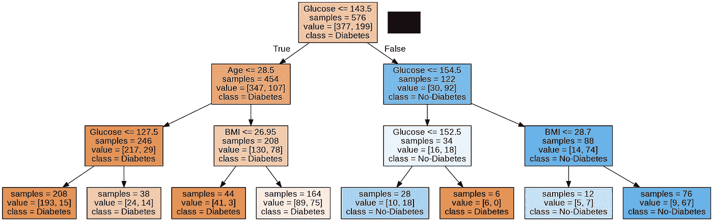

我将展示使用 Google Colab 用 Python 实现决策树所需的步骤。如果您熟悉这项技术背后的理论，并且对 Python 有基本的了解，那么本教程可能会更容易理解。但是，如果不知道决策树算法是如何工作的，不要担心，我会用代码和例子来解释它，因为这样更容易理解。

对于本教程，我们将使用您可以在 Kaggle 上找到的 [**糖尿病 _ 数据集**](https://www.kaggle.com/datasets/mathchi/diabetes-data-set) 。该数据集有 8 个特征和 1 个二元结果(疾病或非疾病)。我们的目标是基于这 8 个特征来预测糖尿病的存在或不存在。

> 开始吧！

第一件事是在你的 Google Colab 笔记本中加载必要的库:

```
import numpy as np
import pandas as pd
import matplotlib.pyplot as plt
import seaborn as sns
from sklearn.model_selection import train_test_split
```

您可以使用左侧的菜单将数据集上传到笔记本会话:

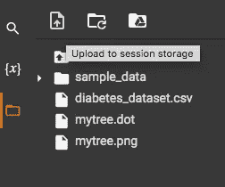

阅读并查看数据集:

```
df = pd.read_csv("/content/diabetes_dataset.csv")
df
```

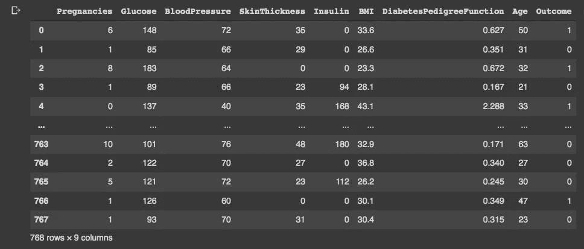

如果一切正常，您将看到一个像这样的表，有 9 列(8 个特性+ 1 个结果)和 768 行(数据点)。为了全面了解我们的变量，我们可以使用 **describe()** 函数:

```
print(df.describe())
```

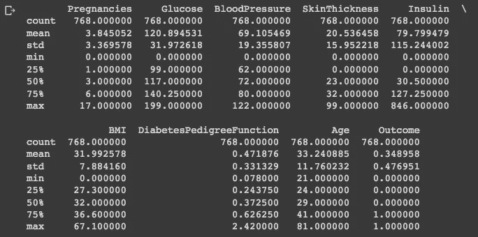

由于“结果”是一个二元变量， **count()** 函数是一个更好的方法:

```
print(df.value_counts("Outcome"))
```

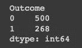

我们可以根据结果探索我们的数据集，并直观地检查每个特征在分离二元结果方面的表现:

```
**#Exploring dataset:**
sns.pairplot(df, kind="scatter", hue="Outcome")
plt.show()
```

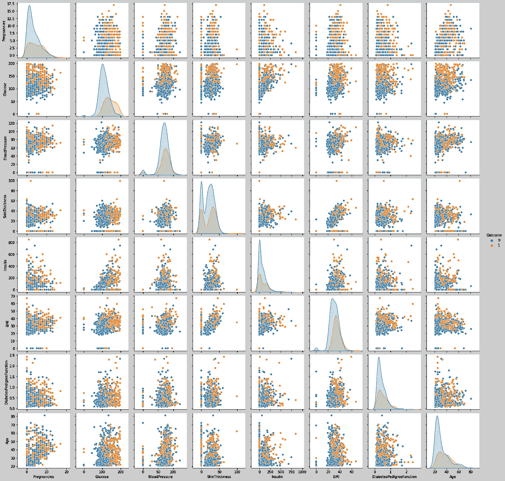

我们还可以评估共线性，并检查要素如何相互关联:

```
**#Drop the outcome:**
df_corr = df.drop(["Outcome"], axis=1)**#Build heatmap:** corr_matrix=df_corr.corr()mask = np.zeros_like(corr_matrix)
mask[np.triu_indices_from(mask)] = Truesns.heatmap(corr_matrix, mask=mask, square=True)
```

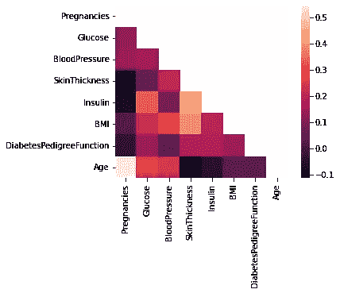

在热图中，我们可以看到只有“年龄”和“怀孕”的相关系数高于 0.5。然而，这是可以预料的，而且可能不会影响我们的分析。分布图有助于直观显示两种结果的预测值分布情况，以及这些分布是否存在较大差异:

```
fig, axs = plt.subplots(4, 2, figsize=(15, 15))sns.histplot(data=df, x="Pregnancies", hue="Outcome", kde=True, color="skyblue", ax=axs[0, 0])
sns.histplot(data=df, x="Glucose", hue="Outcome", kde=True, color="skyblue", ax=axs[0, 1])
sns.histplot(data=df, x="BloodPressure", hue="Outcome", kde=True, color="skyblue", ax=axs[1, 0])
sns.histplot(data=df, x="SkinThickness", hue="Outcome", kde=True, color="skyblue", ax=axs[1, 1])
sns.histplot(data=df, x="Insulin", hue="Outcome", kde=True, color="skyblue", ax=axs[2, 0])
sns.histplot(data=df, x="BMI", hue="Outcome", kde=True, color="skyblue", ax=axs[2, 1])
sns.histplot(data=df, x="DiabetesPedigreeFunction", hue="Outcome", kde=True, color="skyblue", ax=axs[3, 0])
sns.histplot(data=df, x="Age", hue="Outcome", kde=True, color="skyblue", ax=axs[3, 1])plt.show()
```

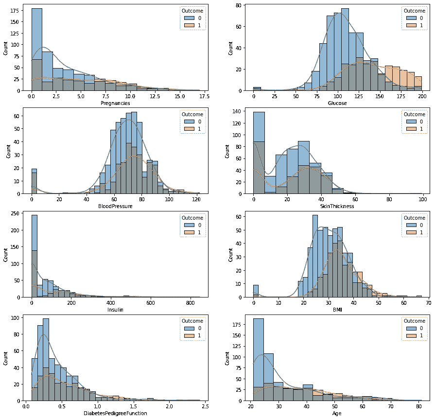

另一种可视化数据的方法是:

```
fig, axs = plt.subplots(4, 2, figsize=(15, 15))sns.boxplot(x=df["Outcome"], y=df["Pregnancies"], ax=axs[0, 0])
sns.boxplot(x=df["Outcome"], y=df["Glucose"], ax=axs[0, 1])
sns.boxplot(x=df["Outcome"], y=df["BloodPressure"], ax=axs[1, 0])
sns.boxplot(x=df["Outcome"], y=df["SkinThickness"],ax=axs[1, 1])
sns.boxplot(x=df["Outcome"], y=df["Insulin"], ax=axs[2, 0])
sns.boxplot(x=df["Outcome"], y=df["BMI"], ax=axs[2, 1])
sns.boxplot(x=df["Outcome"], y=df["DiabetesPedigreeFunction"], ax=axs[3, 0])
sns.boxplot(x=df["Outcome"], y=df["Age"], ax=axs[3, 1])plt.show()
```

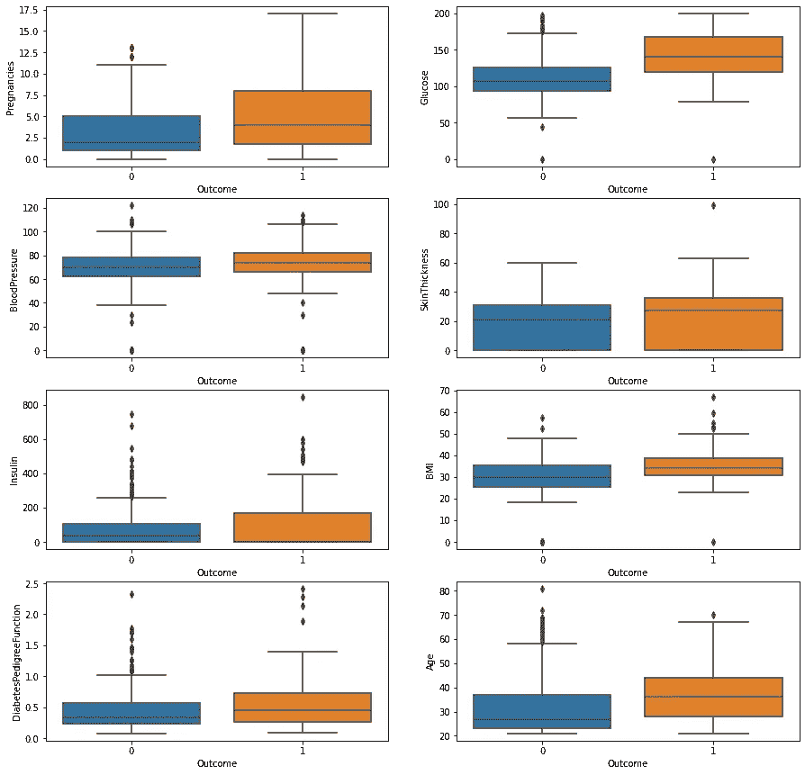

现在我们已经知道了数据的样子，我们可以构建我们的模型了:

```
**#Import libraries:**
from sklearn.tree import DecisionTreeClassifier
from sklearn.model_selection import train_test_split
```

我们需要定义我们的变量: **X** 将包含特性，而 **y** 将包含结果:

```
X = df.drop(["Outcome"], axis=1)
y = df["Outcome"]
```

然后我们将数据分成训练和测试两部分:

```
X_train, X_test, y_train, y_test = train_test_split(X, y, random_state=42)
```

要构建和拟合模型:

```
tree = DecisionTreeClassifier()
tree.fit(X_train, y_train)
```

为了评估这个模型:

```
print("accuracy on training set: %f" % tree.score(X_train, y_train))
print("accuracy on test set: %f" % tree.score(X_test, y_test))
```

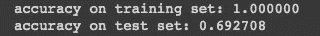

我们看到我们的模型明显过度拟合。这是因为我们没有限制树中节点的数量，我们的模型使用了 8 个可用的特性。这已经建立了一个大而复杂的“树”，如下图所示:


为了检查哪些特性最有能力区分这两个类别，我们可以打印一个数组，显示每个特性的重要性。如果我们将所有值相加，它将等于 1。

```
tree.feature_importances_
```

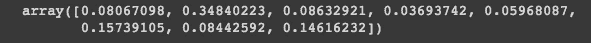

我们可以看到，这三个特征比所有其他特征更重要。这是一个暗示，我们可以建立一个只有三个节点的树。我们不需要知道选择哪些特性，因为模型会为我们完成这项工作。但是，如果我们想知道哪些特征具有最大的预测能力，我们可以使用树特征重要性构建一个图:

```
import matplotlib.pyplot as pltplt.plot(tree.feature_importances_, 'o')
plt.xticks(range(X.shape[1]), X.columns, rotation=90)plt.ylim(0, 1)
```

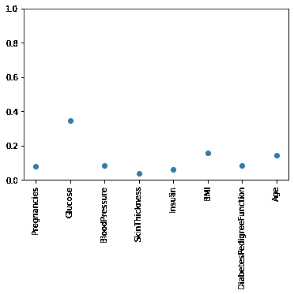

现在我们知道“葡萄糖”、“身体质量指数”和“糖尿病患者的肾功能”是最重要的特征。让我们构建一个只有这三个节点的树:

```
tree = DecisionTreeClassifier(max_depth=3)
tree.fit(X_train, y_train)print("accuracy on training set: %f" % tree.score(X_train, y_train))
print("accuracy on test set: %f" % tree.score(X_test, y_test))
```

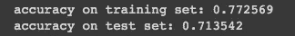

这棵树的特点很重要:

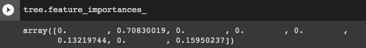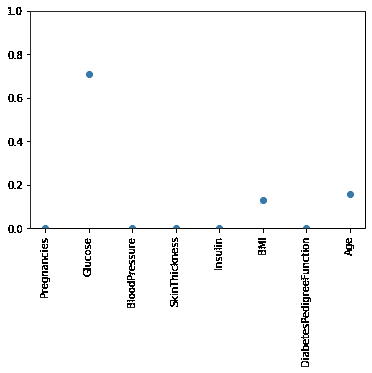

虽然仍然过度拟合，但我们可以看到现在训练和测试精度更接近了。如果我们再次构建我们的树，我们可以看到它是多么简单:

```
**#To build the tree diagram:**
from sklearn.tree import export_graphviz
import graphviz**#Create the tree:**
export_graphviz(tree, out_file="mytree.dot", class_names=["Diabetes", "No-Diabetes"], feature_names = X.columns, impurity=False, filled=True)**#Tree visualisation:**
with open("mytree.dot") as f:
    dot_graph = f.read()graphviz.Source(dot_graph)
```


如果要将树形图保存为**。png** ，你需要执行这些额外的步骤:

```
import pydot**# Use dot file to create a graph:**
(graph, ) = pydot.graph_from_dot_file('mytree.dot')**# Write graph to a png file:**
tree_png = graph.write_png('mytree.png')
```

你会找到你的**。png** 和你的**糖尿病 _ 数据集**在同一个目录下。

感谢您的阅读！如果您对本教程有任何建议，请告诉我，不要忘记订阅以接收关于我未来出版物的通知。

如果:你喜欢这篇文章，别忘了关注我，这样你就能收到关于新出版物的所有更新。

**其他如果:**你想在 Medium 上阅读更多，可以通过 [**我的推荐链接**](https://cdanielaam.medium.com/membership) 订阅 Medium 会员。它不会花你更多的钱，但会给我一杯咖啡。

**其他:**谢谢！