# 决策树分类:像我 10 岁一样解释给我听

> 原文：<https://pub.towardsai.net/decision-tree-classification-explain-it-to-me-like-im-10-59a53c0b338f?source=collection_archive---------1----------------------->

这将是**向 10 岁的**系列解释机器学习算法的第 4 部分。我们之前讨论过一个*回归算法( [XGBoost](https://medium.com/towards-data-science/xgboost-regression-explain-it-to-me-like-im-10-2cf324b0bbdb) )和两个 ***聚类*** 算法( [K-Means](https://medium.com/towards-data-science/k-means-clustering-explain-it-to-me-like-im-10-e0badf10734a) 和[层次化](https://medium.com/towards-data-science/hierarchical-clustering-explain-it-to-me-like-im-10-f949f8f3f80))。为了改变现状，今天我们将学习一种经典的 ***分类*** 技术——决策树，一种老掉牙的好东西。*

*我们将使用一个由 7 个人组成的超级简化的训练数据集来构建一个**决策树**，它可以根据一个人的*性别*，是否患有*运动诱发的心绞痛*(运动时胸痛)，以及年龄*来预测这个人是否患有*心脏病*。**

**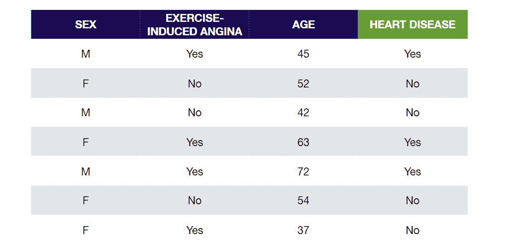**

# **步骤 1:找到根节点**

**让我们从寻找我们树的根节点开始。出于启发的目的，我们将根据变量类型来划分寻找根节点的过程。**

## **分类变量**

**先看看*对某人是否患有*心脏病*的预测有多准确。我们通过将*性别*设置为我们的根节点，并仅基于*性别*统计有多少人患有和没有患有*心脏病*来做到这一点。***

**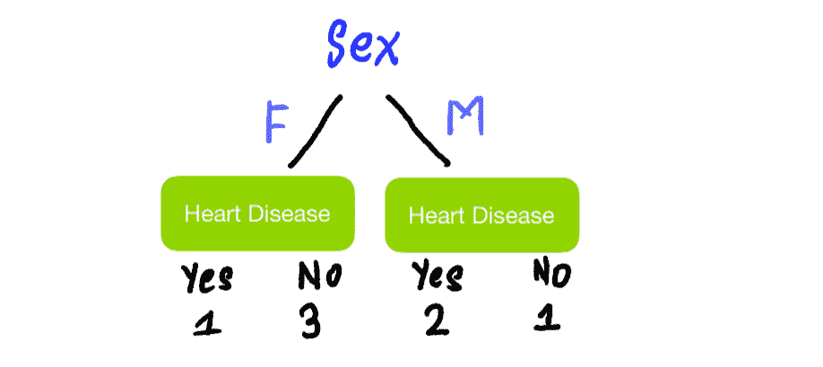**

**对 ***运动诱发的心绞痛做同样的事情*** *:***

**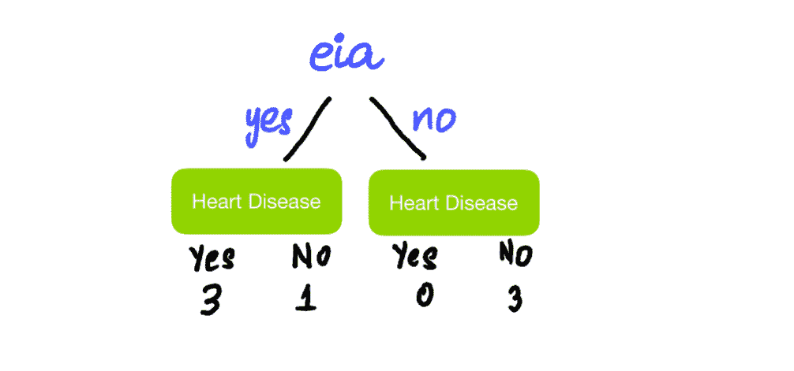**

**看着这些树，我们发现预测一个人是否患有心脏病也不是一项完美的工作。含有患*心脏病*和未患*心脏病的人的混合物的叶子，称为**。我们可以用*基尼系数、熵、*和*信息增益*来量化杂质。在我们的例子中，让我们使用 ***基尼杂质*** 。*基尼杂质*越高，叶子越不纯。所以我们希望该值尽可能低。我们先计算每片叶子的*基尼杂质*，然后再计算分割的总*基尼杂质*。计算叶子的*基尼杂质*的公式为-*****

*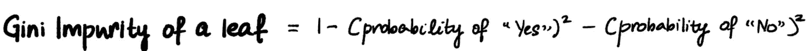*

*左叶:*

*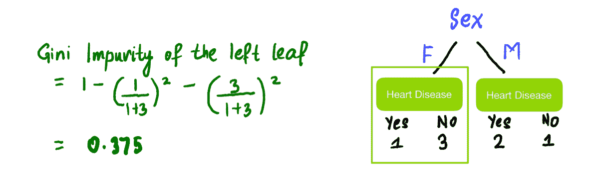*

*右叶:*

*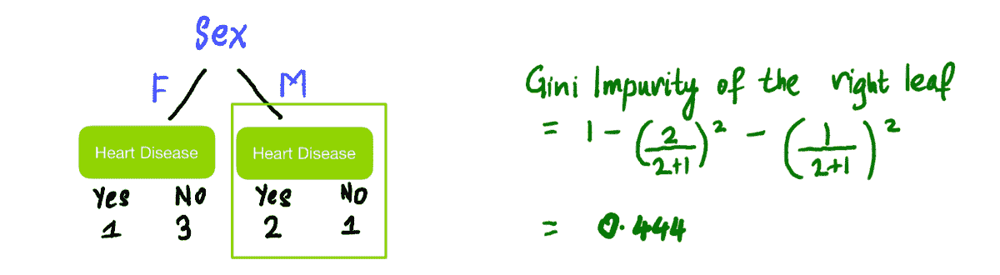*

*分割的总基尼系数杂质是叶子的基尼系数杂质的加权平均值。因为左叶有 4 个人，右叶有 3 个人:*

**

*类似地，使用上面相同的公式，*运动诱发的心绞痛*的总*基尼系数*为 **0.214** 。*

## *连续变量*

*为连续变量寻找*基尼系数要复杂一些。首先，将*年龄*从最低到最高排序:**

*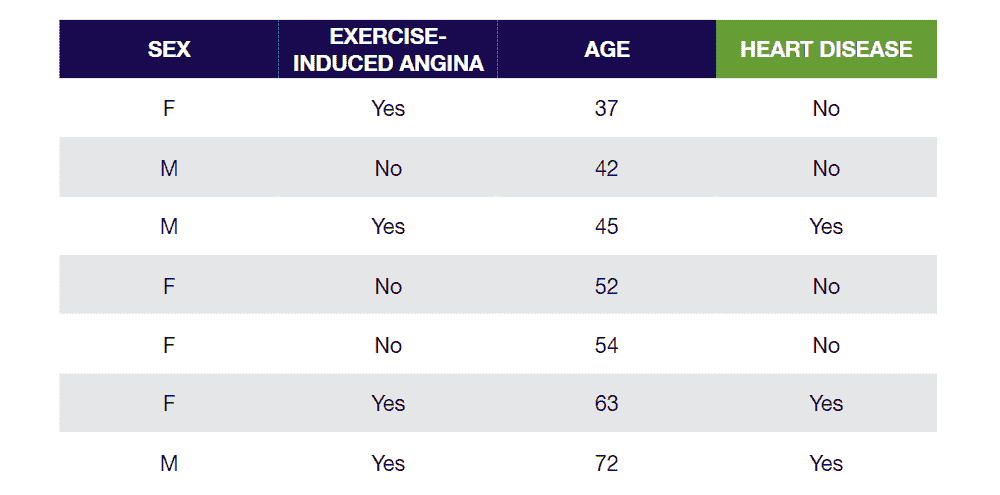*

*然后计算相邻行的平均年龄:*

*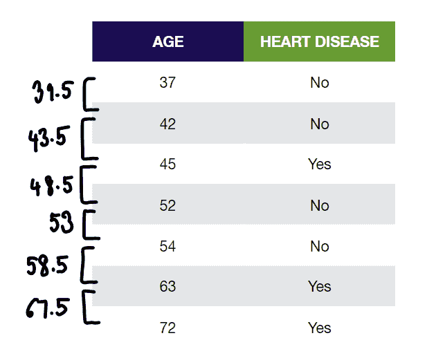*

*这些平均年龄将是我们的根节点阈值的候选者。最后，我们计算每个平均年龄的基尼系数。例如，为计算*年龄< 39.5* 的*基尼系数*:*

***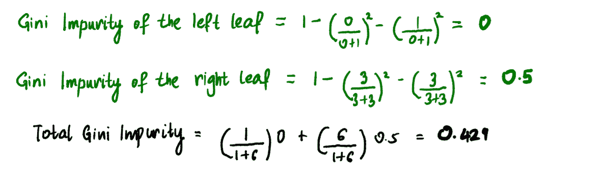*

*同样，*基尼系数*对其余平均*年龄*的拆分是:*

*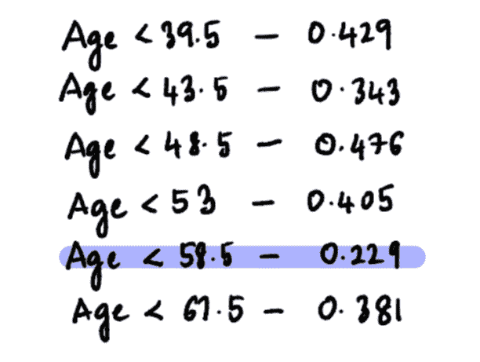*

*这样做后，*基尼杂质*值最低的候选阈值为*年龄< 58.5* 。因此，这将是*年龄*分裂的候选根节点。*

## ****根节点应该是什么？****

*现在我们已经有了三个候选根节点，具有最低 *Gini 杂质*的那个将成为我们的根节点。在这个例子中， ***运动性心绞痛*的*基尼杂质*值最低为 0.214** ，所以我们用的是*。**

# *步骤 2:添加分支*

*我们向不纯的节点添加分支以减少不纯。添加分支的过程与查找根节点的过程非常相似。让我们先用*运动诱发的心绞痛、*来划分这个树，这样患有*运动诱发的心绞痛*的人走左边，没有的人走右边:*

*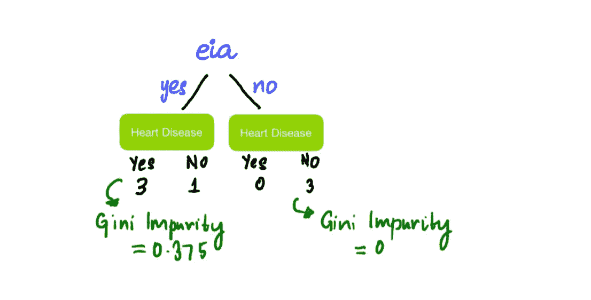*

*我们看到右边的节点是纯的，具有 *Gini 杂质* 0，左边的节点是不纯的，具有 *Gini 杂质* 0.375。现在，我们检查是否可以通过添加分支或通过*年龄*或*性别*进一步分裂来减少杂质。由于我们只关注分裂左侧淋巴结，我们应该只关注患有*运动诱发性心绞痛*的人。*

**

*首先，尝试按*性别*分割左侧节点:*

*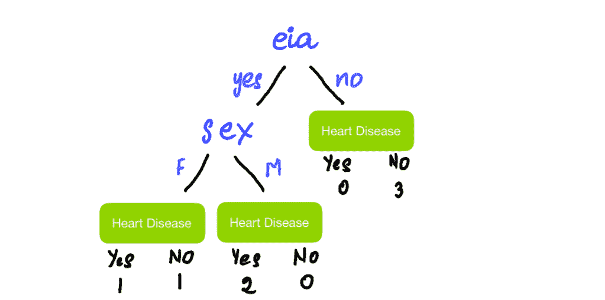*

*我们现在以与之前相同的方式计算分割的*基尼系数*，并看到该值为 **0.25** 。*

*现在，为了找到*年龄*分割的候选阈值，我们将 4 个突出显示的行按升序排序，并计算每个平均年龄的*基尼系数杂质*:*

*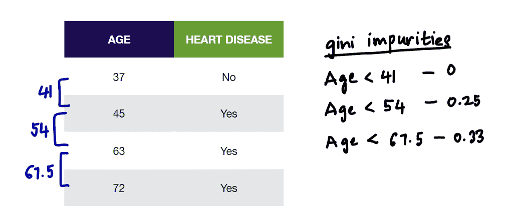*

*我们看到*年龄< 41* 给出最低的基尼杂质值为 0。所以，这将是我们的候选人的*年龄*分裂。现在因为 **0** *(基尼不纯的年龄< 41 拆分)*****0.25***(基尼不纯的性别拆分)*，用*年龄< 41* 将这个节点拆分成叶子。***

> ***注意:我们将输出叶保留为叶，因为没有理由继续通过添加分支将这些人分成更小的组。***

***现在这棵树看起来像这样:***

***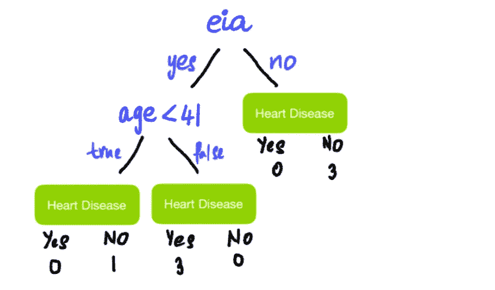***

# ***步骤 3:为每片叶子分配输出值***

***一般来说，一个叶子的输出是哪个类别的投票数最多。在我们的情况下，这将是大多数人是否有心脏病。所以，我们最后的树是:***

***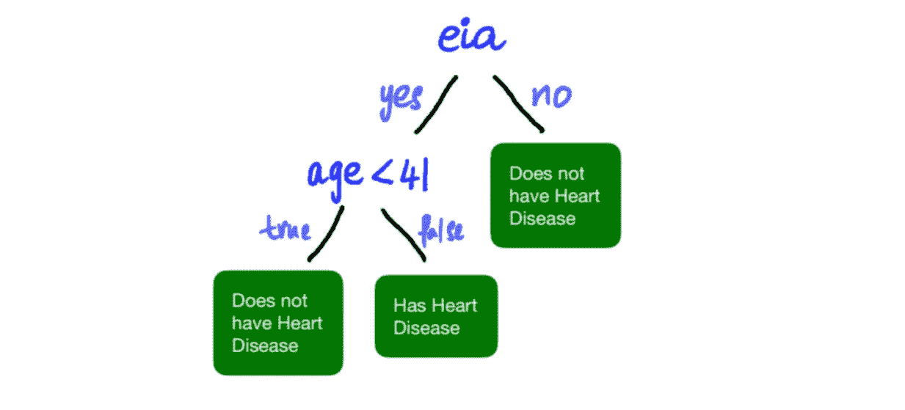***

# ***步骤 4:检查是否过度拟合***

***数据的过度拟合是指模型完全符合训练数据集。理想情况下，我们希望防止训练数据集的过度拟合，因为这会影响模型在新数据上的性能。避免这种情况的方法是修剪树木。这意味着我们通过去掉树枝来减小树的大小。这可以通过两种方式实现:***

1.  *****预修剪**:这里，我们在模型构建过程的开始，通过控制树的最大深度、在节点中向树添加分支所需的最小观察次数和/或在叶节点中所需的最小观察次数来修剪树。***
2.  ***后期修剪:这样可以让树长到最大深度，然后我们会移除树枝。***

***仅此而已。你简单而有效的决策树！***

***另一个大喊到 [StatQuest](https://statquest.org/) ，我最喜欢的统计和机器学习资源。请随时在 LinkedIn 上与我联系，或者给我发电子邮件到 shreya.statistics@gmail.com，给我发送任何 10 岁孩子需要理解的其他算法的建议！***