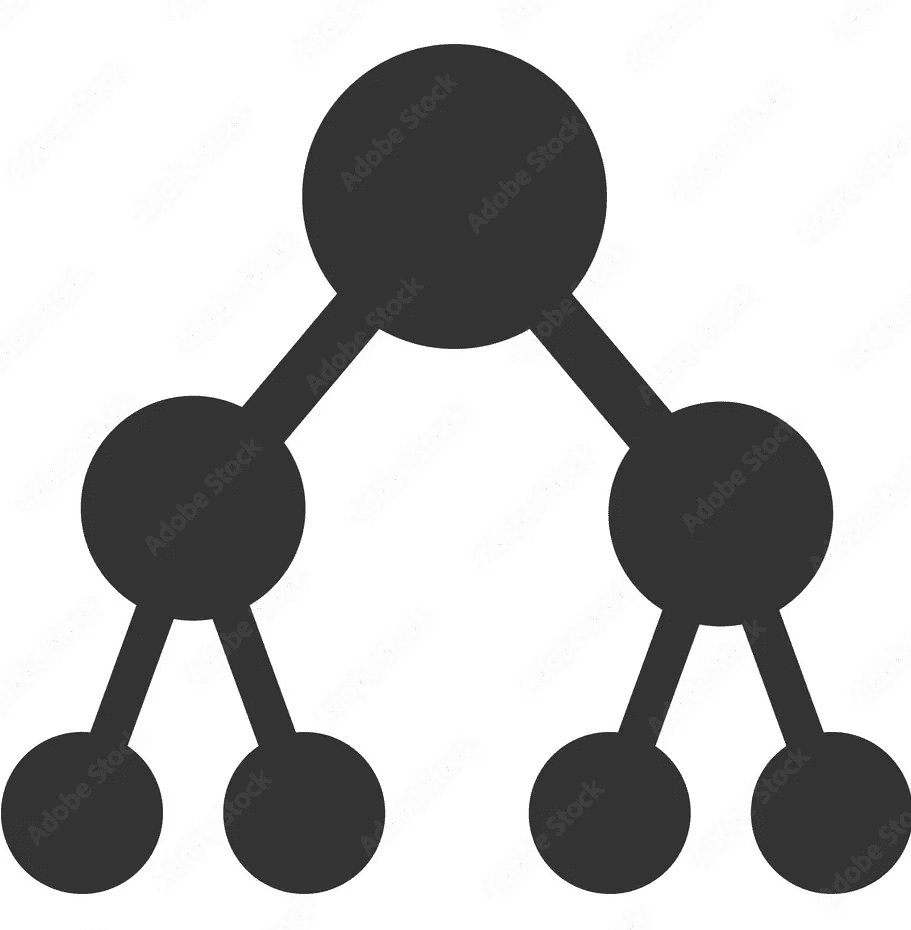
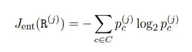
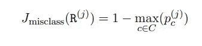
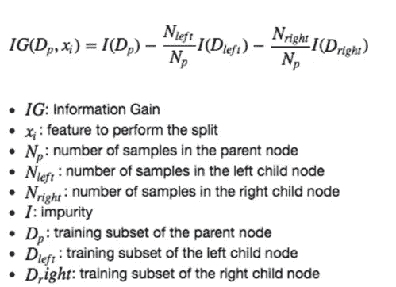
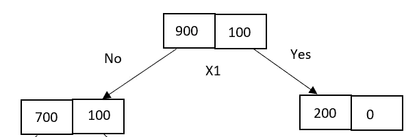
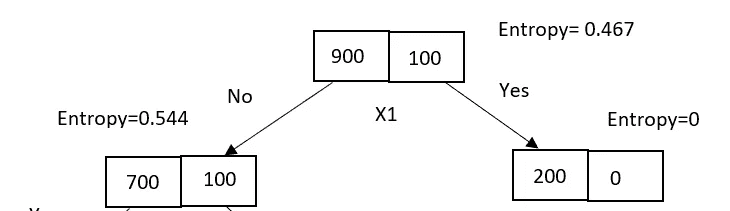
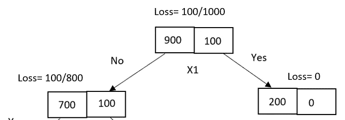
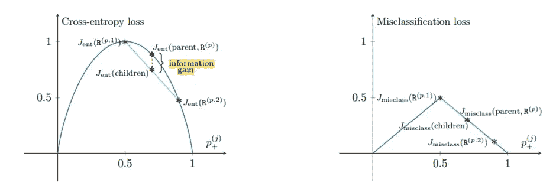

# 决策树分裂:熵与错误分类误差

> 原文：<https://pub.towardsai.net/decision-tree-splitting-entropy-vs-misclassification-error-27fdf2f5e3bf?source=collection_archive---------2----------------------->

## 为什么熵优于误分类错误来执行决策树分裂？

通过 Adobe Stock

决策树使用自上而下的贪婪搜索方法和递归分区。在决策树中，目标是递归地划分区域，直到形成同类聚类。为了进行这些划分，需要问足够多的问题。

要在每一步拆分树，我们需要选择最佳属性，最大限度地减少从父节点到子节点的损失。因此，定义合适的损失函数是重要的一步。

在这里，我们将试图理解熵和误分类误差。另外，回答为什么分类错误不用于拆分。

## **熵**

熵是信息论中用来计算信息中不确定性或杂质的现象。ID3 树算法使用熵和信息增益作为损失函数来选择每一步的数据分裂属性。

考虑一个带有 *C* 类的数据集。区域 *R* 的交叉熵计算如下:

其中*Pc*= c 类中随机选取的样本比例。

熵的范围在 0 到 1 之间。熵的零值表示数据是纯的或同质的。

## **分类错误**

错误分类损失计算错误分类样本的分数。因此，它考虑区域 r 中的主要类别比例。考虑 C 目标类别。设 Pc 是属于 C 个目标类的 C 类样本的比例。

错误分类损失计算如下:

误分类误差范围在 0 到 0.5 之间。

## **熵与误分类误差**

从父区域到子节点的损失的最大减少或最小化子节点损失被用于决定树分裂的属性。这种减少被称为信息增益，如下所示:

为了计算损失，我们需要定义一个合适的损失函数。让我们借助一个例子来比较熵和误分类损失。

考虑 900 个“阳性”样本和 100 个“阴性”样本。让我们假设 X1 属性用于在父节点进行拆分。考虑下面拆分后数据样本分布不均匀的决策树。

决策图表

它有一个分类为 200 个“阳性”样本的纯节点和一个包含 700 个“阳性”和 100 个“阴性”样本的不纯节点。

以**熵**为损失函数，父损失为 0.467，子损失为 0.544。由于一个节点是纯的，熵为零，不纯的节点具有非零熵值。

具有熵值的决策树

使用信息增益公式，从父到子区域的损失减少被计算为:

增益=熵(父项)—[熵(左子项)*(左子项中的样本数/父项中的样本数)+熵(右子项)*(右子项中的样本数/父项中的样本数)]

增益= 0.467-[0.544 *(800/1000)+0 *(200/1000)]

增益= 0.0318

对于**错误分类误差**，父损失为 0.1，子损失为 0.125。

具有误分类损失的决策树

信息增益计算如下:

Gain = ME(父项)— [ME(左子项)*(左子项中的样本数/父项中的样本数)+ ME(右子项)*(右子项中的样本数/父项中的样本数)]

增益=(100/1000)—[(100/800)*(800/1000)+0 *(200/1000)]

增益=0

从上面的增益值，我们可以说，由于误分类错误没有获得任何信息，因此，不需要进一步分裂树，并且决策树停止生长。但是在熵的情况下，决策树可以被进一步划分，直到到达叶节点并且熵值变为零。

让我们用**几何透视**来证明这一点。

熵和错误分类错误图。

上图是在假设数据平均分为两个节点的情况下绘制的。交叉熵函数具有**凹**性质，证明子代的损失总是小于父代。但是错误分类错误的情况并非如此。因此孩子和父母的损失是相等的。

因此，与熵相比，误分类损失对类别概率的变化不敏感，由于这一点，熵经常用于建立分类的决策树。

**Gini 杂质**与熵具有相同的性质，熵也是针对误分类损失构建决策树的首选。

## **参考文献**

*   [https://tushaargvs . github . io/assets/teaching/dt-notes-2020 . pdf](https://tushaargvs.github.io/assets/teaching/dt-notes-2020.pdf)
*   [https://sebastianraschka . com/FAQ/docs/decision tree-error-vs-entropy . html](https://sebastianraschka.com/faq/docs/decisiontree-error-vs-entropy.html)

检查我以前的故事，

1.  [**带细流的图像分类器**](https://medium.com/geekculture/image-classifier-with-streamlit-887fc186f60)

2. [**关于焦损的一切**](https://medium.com/geekculture/everything-about-focal-loss-f2d8ab294133)

快乐学习！！