# 用实例解释决策树

> 原文：<https://pub.towardsai.net/decision-trees-explained-with-a-practical-example-fe47872d3b53?source=collection_archive---------0----------------------->

## 信息映射

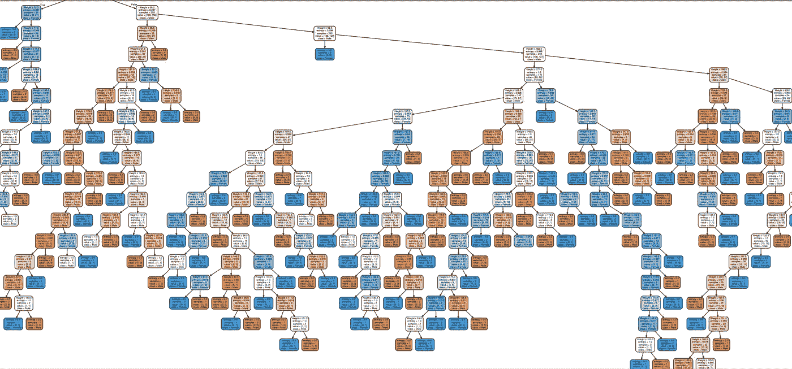

图:一个复杂的决策树

决策树是监督机器学习算法之一，该算法可用于回归和分类问题，但主要用于分类问题。决策树遵循一组 if-else 条件来可视化数据，并根据条件对数据进行分类。
例如，

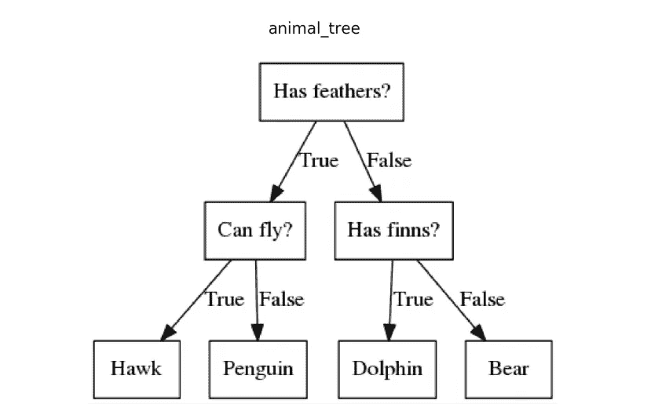

来源:mc.ai

在我们深入探讨决策树算法的工作原理之前，你需要知道一些与之相关的关键词。

# 重要术语

1.  **根节点:**该属性用于将数据分成两组或多组。基于属性选择技术选择该节点中的特征属性。
2.  **分支或子树:**整个决策树的一部分称为分支或子树。
3.  **拆分:**根据 if-else 条件将一个节点划分为两个或两个以上的子节点。
4.  **决策节点:**将子节点拆分成更多的子节点后，称为决策节点。
5.  **叶节点或终端节点:**这是决策树的末端，在这里不能再分成更多的子节点。
6.  **修剪:**从树上移除一个子节点称为修剪。

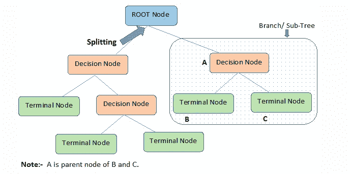

来源: [Kdnuggets](https://www.kdnuggets.com/)

# 决策树的工作原理

1.  基于属性选择测量(ASM)的结果选择根节点特征。
2.  ASM 一直重复，直到出现一个叶节点或终端节点，在那里它不能被分割成子节点。

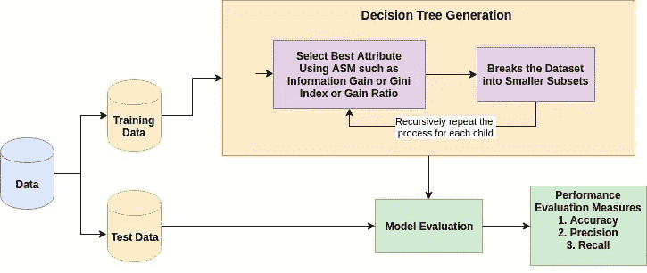

来源:[数据营](http://www.datacamp.com)

# 什么是属性选择度量(ASM)？

属性子集选择度量是在数据挖掘过程中用于数据简化的一种技术。为了更好地分析和预测目标变量，数据简化是必要的。

两种主要的 ASM 技术是

1.  基尼指数
2.  信息增益(ID3)

# 基尼指数

当随机选择某个变量时，衡量该变量被错误分类的概率的尺度称为基尼指数或基尼系数。数据根据基尼指数平均分配。

数学公式:

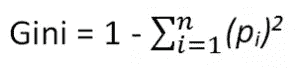

*Pi* =物体被分类到特定类别的概率。

当您使用基尼指数作为算法选择根节点特征的标准时。选择具有最小基尼系数的特征。

# 信息增益(ID3)

熵是这种算法的主要概念，这种算法有助于确定提供关于类的最大信息的特征或属性，这种算法称为信息增益或 ID3 算法。通过使用这种方法，我们可以降低从根节点到叶节点的熵水平。

数学公式:

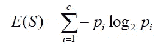

*‘p*’，表示 E(S)的概率，E(S)表示熵。具有最高 ID3 增益的特征或属性被用作分割的根。

资料来源:Giphy

我知道 ASM 技术在上面的上下文中没有解释清楚
让我用一个例子来解释整个过程。

# 是时候举实际例子了

# 问题陈述:

根据给定数据预测贷款资格流程。

以上问题陈述摘自 Analytics Vidhya Hackathon。

您可以在 [Analytics Vidhya](https://datahack.analyticsvidhya.com/contest/practice-problem-loan-prediction-iii/#ProblemStatement) 上找到数据集以及关于数据集中变量的更多信息。

*我选择分类问题的原因是，我们可以在训练后可视化决策树，而这在回归模型中是不可能的。*

# 第一步:加载数据并完成清理过程

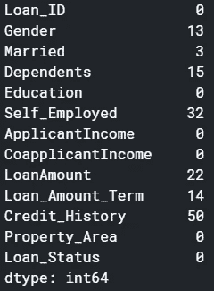

这里有两种可能的方法，要么用某个值填充空值，要么删除所有丢失的值(我删除了所有丢失的值)。

现在，如果您查看原始数据集的形状，它是(614，13)，删除空值后的新数据集是(480，13)。

# 第二步:看一看数据集

资料来源:Giphy

我们发现数据集中有许多分类值。

# 注意:决策树不支持分类数据作为特征。

因此，此时采取的最佳步骤是，您可以使用标签编码和一个热标签编码等功能工程技术。

# 步骤 3:将数据集分成训练集和测试集

**为什么要在训练一个机器学习算法之前拆分数据？**

关于详细的推理，请访问 [Sanjeev 关于训练、开发、测试和数据分割的文章](https://medium.com/@snji.khjuria/everything-you-need-to-know-about-train-dev-test-split-what-how-and-why-6ca17ea6f35)。

# 第 4 步:建立模型并适应训练集

# 在我们可视化树之前，让我们做一些计算，并使用熵找出根节点。

# 计算 1:求总数据集的熵

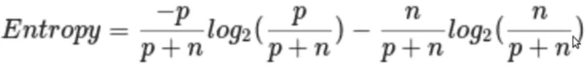

p =阳性病例数(接受贷款状态)

n =否定案例数(Loan_Status not accepted)

在我们的数据集中

p = 332，n=148，p+n=480

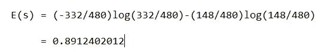

这里的对数以 2 为基数

熵= E(s) = 0.89

# 计算 2:现在找出每一列的熵和增益

# 1)性别栏

来源:[Dictionary.com](https://www.dictionary.com/e/gender-vs-sex/)

这里面有两种类型男性(1)和女性(0)

## 条件 1:男性

所有男性的数据都在里面，

p = 278，n=116，p+n=489

熵(G =男性)= 0.87

## 条件二:女性

所有女性的数据都在里面，

p = 54，n = 32，p+n = 86

熵(G =女性)= 0.95

## 性别栏中的平均信息是

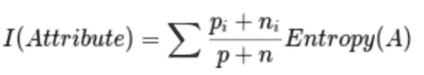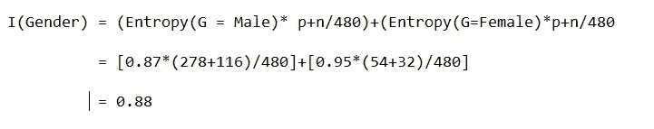

## 获得

增益(性别)= E(s) — I(性别)

增益= 0.89–0.88

增益= 0.001

# 2)已婚一栏

来源:Unsplash | Sandy Millar

在这一列中，我们有“是”和“否”值

## 条件 1:已婚=是(1)

在此拆分中，整个数据集的已婚状态为是

p = 227，n = 84，p+n = 311

e(已婚=是)= 0.84

## 条件 2:已婚=否(0)

在这种分割中，具有已婚状态 no

p = 105，n = 64，p+n = 169

e(已婚=否)= 0.957

## 已婚一栏的平均信息是

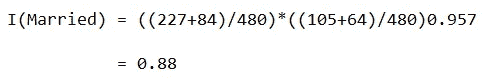

增益= 0.89–0.88 = 0.001

# 3)教育专栏

来源:[图标查找器](https://www.iconfinder.com/icons/4509502/cap_college_degree_graduate_cap_graduation_hat_student_icon)

在这个专栏中，我们有毕业生和非毕业生的价值观。

## 条件 1:学历=毕业(1)

p = 271，n = 112，p+n = 383

e(学历=毕业)= 0.87

## 条件二:学历=未毕业(0)

p = 61，n = 36，p+n = 97

e(学历=未毕业)= 0.95

教育栏的平均信息= 0.886

增益= 0.01

# 4)个体户栏

在这一列中，我们有“是”或“否”值

## 条件 1:自雇=是(1)

p = 43，n = 23，p+n = 66

e(自营职业=是)= 0.93

## 条件 2:自雇=否(0)

p = 289，n = 125，p+n = 414

e(自营职业=否)= 0.88

“教育中的自雇者”栏中的平均信息= 0.886

增益= 0.01

# 5)信用评分栏

来源:[脸书](https://www.facebook.com/credit.repair.bureau.usa/posts/)

在这一列中，我们有 1 和 0 值

## 条件 1:信用评分= 1

p = 325，n = 85，p+n = 410

e(信用评分= 1) = 0.73

## 条件 2:信用评分= 0

p = 63，n = 7，p+n = 70

e(信用评分= 0) = 0.46

信用评分栏中的平均信息= 0.69

增益= 0.2

## 比较所有增益值

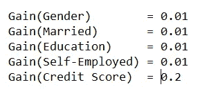

信用分数具有最高增益，因此将在根节点中使用

现在我们用模型的决策树来验证一下。

## 步骤 4:可视化决策树

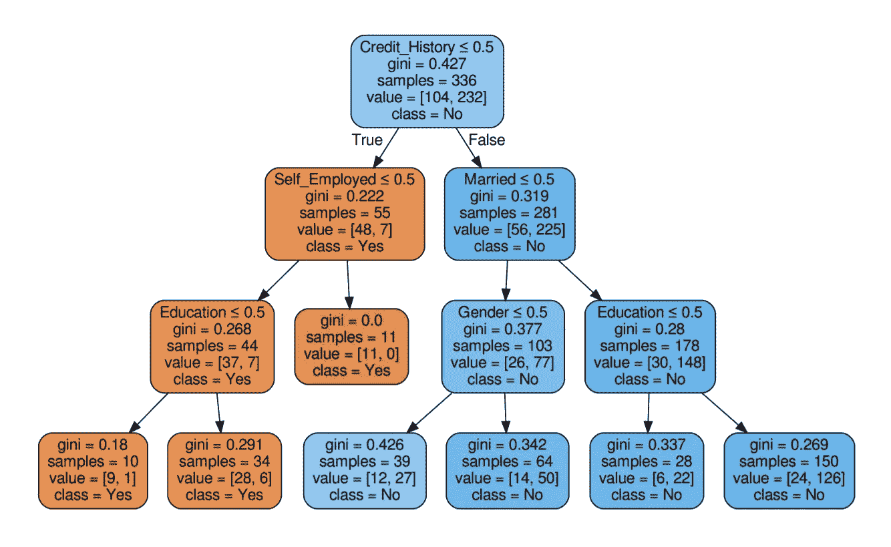

标准=基尼的决策树

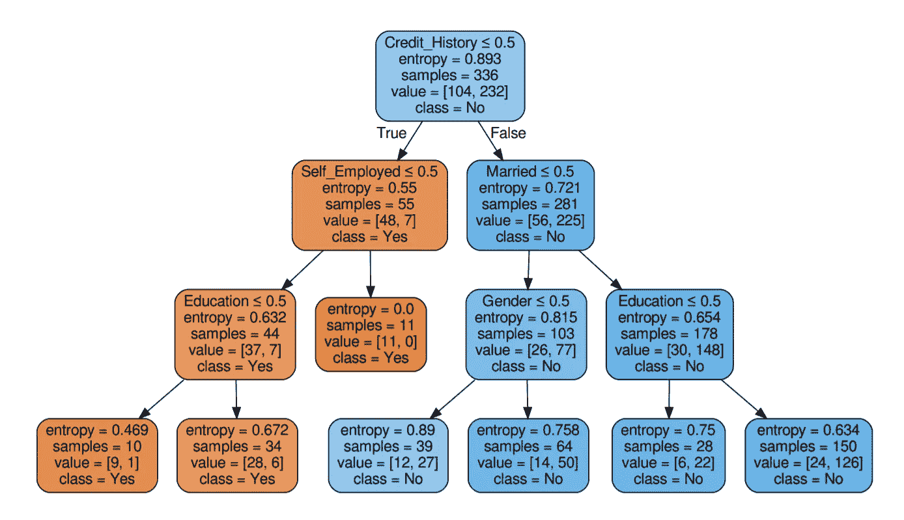

标准=熵的决策树

资料来源:Giphy

嗯，好像我们计算对了！

因此，重复相同的过程，直到没有进一步分裂的可能性。

## 第五步:检查模型的分数

我们几乎达到了 80%的准确率。对于这种类型的问题陈述来说，这是一个不错的分数。

# 让我们回到关于决策树的理论信息

# 创建决策树时所做的假设:

*   在开始训练时，整个数据集被认为是根。
*   输入值最好是分类的。
*   记录是基于属性值分布的。
*   基于统计结果，属性被放置为树的根节点。

# 优化树的性能

*   **max_depth:** 这里定义了树的最大深度。
*   **判据:**该参数以判据方法为值。默认值是基尼。
*   **拆分器**:该参数允许我们选择拆分策略。最佳和随机是可用的拆分类型。默认值是最佳值。

> 试着改变这些变量的值，你会发现模型的准确性有所改变。

# 如何避免过度拟合？

使用随机的森林树木。

# 优势

*   决策树很容易可视化。
*   数据中的非线性模式很容易捕捉。
*   它可用于预测缺失值，适用于特征工程技术。

# 不足之处

*   数据的过度拟合是可能的。
*   输入数据的微小变化会导致不同的决策树。这可以通过使用特征工程技术来减少。
*   在训练模型之前，我们必须平衡数据集。

# 结论

希望大家对决策树都很清楚。我试图简单地解释它。掌声和跟随是值得赞赏的。

敬请关注更多内容。