# 使用 Python 的机器学习(ML)中的决策树教程

> 原文：<https://pub.towardsai.net/decision-trees-in-machine-learning-ml-with-python-tutorial-3bfb457bce67?source=collection_archive---------0----------------------->


来源:图片来自[皮克斯拜](https://pixabay.com/?utm_source=link-attribution&utm_medium=referral&utm_campaign=image&utm_content=683437)

## [机器学习](https://towardsai.net/p/category/machine-learning)、[编辑](https://towardsai.net/p/category/editorial)、[编程](https://towardsai.net/p/category/programming)

## 用 Python 研究机器学习(ML)中的决策树

最后更新，2021 年 1 月 8 日

**作者:**萨妮娅·帕维斯，[罗伯托·伊里翁多](https://mktg.best/vguzs)

[](https://members.towardsai.net/) [## 加入我们吧↓ |面向人工智能成员|数据驱动的社区

### 加入人工智能，成为会员，你将不仅支持人工智能，但你将有机会…

members.towardsai.net](https://members.towardsai.net/) 

**本教程的代码可在**[**Github**](https://github.com/towardsai/tutorials/tree/master/decision_tree_learning)**上获得，其完整实现也可在**[**Google Colab**](https://colab.research.google.com/drive/1y2kKG8Blu9WLjjHbSIYqN4h1erI7geia?usp=sharing)**上获得。**

## 目录

1.  什么是决策树？
2.  [决策树示例](#ed5b)
3.  [构建决策树](#f707)
4.  [节点杂质](#6216)
5.  [熵](#1289)
6.  [基尼](#7bdd)
7.  [决策树学习中的过拟合](#84b4)
8.  [修剪](#8de5)
9.  [基于决策树分类的优缺点](#1cb8)
10.  [代码实现](#f6f6)
11.  [高级决策树](#dbc8)
12.  [结论](#3317)
13.  [资源](#029f)
14.  [参考文献](#1f0f)

> 📚查看我们的[梯度下降教程](https://towardsai.net/p/data-science/gradient-descent-algorithm-for-machine-learning-python-tutorial-ml-9ded189ec556)。📚

# 什么是决策树？

决策树是机器学习、统计学、数据挖掘和机器学习中分类和预测问题的重要和流行的工具[ [4](https://en.wikipedia.org/wiki/Decision_tree) ]。它描述了可以被人类解释并应用于知识系统(如数据库)的规则。基本上，决策树 *T* 以树结构的形式对 *d* (分类器或回归函数)进行编码，该树结构呈现以下属性:

*   **决策节点**:定义对单个属性的测试。
*   **叶节点**:显示目标属性的值。
*   **边缘**:是一个属性的拆分。
*   **路径**:做最后决定的是一个析取测试。

这些是决策树的其他名称:

*   树形分类器。
*   分而治之策略。
*   分级分类器。
*   多级分类器。

它通过从树根开始并穿过树根到达叶子节点来对案例进行分类。

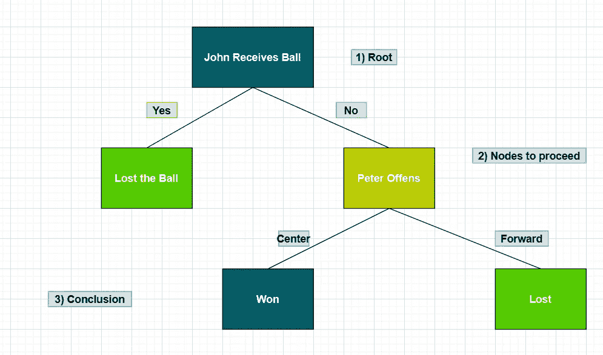

图 1:决策树。

决策树使用节点和树叶来做出决策。

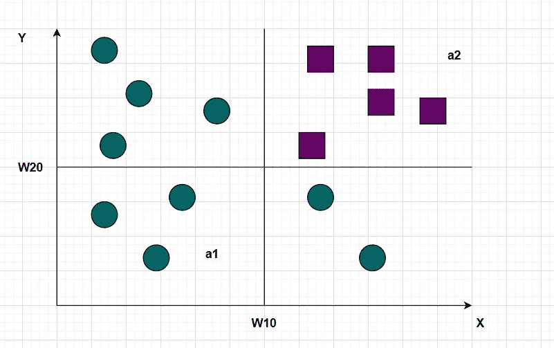

图 2:向量分类。

以决策树的形式表示上述分类:

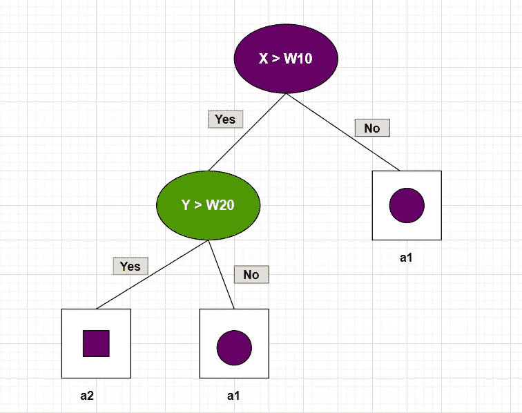

图 3:用于分类的决策树。

# 决策树示例

## **问题陈述**

预测两个不同队(第一队和第二队)之间的篮球比赛结果。

## **游戏相关的可用知识或属性列表**

*   彼得打中锋还是前锋？
*   比赛的地点是哪里——主场还是客场？
*   比赛的开始时间是什么时候？
*   对方中锋高不高？

## **历史数据**

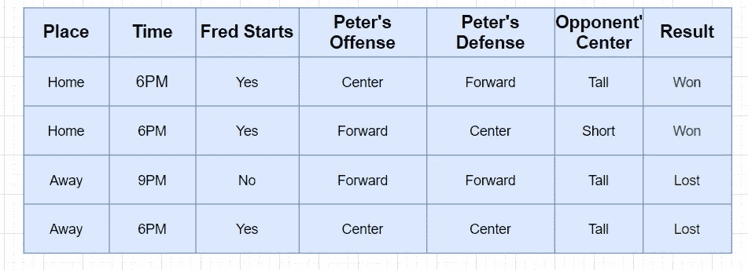

图 4:一场篮球比赛的历史数据。

## **预测数据**

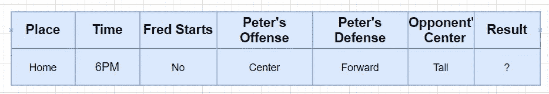

图 5:预测篮球比赛的数据。

因此，根据图 5，历史和预测数据:

*   将学到的规则推广到新数据中。
*   这是一个分类问题。

# 构建决策树

决策树学习包括学习一系列 **if/else** 查询，这些查询可以让我们几乎立即找到“正确”的答案。这些问题也被称为测试。它搜索所有可能的测试，并找到对目标变量最有指导意义的一个。

## 如何生长决策树？

*   顶层节点也称为根节点，它代表整个数据集。
*   决策树逐渐将训练集分成越来越小的子集。
*   如果测试为“真”，则为左侧节点分配一个点；否则，它被分配给正确的节点。
*   包含数据点并且共享相同目标值的树叶被称为**纯** [ [1](https://towardsai.net/p/data-science/best-data-science-books-free-and-paid-data-science-book-recommendations-b519046dcca5#5ed1) 。
*   对新数据点的预测是通过检查该点位于特征空间的分区的哪个区域，然后预测该区域中的多数目标来进行的[ [1](https://towardsai.net/p/data-science/best-data-science-books-free-and-paid-data-science-book-recommendations-b519046dcca5#5ed1) ]。

```
from sklearn.tree import DecisionTreeClassifier
from sklearn.datasets import load_breast_cancer
from sklearn.model_selection import train_test_splitcancer = load_breast_cancer()X_train, X_test, y_train, y_test = train_test_split(cancer.data, cancer.target, stratify=cancer.target, random_state=42)
```

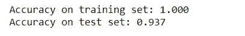

图 6:训练和测试数据集的准确性。

*   如果我们不限制决策树的深度，它可以变得任意深和复杂。
*   如图 6 所示，训练集上的准确率是 100% —因为叶子是纯的，所以树已经长得足够深，可以毫无疑问地记住训练数据上的所有标签。
*   树可以长得很大，这种树很难理解。较大的树通常不如较小的树精确。

创建决策树叶子的代码实现(叶子是基于 ml _ tasks 回归或分类创建的):

```
def create_leaf(data, ml_task):
    label_column = data[:, -1]

    if ml_task == "regression":
        leaf = np.mean(label_column)
    else:
        unique_classes, counts_unique_classes = np.unique(label_column, return_counts=True)
        i = counts_unique_classes.argmax()
        leaf = unique_classes[i]

    return leaf
```

决策树的主要目的是选择合适的特征来将树分割成子部分。然后，我们在分割期间在后台应用 ID3 算法。

# 节点杂质

节点杂质是节点内的同质性。如果事例有多个响应值，则节点是不纯的。如果所有实例都具有相同的响应值或目标变量或杂质值= 0，则节点是纯的。

这是两种最常用的测量节点杂质的方法:

*   熵。
*   基尼。

基于子节点的不纯程度来选择最佳分割。当节点处的所有模式属于同一类别时，节点杂质为 0。当节点 N 上的所有类别都有相同的可能性时，杂质达到最大值。

检查纯度的代码片段:

```
def check_purity(data):
    label_column = data[:, -1]
    unique_classes = np.unique(label_column)

    if len(unique_classes) == 1:
        return True
    else:
        return False
```

# 熵

在决策树中，熵是一种无序或不确定性。它是对一堆数据中的杂质、无序或不确定性的度量。这是一种控制由决策树决定的数据分割的方法。它影响决策树如何形成它的边界。我们使用熵来衡量数据集的不纯度或随机性。

给定如下所示的熵方程:

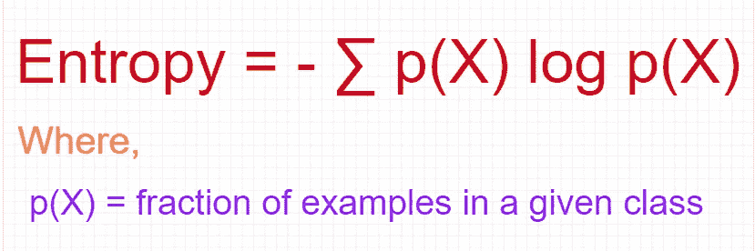

图 7:熵的等式。

计算熵的代码片段:

```
def get_entropy(data):
    label_col = data[:, -1]
    a, counts = np.unique(label_col, return_counts=True)
    prob = counts / counts.sum()
    entropy = sum(probabilities * -np.log2(probabilities))

    return entropy
```

熵的一个简单例子:

假设有一款包描述了两种不同的场景:

*   **袋子 A** 有 100 个绿色的球。彼得想从这个包里选一个绿色的球。这里，袋 A 的熵为 0，因为它意味着 0 杂质或总纯度。
*   我们用红球替换 A 袋中的 40 个绿球，同样，我们用黑球替换 10 个绿球。现在，约翰想从这个包里选择一个绿色的球。在这种情况下，由于袋子杂质的增加，抽取绿色球的概率将从 1.0 下降到 0.5。

**香农熵**模型使用以 2 为底的对数函数 **(log2(P(x))** 来度量熵。

## 香农信息论

只有两类——是，不是。

在我们的例子中， *t* 是发送给接收者的一组消息，接收者必须猜测它们的类别，因此:

*   如果 **p(Yes | t) = 1 (resp。，p(No | t) = 1)** ，那么接收者猜测一个新的例子为是。没有消息需要发送。
*   如果 **p(Yes | t) = p (No | t) = 0.5** ，那么接收者无法猜测，我们必须告诉他们一个新例子的类，发送一个一位的消息。
*   如果 **0 < p(Yes | t) < 1** ，那么接收器平均需要少于一个比特来知道一个新例子的类别。

## 信息增益

信息增益衡量一个特征提供了多少关于类的信息。

由于以下几点，信息增益在决策树中非常重要:

*   它是决策树算法建立决策树所接受的主键。
*   决策树将永远试图最大化信息增益。
*   具有最高信息增益的属性将首先被测试或分割。

下图显示了信息增益的等式:


图 8:信息增益的等式。

## 熵计算示例

有一条供车辆行驶的道路，这条道路具有多种特征，如坡度、颠簸、限速等。

这是数据集:

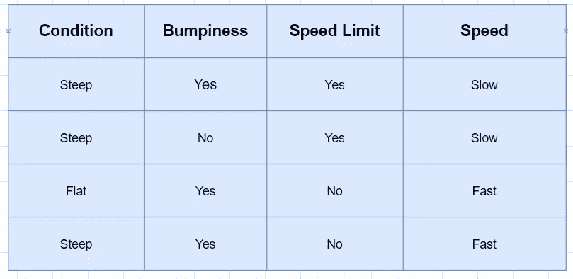

图 9:道路数据集。

**功能:**

*   情况
*   崎岖不平
*   速度限制

**标签:**

*   速度

观察总数:4

**计算等级特征的熵:**

以标签为父节点像 **SSFF** →慢慢快快。

SSFF 的熵:

p(慢)= 2/4 = 0.5

p(快速)= 2/4 = 0.5

所以，SSFF 的熵:

母体的熵= { 0.5 log2(0.5)+0.5 log2(0.5)} =-{-0.5+(-0.5)}

因此，父代的熵= 1

接下来，为了找到 grade 特性的信息增益，按照 grade 特性分割父节点，如图 10 所示。

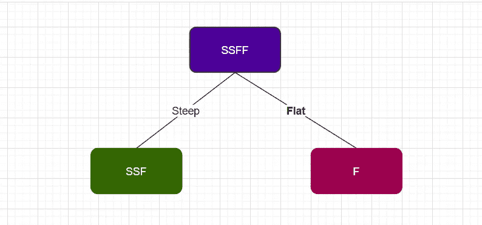

图 10:等级特性对父节点的分割。

分别计算两个(左和右)子节点 SSF 和 F 的熵。

**节点 F** 的熵= 0(注意:0，因为都来自同一个类)

**节点 SSF 的熵:**

p(慢)= 2/3 = 0.334

p(快速)= 1/3 = 0.334

所以，**节点 SSF** 的熵=-{ 0.667 log2(0.667)+0.334 log2(0.334)}

= -{-0.38 + (-0.52)} = 0.9

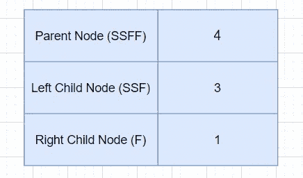

图 11:父节点和子节点中的节点数量。

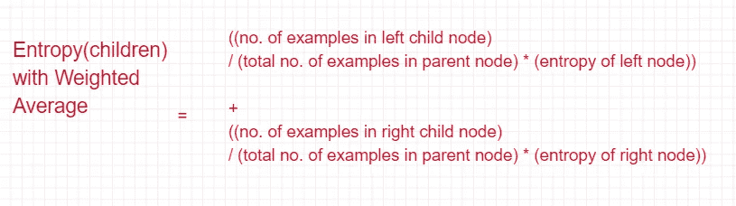

图 12:计算子节点熵的等式。

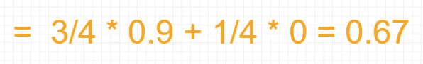

图 13:带有加权平均值的子节点的熵。

从等式中得到的等级信息增益= 1–0.675 = 0.325

熵的范围在 **0 到 1** 之间。

# 基尼

像熵一样，基尼指数也是决策树中用于计算信息增益的一种标准。决策树使用信息增益来分割节点。基尼衡量的是一个节点的杂质。

基尼系数的范围在 0 到 0.5 之间。与熵相比，基尼系数更适合用来选择最佳特征[ [3](https://www.geeksforgeeks.org/gini-impurity-and-entropy-in-decision-tree-ml/) ]。

衡量杂质的基尼系数公式:

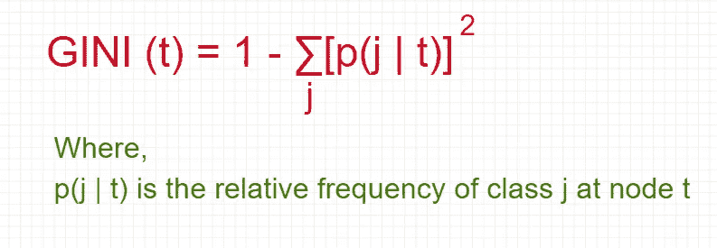

图 14:基尼系数公式。

基尼指数的分割标准:

*   它假设每个属性存在几个可能的分割值。
*   所有属性都被假定为连续值
*   可以针对分类属性对其进行修改。

# 决策树学习中的过拟合

过拟合是机器学习中的一个严重问题，它会导致模型中最差的性能问题。类似地，由于以下问题，决策树也可能面临过度拟合的问题:

*   如果决策树长得太长。
*   如果决策树中的实例数量随着树的构建而变小。

我们使用修剪来避免决策树中的过度拟合。

# 修剪

修剪是调整决策树以最小化误分类错误的过程。这是分裂的逆过程。

有两种方法可以执行修剪:

*   预修剪。
*   后期修剪。

它识别并移除反映噪声或异常值的分支。

## 完全树

完整的树表示树的停止模式。它遵循以下步骤:

*   如果所有记录都属于同一个类，那么停止展开一个节点。
*   如果所有记录都有相同的属性值，那么停止展开一个节点。

## 预修剪

在预修剪方法中，树不会完全生长。它遵循早期停止规则。它遵循以下步骤:

*   在算法变成完全成长的树之前停止算法。
*   如果所有实例都属于同一个类，则停止。
*   如果所有属性值都相同，则停止。

## 后期修剪

后剪枝是决策树中避免过度拟合的最流行的方法。它通过以下步骤从根本上解决了过度拟合的问题:

*   完全生长决策树。
*   遵循自下而上的方法来修剪决策树的节点。
*   如果在修剪节点后泛化的误差有所改善，则用叶节点替换子树。
*   在子树中，叶节点的类标签由多数类确定。

# 基于决策树的分类的优缺点

以下是基于决策树的分类的优点和缺点:

## 优势

*   建造它非常便宜。
*   它提供了出色的准确性。
*   在“未知”记录的分类上非常快。
*   对于小尺寸的树，解释起来很简单。
*   它可以处理连续属性和符号属性。
*   它对噪声数据具有可接受的性能。

## 不足之处

*   可能存在系统内存问题，因为数据需要放入内存中。
*   如果有新数据，需要重新训练。
*   它有轴平行决策边界的问题。

# 代码实现

对于这个例子，我们将使用虹膜数据集。这里我们一步一步地展示决策树的代码实现:

导入必要的库:

```
import numpy as np 
import pandas as pd 
import matplotlib.pyplot as plt
import seaborn as snsfrom sklearn import tree%matplotlib inline
```

读取虹膜数据集:

```
data = pd.read_csv('Iris.csv')
data
```

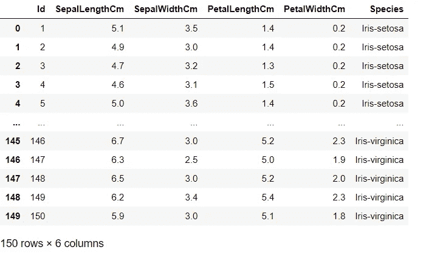

图 15:虹膜数据集。

虹膜数据的形状:

```
data.shape
```

Iris 数据集的列名:

```
col_names = ['id', 'sepal_length', 'sepal_width', 'petal_length', 'petal_width', 'species']data.columns = col_namescol_names
```

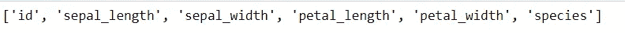

Iris 数据集的列

从数据集中删除“id”列:

```
data = data.drop(['id'], axis=1)
```

检查虹膜数据集的头部:

```
data.head()
```

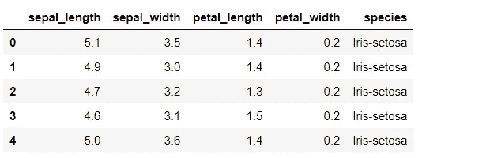

图 16:虹膜数据集。

获取虹膜数据集信息:

```
data.info()
```

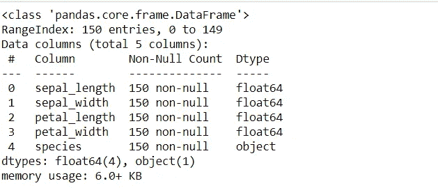

图 17:虹膜数据集信息。

获取计数:

```
data['species'].value_counts()
```

获取目标列:

```
target_col = ['species']
```

获取 X 和 y 的值:

```
X = data.drop(['species'], axis=1)y = data['species']
```

数据集的拆分:

```
from sklearn.model_selection import train_test_splitX_train, X_test, y_train, y_test = train_test_split(X, y, test_size = 0.33, random_state = 42)
```

决策树分类器:

```
from sklearn.tree import DecisionTreeClassifier
```

应用带有基尼指数的决策树分类:

```
clf_gini = DecisionTreeClassifier(criterion='gini', max_depth=3, random_state=0)
```

适合模型:

```
clf_gini.fit(X_train, y_train)
```

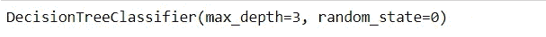

图 18:决策树分类器。

预测:

```
y_pred_gini = clf_gini.predict(X_test)
y_pred_gini
```

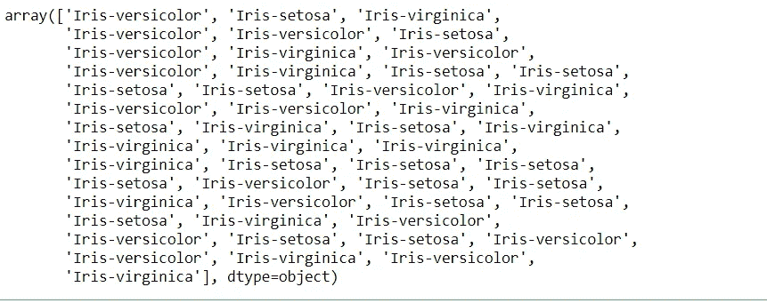

图 19:预测。

使用标准基尼指数获得准确性:

```
from sklearn.metrics import accuracy_scoreprint('Model accuracy score with criterion gini index: {0:0.4f}'. format(accuracy_score(y_test, y_pred_gini)))# y_pred_gini are the predicted class labels in the test-set.
```

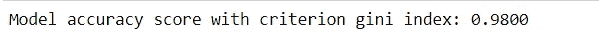

图 20:模型准确性。

检查是否过度配合和配合不足:

```
print('Training set score: {:.4f}'.format(clf_gini.score(X_train, y_train)))print('Test set score: {:.4f}'.format(clf_gini.score(X_test, y_test)))
```

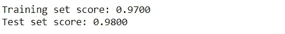

图 21:训练和测试数据集得分。

绘制决策树:

```
plt.figure(figsize=(12,8))
tree.plot_tree(clf_gini.fit(X_train, y_train))
```

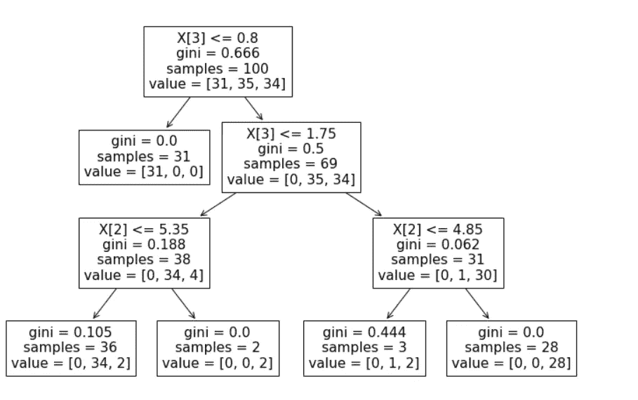

图 Iris 数据集的决策树图。

# 高级决策树

决策树还有另一个重要的改进，那就是**随机森林**。这类似于决策树，但需要多个树，因此命名为森林。**随机森林**集成一种用于机器学习的监督学习技术。在单个决策树中有更多的机会过度拟合，但是在多个树在一起的情况下，随着树越来越深，训练误差是最小的。

# 结论

决策树被广泛使用，并且是预测建模中最常用的方法之一。它们有助于预测未来，非常容易理解。它们处理离散属性的效率更高，但是这些树很有可能遭受错误传播。

决策树对异常值也不敏感，因为分割是基于分割范围内样本的比例而不是绝对值进行的[ [5](https://www.elsevier.com/books/T/A/9780444520753) ]。它们非常直观，很容易向非技术用户解释。

决策树的另一个关键实践是参数之间的非线性关系不会影响树的性能。因此，在决策树中，对高维数据的预测更快。

**免责声明:**本文表达的观点仅代表作者个人观点，不代表卡内基梅隆大学或其他(直接或间接)与作者相关的公司的观点。这些文章并不打算成为最终产品，而是当前思想的反映，同时也是讨论和改进的催化剂。

**除非另有说明，所有图片均来自作者。**

通过[向艾](https://towardsai.net/)发布

# **资源**

[Github 库](https://github.com/towardsai/tutorials/tree/master/decision_tree_learning)。

[Google colab 实现](https://colab.research.google.com/drive/1y2kKG8Blu9WLjjHbSIYqN4h1erI7geia?usp=sharing)。

# **参考文献**

[1]Python 机器学习入门:数据科学家指南第 1 版，Andreas C.Muller，Sarah Guido，[https://toward sai . net/p/Data-science/best-Data-science-books-free-and-payed-Data-science-book-recommendations-b 519046 DCCA 5 # 5ed 1](https://towardsai.net/p/data-science/best-data-science-books-free-and-paid-data-science-book-recommendations-b519046dcca5#5ed1)

[2]决策树算法，Comp328 教程 1，张开，幻灯片分享，[https://www . Slide Share . net/Ami _ Surati/Decision-Tree-51573521](https://www.slideshare.net/Ami_Surati/decision-tree-51573521)

[3]决策树中的基尼杂质和熵— ML，极客为极客，[https://www . geeksforgeeks . org/Gini-inexture-and-Entropy-in-Decision-Tree-ML/](https://www.geeksforgeeks.org/gini-impurity-and-entropy-in-decision-tree-ml/)

[4]决策树，维基百科，[https://en.wikipedia.org/wiki/Decision_tree](https://en.wikipedia.org/wiki/Decision_tree)

[5]决策树，现代信息处理，第 1 版。纸质书和电子书，伯纳黛特·布琼-梅尼尔·朱利安尼拉·科莱蒂罗纳德·r·雅戈，国际标准书号 9780444520753，9780080461694，[https://www.elsevier.com/books/T/A/9780444520753](https://www.elsevier.com/books/T/A/9780444520753)