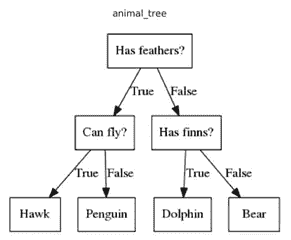
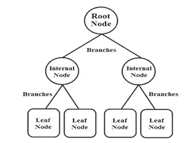
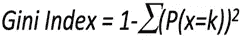
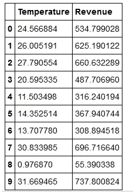
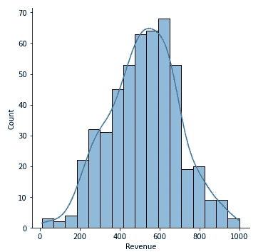
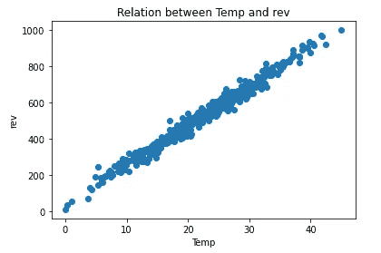
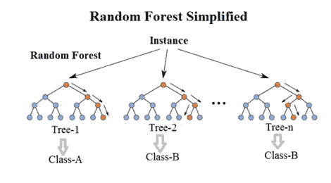
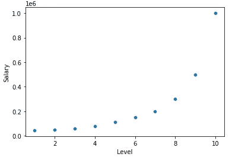

# 机器学习中的决策树与随机森林

> 原文：<https://pub.towardsai.net/decision-trees-vs-random-forests-in-machine-learning-be56c093b0f?source=collection_archive---------0----------------------->

## [机器学习](https://towardsai.net/p/category/machine-learning)

## 理解两种监督学习算法


由[迪特玛·贝克尔](https://unsplash.com/@dietmarbecker?utm_source=medium&utm_medium=referral)在 [Unsplash](https://unsplash.com?utm_source=medium&utm_medium=referral) 上拍摄的照片

众所周知，机器学习是人工智能的子集，允许用户训练模型并预测商业消费的数据。我们用训练数据集训练机器；数据不必总是被标记为 1，即没有指定的特征。这是无监督的 ML 模型进入画面的时候。他们在未标记的数据中工作。有监督的工作在有标签的数据上，无监督的工作在无标签的数据上。

我们现在对什么是机器学习及其类型有了一个大致的了解。现在，在本文中，让我们进一步尝试理解两种监督学习算法决策树、随机森林，以及它们之间的不同点。

> ***决策树***

顾名思义，它是一个树状结构，主要用于条件控制语句中的决策。

下面是一个决策树的图示



**机器学习中的决策树:**

决策树是一种受监督的机器学习模型，用于分类和回归。这里的数据是按照一定的规则或参数连续分割的。每个分支代表一个测试结果，每个叶节点持有一个标签。数据分割从根节点开始，在叶节点结束。所以，他们总是遵循自上而下的方法。在我们继续之前，让我们学习一些新的术语。

*   **根节点**:代表整个群体。这是第一个节点。
*   **分割:**根据参数分割样本的过程。
*   **决策节点:**节点分裂成更多的子节点。
*   **叶节点:**最后一级节点或输出标签。
*   **修剪:**与劈树相反，是为了缩小树的尺寸。



**数据拆分的依据是什么？**

使用基尼指数、熵和信息增益等方法将决策树中的数据分成节点和子节点。

ID3 代表迭代二分法 3。它是一种分类算法，选择产生最大信息增益或最小熵的最佳属性。

同样，CART 算法主要使用基尼指数来选择最佳属性。

**熵:**

用蹩脚的话来说，熵被定义为一种用于发现错误或杂质的度量。而是数据点的随机性。如果所有的数据点都属于同一个类别，它们被称为“纯的”,否则被称为“不纯的”。

熵的范围从 0 到 1。在某些情况下，它也可能不止一个，意味着数据更加不纯。它用“H”表示

因此，如果数据集包含同质的观测值子集，则数据集中不存在杂质或随机性，如果所有观测值都属于一个类，则该数据集的熵为零。

**信息增益:**

熵是寻找或度量信息增益的基础。它被称为熵的变化。信息增益用于确定最佳值，从而为我们提供关于数据的最大信息。

具有最大信息增益的特征应该被用作决策树的根节点。它用“IG”表示，并且随着树到达其末端，信息节点减少。

***信息增益=分裂前的熵—分裂后的熵***

**基尼指数:**

基尼指数主要用于经典的 CART 算法。CART 的意思是分类和回归树，它解释了如何根据其他值预测结果变量的值。



它适用于分类变量。结果不是“成功”就是“失败”，所以它只进行二进制拆分。基尼系数的程度也从 0 到 1 不等。

*   如果为 0，则数据分布在同一个类中。
*   如果为 1，则数据是随机分布的。
*   0.5 表示数据均匀分布。

从 1 中减去概率总和的计算非常简单。

下面给出了一个说明决策树的例子。

让我们以冰淇淋数据集为例，应用决策树算法。数据包含以下列。

**用 python 代码实现决策树:**

```
#importing all the libraries needed for the process
import numpy as np
import pandas as pd
import seaborn as sns
import matplotlib.pyplot as plt
%inline matplotlib
```

使用熊猫将 csv 文件读入冰激凌。查看数据集的前 10 个值

```
ice_cream=pd.read_csv("IceCreamData.csv")
ice_cream.head(10)
```



使用 displot 了解数据集中收入列的分布

```
sns.displot(x='Revenue',data=ice_cream,kde=True)
```



使用散点图了解数据集中温度和收入之间的关系

```
plt.scatter(x='Temperature',y='Revenue',data=ice_cream)
plt.title("Relation between Temp and rev")
plt.xlabel('Temp')
plt.ylabel('rev')
plt.show()
```



气温和收益正相关。随着温度的升高，收益也随之增加。因此，很明显，温度是独立的，收入取决于温度。将数据分为 X 和 Y，分别独立和相关。

```
X=pd.DataFrame(ice_cream['Temperature'])
Y=pd.DataFrame(ice_cream['Revenue'])#importing train_test_split method from sklearn
from sklearn.model_selection import train_test_split
X_train,X_test,Y_train,Y_test=train_test_split(X,Y,test_size=0.1,
                                               random_state=1)#importing the DecisionTreeRegressor from the sklearn lib
from sklearn.tree import DecisionTreeRegressor
regressor = DecisionTreeRegressor(random_state=0)
regressor.fit(X_train, Y_train)#output:
Training score:1.0
Testing score:0.9739054111493022#Predicting the values
y_pred=regressor.predict(X_test)
x_pred=regressor.predict(X_train)#Evaluating the model based on the metrics
from sklearn import metrics
print('Mean Absolute Error:', metrics.mean_absolute_error(Y_test,
                                                         y_pred))print('Root Mean Squared Error of train dataset:',
             np.sqrt(metrics.mean_squared_error(Y_train,x_pred)))print('Root Mean Squared Error of test dataset:', 
              np.sqrt(metrics.mean_squared_error(Y_test, y_pred)))#output:
Mean Absolute Error: 21.89481194999999
Root Mean Squared Error of train dataset: 0.0
Root Mean Squared Error of test dataset: 27.149437063596295
```

这里平均绝对误差是 21.9，即实际数据和预测数据之间的平均距离是 21.9。预测数据的 rmse 值为 27.1，这意味着实际数据与预测数据相差(大约)27.1 个单位。

决策树中的标准参数将基尼指数作为默认值。即 ***【判据:{"gini "，"熵" }，默认=" gini "】。***

**优点:**

*   决策树不需要数据的标准化和缩放。
*   它对丢失的值是健壮的。

**缺点:**

*   决策树通常需要更多时间来训练数据。
*   数据的微小变化会导致决策树结构的巨大变化，从而导致不稳定。
*   倾向于过度拟合数据。

为了克服数据的复杂性和不稳定性，我们使用随机森林分类器。现在，让我们了解什么是随机森林，以及它如何帮助减少上述问题。

[](/fully-explained-decision-tree-classification-with-python-d90d3bd16836) [## 用 Python 全面解释决策树分类

### 分类问题决策树的深入研究

pub.towardsai.net](/fully-explained-decision-tree-classification-with-python-d90d3bd16836) 

> ***随机森林***

随机森林是一种集成机器学习技术，它添加了几个决策树，目的是克服单个决策树的过拟合问题。



随机森林是用于分类和回归问题的最常用的机器学习算法之一。但是在分类模型上表现良好。

随机森林是另一种类型的集成学习。集成学习将几个决策树结合起来，比利用单个决策树产生更好的预测性能。集合模型背后的主要原理是一群弱学习者作为强学习者聚集在一起。

随机森林增加了模型的随机性。分割节点时，它会在随机特征子集中搜索最佳特征。这导致了多样性，而多样性通常会导致更好的模型。

**功能重要性:**

*特征重要性*指的是根据输入特征在预测目标变量时的有用程度对其进行评分的技术

Sklearn 提供了一些方法来衡量一个特性的重要性，方法是查看该特性在森林中的所有树中减少了多少杂质。它在训练后自动计算每个特征的分数，并试图使结果相等，使得所有重要性的总和等于 1。

**用 python 代码实现随机森林:**

6.5 级的应聘者之前的工资是 16 万。为了在我们的新公司雇用他，我们想确认他是否对他的上一份薪水诚实，我们将使用随机森林来预测这一点。

```
#importing all the libraries needed for the process
import numpy as np
import pandas as pd
import seaborn as sns
import matplotlib.pyplot as plt
%inline matplolib#reading the csv data using pandas to salary
salary=pd.read_csv("Position_Salaries.csv")
salary
```


```
#Using the scatterplot to find the relation between level and salary
sns.scatterplot(data=salary,x='Level',y='Salary')
```



变量之间有一个多项式关系，即如果级别增加，工资也会增加

很明显，工资是自变量，水平是因变量。

```
#Now dividing the X and Y based on the variables.
X=salary.iloc[:,1].values
Y=salary.iloc[:,-1].values#importing the train_test_split method from sklearn
from sklearn.model_selection import train_test_splitX_train,X_test,Y_train,Y_test=train_test_split(X,Y,test_size=0.2,
                                               random_state=0)#reshaping the train and test dataset to minimize the value error in the further process.X_train=np.array(X_train).reshape(-1, 1)
Y_train=np.array(Y_train).reshape(-1, 1)
X_test=np.array(X_test).reshape(-1, 1)
Y_test=np.array(Y_test).reshape(-1, 1)#importing the Random tree regressor form the sklearn.ensemble
from sklearn.ensemble import RandomForestRegressor
rfr=RandomForestRegressor(n_estimators=100,random_state=1)
rfr.fit(X_train,Y_train.ravel())
```

我们应该总是在测试分数大于训练数据集的数据集上工作。为了得到要求的分数，我们应该改变 n 估计量、测试规模和随机状态。

```
print("Training dataset Score:",rfr.score(X_train,Y_train))
print("Testing dataset Score:",rfr.score(X_test,Y_test))#output:
Training dataset Score: 0.883197840979863
Testing dataset Score: 0.9909168388429752#Predicting the values
x_pred=rfr.predict(X_train)
y_pred=rfr.predict(X_test) from sklearn import metrics
print('Mean Absolute Error:', metrics.mean_absolute_error(Y_test,
                                                         y_pred))print('Root Mean Squared Error of train dataset:', 
          np.sqrt(metrics.mean_squared_error(Y_train, x_pred)))print('Root Mean Squared Error of test:', 
           np.sqrt(metrics.mean_squared_error(Y_test, y_pred)))#output:
Mean Absolute Error: 16250.0
Root Mean Squared Error of train dataset: 101634.8626825461
Root Mean Squared Error of test: 20967.236346261754
```

这里平均绝对误差是 16250，即实际数据和预测数据之间的平均距离是 16250。预测数据的 rmse 值为 20967，这意味着实际数据与预测数据相差(大约)指定的单位。

```
#Now predicting if he is being honest about his last salary by predicting the sal for the level 6.5new_val= np.array(6.5).reshape(-1,1)
our_pred=rfr.predict(new_val)
our_pred#output:
array([164100.])
```

6.5 级的候选人之前的工资是 160000 英镑。在这里，我们预测它是 164100，这是大约相同的价值，所以我们得出结论，他是诚实的关于他的最后工资。

**优点:**

*   因为随机森林减少了过拟合标准，所以提高了精确度。
*   它非常有用，适用于回归和分类。
*   要素是分类值还是连续值并不重要，两者都适用。

**缺点:**

*   它需要大量的计算能力，因为它构建了大量的树来组合它们的输出。
*   它还需要更多的训练时间，因为它结合了许多决策树来确定类别
*   它无法确定它使用集成学习的每个变量的重要性。

[](/fully-explained-ensemble-techniques-example-with-python-b83e50310841) [## 用 Python 完整解释了整体技术示例

### 基于几种决策树的机器学习方法

pub.towardsai.net](/fully-explained-ensemble-techniques-example-with-python-b83e50310841) 

**决策树和随机森林的区别:**

与随机森林相比，决策树很容易。决策树结合了决策，但是随机森林结合了几个决策树。所以，这是一个漫长而缓慢的过程。

决策树速度很快，在大型数据集上操作简单。随机森林模型需要严格的训练。根据不同的需求，如果你有更少的时间来处理一个模型，你一定会选择决策树。然而，稳定性和可靠的预测在随机森林中更准确。

**结论:**

希望你对有监督的机器学习模型有所了解，这些模型几乎是紧密工作的，决策树和随机森林。它们的重要性、优点、缺点以及最重要的区别。

我感谢 Dhanasree 在这篇文章中帮助我。

我希望你喜欢这篇文章。通过我的 [LinkedIn](https://www.linkedin.com/in/data-scientist-95040a1ab/) 和 [twitter](https://twitter.com/amitprius) 联系我。

# 推荐文章

[1。NLP —零到英雄与 Python](https://medium.com/towards-artificial-intelligence/nlp-zero-to-hero-with-python-2df6fcebff6e?sk=2231d868766e96b13d1e9d7db6064df1)
2。 [Python 数据结构数据类型和对象](https://medium.com/towards-artificial-intelligence/python-data-structures-data-types-and-objects-244d0a86c3cf?sk=42f4b462499f3fc3a160b21e2c94dba6)3 .[Python 中的异常处理概念](/exception-handling-concepts-in-python-4d5116decac3?source=friends_link&sk=a0ed49d9fdeaa67925eac34ecb55ea30)
4。[为什么 LSTM 在深度学习方面比 RNN 更有用？](/deep-learning-88e218b74a14?source=friends_link&sk=540bf9088d31859d50dbddab7524ba35)
5。[神经网络:递归神经网络的兴起](/neural-networks-the-rise-of-recurrent-neural-networks-df740252da88?source=friends_link&sk=6844935e3de14e478ce00f0b22e419eb)
6。[用 Python](https://medium.com/towards-artificial-intelligence/fully-explained-linear-regression-with-python-fe2b313f32f3?source=friends_link&sk=53c91a2a51347ec2d93f8222c0e06402)
7 全面讲解了线性回归。[用 Python](https://medium.com/towards-artificial-intelligence/fully-explained-logistic-regression-with-python-f4a16413ddcd?source=friends_link&sk=528181f15a44e48ea38fdd9579241a78)
充分解释了 Logistic 回归 8。[concat()、merge()和 join()与 Python](/differences-between-concat-merge-and-join-with-python-1a6541abc08d?source=friends_link&sk=3b37b694fb90db16275059ea752fc16a)
的区别 9。[与 Python 的数据角力—第一部分](/data-wrangling-with-python-part-1-969e3cc81d69?source=friends_link&sk=9c3649cf20f31a5c9ead51c50c89ba0b)
10。[机器学习中的混淆矩阵](https://medium.com/analytics-vidhya/confusion-matrix-in-machine-learning-91b6e2b3f9af?source=friends_link&sk=11c6531da0bab7b504d518d02746d4cc)