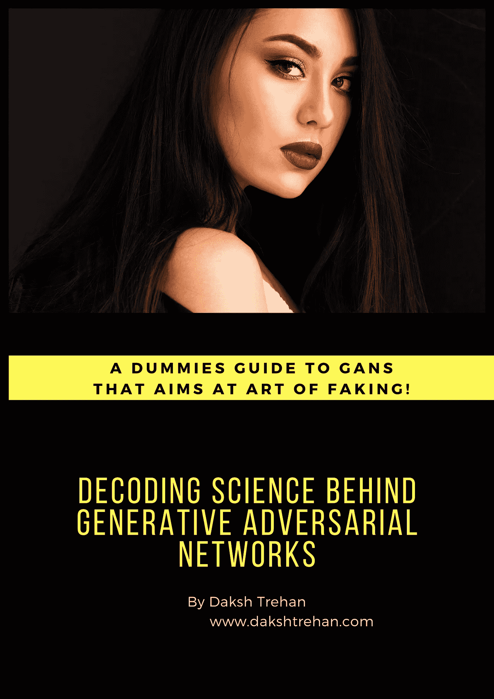
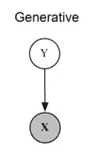
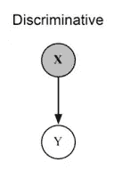
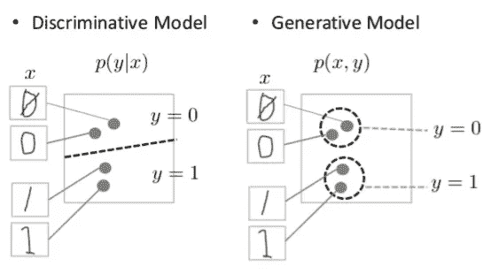
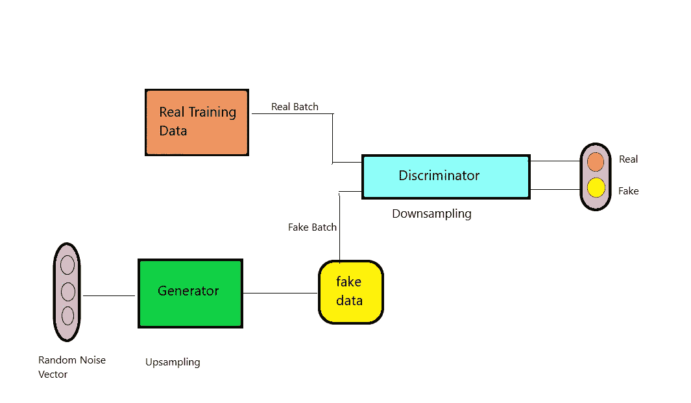
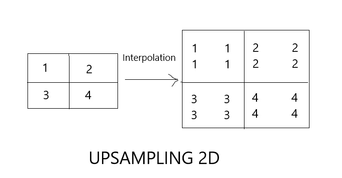
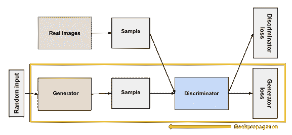
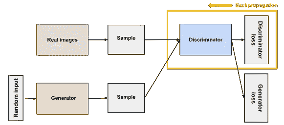
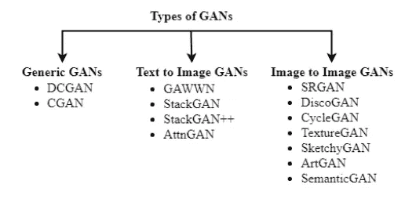

# 解码生成性对抗网络背后的科学

> 原文：<https://pub.towardsai.net/decoding-science-behind-generative-adversarial-networks-4d188a67d863?source=collection_archive---------3----------------------->

## [深度学习](https://towardsai.net/p/category/machine-learning/deep-learning)

## 一个假人指南，旨在 GANs 的艺术伪造！

去年，生成对抗网络(GANs)凭借那些令人印象深刻的假人类面孔在机器学习领域掀起了风暴。

**加分*** 他们基本上是从无到有产生的。

无可辩驳的是，GANs 实现了隐式学习方法，其中模型在没有数据直接通过网络的情况下进行学习，不像那些直接从数据中学习权重的显式技术。

# 直觉

照片由[罗伯特·尼曼](https://unsplash.com/@robertnyman?utm_source=medium&utm_medium=referral)在 [Unsplash](https://unsplash.com?utm_source=medium&utm_medium=referral) 拍摄

好的，假设在里约热内卢市，伪造货币的重罪正在增加，因此指定了一个部门来检查这些案件。侦探被期望去区分合法的和伪造的。当官员正确地对假币进行分类时，他们会受到赞赏，当他们犯了错误时，中央银行会提供反馈。现在，每当假货币被破获，伪造者的目标是在市场上流通更好的假货币。这是一个递归的过程，当侦探识别假货币时，伪造者学会了更好的方法来开发更真实的货币，类似地，随着市场上更多假货币的出现，侦探开发出了更好的策略来识别伪造的货币。通过相互学习，侦探和伪造者都会变得更擅长他们的工作。

这是甘斯背后的基本直觉。

在 GANs 中，有两个网络鉴别器(侦探)和生成器(伪造者)。生成器旨在创建假数据，而鉴别器则有望破解假数据。递归过程使得生成器和鉴别器都竞争以获得更好的性能。他们相互依赖，因为他们都在彼此的学习过程中发挥着重要作用。

另一点值得思考的是，两个网络都在不断学习。假设鉴别器错误地将假数据分类为真数据，这将导致生成器学习到当前开发的数据是好数据。但是，这在技术上是错误的，当鉴别器从政府得到同样的反馈时，它将被纠正。

# 甘如何学习？

> **目标**:生成新数据，即新图像、文本、语音等。

## 生成建模

这是一种建模类型，涉及基于给定数据的学习趋势，并尝试生成与提供的数据非常相似的样本。生成式建模的一个非常常见的例子是预测序列数据。

生成模型遵循联合概率分布。

> 最终目标是从 y 中得到 X。
> 
> **P(X，Y)** 可以读作变量 X **和** Y 的概率分布

## 判别建模

这种类型的模型通常包括那些旨在对来自给定趋势的数据进行分类的算法。把一个图像分析成里面的一只猫或者一只狗，可以算是它最好的例子。

而判别模型是对来自给定分布的数据进行判别(分类)的模型。辨别一幅给定的图片中是一只猫还是一只狗，是辨别建模最简单的例子。

> 最终目标是从 x 预测 Y。
> 
> **P(Y|X)** 可以看作是“给定事件 X 已经发生，事件 Y 发生的概率”。

区别性 vs 生成性，[来源](https://developers.google.com/machine-learning/gan/images/generative_v_discriminative.png)

> GAN 遵循生成模型，因此它的目标是生成 **P(X，Y)**

# 模型架构

典型的甘

## 噪音

这来自于可以转化为所需数据的随机分布。通过引入噪声，我们使 GAN 变得更加健壮，从而简化了其过程，使其能够“从目标分布的不同位置采样，产生各种各样的数据。”

噪声应从高斯分布中取样。

## 来自真实分布的数据

这是必需的分布。我们希望 GAN 在噪声数据的帮助下，生成受这种分布启发的数据。

## 发电机

这是 GAN 的重要组成部分。它侧重于根据分布趋势开发数据。

发生器需要对输入数据进行上采样，以产生输出数据。上采样层是一个无权重层，有助于增加输入向量的空间大小。

生成器生成的数据会被鉴别器分类为真或假。如果生成的数据与实际数据的相似度较低，那么生成器将被罚款，损失更多，然后使用反向传播，它将试图从其错误中学习，以开发更好的策略来欺骗鉴别器。

发电机运行，[来源](https://developers.google.com/machine-learning/gan/generator)

**发电机培训:**

*   样本随机噪声。
*   使用随机噪声产生输出。
*   基于鉴别器的分类分析损失。
*   通过鉴别器和发生器反向传播以获得梯度。
*   使用渐变更新权重。

**目标:**最大限度降低检测出真假数据的概率。

**接受输入:**随机噪声

**输出生成:**假数据

## 鉴别器

它只是一个常规的分类器，试图区分真实数据和虚假数据。它的网络架构取决于它所实现的数据类型，例如，它可能将 RNN 用于文本数据，将 CNN 用于图像数据。

它试图增加通道的数量，从而简化了解更多数据特征的过程。

鉴别器试图对数据进行分类，它通常忽略生成器的损耗，只实现一个鉴别器的损耗。如果鉴别器用假数据对实际数据进行错误分类，它将被罚款，损失更大，然后使用反向传播，它将试图从错误中学习，以制定更好的策略来欺骗生成器。

鉴频器操作，[源](https://developers.google.com/machine-learning/gan/discriminator)

甄别培训:

*   将输入数据分类为真或假。
*   分析错误分类的损失函数。
*   使用反向传播更新权重。

目标:最大化检测真假数据的概率。

输入:数据(真+假)

输出:数据真假的概率。

## 训练我们的模型

在训练我们的模型时，必须分别训练两个网络。首先，对鉴别器进行几个步骤的训练，然后将训练转移到生成器。

如果我们试图同时训练两个网络，这就像瞄准一只飞鸟，因此增加了我们失败的机会。

随着生成器通过训练变得更好，鉴别器的性能受到影响，即它变得难以分类真实和虚假数据。如果发生器完美地成功实现其目标，即最小化检测的概率，鉴别器的精度下降到 0.5。降级的不准确性表明 discriminator 已经将其策略从统计方法转向随机方法。这进一步降低了生成器的准确性，降低了模型的性能。

# GAN 型号的类型

甘斯变奏曲，[来源](https://insidebigdata.com/wp-content/uploads/2019/09/arXiv_2019_Aug_pic4.png)

# 结论

希望这篇文章能帮助你以尽可能好的方式理解生成对抗网络(GAN ),并帮助你实际运用它。

一如既往，非常感谢您的阅读，如果您觉得这篇文章有用，请分享！

请随意连接:

> 领英~[https://www.linkedin.com/in/dakshtrehan/](https://www.linkedin.com/in/dakshtrehan/)
> 
> insta gram ~[https://www.instagram.com/_daksh_trehan_/](https://www.instagram.com/_daksh_trehan_/)
> 
> github ~[https://github.com/dakshtrehan](https://github.com/dakshtrehan)

关注更多机器学习/深度学习博客。

> https://medium.com/@dakshtrehan 中型~

# 想了解更多？

[利用深度学习检测新冠肺炎](https://towardsdatascience.com/detecting-covid-19-using-deep-learning-262956b6f981)

[无法逃脱的人工智能算法:抖音](https://towardsdatascience.com/the-inescapable-ai-algorithm-tiktok-ad4c6fd981b8)

[使用机器学习的卡通化内部指南](https://medium.com/towards-artificial-intelligence/an-insiders-guide-to-cartoonization-using-machine-learning-ce3648adfe8)

[你为什么要为乔治·弗洛伊德的谋杀和德里的社区骚乱负责？](https://medium.com/@dakshtrehan/why-are-you-responsible-for-george-floyds-murder-delhi-communal-riots-4c1edb7acbc5)

[理解 LSTM 和 GRU 的](https://medium.com/towards-artificial-intelligence/understanding-lstms-and-gru-s-b69749acaa35)

[用于假人的递归神经网络](https://medium.com/towards-artificial-intelligence/recurrent-neural-networks-for-dummies-8d2c4c725fbe)

[虚拟卷积神经网络](https://medium.com/towards-artificial-intelligence/convolutional-neural-networks-for-dummies-afd7166cd9e)

[深入钻研深度学习](https://medium.com/towards-artificial-intelligence/diving-deep-into-deep-learning-f34497c18f11)

[为什么选择随机森林而不是决策树](https://medium.com/towards-artificial-intelligence/why-choose-random-forest-and-not-decision-trees-a28278daa5d)

[聚类:是什么？什么时候用？](https://medium.com/@dakshtrehan/clustering-what-it-is-when-to-use-it-a612bbe95881)

[从 k 个最近邻居开始你的 ML 之旅](https://medium.com/@dakshtrehan/start-off-your-ml-journey-with-k-nearest-neighbors-f72a122f428)

[朴素贝叶斯解释了](https://medium.com/swlh/things-you-never-knew-about-naive-bayes-eb84b6ee039a)

[激活功能说明](https://medium.com/analytics-vidhya/activation-functions-explained-8690ea7bdec9)

[参数优化说明](https://towardsdatascience.com/parameters-optimization-explained-876561853de0)

[梯度下降解释](https://towardsdatascience.com/gradient-descent-explained-9b953fc0d2c)

[逻辑回归解释](https://towardsdatascience.com/logistic-regression-explained-ef1d816ea85a)

[线性回归解释](https://medium.com/towards-artificial-intelligence/linear-regression-explained-f5cc85ae2c5c)

[确定最适合您的 ML 模型](https://medium.com/datadriveninvestor/determining-perfect-fit-for-your-ml-model-339459eef670)

> 干杯！