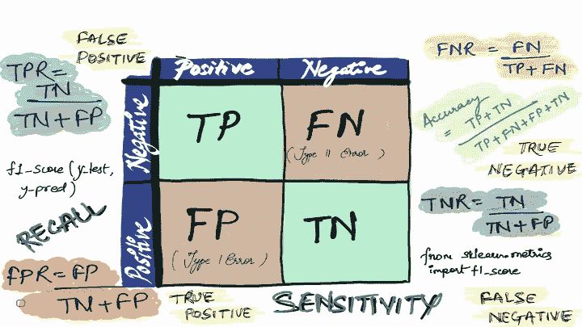
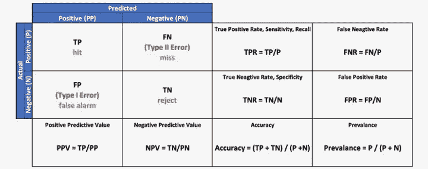
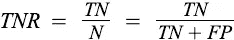
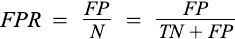
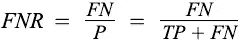
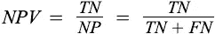
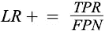
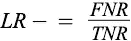
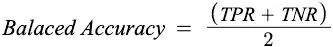
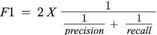

# 深入混乱矩阵

> 原文：<https://pub.towardsai.net/deep-dive-into-confusion-matrix-6b8111d5c3f7?source=collection_archive---------3----------------------->

## 模型评估

## 精确度(TPR)，召回率(PPV)，TNR，FPR，FNR，净现值，F1 得分，准确度，平衡准确度，LR+，LR-



作者图片

在数据科学领域，模型评估是培训生命周期的关键组成部分。有许多度量来评估分类模型，但是经常使用准确性度量。然而，由于类别不平衡，准确性可能无法给出模型的正确描述，在这种情况下，将使用混淆矩阵进行评估。

混淆矩阵非常重要，因为许多指标都是从它衍生出来的，无论是精确度、召回率、F1 分数还是准确度。



困惑矩阵|作者图片

让我们理解从混淆矩阵中得出的指标

**真阳性(TP)** 是实际类为阳性时的正确预测数。

**真阴性(TN)** 是实际类别为阴性时的正确预测数。

**假阳性(FP)** 是实际类为阳性时的错误预测数，也称为**I 类错误**。

**假阴性(FN)** 是实际类别为阴性时的错误预测数，也称为**类型 II 错误**。

```
from sklearn.datasets import load_breast_cancer
from sklearn.model_selection import train_test_split 
from sklearn.linear_model import LogisticRegression
from . import confusion_matrixX, y = load_breast_cancer(return_X_y=True)
X_train, X_test, y_train, y_test = train_test_split(X, y,
                                                    test_size=0.33,
                                                    random_state=42)
lr= LogisticRegression()
lr.fit(X_train,y_train) 
y_pred=lr.predict(X_test)conf_mat = confusion_matrix(y_test, y_pred, plot=False)
TP = conf_mat[0,0]
TN = conf_mat[1,1]
FP = conf_mat[1,0]
FN = conf_mat[0,1]print("TP: ", TP)
print("TN: ", TN)
print("FP: ", FP)
print("FN: ", FN)**Output:** TP:  63
TN:  118
FP:  3
FN:  4
```

**真阳性率(TPR)、灵敏度、回忆:**是一个人检测呈阳性而患有某种疾病的概率。换句话说，召回率是模型预测的属于特定类别的实例的比例。


```
from sklearn.metrics import recall_score
recall_score(y_test, y_pred)**Output:** 0.9752066115702479
```

**真阳性率(TPR)，特异性:**是一个人检测阴性但没有患病的概率。



**假阳性率(FPR)，脱落:**它是一个人检测呈阳性而没有患病的概率。



**假阴性率(FNR)，漏检率:**是检测阴性的人确实患有疾病的概率。



```
TNR = TN/(TN+FP)
print("Specificity: ", TNR) 
FPR = FP/(TN+FP)
print("FPR: ", FPR)
FNR = FN/(TP+FN)
print("FNR: ", FNR)**Output:** Specificity:  0.9752066115702479
FPR:  0.024793388429752067
FNR:  0.05970149253731343
```

**阳性预测值(PPV)，精度:**是一个人患病检测呈阳性的概率。换句话说，精度就是所有预测中正确预测的比例。


```
from sklearn.metrics import precision_score
precision_score(y_test, y_pred)**Output:** 0.9672131147540983
```

**阴性预测值(NPV):** 是一个人没有患病但检测为阴性的概率。



**阳性似然比(LR+):**



**负似然比(LR-):**



```
TNR = TP/(TP+FN)
NPV = TN/(TN+FN)
print("NPV: ", NPV) 
LRp = TPR/FPR
print("LR+: ", LRp)
LRn = FNR/TNR
print("LR-: ", LRn)**Output:** NPV:  0.9672131147540983
LR+:  37.92537313432836
LR-:  0.06349206349206349
```

**准确率:**准确率是样本被正确分类的比例。更准确地说，是正确预测数占总病例数的比率。


```
from sklearn.metrics import accuracy_score
accuracy_score(y_test, y_pred)**Output:** 0.9627659574468085
```

**均衡精度:**是 TPR 和 TNR 的算术平均值。在数据不平衡的情况下，平衡精度会发挥作用。



```
from sklearn.metrics import balanced_accuracy_score
balanced_accuracy_score(y_test, y_pred)**Output:** 0.9577525595164673
```

**F1 得分:**它是精确度和召回率的调和平均值，因此它是对分类器预测质量的总体度量。对于大多数人来说，它通常是首选的度量标准，因为它同时兼顾了精确度和召回率。它会在数据不平衡时找到自己的路。



```
from sklearn.metrics import f1_score
f1_score(y_test, y_pred)**Output:** 0.9711934156378601
```

## F1 和平衡精度有什么区别？

F1 不考虑用于评估模型的真阴性，而平衡准确度考虑所有四个 TP、TN、FP 和 FN。

F1 是考虑精确度和召回率的复合指标。还有其他复合指标，如精确度-召回率曲线、ROC 和 AUC，它们对评估任何分类模型都很重要。要了解更多关于这些曲线的信息，请访问 [**精确回忆和 ROC 曲线**](/precision-recall-curve-26f9e7984add) 。

*下面的代码类似于 sklearn 的分类报告，它将给出二进制分类的混淆矩阵中的所有指标。*

```
report = binary_classification_report(y_test, y_pred)
report**Output:** {'TP': 118,
 'TN': 63,
 'FP': 4,
 'FN': 3,
 'TPR': 0.9752066115702479,
 'Recall': 0.9752066115702479,
 'Sensitivity': 0.9752066115702479,
 'TNR': 0.9402985074626866,
 'Specificity': 0.9402985074626866,
 'FPR': 0.05970149253731343,
 'FNR': 0.024793388429752067,
 'PPV': 0.9672131147540983,
 'Precision': 0.9672131147540983,
 'Accuracy': 0.9627659574468085,
 'Balaced Accuracy': 0.9577525595164673,
 'F1 Score': 0.9711934156378601}
```

***注:*** *博客中提到的以上代码均为二进制分类，*

*在这篇博客中，我们了解了二元分类的混淆矩阵。但是，如果您对多类感兴趣，请参考* [***多类模型评估与混淆矩阵和分类报告***](/multi-class-model-evaluation-with-confusion-matrix-and-classification-report-c92a74d5e908)**如果您对“从。导入混淆 _ 矩阵”请参考* [***混淆矩阵介绍***](/introduction-to-confusion-matrix-50676f2756ee) *获取 Python 方法。**

***参考文献:***

*[1] sklearn 度量 API。[https://sci kit-learn . org/stable/modules/classes . html # module-sk learn . metrics](https://scikit-learn.org/stable/modules/classes.html#module-sklearn.metrics)*