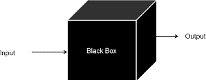
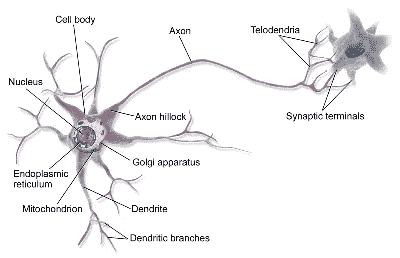
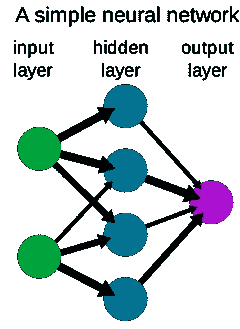
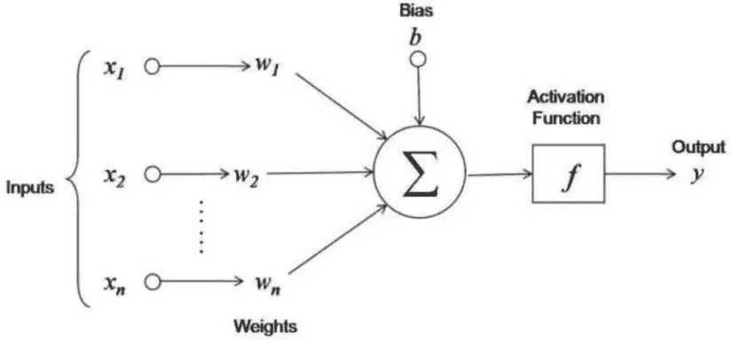
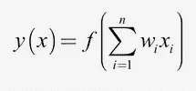
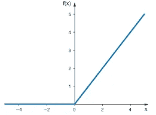
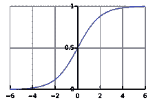
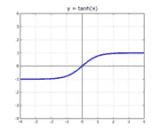

# 深入研究神经网络

> 原文：<https://pub.towardsai.net/deep-dive-into-neural-networks-1d942472e31b?source=collection_archive---------2----------------------->

## [深度学习](https://towardsai.net/p/category/machine-learning/deep-learning)

照片由[德鲁·格拉汉姆](https://unsplash.com/@dizzyd718?utm_source=medium&utm_medium=referral)在 [Unsplash](https://unsplash.com?utm_source=medium&utm_medium=referral) 上拍摄

除了图像和语音识别等众所周知的应用之外，神经网络还被用于在大量数据集中寻找复杂模式，例如当电子邮件引擎建议完成句子时，或者当机器将一种语言翻译成另一种语言时。为了解决如此复杂的问题，我们使用人工神经网络。

在这篇文章中，主题将涵盖:-

*   神经网络导论
*   使用神经网络的目的
*   神经网络体系结构
*   神经元的评估
*   激活函数的几种类型解释
*   估计权重和偏差的反向传播

# 介绍

人工神经网络(ANN)通常被称为黑盒技术，因为有时很难理解它们在做什么。这是一系列数学计算，通过神经网络可以很好地可视化。

来源: [Wikimedia Commons](https://commons.wikimedia.org/wiki/File:Blackbox3D-withGraphs.png) ，根据[Creative Commons](https://en.wikipedia.org/wiki/en:Creative_Commons)[Attribution-Share like 4.0 International](https://creativecommons.org/licenses/by-sa/4.0/deed.en)许可证授权。

安隐约受到构成人类大脑的生物神经网络的启发。人类大脑使用称为神经元的相互连接的细胞网络来提供学习能力。同样，ANN 使用人工神经元或节点网络来解决具有挑战性的学习问题。

来源: [Wikimedia Commons](https://commons.wikimedia.org/wiki/File:Blausen_0657_MultipolarNeuron.png) ，根据[Creative Commons](https://en.wikipedia.org/wiki/en:Creative_Commons)[Attribution-Share like 4.0 International](https://creativecommons.org/licenses/by-sa/4.0/deed.en)许可协议授权。

来源:[维基共享](https://commons.wikimedia.org/wiki/File:Neural_network_example.svg)，根据[知识共享](https://en.wikipedia.org/wiki/en:Creative_Commons) [署名-分享 4.0 国际](https://creativecommons.org/licenses/by-sa/4.0/deed.en)许可授权。

***人脑的神经网络通过神经元显示信息的输入和输出***

***人工神经网络***

## 为什么要学习神经网络？

*   **学习能力** -神经网络可以独立执行其功能。
*   **泛化能力**——它可以很容易地为没有被教会如何处理的输入产生输出。
*   **适应性** —它可以很容易地保持变化的环境条件。

## 神经网络体系结构

神经网络由上图所示的三层组成-

*   输入层
*   隐蔽层
*   输出层

实际上，神经网络具有一个以上的输入模式，并且通常也具有一个以上的输出节点。在这两个节点之间，每层节点之间有一个连接的蜘蛛网。这些层是隐藏层。当我们建立一个神经网络时，要做的第一件事是决定我们需要多少个隐藏层。

**来源:作者图片**

神经元是信息处理单元，是神经网络运行的基础。神经元模型的三个基本要素:

突触重量

组合(加法)功能

*   激活功能

外部输入偏置，用于增加或降低激活函数的净输入

## 神经元评估

**来源:作者图片**

重量级砝码

n–输入数量

Xi-输入

f(x)-激活功能

*   y(x)–输出

这个评估可以通过一个简单的例子来理解，假设在输入节点中，我们有一个值 x1，我们通过网络的突触将这个值从输入节点传递到隐藏层，每个突触或连接都有一些突触权重，即 w，输入值 x1 乘以各自的突触权重，并被输入到隐藏层节点中，在这个隐藏层节点中，激活函数 f(x)完成它们的工作。现在让我们理解什么是激活函数-

**激活功能-**

在以线性组合的形式输入时，我们需要应用一些函数来达到优化的目的。这个功能被称为激活功能，以实现所需的输出。当我们建立一个神经网络时，我们必须决定我们想要使用哪个激活函数。有几种类型的激活功能可以使用-

*   **RELU(整流线性单元)** -对于负输入返回零，对于所有正值保持沉默使用函数- ***y=max(z，0)。z 是在隐藏层节点中接收的加权输入。***

**来源:作者图片**

**Sigmoid 函数-** 输出值的范围可以是 0 到 1 之间的任何值。评估人—***f(x)=1/1+e^z.***

**来源:图片由作者提供**

*   **双曲正切函数—** 也称为双曲正切函数，是 sigmoid 函数的移位版本，具有广泛的输出范围。范围从-1 到+1

**来源:图片由作者提供**

在所有这些激活函数中，RELU 是使用最多的激活函数，其背后的主要动机是将输入转化为有价值的输出单位。

**反向传播**

神经网络从相同的激活函数开始，但在连接上使用不同的权重和偏差，它将激活函数翻转和拉伸成新的形状，该形状被转移以估计权重和偏差。反向传播使用两种不同的方法来估计神经网络中的权重和偏差参数

1.  使用链式法则计算导数或
2.  将导数代入梯度下降以优化参数。

# 神经网络的用途

*   用于语音识别
*   面部识别
*   欺诈检测
*   情感分析
*   社交媒体中的图片搜索

# 结论

本文介绍了人工神经网络的概念、功能类型、用途以及如何估计其参数值。此外，它简要地解释了它是如何类似于人的大脑神经系统。

要了解更多信息或深入研究神经网络，你可以参考 Akruti Acharya 的这篇精彩的案例研究文章

## 链接-[https://neptune.ai/blog/neural-network-guide](https://neptune.ai/blog/neural-network-guide)

*感谢阅读！*

**参考文献**

1.  [https://en.wikipedia.org/wiki/Artificial_neural_network](https://en.wikipedia.org/wiki/Artificial_neural_network)
2.  [https://en.wikipedia.org/wiki/Activation_function](https://en.wikipedia.org/wiki/Activation_function)
3.  [https://www . SAS . com/en _ in/insights/analytics/neural-networks . html](https://www.sas.com/en_in/insights/analytics/neural-networks.html)