# 深入了解熊猫数据帧连接— pd.join()

> 原文：<https://pub.towardsai.net/deep-dive-into-pandas-dataframe-join-pd-join-4cc2adee351d?source=collection_archive---------1----------------------->

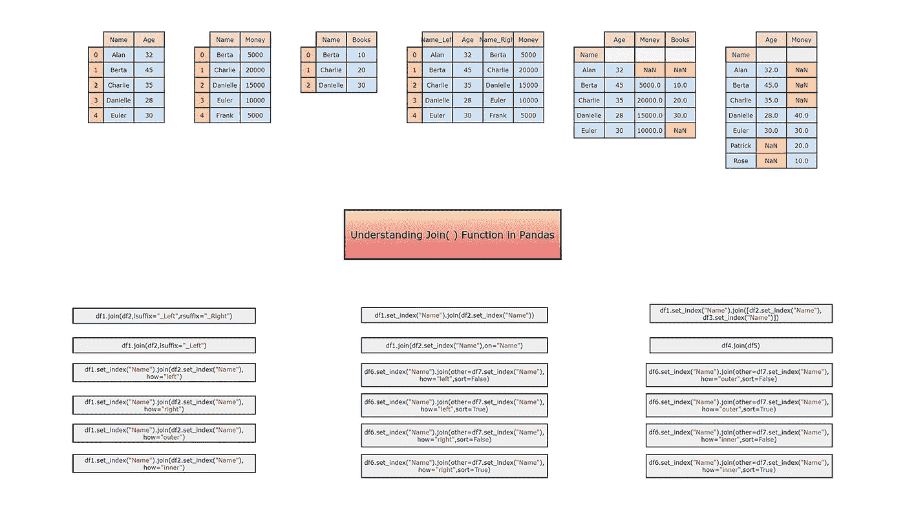

图片由作者| **除特别注明外，所有图片均来自作者。**

## [数据科学](https://towardsai.net/p/category/data-science)，[编辑](https://towardsai.net/p/category/editorial)，[编程](https://towardsai.net/p/category/programming)

## 关于如何在 pandas 中将列与其他数据框连接的深度可视化教程

**作者:** [普拉蒂克·舒克拉](https://www.linkedin.com/in/pratik-shukla28/)，[罗伯特·伊里翁多](https://mktg.best/vguzs)

 [## 加入我们吧↓ |面向人工智能成员|数据驱动的社区

### 加入人工智能，成为会员，你将不仅支持人工智能，但你将有机会…

members.towardsai.net](https://members.towardsai.net/) 

pandas 库的函数用于连接另一个数据帧的列。它可以有效地将列与索引或键列上的另一个数据帧连接起来。我们也可以通过传递一个列表来连接多个 DataFrame 对象。让我们从理解它的语法和参数开始。本教程的配套资料可以在我们的 [**资源部分**](#dc64) 中找到。

## 目录:

1.  [语法](#0538)
2.  [创建数据帧](#e8c6)
3.  [了解 lsuffix 和 rsuffix 参数](#a343)
4.  [通过索引值连接数据帧](#a475)
5.  [设置索引以连接数据帧](#ad00)
6.  [了解 on 参数](#da7f)
7.  [连接多个数据帧](#8285)
8.  [用数据帧连接一个系列](#de10)
9.  [了解“如何”参数](#2069)
10.  [了解“排序”参数](#0d9e)
11.  [关键要点](#8129)
12.  [资源](#dc64)
13.  [参考文献](#e18d)

# 熊猫。DataFrame.join()

**调用者数据帧:** 主数据帧，我们想用它来连接其他数据帧或系列。

**其他数据框:**
我们希望与主数据框连接的数据框。

## 语法:

*DataFrame.join(other，on=None，how="left "，lsuffix= " "，rsuffix = " "，sort=False)*

## 参数:

> 1.其他→数据帧、数据帧系列或数据帧列表
> 我们希望连接到主对象的其他对象(数据帧或系列)。
> 该参数是必需值。
> 
> 2.on → string、字符串列表或类似数组的
> 来设置调用数据帧中的列，以连接其他数据帧的索引。
> 该参数是可选值。默认值为无。
> 
> 3.how →{“左”、“右”、“外”、“内”}
> 如何处理对象的拼接操作。
> A. left:使用调用框架的索引。
> B .右:使用别人的指数。
> C. outer:将调用框架的索引与其他框架的索引形成并集。
> D. inner:形成调用框架的索引与其他框架的索引的交集。
> 这是一个可选值。默认值为左。
> 
> 4.lsuffix → string
> 它指定用于左框架重叠列的后缀值。
> 该参数是可选值。默认值为“”。
> 
> 5.rsuffix → string
> 它指定用于右框架重叠列的后缀值。
> 该参数为可选值。默认值为“”。
> 
> 6.sort → boolean
> 它指定结果数据帧的顺序结果。如果为 False，则顺序取决于“how”关键字的值。
> 该参数为可选值。默认值为 False。

## 退货:

它将返回一个 DataFrame，其中包含来自调用者和其他人的列。

## A.导入所需的库:

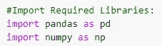

图 1:导入所需的库

## B.创建数据帧:

## B1。第一个数据帧:

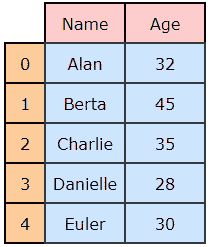

图 2:数据帧 1 (df1)

## Python 实现:

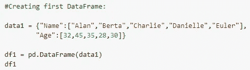

图 3: Python 代码

图 4:输出

## B2。第二个数据帧:

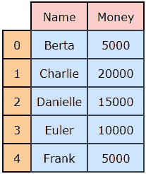

图 5:数据帧 2 (df2)

## Python 实现:

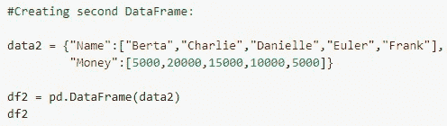

图 6: Python 代码

图 7:输出

## B3。第三个数据帧:

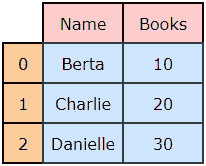

图 8:数据帧 3 (df3)

## Python 实现:

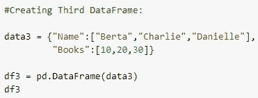

图 9: Python 代码

图 10:输出

## B4。第四个数据帧:

图 11:数据帧 4 (df4)

## Python 实现:

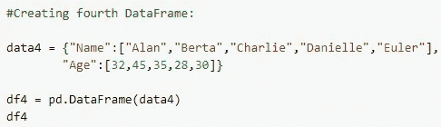

图 12: Python 代码

图 13:输出

## B5。第五个数据帧:

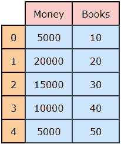

图 14:数据帧 5 (df5)

## Python 实现:

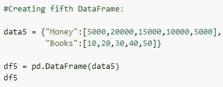

图 15: Python 代码

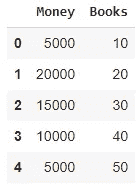

图 16:输出

## B6。第六个数据帧:

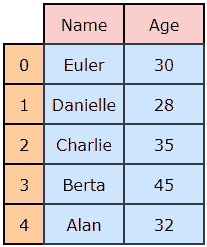

图 17:数据帧 6 (df6)

## Python 实现:

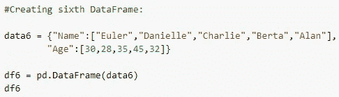

图 18: Python 代码

图 19:输出

## B7。第七个数据帧:

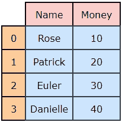

图 20:数据帧 7 (df7)

## Python 实现:

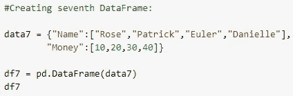

图 21: Python 代码

图 22:输出

# 了解 lsuffix 和 rsuffix 参数:

## A.示例 1:

如果我们在数据帧中有重叠的列，并且没有指定`“lsuffix”`或`“rsuffix”`的值，那么就会产生一个错误。请注意，我们必须指定`“lsuffix”`或`“rsuffix”`的值，或两者都指定，以避免此错误。在下面的例子中，我们有一个名为`“Name”`的重叠列，因为我们既没有指定`“lsuffix”`也没有指定`“rsuffix”`，所以它会产生一个错误。

图 23:数据帧 1 (df1)

图 24:数据帧 2 (df2)

图 25:使用 join()函数

图 26:输出

## Python 实现:

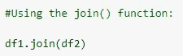

图 27: Python 代码

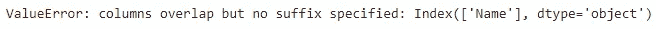

图 28:输出

## B.示例 2:

## 使用的参数:

> lsuffix = "_Left "
> 
> rsuffix = "_Right "

图 29:数据帧 1 (df1)

图 30:数据帧 2 (df2)

图 31:使用 join()函数

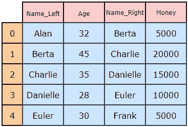

图 32:最终输出

## Python 实现:

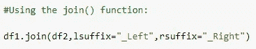

图 33: Python 代码

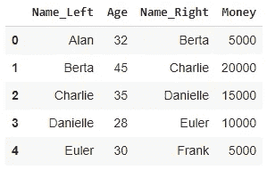

图 34:输出

## C.示例 3:

## 使用的参数:

> lsuffix = "_Left "

图— 35:数据帧 1 (df1)

图— 36:数据帧 2 (df2)

图— 37:使用 join()函数

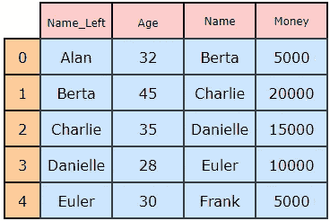

图 38:最终输出

## Python 实现:

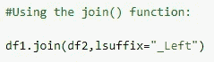

图 39: Python 代码

图 40:输出

## D.示例 4:

## 使用的参数:

> rsuffix = "_Right "

图— 41:数据帧 1 (df1)

图 42:数据帧 2 (df2)

图 43:使用 join()函数

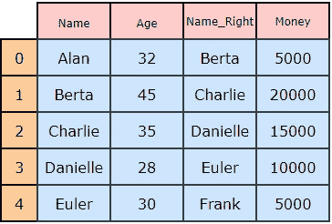

图 44:输出

## Python 实现:

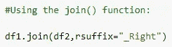

图 45: Python 代码

图 46:输出

# 通过索引值连接数据帧:

## A.示例 1:

默认情况下，数据帧将由索引值连接。

图— 47:数据帧 4 (df4)

图 48:数据帧 5 (df5)

图-49:使用 join()函数

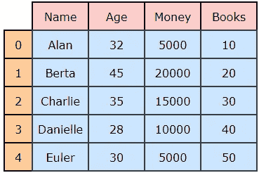

图 50:输出

## Python 实现:

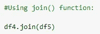

图 51: Python 代码

图 52:输出

# 设置索引以连接数据帧:

## A.示例 1:

我们可以使用`“set_index”`来设置数据帧的索引，然后连接数据帧。

图— 53:数据帧 1 (df1)

图— 54:数据帧 2 (df2)

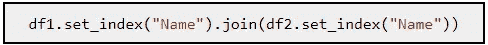

图-55:使用 join()函数

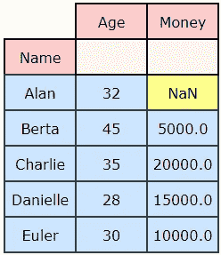

图 56:输出

## Python 实现:

图 57: Python 代码

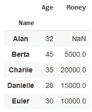

图 58:输出

# 理解“开”参数:

## A.示例 1:

## 使用的参数:

> on = "Name "

图— 59:数据帧 1 (df1)

图 60:数据帧 2 (df2)

图-61:使用 join()函数

图 62:输出

## Python 实现:

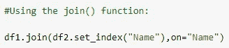

图 63: Python 代码

图 64:输出

# 连接多个数据帧:

## A.示例 1:

我们可以通过使用数据帧列表来连接多个数据帧。

图— 65:数据帧 1 (df1)

图-66:数据帧 2 (df2)

图-67:数据帧 3 (df3)

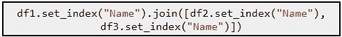

图-68:使用 join()函数

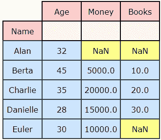

图 69:输出

## Python 实现:

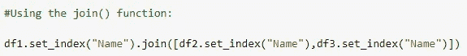

图 70: Python 代码

图 71:输出

# 将系列与数据框连接起来:

## A.创建系列:

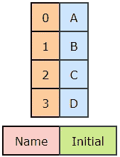

图— 71:创建系列图像

## Python 实现:

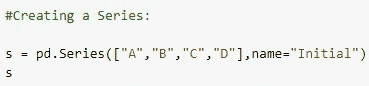

图 72: Python 代码

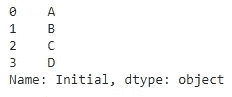

图-73:输出

## B.示例 1:

将一个系列与一个数据帧连接时，必须指定该系列的`name` ，它将在输出中用作列名。

图— 74:数据帧 1 (df1)

图-75:系列

图-76:使用 join()函数

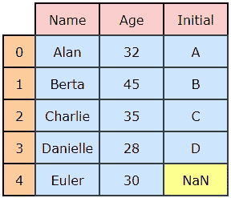

图— 77:输出

## Python 实现:

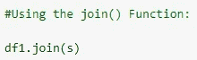

图 78: Python 代码

图-79:输出

# 了解“如何”参数:

## A.示例 1:

如果我们使用`“how” = “left”`，那么它将使用调用框架的索引(或列名)来执行连接操作。*在这种情况下，调用数据帧中的任何一行都不会在最终输出中丢失。*

## 使用的参数:

> how = "左"

图 80:数据帧 1 (df1)

图-81:数据帧 2 (df2)

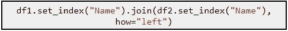

图-82:使用 join()函数

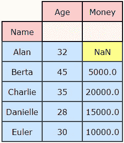

图 83:输出

## Python 实现:

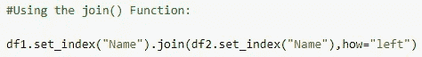

图 84: Python 代码

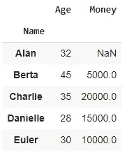

图 85:输出

## B.示例 2:

如果我们使用`“how” = “right”`，那么它将使用另一个框架的索引(或列名)来执行连接操作。*在这种情况下，来自另一个数据帧的任何一行都不会在最终输出中丢失。*

## 使用的参数:

> how = "right "

图— 86:数据帧 1 (df1)

图-87:数据帧 2 (df2)

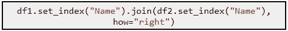

图-88:使用 join()函数

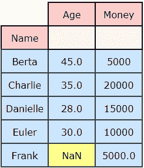

图-89:输出

## Python 实现:

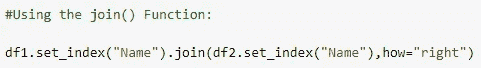

图 90: Python 代码

图 91:输出

## C.示例 3:

如果我们使用`“how” = “outer”`，它将调用框架的索引(或列名)与其他框架的索引结合起来。这里需要注意的重要一点是，即使我们没有指定`sort`参数，输出也将按字典顺序排序。*在这种情况下，来自调用和其他数据帧的行都不会丢失。*

## 使用的参数:

> how = "outer "

图— 92:数据帧 1 (df1)

图— 93:数据帧 2 (df2)

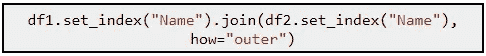

图-94:使用 join()函数

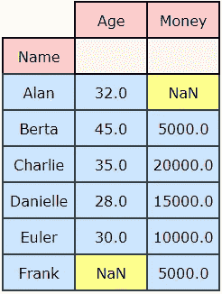

图 95:输出

## Python 实现:

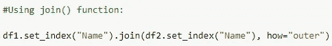

图 96: Python 代码

图 97:输出

## D.示例 4:

如果我们使用`“how” = “inner”`，那么它形成了调用框架的索引(或列名)与其他索引的交集。输出将保持调用数据帧的顺序。

## 使用的参数:

> how = "内心"

图— 98:数据帧 1 (df1)

图— 99:数据帧 2 (df2)

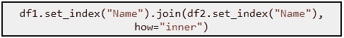

图 100:使用 join()函数

图 101:输出

## Python 实现:

图 102: Python 代码

图 103:输出

## 总结:

# 了解“排序”参数:

## A.示例 1:

## 使用的参数:

> how = "左"
> 
> 排序=假

输出将**而不是**按字典顺序排序。

图— 104:数据帧 6 (df6)

图— 105:数据帧 7 (df7)

图-106:使用 join()函数

图 107:输出

## Python 实现:

图 108: Python 代码

图 109:输出

## B.示例 2:

## 使用的参数:

> how = "左"
> 
> 排序=真

输出将按字典顺序排序。

图 110:数据帧 6 (df6)

图— 111:数据帧 7 (df7)

图-112:使用 join()函数

图 113:输出

## Python 实现:

图 114: Python 代码

图 114:输出

## C.示例 3:

## 使用的参数:

> how = "right "
> 
> 排序=假

输出将**而不是**按字典顺序排序。

图— 115:数据帧 6 (df6)

图— 116:数据帧 7 (df7)

图-117:使用 join()函数

图 118:输出

## Python 实现:

图 119: Python 代码

图 120:输出

## D.示例 4:

## 使用的参数:

> how = "right "
> 
> 排序=真

输出将按字典顺序排序。

图— 121:数据帧 6 (df6)

图— 122:数据帧 7 (df7)

图-123:使用 join()函数

图 124:输出

## Python 实现:

图 125: Python 代码

图 126:输出

## E.示例— 5:

## 使用的参数:

> how = "outer "
> 
> 排序=假

如果我们指定了`how = “outer”`，那么不管我们是否指定了`sort = True or False`，输出总是按字典顺序排序。

图— 127:数据帧 6 (df6)

图— 128:数据帧 7 (df7)

图-129:使用 join()函数

图 130:输出

## Python 实现:

图 131: Python 代码

图 132:输出

## F.示例— 6:

## 使用的参数:

> how = "outer "
> 
> 排序=真

输出将按字典顺序排序。

图— 133:数据帧 6 (df6)

图— 134:数据帧 7 (df7)

图-135:使用 join()函数

图 136:输出

## Python 实现:

图 137: Python 代码

图 138:输出

## G.示例— 7:

## 使用的参数:

> how = "内心"
> 
> 排序=假

如果我们指定`how = “inner”`，那么默认情况下，输出将保持调用数据帧的顺序。输出将**而不是**按字典顺序排序。

图— 139:数据帧 6 (df6)

图— 140:数据帧 7 (df7)

使用 join()函数

图 141:输出

## Python 实现:

图 142: Python 代码

图 143:输出

## H.示例— 8:

## 使用的参数:

> how = "内心"
> 
> 排序=真

输出将按字典顺序排序。

图— 144:数据帧 6 (df6)

图— 145:数据帧 7 (df7)

图-146:使用 join()函数

图 147:输出

## Python 实现:

图 148: Python 代码

图 149:输出

## 总结:

图 150:总结

## 关键要点:

1.  当两个数据帧中有相同标签的列时，我们希望连接。我们必须使用`“lsuffix”`或`“rsuffix”`值来避免错误。
2.  默认情况下，数据帧将通过其索引值进行连接。
3.  我们可以通过使用数据帧列表来连接多个数据帧。
4.  我们可以使用`“how”`参数来处理连接操作。
5.  我们可以使用`“sort”`参数按字典顺序对结果数据帧进行排序。

给普拉蒂克买杯咖啡！

**免责声明:**本文所表达的观点均为作者个人观点，不代表与作者(直接或间接)相关的任何公司的观点。这项工作并不打算成为最终产品，而是当前思想的反映，同时也是讨论和改进的催化剂。

**除非另有说明，所有图片均来自作者。**

经由[发布**走向 AI** 发布](https://towardsai.net/)

## 资源:

 [## 熊猫数据框架连接— pd.join() |谷歌联合实验室

colab.research.google.com](https://colab.research.google.com/drive/10nYP81Ya3Z_pCEhjxaDXE8-wTXsR8mPt?usp=sharing) 

[**Github 资源库。**](https://github.com/towardsai/tutorials/blob/master/pandas/pd_join().py)

 [## 店铺↓ |走向 AI

### 发布最好的技术、科学和工程|社论→https://towardsai.net/p/editorial |订阅→…

ws.towardsai.net](https://ws.towardsai.net/shop)  [## 加入我们吧↓ |面向人工智能成员|数据驱动的社区

### 加入人工智能，成为会员，你将不仅支持人工智能，但你将有机会…

members.towardsai.net](https://members.towardsai.net/)  [## 赞助商|了解如何成为《走向人工智能》的赞助商

### 无论你是想以一种吸引读者的方式突出你的产品，吸引高度相关的利基受众，还是…

sponsors.towardsai.net](https://sponsors.towardsai.net/) 

## 进一步阅读

 [## 处理熊猫中缺失的值

### 一个关于如何检测和处理熊猫丢失数据的实践视频教程

pub.towardsai.net](/handling-missing-values-in-pandas-f87cec928937)  [## 搜索引擎优化(SEO)中的自然语言——如何、做什么、何时以及为什么

新闻网](https://news.mktg.best/natural-language-in-search-engine-optimization-seo-how-what-when-and-why-b390364b5d3d)  [## 了解熊猫融化— pd.melt()

### 了解重塑 Pandas 数据框的最有效和最灵活的函数

pub.towardsai.net](/understanding-pandas-melt-pd-melt-362954f8c125) 

## 参考资料:

[1]“熊猫。data frame . Join-Pandas 1 . 2 . 4 文档”。2021.Pandas.Pydata.Org。[https://pandas . pydata . org/docs/reference/API/pandas . data frame . join . html](https://pandas.pydata.org/docs/reference/api/pandas.DataFrame.join.html.)