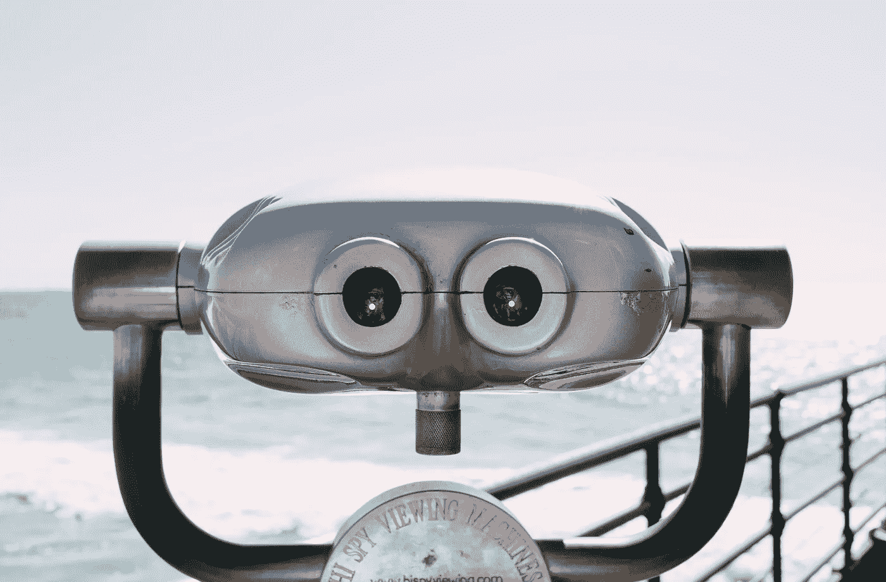
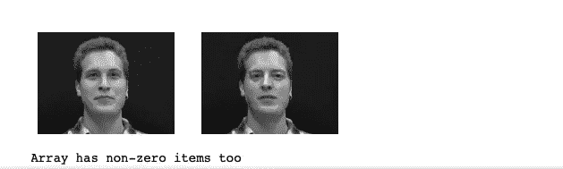
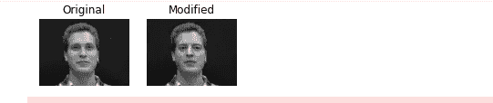
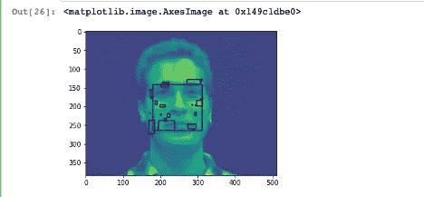
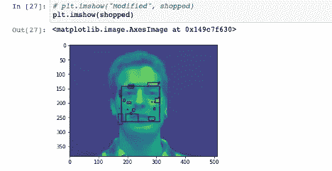
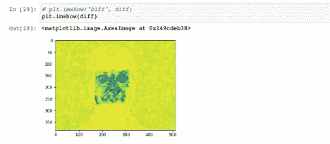

# 基于 OpenCV 和 MTCNN 的深度防伪检测

> 原文：<https://pub.towardsai.net/deep-fake-detection-using-opencv-and-mtcnn-833625abdd03?source=collection_archive---------1----------------------->

## [深度学习](https://towardsai.net/p/category/machine-learning/deep-learning)



来源:https://stockup.sitebuilderreport.com

这个周末，我碰到了一个有趣的话题。话题很深——假货。有许多关于流行名人或政治家的假视频的报道。这些被操纵的视频是通过操纵原始视频而创建的。这些假视频很难用肉眼发现，它们正在成为社会的一个重要问题。

脸书、推特、Youtube 等社交媒体平台。是这些被篡改的视频的主要发布渠道。当这些平台正在努力解决这个问题时，脸书正在投入巨资(1000 万美元)来解决这个问题，Twitter 和 Google 等其他平台也在努力解决这个问题。这是谷歌打击深度假货的一些[细节](https://ai.googleblog.com/2019/09/contributing-data-to-deepfake-detection.html)。

在这篇文章中，我们将讨论如何识别真假。它包括将视频分解成一帧，从真实和虚假的视频中检测人脸，裁剪人脸，并对其进行分析。我们将使用:

1.  OpenCV: OpenCV 支持大量与计算机视觉和机器学习相关的算法。OpenCV 有一个叫做“OpenCV-python”的 Python 库。
2.  Numpy:它用于 python 中数组的一般表示和操作。
3.  scikit-image:我们将使用这个工具对面部图像进行操作。
4.  Matplotlib:用于绘制检测结果(直方图和 ROC
    曲线等)。).

数据集

我们使用的是 DeepfakeTIMIT 数据库(T8)，这是一个视频数据库，使用开源的基于 GAN 的方法交换人脸。

这个数据集是从最初的[基于自动编码器的 Deepfake 算法](https://github.com/deepfakes/faceswap)中创建的。

我们将使用两种不同的 GAN 模型进行训练/测试:低质量(LQ)的 64 x 64 输入/输出尺寸模型，高质量(HQ)的 128 x 128 尺寸模型。

让我们进入正题。

我们将使用两种不同的 GAN 模型进行训练/测试:低质量(LQ)的 64 x 64 输入/输出尺寸模型，高质量(HQ)的 128 x 128 尺寸模型。

让我们进入正题。

# OpenCV

**使用 pip 安装 OpenCV**

```
pip install opencv
```

**窗户安装**

请关注这篇文章:

[https://opencv-python-tutro als . readthedocs . io/en/latest/py _ tutorials/py _ setup/py _ setup _ in _ windows/py _ setup _ in _ windows . html](https://opencv-python-tutroals.readthedocs.io/en/latest/py_tutorials/py_setup/py_setup_in_windows/py_setup_in_windows.html)

OpenCV 将用于四个主要任务。

1.  图像处理
2.  视频处理
3.  特征检测
4.  目标检测

让我们讨论一下 OpenCV 的一些基础知识

要使用 OpenCV，您需要做的就是

```
Import cv2
```

**读一个图像**

```
import numpy as np
import cv2# Load an color image in grayscale
img = cv2.imread('imagename.jpg',0)
```

cv2.imread()函数有两个参数。第一个是图像源，第二个是标志，它指定了读取图像的方式。他们是

*   cv2。加载一幅彩色图像。图像的任何透明度都将被忽略。这是默认标志。
*   cv2。im read _ gray:以灰度模式加载图像
*   cv2。IMREAD_UNCHANGED:加载图像本身，包括 alpha 通道

在您的函数中，我们将“0”作为第二个参数传递。可以传递全名，也可以分别传递 1、0 和-1。

**显示一幅图像**

```
cv2.imshow('image',img)
cv2.waitKey(0)
cv2.destroyAllWindows()
```

cv2.imshow()有两个参数。第一个是图像的名称，第二个是图像来源。cv2.waitKey()为任何键盘事件等待指定的毫秒数。cv2.destroyAllWindows()简单地销毁我们创建的所有窗口。

**写一个图像**

```
cv2.imwrite('imagename.png',img)
```

这将在当前目录中创建一个图像。第一个参数是您设置的图像文件的名称，第二个参数是实际的图像。

**从摄像机捕捉视频**

```
import numpy as np
import cv2cap = cv2.VideoCapture(0)while(True):
    # Capture frame-by-frame
    ret, frame = cap.read() # Our operations on the frame come here
    gray = cv2.cvtColor(frame, cv2.COLOR_BGR2GRAY) # Display the resulting frame
    cv2.imshow('frame',gray)
    if cv2.waitKey(1) & 0xFF == ord('q'):
        break# When everything done, release the capture
cap.release()
cv2.destroyAllWindows()
```

代码参考:[官方 OpenCV 库网站](https://opencv-python-tutroals.readthedocs.io/en/latest/py_tutorials/py_gui/py_video_display/py_video_display.html)

这将打开摄像机中的视频。

**播放文件中的视频。**

```
import numpy as np
import cv2cap = cv2.VideoCapture('yourvoideofilename.avi')while(cap.isOpened()):
    ret, frame = cap.read() gray = cv2.cvtColor(frame, cv2.COLOR_BGR2GRAY) cv2.imshow('frame',gray)
    if cv2.waitKey(1) & 0xFF == ord('q'):
        breakcap.release()
cv2.destroyAllWindows()
```

代码参考:[官方 OpenCV 库网站](https://opencv-python-tutroals.readthedocs.io/en/latest/py_tutorials/py_gui/py_video_display/py_video_display.html)。

它将从您提供的路径打开一个视频文件。这些是 OpenCV 中执行的一般任务，但是你可以在这里找到更多的。

## Matplotlib

Matplotlib 会给你各种各样的绘图方法。我们将在本文后面讨论更多内容。下面是一个如何使用 matplotlib 显示图像的示例。

```
import numpy as np
import cv2
from matplotlib import pyplot as pltimg = cv2.imread('yourimagename.jpg',0)
plt.imshow(img, cmap = 'gray', interpolation = 'bicubic')# to hide tick values on X and Y axis
plt.xticks([]), plt.yticks([])  
plt.show()
```

它将显示您提供的路径中的图像。

现在，我们的主要目标是从 path 中读取视频文件，并从我们选择的真实视频和虚假视频中提取帧。然后执行面部检测以提取面部。之后，我们用各种方法分析了这两张人脸图像的差异。我把代码分成多个部分。我希望它能更容易阅读。

```
#required Librariesimport numpy as np
import matplotlib.pyplot as plt
import cv2
import pandas as pd
import glob2
import os, fnmatch
from pathlib import Path
# import mtcnn
from mtcnn.mtcnn import MTCNN
```

处理视频

```
# reading video fame
# Create a VideoCapture object and read from input filedef extract_multiple_videos(intput_filenames, image_path_infile):
    """Extract video files into sequence of images."""i = 1  # Counter of first video# Iterate file names:
    cap = cv2.VideoCapture('your_video_file_path.avi' or intput_filenames)if (cap.isOpened()== False):
        print("Error opening file")# Keep iterating break
    while True:
        ret, frame = cap.read()  # Read frame from first video

        if ret:
            cv2.imwrite(os.path.join(image_path_infile , str(i) + '.jpg'), frame)  # Write frame to JPEG file (1.jpg, 2.jpg, ...)# you can uncomment this line if you want to view them.
#           cv2.imshow('frame', frame)  # Display frame for testing
            i += 1 # Advance file counter
        else:
            # Break the interal loop when res status is False.
            breakcv2.waitKey(50) #Wait 50mseccap.release()
```

调用这个函数

```
# extract_multiple_videos(real_video_name,real_image_path_for_frame)extract_multiple_videos(fake_video_name, fake_image_path_for_frame)
extract_multiple_videos(real_video_name, real_image_path_for_frame)
```

**extract _ multiple _ videos()**函数有两个参数。第一个参数是视频文件路径。第二个参数是保存提取的帧的路径。

我们只是加载了视频，读取了帧，并把它们写到一个文件中。

现在，让我们找出两个框架之间的差异，并可视化的差异。

```
# from skimage.measure import structural_similarity as ssim
from skimage import measuredef mse(imageA, imageB):
    # the 'Mean Squared Error' between the two images is the
    # sum of the squared difference between the two images;
    # NOTE: the two images must have the same dimension
    err = np.sum((imageA.astype("float") - imageB.astype("float")) ** 2)
    err /= float(imageA.shape[0] * imageA.shape[1])# return the MSE, the lower the error, the more "similar"
    # the two images are
    return err
def compare_images(imageA, imageB, title):
    # compute the mean squared error and structural similarity
    # index for the images
    m = mse(imageA, imageB)
    s = measure.compare_ssim(imageA, imageB)
    # setup the figure
    fig = plt.figure(title)
    plt.suptitle("MSE: %.2f, SSIM: %.2f" % (m, s))
    # show first image
    ax = fig.add_subplot(1, 2, 1)
    plt.imshow(imageA, cmap = plt.cm.gray)
    plt.axis("off")
    # show the second image
    ax = fig.add_subplot(1, 2, 2)
    plt.imshow(imageB, cmap = plt.cm.gray)
    plt.axis("off")
    # show the images
    plt.show()
```

代码参考:【https://www.pyimagesearch.com 

```
original = cv2.imread("image_path_from_real_video")
shopped = cv2.imread("image_path_from_fake_video")
# convert the images to grayscale
original = cv2.cvtColor(original, cv2.COLOR_BGR2GRAY)
shopped = cv2.cvtColor(shopped, cv2.COLOR_BGR2GRAY)
```

调用函数

```
# initialize the figure
fig = plt.figure("Images")
images = ("Original", original), ("modified", shopped)
# loop over the images
for (i, (name, image)) in enumerate(images):
 # show the image
 ax = fig.add_subplot(1, 3, i + 1)
 ax.set_title(name)
 plt.imshow(image, cmap = plt.cm.gray)
 plt.axis("off")
# show the figure
plt.show()# compare the images
compare_images(original, original, "Original vs. Original")
compare_images(original, shopped, "Original vs. Modified")
# cv2.subtract(original)
# img3 = original-shopped
image3 = cv2.absdiff(original, shopped)
image3is_all_zero = not np.any(image3)if is_all_zero:
    print('Array contains only 0')
else:
    print('Array has non-zero items too')
```

在上面的代码中，我们比较了从原始视频中提取的图像和从假视频中提取的相应图像。在代码的最后一部分，我检查两个图像是否有差异。

输出:



现在我们很难过，这两个图像是不同的。我们可以计算 **SSIM。**

**计算结构相似指数(SSIM)**

```
from skimage.measure import compare_ssim
import argparse
import imutils(score, diff) = compare_ssim(original, shopped, full=True)
diff = (diff * 255).astype(“uint8”)
print(“SSIM: {}”.format(score))
```

该分数表示两幅图像之间的结构相似性。所以我们的图像 91.50 %相似。diff 变量包含两个图像之间的实际位差。如果打印出来，可以在 Diff 中看到这个数组。

**寻找图像差异**

```
thresh = cv2.threshold(diff, 0, 255,cv2.THRESH_BINARY_INV | cv2.THRESH_OTSU)[1]
cnts = cv2.findContours(thresh.copy(), cv2.RETR_EXTERNAL,cv2.CHAIN_APPROX_SIMPLE)
cnts = imutils.grab_contours(cnts)
```

显示图像

```
%matplotlib inline# loop over the contours
for c in cnts:
 # compute the bounding box of the contour and then draw the
 # bounding box on both input images to represent where the two
 # images differ
 (x, y, w, h) = cv2.boundingRect(c)
 cv2.rectangle(original, (x, y), (x + w, y + h), (0, 0, 255), 2)
 cv2.rectangle(shopped, (x, y), (x + w, y + h), (0, 0, 255), 2)

# show the output images
# plt.imshow(“Original”, original)
plt.imshow(original)
# cv2.waitKey(0)
```

原象



原象

修改的图像



修改的图像

两幅图像的差异



两者之间的差异

正如我们从图像中看到的，我们可以查看两幅图像之间的差异，并计算修改的部分。

**执行面部检测**

```
from matplotlib.patches import Rectangle
from matplotlib.patches import Circle
from matplotlib import pyplot
from mtcnn.mtcnn import MTCNN# draw an image with detected objects
def draw_image_with_boxes(filename, result_list, face_filename):
 # load the image
 data = pyplot.imread(filename)
 for i in range(len(result_list)):
 # get coordinates
 x1, y1, width, height = result_list[i][‘box’]
 x2, y2 = x1 + width, y1 + height
 # define subplot
 pyplot.subplot(1, len(result_list), i+1)
 pyplot.axis(‘off’)
 # plot face
 pyplot.imshow(data[y1:y2, x1:x2])
 pyplot.savefig(‘Dataset/only_face/’+ face_filename)
# show the plot
pyplot.show()
```

提取视频帧并用 MTCNN 检测人脸

```
# reading video fame
# Create a VideoCapture object and read from input file
def extract_multiple_videos_faces(intput_video_file_names, image_path_infile):
    """Extract video files into sequence of images.
       Intput_filenames is a list for video file names"""i = 1  # Counter of first video# Iterate file names:
    cap = cv2.VideoCapture('/Users/praladneupane/Documents/Third_Semester/695/projects/Deepfake/Dataset/VidTIMIT/mstk0/sa1.avi')

    if (cap.isOpened()== False):
        print("Error opening video stream or file")# Keep iterating break
    while True:
        ret, frame = cap.read()  # Read frame from first video

        if ret:

#           cv2.imwrite(str(i) + '.jpg', frame)  # Write frame to JPEG file (1.jpg, 2.jpg, ...)
#             this code can be use to do 1.2.3 and 1.3, but i am only doing 1.3 now
#             cv2.imwrite(os.path.join(image_path_infile , str(i) + '.jpg'), frame)  # Write frame to JPEG file (1.jpg, 2.jpg, ...)

#           cv2.imshow('frame', frame)  # Display frame for testing

            filename = os.path.join(image_path_infile , str(i) + '.jpg') 

        # this line feels little odd. Cause it looks 
        # like i am reading it mannually but if i uncomment above line it will be dynamic everytime, cause those line 
        # creates the frame in the folder first.

            # load image from file
            pixels = pyplot.imread(filename)
            # create the detector, using default weights
            detector = MTCNN()
            # detect faces in the image
            faces = detector.detect_faces(pixels)
            # display faces on the original image
            face_filename_crp = str(i) + '.jpg'
            draw_image_with_boxes(filename, faces, face_filename_crp)

            i += 1 # Advance file counter

            face_filename = str(i) + '.jpg'
            # display faces on the original image
#             draw_image_with_boxes(filename, faces,face_filename)
        else:
            # Break the interal loop when res status is False.
            breakcv2.waitKey(100) #Wait 100msec (for debugging)cap.release() #Release must be inside the outer loop
```

打电话吧

```
extract_multiple_videos_faces(video_file_path,real_image_path_for_frame)
```

这里，extract_multiple_videos_faces()函数需要两个参数。第一个参数是视频文件路径，第二个参数是保存这些视频的帧的位置。只需更改文件路径即可检测不同的视频，并传递一个路径保存在不同的目录中。

现在你只有真实和虚假的面部图像。你可以试着实现上面叫做**寻找轮廓**的部分。这是故意的，所以试一试。

总之，我们能够从真实和虚假的视频中提取帧，比较和对比来自两者的相同图像，并检测差异。

[1]:P. Korshunov 和 S. Marcel，
DeepFakes:人脸识别的新威胁？评估和检测。
arXiv 和 Idiap 研究报告

[2]:C. Sanderson 和 B.C. Lovell，
用于稳健和可扩展身份推断的多区域概率直方图。
计算机科学讲义(LNCS)，第 5558 卷，第 199–208 页，2009 年。