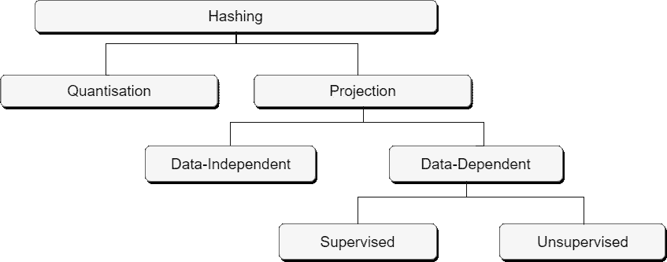
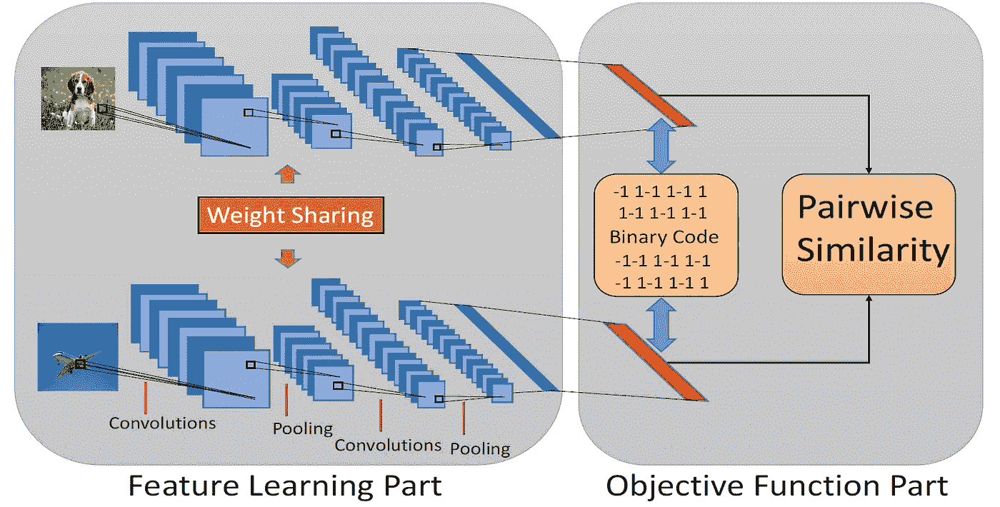
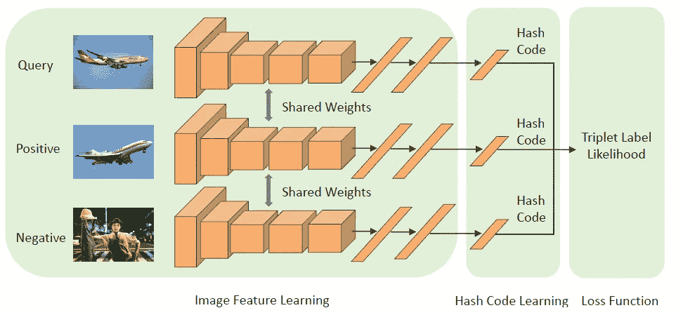
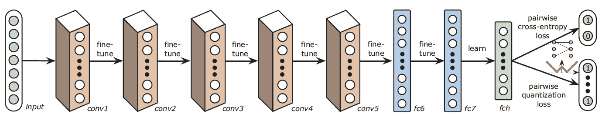

# 用于相似性搜索的深度散列

> 原文：<https://pub.towardsai.net/deep-hashing-for-similarity-search-9273aac054db?source=collection_archive---------0----------------------->

## [深度学习](https://towardsai.net/p/category/machine-learning/deep-learning)，[计算机视觉](https://towardsai.net/p/category/computer-vision)

## 文献中的新型深度哈希神经网络综述

由[托尔加·乌尔坎](https://unsplash.com/@tolga__?utm_source=unsplash&utm_medium=referral&utm_content=creditCopyText)在 [Unsplash](https://unsplash.com/?utm_source=unsplash&utm_medium=referral&utm_content=creditCopyText) 拍摄的照片

近年来**近似最近邻(ANN)**【1】搜索已经成为一个突出的研究课题，以有效地处理现实世界应用中不断增长的数据量。人工神经网络有多种应用[包括模式识别、推荐系统、相似性搜索、聚类分析等。然而，在本文中，我们将主要关注**相似性搜索**的应用。此外，在现有的人工神经网络技术中，**哈希**因其快速的查询速度和低内存成本而在高维数据的管理、存储和处理中变得非常流行[2–10]。](https://en.wikipedia.org/wiki/Nearest_neighbor_search#Applications)

哈希模型采用输入数据点(图像、文档等)。)并输出表示该数据点的比特序列或哈希码。此外，基于基本属性的不同散列模型的[分类法](https://learning2hash.github.io/base-taxonomy/)如下所示，

在本文中，我们将主要关注**数据相关散列法、**，其中散列函数的学习考虑了输入数据分布。这一类有代表性的方法有**学习哈希****(L2H)**【11–13】方法。

[L2H](https://cs.nju.edu.cn/lwj/slides/L2H.pdf)【12，13】是一组数据相关的哈希方法，旨在学习具有较短哈希代码的紧凑且相似性保持的按位表示，以这种方式将相似的输入映射到附近的二进制哈希代码。具体从不同的 L2H 方法，我们将深入到**深度哈希**。深度散列构成了利用深度学习的监督 L2H，并且包括不同的散列方法，其中一些关于图像数据的相似性搜索的新颖方法以及它们不同的功能设计方面被进一步阐述，

**深度成对监督哈希(DPSH)**

李等人[14]提出了一种新的深度哈希方法，称为**深度成对监督哈希(DPSH)** ，它在端到端架构中使用监督成对标签同时进行特征学习和哈希码学习，利用反馈机制来学习更好的哈希码。

深度成对监督哈希(DPSH)的端到端架构[14]

如上图所示，用于图像检索的端到端学习框架具有三个关键组件，第一个组件是从像素学习图像表示的***【CNN】***，第二个组件是将学习到的图像表示映射到散列码的 ***散列函数*** ，第三个组件是与成对标签相比较来测量生成的散列码的 ***损失函数*** 。

**基于三元组的深度哈希**

受李等人关于的工作的启发，王等人[15]提出了一种新的**基于三元组的深度哈希**方法(对标签进行排序的一种特殊情况)，该方法以端到端的方式同时执行图像特征和哈希码学习，旨在最大化输入三元组标签的可能性。该方法通过实验评估优于基于
成对标签的深度散列和基于预先存在的三元标签的深度散列方法。

基于三元组的深度哈希的端到端架构[15]

如上图所示，这个端到端学习框架有三个组件，一个 ***深度神经网络*** 从图像中学习特征，一个 ***全连接层*** 从这些特征中学习哈希码，以及 ***损失函数*** 。

> **目标函数**

**潜在因素散列法(LFH)**

关于学习相似性保持哈希码的目标函数，Zhang 等人[16]首先提出了一种监督哈希方法，**【潜在因子哈希(LFH)** 基于潜在因子模型学习相似性保持二进制码，可以有效地用于训练大规模监督哈希问题。LFH 将成对的
相似性的可能性建模为对应点之间的*海明距离*的函数。然而，该目标函数的优化是一个不容易解决的离散优化问题，因此通过将离散码转换为连续码来放松该约束，这可能无法实现令人满意的性能[10]。

因此，利用 LFH 的深度哈希方法提出了新的策略，以离散的方式解决这一离散优化问题，从而提高精度，如 DPSH [14]。Wang 等人[15]在基于三元组的深度哈希中更倾向于以张等人[16]提出的连续方式解决这种离散优化问题，但是考虑了损失函数中这种松弛所引起的量化误差。

> **损失函数优化**

**深度哈希网络(DHN)**

关于成对监督哈希的优化损失函数，Zhu 等人[17]提出了一种新的**深度哈希网络(DHN)** 架构，可以同时优化学习到的语义相似对上的成对交叉熵损失和学习到的哈希码上的成对量化损失。这有利于更好地保持相似性的学习和控制所学习的散列码的质量。

深度哈希网络的架构(DHN) [17]

如上图所示，DHN 的流水线架构由四个关键组件组成，第一个组件是由多个卷积池层组成的*以学习图像表示，第二个组件是用于生成紧凑哈希码的 ***全连接哈希层*** ，第三个组件是 ***成对交叉熵损失函数*** ，第四个组件是 ***成对量化损失函数****

****深度监督离散哈希(DSDN)****

**李等人[18]提出了一种新的深度哈希方法**深度监督离散哈希(DSDN)** ，其使用成对标签和分类信息在一个流框架中生成离散哈希码。优化过程保持了散列码的这种离散特性，以减少量化误差，因此导出了交替最小化方法来优化损失函数。**

> **本文分享的见解是为科研工作 [*嵌入式数据高维相似性搜索深度哈希评估*](http://dx.doi.org/10.25673/31719) *进行的系统性文献综述的一部分。***

> **这篇文章被《走向 AI》团队收录在 [*编辑选择的每月精选文章*](https://medium.com/towards-artificial-intelligence/optical-character-recognition-ocr-for-text-localization-detection-and-more-9018fa171324) 中。**

## **参考**

**[1] A. Andoni 和 P. Indyk，“高维近似最近邻的近似最优哈希算法”，《美国计算机学会通讯》，第 51 卷，第 1 期，第 117 页，2008 年。**

**[2] B. Kulis 和 K. Grauman，“用于可伸缩图像搜索的内核化的位置敏感散列”。，“在 ICCV，第 9 卷，第 2130-2137 页，2009 年。**

**[3] Y. Gong，S. Lazebnik，A. Gordo 和 F. Perronnin，“迭代量化:学习二进制码用于大规模图像检索的 procrustean 方法”，IEEE 模式分析和机器智能汇刊，第 35 卷，第 12 期，第 2916-2929 页，2012 年。**

**[4] W .孔和 w .-J. Li，“各向同性散列”，载于《神经信息处理系统进展》，第 1646-1654 页，2012 年。**

**[5]刘伟、王军、纪瑞根、江玉刚和张世锋，“带核的监督哈希算法”，2012 年 IEEE 计算机视觉和模式识别会议，第 2074–2081 页，IEEE，2012 年。**

**[6] M. Rastegari、J. Choi、S. Fakhraei、D. Hal 和 L. Davis，“可预测的双视图哈希”，载于机器学习国际会议，第 1328-1336 页，2013 年。**

**[7] K. He、F. Wen 和 J. Sun，“K-means 散列法:一种学习二进制紧凑码的相似性保持量化方法”，载于 IEEE 计算机视觉和模式识别会议论文集，第 2938-2945 页，2013 年。**

**[8] G. Lin、C. Shen、Q. Shi、A. Van den Hengel 和 D. Suter，“使用决策树对高维数据进行快速监督哈希运算”，载于 IEEE 计算机视觉和模式识别会议论文集，第 1963–1970 页，2014 年。**

**[9] F. Shen，C. Shen，W. Liu 和 h .，“有监督的离散哈希算法”，载于 IEEE 计算机视觉和模式识别会议论文集，第 37–45 页，2015 年。**

**[10]康伟忠、李伟杰、周志宏，“基于列采样的离散监督哈希算法”，第三十届人工智能会议，2016。**

**[11] Y. Gong，S. Lazebnik，A. Gordo 和 F. Perronnin，“迭代量化:学习二进制码用于大规模图像检索的 procrustean 方法”，IEEE 模式分析和机器智能汇刊，第 35 卷，第 12 期，第 2916-2929 页，2012 年。**

**[12] W. Kong 和 W.-J. Li，“各向同性散列”，载于《神经信息处理系统进展》，第 1646-1654 页，2012 年。**

**[13] J. Wang、W. Liu、S. Kumar 和 S.-F. Chang，“学习散列法用于索引大数据—一项调查”，《IEEE 学报》，第 104 卷，第 1 期，第 34–57 页，2015 年。**

**[14] W.-J. Li、S. Wang 和 W.-C. Kang，“基于特征学习的具有成对标签的深度监督散列”，arXiv 预印本 arXiv:1511.03855，2015 年。**

**[15] X. Wang，Y. Shi，K. M. Kitani，“具有三元标签的深度监督哈希算法”，亚洲计算机视觉会议，第 70–84 页，Springer，2016 年。**

**[16] P. Zhang、W. Zhang、W.-J. Li 和 M. Guo，“潜在因素模型的监督散列”，载于第 37 届国际 ACM 信息检索研究与发展会议论文集，第 173-182 页，ACM，2014 年。**

**[17] H. Zhu，M. Long，J. Wang，和 Y. Cao，“面向高效相似性检索的深度哈希网络”，第三十届人工智能会议，2016**

**[18] Q. Li、Z. Sun、R. He 和 T. Tan，“深度监督离散散列”，载于《神经信息处理系统进展》，第 2482-2491 页，2017 年。**