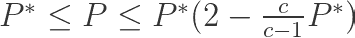
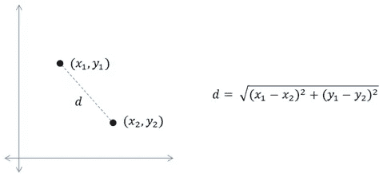
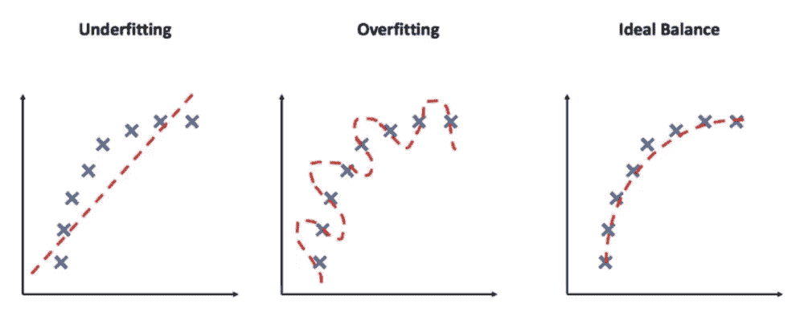
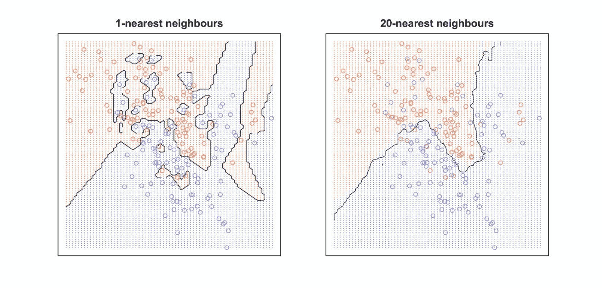
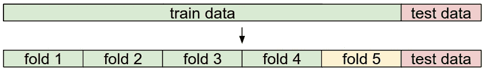

# 深入了解 K 近邻

> 原文：<https://pub.towardsai.net/deep-insights-into-k-nearest-neighbors-2c95c04728d9?source=collection_archive---------2----------------------->

## [机器学习](https://towardsai.net/p/category/machine-learning)

在 [Unsplash](https://unsplash.com/s/photos/two-owls?utm_source=unsplash&utm_medium=referral&utm_content=creditCopyText) 上由[zdenk macha ek](https://unsplash.com/@zmachacek?utm_source=unsplash&utm_medium=referral&utm_content=creditCopyText)拍摄的照片

# 介绍

k-最近邻(简称 KNNs)是一种健壮而简单的监督机器学习算法。虽然它的回归变量也存在，但我们只讨论它的分类形式。

KNN 是一个 ***无参*** *懒学*的算法。让我们来看看每个术语的含义—

*   **非参数**:与参数模型不同，非参数模型更加灵活。他们对参数的数量或假设的函数形式没有任何先入为主的概念。因此，它们将我们从任何关于数据分布的错误假设的麻烦中解救出来。例如，在线性回归(一种参数算法)中，我们已经有了一种假设形式，在训练阶段，我们会寻找其正确的系数值。
*   **懒惰学习**:又称*基于实例的*学习。这里，该算法不明确地学习模型，而是选择记忆训练集，以便在预测阶段使用。这导致快速训练阶段，但是昂贵的测试阶段，因为它需要存储和遍历整个数据集。

## 直觉方法

这种算法背后的基本思想是——***【物以类聚】，*** 即类似的事情发生在附近，想知道为什么这样的事情竟然成立？好吧，试着想象一个 D 维空间中的大量数据点。得出子空间将被密集填充的结论并没有错，这意味着两个相当接近的点更有可能具有相同的标签。事实上，这个算法存在一个严格的误差范围—

其中 P*是贝叶斯错误率，这是任何分类器的最低可能错误率，c 是类的数量，P 是我们算法的错误率。根据上面的等式，如果点的数量相当大，那么算法的错误率小于 Bayes 错误率的两倍。相当酷！不要误会我的意思。我说的大量数据点，不是指大量特征。相反，该算法特别容易受到**维度诅咒**的影响，这意味着维度(特征数量)的增加将导致积累固定数量的邻居所需的超空间体积的增加。而且随着体积的增大，邻居越来越不相似，因为他们之间的距离增大了。因此，具有相同标签的点的概率降低。在这些情况下，功能选择可能会派上用场。

# KNN 是做什么的？

KNN 算法获取测试输入，将其与每个单个训练样本进行比较，并将目标标签预测为 k 个最相似训练样本中最常出现的标签。两个数据点之间的相似性通常使用欧几里德距离来度量。

[来源](https://mccormickml.com/2013/08/15/the-gaussian-kernel/)

当 k = 1 时，目标标签被预测为最近的训练样本的标签。
因为我们存储并遍历每个测试示例的整个训练集，所以测试阶段在内存和时间方面都很昂贵。

# kNN 中的 k 是什么？

k 是超参数，其值控制学习过程。它是预测测试样本标签时考虑的邻居数量。

# k 的值对我们的分类器有影响吗？

在回答上述问题之前，让我们先了解一下过度拟合和欠拟合的含义。在监督学习中，我们希望建立一个从我们的训练集中学习的模型，并对看不见的数据做出合理准确的预测。我们模型的这种*学习到足够应用*的能力叫做泛化。直觉上，我们期望简单的模型能够更好地概括。复杂的模型[符合数据的特性，而不是总结潜在的生物学。](https://methodsblog.com/2012/04/23/simple-models-ftw/)它们可能在训练数据上表现准确，但通常不能概括测试数据。

而当模型过于简单，甚至在训练集上失败时，就会出现欠拟合。

[来源](https://mc.ai/overfitting-and-underfitting-bug-in-ml-models/)

让我们看看考虑一个最近的邻居和 20 个最近的邻居是什么样子的—

[来源](https://kevinzakka.github.io/2016/07/13/k-nearest-neighbor/)

从上图可以观察到，k = 1 导致了锯齿状的边界，而 k = 20 给了我们一个平滑的边界。
平滑的边界对应于简单的模型，而锯齿状的边界对应于复杂的模型。因此，如果我们保持 k 值较低，我们有过度拟合的风险，而如果我们保持 k 值较高，我们有欠拟合的风险。
因此，一个显而易见的解决方案是保持 k，使其既不太小也不太大。也许可以尝试用不同的 k 值进行评估，然后选择效果最好的。
好吧，这就是我们要做的，但是要巧妙一点。

# 超参数调谐的验证

如前所述，我们将尝试不同的 k 值，但不是在测试集上。直到最后一次才使用测试设备。以前使用它会给我们带来过度适应测试集的麻烦，因此无法对看不见的数据进行归纳。
解决这个问题的一种方法是保留训练集的一个子集，用于调整超参数。这个集合称为验证集。在训练集很小的情况下，一种更复杂的技术是交叉验证。这里我们将训练集分成 x 个组，比如 5 个。我们将使用其中的 4 个进行训练，一个进行验证。对于每次迭代，我们使用另一个组作为验证集。最后，平均性能用于计算 k 的最佳值。

[**来源**](https://cs231n.github.io/classification/#nn) **:** 给出一个训练和测试集。训练集被分成多个折叠(例如，这里是五个折叠)。折叠 1–4 成为训练集。一个折叠(例如，此处黄色的折叠五)被表示为验证折叠，并用于调整超参数。交叉验证更进了一步，它迭代选择哪个折叠是验证折叠，独立于 1-5。这将被称为 5 重交叉验证。最后，一旦模型被训练并且所有的最佳超参数被确定，模型在测试数据(红色)上被评估一次。

[来源](https://kevinzakka.github.io/2016/07/13/k-nearest-neighbor/)

在上图中，k = 7 导致最低的验证误差。

# KNNs 的优势

*   KNN 易于实现和理解。
*   不需要或只需要很少的培训时间。
*   它适用于多类数据集。
*   KNN 是非参数的，所以它可以很好地处理非常不寻常的数据，因为不需要关于函数形式的假设。

# KNNs 的缺点

*   它有一个计算昂贵的测试阶段。
*   KNN 饱受阶级分布不均衡之苦。更频繁的类倾向于支配投票过程。
*   KNN 也遭受了维数灾难。

我已经尝试对 K-最近邻算法给出了深入的见解。我希望一切都有意义。

感谢阅读！

# 参考资料:

 [## 用于视觉识别的 CS231n 卷积神经网络

### 斯坦福 CS231n 课程材料和笔记:视觉识别的卷积神经网络。

cs231n.github.io](https://cs231n.github.io/)  [## K 近邻(KNN)算法的详细介绍

### k 最近邻(从现在开始是 KNN)是一种非常容易理解但是非常有效的算法…

saravananthirumuruganathan.wordpress.com。](https://saravananthirumuruganathan.wordpress.com/2010/05/17/a-detailed-introduction-to-k-nearest-neighbor-knn-algorithm/)  [## Python 和 R 语言 K 近邻应用完全指南

### 这是一个深入的教程，旨在向您介绍一个简单而强大的分类算法，称为…

kevinzakka.github.io](https://kevinzakka.github.io/2016/07/13/k-nearest-neighbor/)