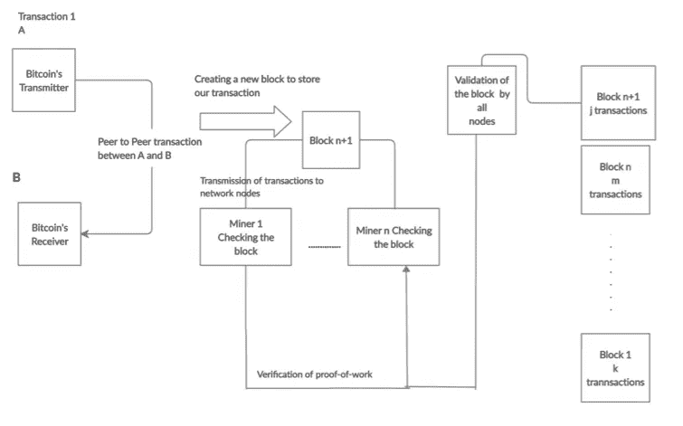

# 基于深度学习的比特币价格预测建模理论

> 原文：<https://pub.towardsai.net/deep-learning-26adbecfd8d0?source=collection_archive---------1----------------------->

## [深度学习](https://towardsai.net/p/category/machine-learning/deep-learning)

## 预测比特币的未来


比特币的预测。作者的照片

预测未来一直是一项艰巨的任务。预测未来的重要性已经在计算机科学和信息技术领域占据了首要地位。

自过去十年以来，开发几种算法并构建它们来预测未来事件已经受到了极大的关注。在这里，我使用了一种最新最先进的技术，即深度学习。这个项目的主要目的是展示一个经过训练的机器模型如何预测比特币等加密货币崛起的未来波动。它表明，如果我们提供适量的数据和足够的计算能力，一个经过训练的机器模型可以给出比特币等加密货币的价格。

我期望的输出是一个带有预测值的图表。最流行和最广泛使用的技术是那种可以帮助人类预测未来事件的技术解决方案。

在这里，我收集了以前各个比特币交易所的比特币价值。因此，随着大量数据的产生，我分离了这些值，并试图以图表的形式预测比特币的价格。

递归神经网络(RNN)用于这种深度学习方法。这可以通过使用几种机器学习技术和方法来实现。

[](/z-statistics-t-statistics-p-statistics-are-still-confusing-you-87557047e20a) [## Z-统计量，T-统计量，P-统计量还在迷惑你？

### 机器学习统计学中的定义和概念

pub.towardsai.net](/z-statistics-t-statistics-p-statistics-are-still-confusing-you-87557047e20a) 

## 简介:

当前的经济正在向数字世界转变。执行的每个交易都是以数字交易的形式进行的。印度正在走向无现金经济。因此，现在是以数字化形式进行所有交易的高峰期。通过把一切都变成数字格式，印度正在走向数字印度。加密货币是一种广泛使用的数字货币形式。最常用的加密货币非比特币莫属。加密货币的使用包括以下内容:

```
* Access to everyone
* No identity theft
* Globally accepted and recognized
* Decentralization
* Immediate Settlement
```

加密货币的兴起创造了世界的一大飞跃。由于上面列出的特征，它已经被全球接受。

## 比特币的工作原理:

下图描述了比特币的工作原理



比特币工作流程图。作者的照片

模块:

给定的项目分为四个模块:

```
(1) Dataset Collection and Storage
(2) Training the Network using Training Dataset
(3) Testing the Network using Testing Dataset
(4) Output Prediction
```

## 数据集收集和存储:

比特币时间序列数据是使用 REST API 调用从网站收集的。然后将收集的数据存储在数据框中。几个网站包含加密货币的交易值。

该网站帮助我们收集在预测过程中提供高精度的值。数据集包含从 2016 年到 2018 年的过去三年的价格。数据集包含诸如全球交易、日期、金额等属性。日期属性值增加十天，并提供一天中每 24 小时的比特币价格。然后，数据集存储在 CSV 文件中。

数据框将包含所需的所有列以及一些附加列。不相关或不能用于预测目的的额外属性应从收集的数据集中移除。

导出的 CSV 文件随后被调用到整个程序的不同部分，并再次过滤以获得相关数据。然后转换成. h5py 格式。然后，该数据集被用于项目的各个部分，如培训、测试和评估目的。

[](/neural-networks-the-rise-of-recurrent-neural-networks-df740252da88) [## 神经网络:递归神经网络的兴起

### 深度学习中的渐进一代

pub.towardsai.net](/neural-networks-the-rise-of-recurrent-neural-networks-df740252da88) 

## 使用训练数据集训练网络:

这里，我们使用递归神经网络(RNN ),因为它最适合序列数据。它能够记住每一层的权重，并将其输入到下一层。

给定测试数据和提供的训练数据的训练是通过使用在深度学习中起主要作用的神经网络的帮助来完成的。这里使用的神经网络是递归神经网络(RNN)。

为了提高预测准确度和精确度，请在更大的数据集上训练模型。选择此网络是因为它是广泛用于训练序列数据的神经网络之一。使用长短期记忆(LSTM ),因为它是 RNN 的记忆单元之一。

递归神经网络(RNN)是一种深度学习方法。RNN 最适合顺序数据。它是有效的，因为它能够记住每一层的权重，并将它们输入到下一层。这个类神经网路利用内部记忆体来储存每一列的资料序列，并在相邻的右上角储存格中储存下一个可预测的值。

输入被接收并通过三个门。它们是遗忘门、输入门和输出门。在每个门中，所有层都应用一个 sigmoid 函数，以确保输出介于 0 和 1 之间。因此，当我们将值输入到 RNN 的这一层时，我们将缩放以转换输入数据，这些数据将被重新整形以适应神经网络。

## 使用测试数据集测试神经网络:

测试包括以下操作模式:

㈠测试数据集:必须进行多次测试，以得出结论，即哪些数据集参数或属性以更高的效率给出了完美的结果。

(ii)调整指定的神经网络:进行这种调整是为了预测哪个输出更好。这是通过增加或减少神经网络的层数来实现的。通过增加或减少层数，然后进行比较，有助于检查哪一层的输出比神经网络中的其他层更有效

(三)递归神经网络的测试:主要有三层，即输入层、隐含层和输出层。

2 层方法:2 层方法后获得的最终结果不准确，因为预测值和原始值之间存在巨大差异。

3-分层方法:在用这一层进行测试后，它比以前的结果显示出一定的改进，并给出更准确的结果。

*   4 —分层方法:这种方法类似于卷积神经网络(CNN)。因此，考虑一种三层方法。

[](/understand-time-series-components-with-python-4bc3e2ba1189) [## 用 Python 理解时间序列组件

### 机器学习中预测模型的基本概念及实例

pub.towardsai.net](/understand-time-series-components-with-python-4bc3e2ba1189) [](/data-preprocessing-concepts-with-python-b93c63f14bb6) [## Python 中的数据预处理概念

### 一种为机器学习估值器准备数据的稳健方法

pub.towardsai.net](/data-preprocessing-concepts-with-python-b93c63f14bb6) 

## 输出预测:

Web 应用程序是在 Django 框架上设计的，有两个页面，一个用于 RNN，另一个用于 LSTM 网络。一旦新的权重被更新，预测的输出将是一个图表。输出预测涉及几个系列的过程，这些过程很复杂，因为这里涉及深度学习技术。深度学习策略主要用于进行复杂的预处理，这涉及到某些复杂算法的使用。

这个项目完成后的最终输出是一个描述比特币价格未来趋势的图表，这将是项目的最终结果。根据图表中涉及过去和未来预测价格的变化，比特币用户可以决定他们是否应该出售它。

## 项目设计和实施:

项目设计包括项目整体实施中涉及的过程。项目设计包括不同阶段:

**数据收集:**数据收集是项目设计的第一步。收集整体设计的数据，然后将其存储在数据框中。然后，从数据帧中提取收集的数据以备将来使用。这里考虑的属性有 ***日期、开盘价、最高价、最低价、收盘价、*和*成交量*** 。

在收集了所需的数据字段后，它将被传递到项目设计的下一个阶段。本项目使用的四个数据集分别是 *Bitcoin1D.csv* 、 *Bitcoin3D.csv* 、 *Ds2.csv* 和 *Dataset.csv* 。比特币 1D 数据集用于一维比特币价格预测。

该数据集包含用于预测的属性，例如价格上限、价格下限、价格收盘、价格开盘、日期和交易量。数据集包含 2016 年至 2018 年的历史时间序列数据。下一个数据集 Bitcoin3D.csv 是通过预处理和连接 Ds2 和数据集 csv 文件形成的。

它包含价格和影响价格估计波动的其他不同特征。它用于 RNN 多变量价格预测。

数据预处理:从数据框中收集的数据被保存起来，用于数据预处理。有两个与项目相关的数据集。在这里，不使用的列被删除并进行预处理。

预处理后，新属性是日期、公开、高、低、BTC、区块链、加密货币和 Iota。这些是连接两个数据集后的数据。拼接后，导出最终数据集。这是整个项目中使用的最终数据集。

递归神经网络(RNN):递归神经网络是一种深度学习方法，已经应用于我们的项目中。它也属于目前已知的一类人工神经网络。选择递归神经网络是因为它对于给出关于序列数据的信息非常有用。RNN 的另一个特点是，它有足够的能力记住每一层的权重，然后将它们输入回下一层。RNN 使用内存来存储顺序数据。有三个门在使用——输入门、输出门和遗忘门。这里，应用了被称为 sigmoid 函数的激活函数。

长短期记忆(LSTM):由于序列，预测是做 LSTM 是有效的解决办法。LSTM 是 RNN 的一个记忆细胞，它比其他细胞更精确。所以，LSTM 是最受欢迎的。

它有一个特殊的特征，那就是能长时间记住这些模式。因此，为了克服这一缺点，在递归神经网络中使用了 LSTM。

实现:这里，张量流在项目中被用作后端。Matplotlib 用于可视化最终预测图。比特币历史数据集包含 2016 年至 2018 年的 23977 条记录。使用的历元数是 10。Python 语言用于模型开发过程。anaconda navigator 中使用的 IDE 是 spyder，因为它为神经网络开发提供了库。

数据预处理:将比特币和谷歌数据集加载到两个临时框架中，并打印原始数据集。然后对未使用的列进行预处理。然后打印新的数据集，并连接成一个单独的数据集 bitcoin1D.csv，最后，它被导出到预测模块。

**1D 的 RNN:**在预处理阶段获得的数据集被加载到数据帧 df 中。接下来，日期列被转换为日期时间。那么重新索引过程就完成了。按数据列重新索引数据集已完成。使用 MinMaxScaler 对数据集执行归一化。

然后原始数据集被一分为二，即用于训练和测试目的，我们从它创建一个 1D 数据集。此处使用了长短期记忆(LSTM ),因此数据集应在 3D 中针对 LSTM 进行整形。建立了 LSTM 模型，这里使用线性激活函数来计算输出。

执行训练和测试，并且执行纪元直到基本值 10。计算每个时期的损失值。然后，LSTM 模型预测训练和测试数据集的价格。

然后，使用逆变换对预测值进行去归一化，以便绘图。这里使用的性能测量是 RMSE，它也是为预测的训练数据集计算的。基于时间戳，绘制出这些值。

最后，使用原始集、训练集和预测集可视化预测值。ylabel 表示时间，xlabel 表示收盘价。

**用于多变量的 RNN:**数据集 Bitcoin3D.csv 通过使用 pandas 的库被加载，并且列被分成组用于可视化。使用 MinMaxScaler 对数据集执行归一化。标准化的数据被转换用于监督学习。

在这个转换中，输入列被创建为 t-n，..，t-1。同样，预测列也被制作为 t，t+1，..t+n。然后将它聚合在一起，并打印出重新成帧的集合。然后对数据集进行拆分，对数据集进行测试和训练。训练集包含 16，782 条记录，验证集包含 7193 条记录。

然后，对 1D 执行与 RNN 相同的程序。此外，我们还显示了一个描述各时期及其损失值的图表。最终的预测是作为图形时间 v/s 收盘价获得的。


比特币预测。作者的照片

## 结论:

比特币价格预测始终是一个出于研究目的的课题。随着世界走向数字化，加密货币(主要是比特币)变得举足轻重。在这个项目中，我们试图使用深度学习方法来预测比特币价格的趋势。这项工作的重点是基于项目的学习，也可以用于研究人员和科学家在未来的进一步研究目的。预测未来有点困难，因为它涉及许多预测和程序。

我们现在生活的世界正在向数字化阶段转变。每个国家，甚至发达国家和发展中国家，都在向数字化阶段转型。随着印度迈向无现金经济，对加密货币和数字货币的需求将成为优先事项。

因此，印度现在正在为数字交易做准备，并让人们意识到数字交易的重要性。因此，应该让公民对这些数字货币的交易和处理有适当的认识，因为他们不太了解其中涉及的交易程序。在这里，我们使用历史比特币价格数据集开发了一个价格预测模型。

我们使用深度学习技术递归神经网络(RNN)进行模型开发。在 RNN，为了更准确，我们使用长短期记忆(LSTM)。获得一维多变量比特币价格的预测图作为最终输出。我们可以通过获取更大的数据集或增加神经元的数量来进一步改进这个项目。基于这两个数据集，对数据进行预处理。

这个项目可以在未来被研究人员和学生用于进一步的研究目的，并可以做进一步的修改。他们可以增加参数或属性的数量，增加数据集的大小，增加数据帧的数量，等等。

时期的数量也可以更多，以增加预测的准确性。这个项目可以被比特币交易者、美国自由主义者以及编程爱好者用来检查比特币价格是否波动。这些人可以根据项目产出的最终趋势来决定是否应该进行特定的比特币交易。

比特币的价格每分每秒都在变化，而且变化的频率是有规律的。研究爱好者可以利用这个项目进一步研究其他加密货币，如 Lite coin、Coinye、Dogecoin 等。这个项目将是计算机科学和技术领域的一个里程碑。

我希望你喜欢这篇文章。通过我的 [LinkedIn](https://www.linkedin.com/in/data-scientist-95040a1ab/) 和 [twitter](https://twitter.com/amitprius) 联系我。

# 推荐文章

[1。NLP —零到英雄与 Python](https://medium.com/towards-artificial-intelligence/nlp-zero-to-hero-with-python-2df6fcebff6e?sk=2231d868766e96b13d1e9d7db6064df1)
2。 [Python 数据结构数据类型和对象](https://medium.com/towards-artificial-intelligence/python-data-structures-data-types-and-objects-244d0a86c3cf?sk=42f4b462499f3fc3a160b21e2c94dba6)3 .[Python 中的异常处理概念](/exception-handling-concepts-in-python-4d5116decac3?source=friends_link&sk=a0ed49d9fdeaa67925eac34ecb55ea30)
4。[用 Python 进行主成分分析降维](/principal-component-analysis-in-dimensionality-reduction-with-python-1a613006d531?source=friends_link&sk=3ed0671fdc04ba395dd36478bcea8a55)
5。[用 Python 全面讲解 K-means 聚类](https://medium.com/towards-artificial-intelligence/fully-explained-k-means-clustering-with-python-e7caa573176a?source=friends_link&sk=9c5c613ceb10f2d203712634f3b6fb28)
6。[用 Python](https://medium.com/towards-artificial-intelligence/fully-explained-linear-regression-with-python-fe2b313f32f3?source=friends_link&sk=53c91a2a51347ec2d93f8222c0e06402)
7 全面讲解了线性回归。[用 Python](https://medium.com/towards-artificial-intelligence/fully-explained-logistic-regression-with-python-f4a16413ddcd?source=friends_link&sk=528181f15a44e48ea38fdd9579241a78)
充分解释了 Logistic 回归 8。 [Nengo:一种新的神经网络构建和部署工具](/nengo-a-new-neural-network-building-and-deployment-tool-66677c65fa19?source=friends_link&sk=6f6d2495d486dda2acb28f2d2bf7dd77)
9。[与 Python 的数据角力—第一部分](/data-wrangling-with-python-part-1-969e3cc81d69?source=friends_link&sk=9c3649cf20f31a5c9ead51c50c89ba0b)
10。[机器学习中的混淆矩阵](https://medium.com/analytics-vidhya/confusion-matrix-in-machine-learning-91b6e2b3f9af?source=friends_link&sk=11c6531da0bab7b504d518d02746d4cc)