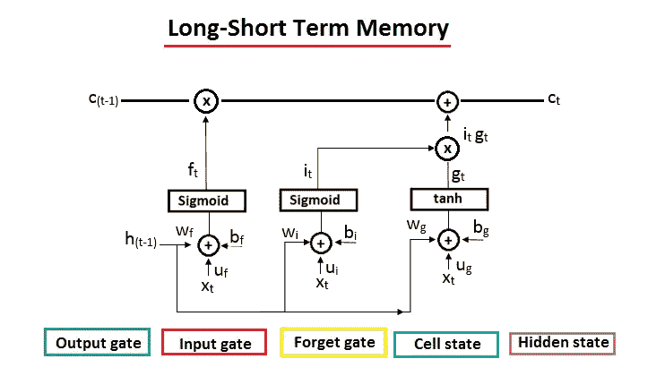
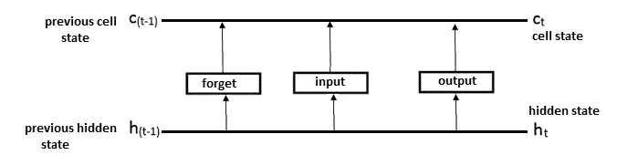
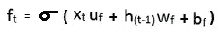
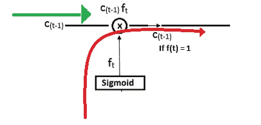
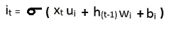
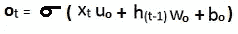
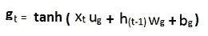
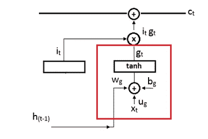

# 为什么 LSTM 在深度学习方面比 RNN 更有用？

> 原文：<https://pub.towardsai.net/deep-learning-88e218b74a14?source=collection_archive---------0----------------------->

## [深度学习](https://towardsai.net/p/category/machine-learning/deep-learning)

## 深度神经网络中的记忆存储容量方法



LSTM 模型。作者的照片

> **简介 **

本文是上一篇关于递归神经网络文章的续篇。LSTM 模型克服了递归神经网络对前一状态的记忆存储的问题，并基于它来决定预测。这意味着梯度消失的问题，由此我们不能适当地训练网络，这导致递归神经网络不能在存储器中保留长期序列。

LSTM 的特别之处在于它实现了长期依赖，并且它处理信息以保存和丢弃设备。所有这些条件都是借助三个门完成的，即 ***输出门、输入门和*** 。

递归神经网络和长短期记忆的区别在于，RNN 有一个 ***隐藏状态*** 来存储信息和进行预测。另一方面，LSTM 将 ***隐藏状态*** 分解成**单元状态**和**隐藏状态**。

```
1\. The **cell state** is an internal memory to store all the
   information. 
2\. The **hidden state** is used for operations for the output.
```

LSTM 的基本架构如下所示:



基本 LSTM。作者的照片

基本架构由*前单元状态*、*单元状态*、*前隐藏状态*和*隐藏状态*组成。下标是 *t* 和 *(t-1)* 当时所处的状态。

f **遗忘门、输入门和输出门**正在调制输入信号。这些门正在修改存储在 ***先前单元状态*** 中的信息，其中一些操作如在 ***单元状态*** 中那样修改结果。输出门将存储在 ***单元状态*** 中的信息传输到输出状态 y(t)。

[](/neural-networks-the-rise-of-recurrent-neural-networks-df740252da88) [## 神经网络:递归神经网络的兴起

### 深度学习中的渐进一代

pub.towardsai.net](/neural-networks-the-rise-of-recurrent-neural-networks-df740252da88) 

> ***这些门的工作***

## 忘记大门

这个门负责决定应该从单元状态中移除什么信息。

例如:

```
**Indian** is a beautiful country. I live in India. 
**Norway** is also a beautiful country.
```

在第一句中，印度是一个主语，但当我们谈到挪威时，这就成了主语。在 LSTM，忘记门被识别，主题被改变为挪威，并删除印度作为主题。这种类型的智能行为是在遗忘门的帮助下完成的。



我们可以看到遗忘门的公式，它是输入信号和先前隐藏状态的函数，乘以权重矩阵 u(f)、w(f)和 b(f)。所有这些单元都由 sigmoid 函数 sigma 调制。“忽略门”中的值在“0”到“1”的范围内，即值为“0”的信息将被删除，值为“1”的信息将被保留。



遗忘之门的运作。作者的照片

## 输入门

这个门负责决定应该在单元状态中存储什么信息。

例如:

```
**Indian** is a beautiful country. I live in India. 
**Norway** is also a beautiful country.
```

在上面的例子中，forget 被用来删除哪些信息，并选择新的主题“挪威”。现在输入门的工作是把这个新课题储存到细胞状态 c(t-1)中。



输入数据的公式如下所示，它是输入信号和先前隐藏状态与权重矩阵 u(i)、w(i)和 b(i)相乘的函数。所有这些单元都由 sigmoid 函数 sigma 调制。输入门的值在“0”到“1”的范围内，即不存储值为“0”的信息，而存储/更新值为“1”的信息。

[](/understand-tensorflow-basic-with-python-87281e737db9) [## 使用 Python 了解 TensorFlow Basic

### 张量流中使用的基本术语

pub.towardsai.net](/understand-tensorflow-basic-with-python-87281e737db9) 

## 输出门

这个门负责从单元状态 c(t-1)中选择哪些信息作为输出 y。

例如:

```
**Indian** is a beautiful country. I live in India. 
**Norway** is also a beautiful country. You must visit the capital of .........
```

在上面的例子中，输出已经使用了处于隐藏状态的信息是否会被传递。输出门将决定填空的主题，即挪威。



输出数据的公式如下所示，它是输入信号和先前隐藏状态的函数，乘以权重矩阵 u(0)、w(0)和 b(0)。所有这些单元都由 sigmoid 函数 sigma 调制。输入门中的值在“0”到“1”的范围内，即值为“0”的信息不会将隐藏状态传递到输出，而值为“1”的信息会将隐藏状态传递到输出。

## 候选州

该状态负责添加新信息或更新单元状态。



这种状态的公式如下所示:

上面的公式现在有了参数化函数“ *tan 双曲线”。*



LSTM 的候选州。作者的照片

状态用于保存由 i(t)和乘法运算符控制的信息。如果 i(t)的值是“0 ”,则没有信息将传递到单元状态，并且 i(t)的值是“1 ”,则 g(t)信息将添加到单元状态线。

[](/step-by-step-basic-understanding-of-neural-networks-with-keras-in-python-94f4afd026e5) [## 使用 Python 中的 Keras 逐步基本了解神经网络

### 具有定义的神经网络的学习

pub.towardsai.net](/step-by-step-basic-understanding-of-neural-networks-with-keras-in-python-94f4afd026e5) 

> ***结论:***

这是深度学习中 LSTM 算法工作流程背后的基本思想。来自门和候选状态的信息流改变了单元状态输出 c(t)。

我希望你喜欢这篇文章。通过我的 [LinkedIn](https://www.linkedin.com/in/data-scientist-95040a1ab/) 和 [twitter](https://twitter.com/amitprius) 联系我。

# 推荐文章

[1。NLP —零到英雄用 Python](https://medium.com/towards-artificial-intelligence/nlp-zero-to-hero-with-python-2df6fcebff6e?sk=2231d868766e96b13d1e9d7db6064df1)
2。 [Python 数据结构数据类型和对象](https://medium.com/towards-artificial-intelligence/python-data-structures-data-types-and-objects-244d0a86c3cf?sk=42f4b462499f3fc3a160b21e2c94dba6)
3。[Python 中的异常处理概念](/exception-handling-concepts-in-python-4d5116decac3?source=friends_link&sk=a0ed49d9fdeaa67925eac34ecb55ea30)
4。[用 Python 进行主成分分析降维](/principal-component-analysis-in-dimensionality-reduction-with-python-1a613006d531?source=friends_link&sk=3ed0671fdc04ba395dd36478bcea8a55)
5。[用 Python 全面讲解 K-means 聚类](https://medium.com/towards-artificial-intelligence/fully-explained-k-means-clustering-with-python-e7caa573176a?source=friends_link&sk=9c5c613ceb10f2d203712634f3b6fb28)
6。[用 Python 充分解释了线性回归](https://medium.com/towards-artificial-intelligence/fully-explained-linear-regression-with-python-fe2b313f32f3?source=friends_link&sk=53c91a2a51347ec2d93f8222c0e06402)
7。[用 Python](https://medium.com/towards-artificial-intelligence/fully-explained-logistic-regression-with-python-f4a16413ddcd?source=friends_link&sk=528181f15a44e48ea38fdd9579241a78)
充分解释了 Logistic 回归 8。[concat()、merge()和 join()与 Python](/differences-between-concat-merge-and-join-with-python-1a6541abc08d?source=friends_link&sk=3b37b694fb90db16275059ea752fc16a)
9 的区别。[与 Python 的数据角力—第一部分](/data-wrangling-with-python-part-1-969e3cc81d69?source=friends_link&sk=9c3649cf20f31a5c9ead51c50c89ba0b)10。[机器学习中的混淆矩阵](https://medium.com/analytics-vidhya/confusion-matrix-in-machine-learning-91b6e2b3f9af?source=friends_link&sk=11c6531da0bab7b504d518d02746d4cc)