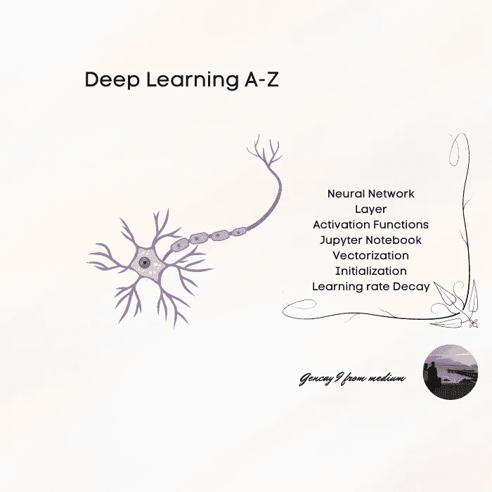
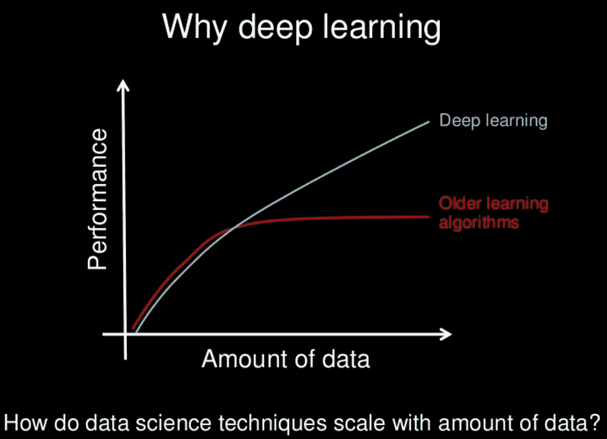
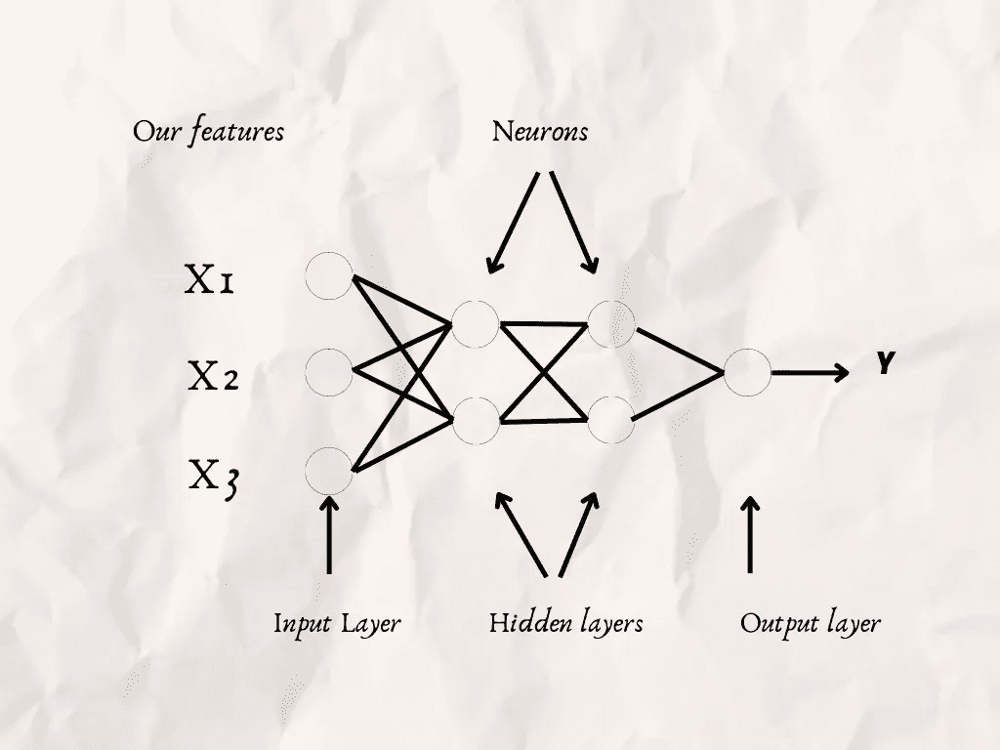
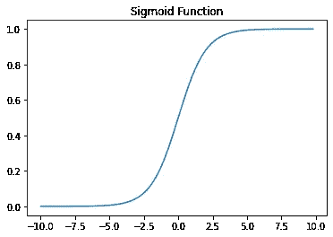
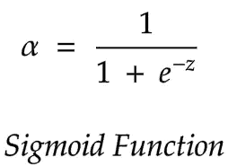
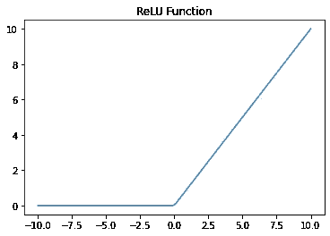
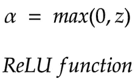
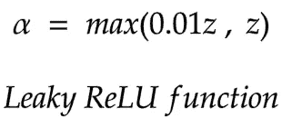
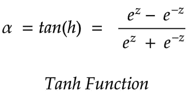
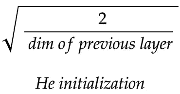

# 深度学习 A-Z 简要说明

> 原文：<https://pub.towardsai.net/deep-learning-a-z-briefly-explained-9026028f1281?source=collection_archive---------1----------------------->

## 提神和快速回忆



作者图片

# 介绍

深度学习主要由机器学习的子集来解释。

你已经知道机器学习的一切了，何必呢？

下面是 Andrew NG 用下图解释的原因，是机器学习和深度学习的 ***Yoda*** 。(说尤达——我指的是大师)。

如果你正处于学习之旅的开始，这里有 Andrew 关于[机器学习](https://www.coursera.org/specializations/machine-learning-introduction)和[深度学习的课程。](https://www.coursera.org/specializations/deep-learning)

我可以很容易地说，由于我的经验，这些课程真的是顶轻推。

现在我们来看看，为什么要深度学习？



幻灯片作者[吴恩达](http://www.slideshare.net/ExtractConf)，版权所有。

当然，也可能有其他原因，但我认为这是最有力的原因。

现在我来简单解释一下 ***深度学习术语。***

阅读本文大约 6 分钟后，您将熟悉深度学习术语。

由于 ***那一次*** ，要么你可以为深度学习规划你的学习时间表，在学习深度学习的时候感觉很舒服，因为你已经有了事先的介绍。

如果你已经知道深度学习，但你觉得你必须重复才能感觉更好，那篇文章也会为你服务。

> "重复是技能之母。"
> 
> 托尼·罗宾斯

任何人都知道，如果你想擅长某件事，你应该坚持不懈。

> 只有那些坚持不懈并愿意深入研究事物的人，才能完成大师级的作品。
> 
> 保罗·柯艾略

如果你觉得有动力，让我们开始吧。

[参考](https://giphy.com/gifs/reaction-SiKqNZqksVYWmQEMjd)

```
**Table Of Content**· [**Introduction**](#3c48)
· [Neural Network](#8a83)
· [Layer](#89b0)
  ∘ [Output Layer](#39db)
  ∘ [Input Layer](#96d3)
  ∘ [Hidden Layer](#c465)
· [Activation Functions](#0304)
  ∘ [Sigmoid Activation Function](#0a60)
  ∘ [Graph](#5b6c)
  ∘ [Function](#3635)
  ∘ [ReLU Activation Function](#d4a5)
  ∘ [Leaky ReLU Activation Function](#ec3c)
  ∘ [Tanh Activation Function](#6b08)
· [Vectorization](#64c6)
· [Forward Propagation](#0dad)
· [Back Propagation](#821a)
· [Train Set](#ad49)
· [Dev Set](#5838)
· [Test Set](#d6f7)
· [Initialization](#1848)
  ∘ [Random Initialization](#220e)
  ∘ [He Initialization — Xavier Initialization](#e1d6)
· [Bias and Variance](#f23a)
· [Regularization](#7191)
· [Normalization](#0cd0)
· [Gradient Descent](#58c2)
  ∘ [Mini batch Gradient Descent](#6ba2)
  ∘ [Stochastic Gradient Descent](#4289)
  ∘ [Batch Gradient Descent](#acbb)
· [Learning rate Decay](#d883)
  ∘ [Human-Level Performance](#a213)
· [Transfer Learning](#f8bb)
· [Multi-task Learning](#0b56)
· [Tensorflow](#bca0)
· [**Conclusion**](#5a99) 
```

# 神经网络

在每个神经元中，构建神经元与下一层神经元紧密相连，在每个神经元中，计算不同的函数，然后使用其他网络计算来找到下一层的参数，然后再次这样做，直到到达最后一层，您将使用激活函数来进行预测。

# 层

它包含许多神经元。

## 输出层

在最后一层，从这里开始，您将使用激活函数来计算结果。

## 输入层

你的特征。

## 隐蔽层

在输入层和输出层之间。



在坎瓦普罗设计

# 激活功能

该函数在输出图层中用于计算 y。

## Sigmoid 激活函数

## 图表



作者图片

## 功能



作者图片

## ReLU 激活功能

Z > 0，函数的导数将= 1

Z < 0，导数= 0。



作者图片



作者图片

## 泄漏 ReLU 激活功能

当 x < 0, y will be a really little number to

*(实际中用得不多)*



作者图片

## Tanh 激活函数

这个函数图就像一个 sigmoid 函数图。然而，不同的是 Y 将是-(1，1)，这意味着你的数据的平均值是零。

该函数比隐藏层中的 sigmoid 激活函数使用得更多。



作者图片

# …向量化…

不要使用循环，而是使用 NumPy 特性来提高算法速度。

# 正向传播

包含从输入层到输出层的计算，用于将来反向传播的计算。

# 反向传播

保存转发传播的结果。

并用它们来计算梯度。

设置您的超参数，并根据您参数的导数相应地更新您的参数。

# 列车组

它用于拟合您的参数。

# 开发集

另一个名称是保留交叉验证集。

这个数据集用来调整你的超参数。

# 测试装置

用于评估模型的性能。

# 初始化

设置我们参数的第一个值是很重要的，因为我们的参数将根据梯度的结果而改变，并且这些初始值将定义我们梯度下降算法的速度。

## 随机初始化

参数是随机分配的。

## He 初始化— Xavier 初始化

随机分配的参数乘以；



# 偏差和方差

高偏差-

*   装配不足
*   你的算法不是成功的训练集和开发集。

高方差

*   过度拟合
*   你的算法在训练集中是成功的，但在开发集中是失败的。

# 正规化

通过添加额外值来避免过度拟合的技术。

# 正常化

更改要素的比例以提高之后的梯度下降速度。

# 梯度下降

该算法用于通过计算导数和更新参数来降低成本函数。

该算法有 3 个不同的选项，根据数据的长度和算法速度而有所不同。

## 小批量梯度下降

选择“m”长度的小批量并应用梯度下降。

## 随机梯度下降

你的小批量= 1

## 批量梯度下降

你的小批量=你的数据集长度。

# 学习率衰减

以计算梯度下降的方式减小学习速率，以找到合适的局部最小值。

## 人类水平的性能

设置人类级别的性能，超越你的深度学习算法。
大多设定为最佳人类表演。
例如，如果下面陈述的三个人类表演；

*   % 0.5 错误
*   % 2 错误
*   % 1.5 错误。
    那么应该是选人类级性能为 0.5。
    你得到了逻辑。

# 迁移学习

你从你的深度学习网络中学到一些东西，比如，物体检测。
如果您没有足够的数据来检测肿瘤，例如，您将使用第一个示例的几个层，并更改后面的层和/或激活函数来分析您的 X 射线结果。

# 多任务学习

由于你的深度学习网络，你将计算不止一个级别。

例如，通过学习行人运动和阅读停车标志来预测自动驾驶汽车的运动。

# 张量流

流行的 Python 机器学习 Google 开发的深度学习库。

# 结论

现在你已经熟悉了很多深度学习的术语。

读完那篇文章后，如果你觉得你可能想了解更多，试着搜索类似的文章，如果你的学习冲动没有停止，我强烈推荐我在简介中添加链接的 Andrew NG 的一门课程。

当然，你可能没有关于机器学习或其基础的先验知识。

你可以看看那篇关于[机器学习](/machine-learning-a-z-briefly-explained-4ff86bd81e3a)、[统计](/statistics-for-machine-learning-a-z-66a82fbf2622)、[线性代数](https://medium.datadriveninvestor.com/linear-algebra-a-z-for-machine-learning-68dadcd0b757)、[分类](https://medium.com/mlearning-ai/classification-a-z-briefly-explained-25ca811ab4e4)、[和回归](/regression-a-z-briefly-explained-618e5d5c89f8)的结构相同的文章。

如果你的反应是积极的，我将继续写这篇文章的第二部分。

感谢您到目前为止阅读我的文章。

***如果你也想在将来收到关于那类文章的电子邮件，并阅读&下载免费备忘单，请在此订阅我的电子邮件列表*** [***。***](https://gencay.ck.page/)

一般来说，我尽量每周发两封电子邮件。

***如果你还不是 Medium 的一员，渴望通过阅读来学习，这里是我推荐的*** [***链接。*T32**](https://medium.com/@geencay/membership)

> “机器学习是人类需要创造的最后一项发明。”
> 
> 尼克·博斯特伦