# 分析灾害卫星图像

> 原文：<https://pub.towardsai.net/deep-learning-a692669f6f42?source=collection_archive---------2----------------------->

## [深度学习](https://towardsai.net/p/category/machine-learning/deep-learning)

从预处理大型图像数据集到托管深度神经网络

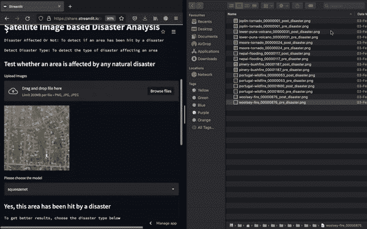

显示最终功能的 Gif。详细视频[这里](https://vimeo.com/673874500)

**项目概述:**建立深度神经网络模型，可以分析卫星图像的灾难。(这是作为 [AWS 灾难响应黑客马拉松](https://devpost.com/software/disaster-analysis-on-satellite-images)的一部分建立的)

*   给定一张卫星图片，检测它是否遭到了灾难的袭击(这将是本文的重点)。
*   通过为每种灾害类型创建单独的模型来提高检测效率
*   给定受灾区域的图像，让深度神经网络计算出蹂躏该地区的灾害类型。

**涵盖的主题:**我们将在这篇文章中涵盖很多内容，包括

1.  下载和预处理数据
2.  将数据整理到训练和测试中，以便 PyTorch 数据加载器可以使用它
3.  利用预先训练的神经网络从数据中学习
4.  通过 streamlit 应用程序公开模型，以便可以在任何地方使用它们

**使用的数据集:**xfiew 2 tier 3 数据集，包含以下内容

*   1756 张遭受火灾前后的照片
*   3690 张森林大火前后的照片
*   3738 张遭受野火袭击前后的照片
*   582 张火山爆发前后的照片
*   1238 张遭受洪水袭击前后的照片
*   1438 张遭受龙卷风袭击前后的照片
*   296 张受海啸袭击前后的照片

数据来源:[https://www . ka ggle . com/tunguz/xview 2-challenge-dataset-tier-3-data](https://www.kaggle.com/tunguz/xview2-challenge-dataset-tier-3-data)

下面是一些下载图片的例子。右边的图像是灾难前的，右边的是灾难后的同一地区。

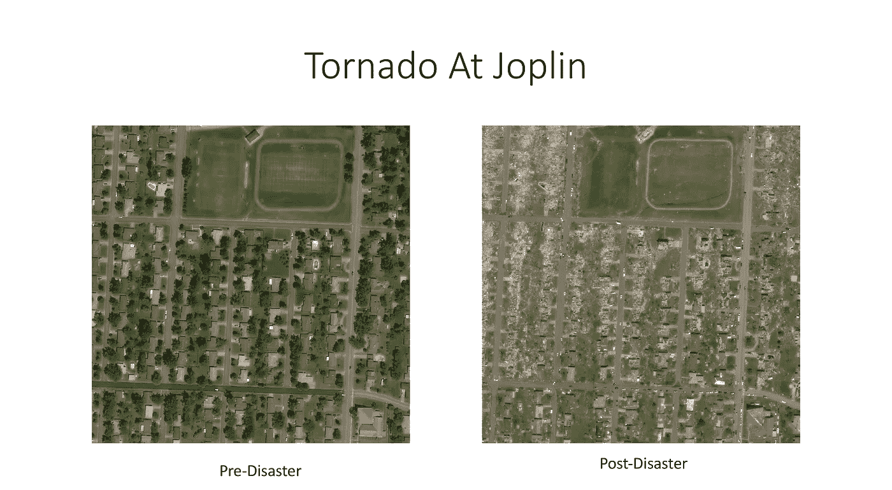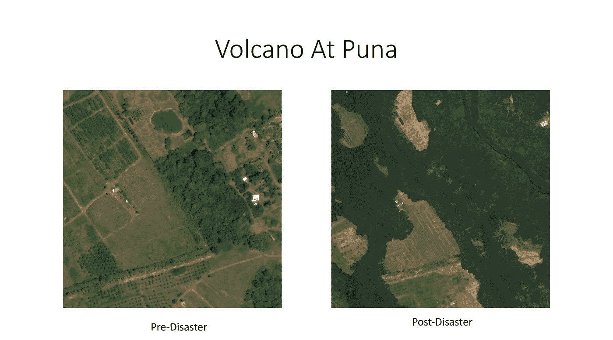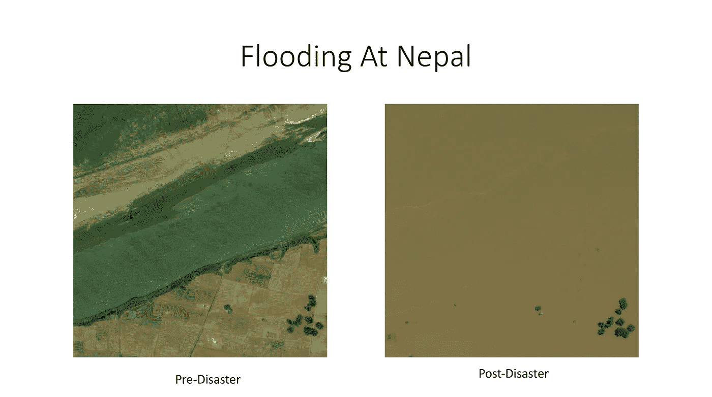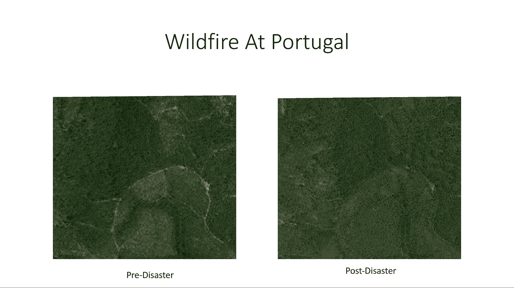

你可能已经理解了，数据是成对的。每个地区都有灾前形象和灾后形象。灾难发生前后的图像有明显的不同，我们希望神经网络能够学习这一点。

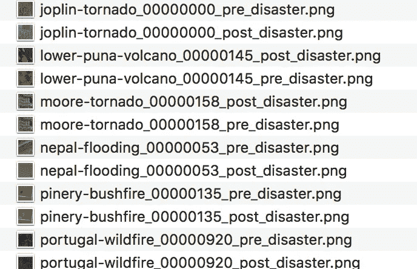

每次灾难的前映像和后映像

让我们先处理数据。

## 1.下载数据

数据可以从[https://www . ka ggle . com/tunguz/xview 2-challenge-dataset-tier-3-data 获取？select=tier3](https://www.kaggle.com/tunguz/xview2-challenge-dataset-tier-3-data?select=tier3) 。数据大小约为 19 GB，下载需要一段时间，这取决于带宽。

## 2.数据处理

一旦数据进入你的系统，你解压它，它看起来像这样

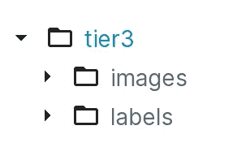

我们对大约有 12738 张图片的图片文件夹感兴趣。它是一个偶数，因为我们对每种类型都有一个前像和后像。

**PyTorch 需求**

为了能够加载供 PyTorch 使用的数据，我们需要以特定的方式提供数据。数据需要被分发到测试和训练文件夹中。在它们中的每一个内部，数据都必须基于类标签再次重新分布。

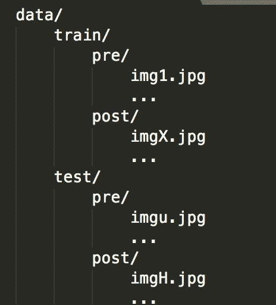

PyTorch 的理想格式

比方说，我们希望保留 25%的数据用于测试。相应地，数据应该被划分到文件夹中。还有，最好给出一个数字类标签，而不是 pre 和 post。让我们将 pre 标记为 0，post 标记为 1。文件夹结构如下所示。

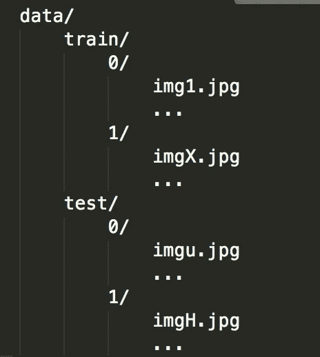

数字类别标签

## 排列图像的代码

将代码放在正确的位置很重要，这样它就可以访问图像文件。

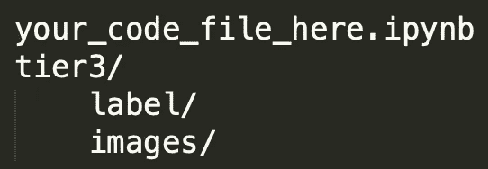

代码文件应与 tier3 文件夹处于同一级别

导入库并绘制一些图像

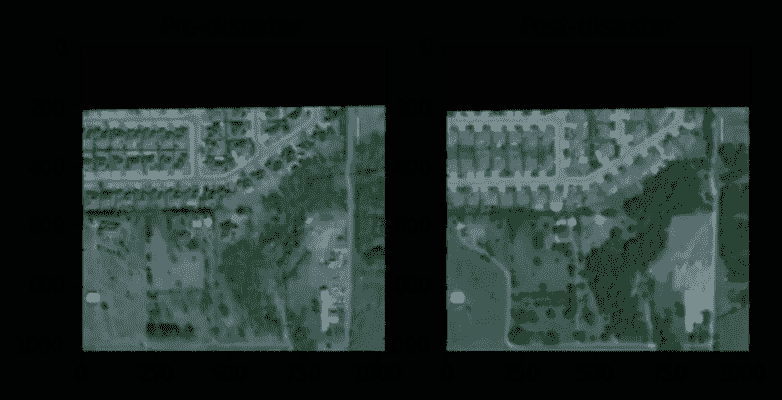

图像样本

将文件分类成两个列表——事前和事后

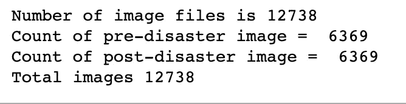

输出

上面的代码将文件分类到包含灾前和灾后映像的两个列表中。现在让我们把它们分成训练集和测试集。

将数据分为训练和测试的代码

我们获取前列表和后列表中的文件名列表，并将它们分别划分为 pre_train、pre_test 和 post_train 以及 post_test。我们使用了随机的。示例函数首先将文件挑选出来放入测试文件夹。剩下的文件我们已经放入了 train 文件夹。有其他方法可以做到这一点，但这一点很好。现在我们有了 4 个列表，pre_train、pre_test、post_train 和 post_test，我们需要将文件物理复制到指定的文件夹中。让我们先创建文件夹。

创建不同文件夹所需的代码

一旦执行了上面的代码片段，就应该创建了必要的文件夹。它应该如下所示

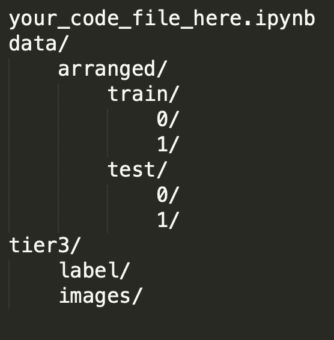

存储图像的新文件夹

复制测试和训练图像

随着上述代码的执行，数据准备好由 PyTorch 处理。

## 用于处理数据的 PyTorch 实现

您可以在同一文件夹中打开一个新的 jupyter 笔记本来处理数据和创建模型。

导入库

将数据加载到 dataloaders_dict

上面的代码将数据加载到字典“dataloaders_dict”中。字典包含两个关键字，“测试”和“训练”。字典 dataloaders_dict["train"]包含用于训练数据的数据加载器，而 dataloaders_dict["test"]包含用于测试数据的数据加载器。

## 使用预先训练的 PyTorch 模型

我们将使用火炬视觉图书馆的预训练模型。让我们设置一些函数来获取模型。

模型初始化

上面的代码包含两个函数，使我们能够创建带有预训练权重的模型。我们使用下面的函数来训练模型。

训练模型的函数

上述函数用于在初始化后训练模型。由于我们已经处理了数据并将其加载到内存中，现在让我们开始训练。确保在运行代码的笔记本所在的同一层有一个名为“models”的文件夹。

上面这段代码按照变量 num_epochs 中提到的时期数来训练模型。最终的模型也保存在磁盘中的文件夹 models 中，名称为“squeezenet_20_pre_vs_post.pt”。如果更改模型的名称或历元数，具有不同名称的模型会保存在同一文件夹中。

## 测试模型

一旦模型被训练好，我们可以如下测试模型。

测试模型

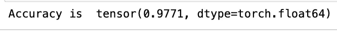

使用 squeezenet 在 10 个时期达到 97.7 %的准确度

**对单个图像的测试**

如果我们想将模型作为服务公开，它需要能够对单个图像进行预测。让我们看一下帮助我们做到这一点的代码。下面的代码是上一节的延续。

允许模型预测单个图像的代码片段

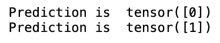

输出:0 表示灾前图像，1 表示灾后图像

上面的代码允许在单个图像上执行模型。当您想要将您的模型发布到云中的某个地方时，这一点非常重要。您希望用户将单个图像上传到服务器。然后，该模型在单个图像上运行并给出预测。因此，这段代码片段是至关重要的，当我们通过 streamlit 应用程序为模型提供服务时，它将被重用。

## 作为 Streamlit 应用程序托管(本地，然后在云中)

> Streamlit 到机器学习 web 应用程序就像媒体到博客一样。

它允许我们只使用 Python 代码在 web 上托管机器学习应用程序。让我们看看如何使用我们刚刚创建的模型来设置一个 streamlit 应用程序。在 [youtube](https://www.youtube.com/watch?v=-IM3531b1XU) 上为 [Misra Turp](https://www.linkedin.com/in/misraturp) 简单直接的 streamlit 教程大声喊出来。

**先决条件**

你将需要

*   github 的一个账户
*   一个简化的账户

仅此而已。

**文件夹结构**

Streamlit 现在可以支持单页和多页应用程序。虽然我们在这个应用程序中只有一个页面，但我将使用多页面格式，以便您可以在以后的基础上添加更多功能。最初，这是您的项目所包含的内容。

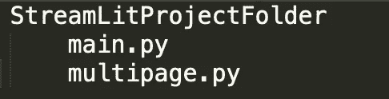

从两个文件 main 和 multipage 开始

main.py 文件是添加页面、封面图像和标题等的控制器文件。multipage.py 是一个标准的 streamlit 框架，使我们能够添加页面。multipage.py 的代码如下，这是一段标准的代码，你只需要写一次就可以忘记了。

multipage.py 礼貌简化讨论

接下来，我们看一下 main.py 文件。首先，我们需要一个带有标题和一些文本的页面。

启动 streamlit 应用程序

为了运行应用程序，在终端，确保你运行`pip install streamlit`或者按照这里的指示[。接下来，执行](https://docs.streamlit.io/library/get-started/installation)

`streamlit run main.py`

这将在您的浏览器中打开应用程序，您应该能够看到如下内容:

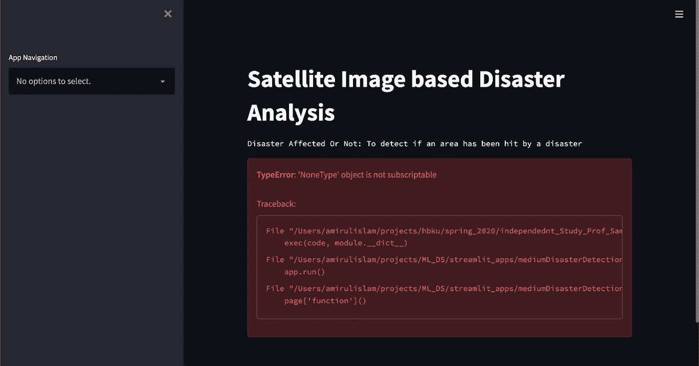

应用程序运行出错。

我们一会儿将回到错误，但在此之前，让我们快速添加一个封面图像。

选择任意一张免费图片，我选择了 Unsplash 的[这张](https://unsplash.com/photos/rxlx9Yi0298)。下载并将其保存在与代码 main.py 相同的级别。为图像命名为—cover.jpg

您的文件夹结构现在看起来像这样。

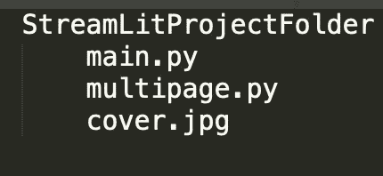

添加了封面图片

下面是添加封面图片的修改代码。

第 12–14 行添加了封面图像

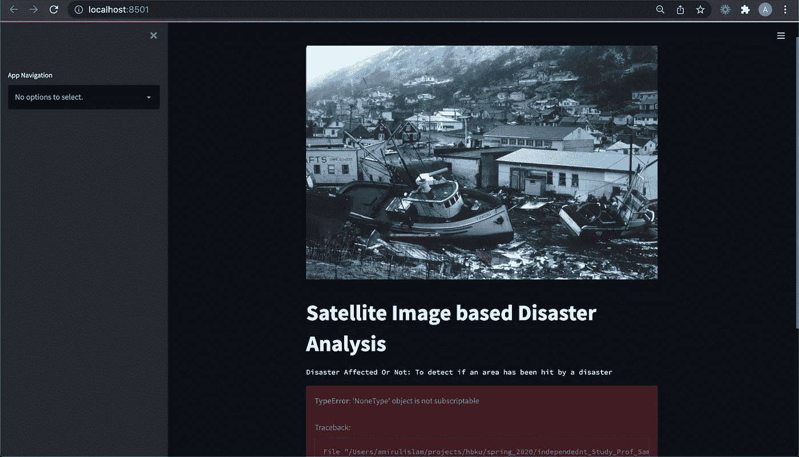

带有封面图像的页面

现在让我们来处理这个错误。我们已经将这个 streamlit 应用程序初始化为多页面应用程序，但是我们没有向它添加任何页面。这就是为什么我们会得到这个错误。然后，让我们向应用程序添加一个页面。

**向 streamlit 应用添加页面**

向 streamlit 应用程序添加页面的过程非常简单。添加一个名为 pages 的文件夹，然后在该文件夹中添加一个 python 文件。

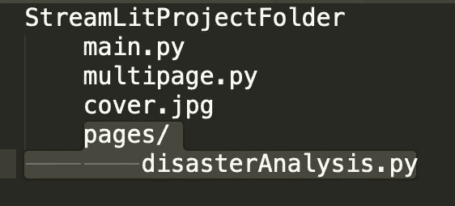

添加了一个名为 pages 的新文件夹，并向该文件夹添加了一个名为 disasterAnalysis.py 的文件

新文件 disasterAnalysis.py 将包含显示卫星图像的代码，为用户提供上传选项，以便他们可以拖放自己选择的图像，并最终使用该模型预测灾难状态——图像是灾前还是灾后图像。让我们一步一步来。让我们把

*   新 disasterAnalysis.py 文件中的占位符文本
*   将新的 disasterAnalysis.py 文件合并到 main.py 文件中

这是第一步(修改 disasterAnalysis.py 文件) :

向 disasterAnalysis.py 文件添加了占位符文本

现在来更改 main.py 文件

用代码修改了 main.py 文件，以合并新的页面/文件— disasterAnalysis.py

第一个添加是第 9 行，我们在那里导入 disasterAnalysis.py 文件。接下来，在第 21 行，我们将 disasterAnalysis.app 添加到主应用程序中。这消除了错误，一旦你用`streamlit run app.py` 运行，你会看到下面的页面。

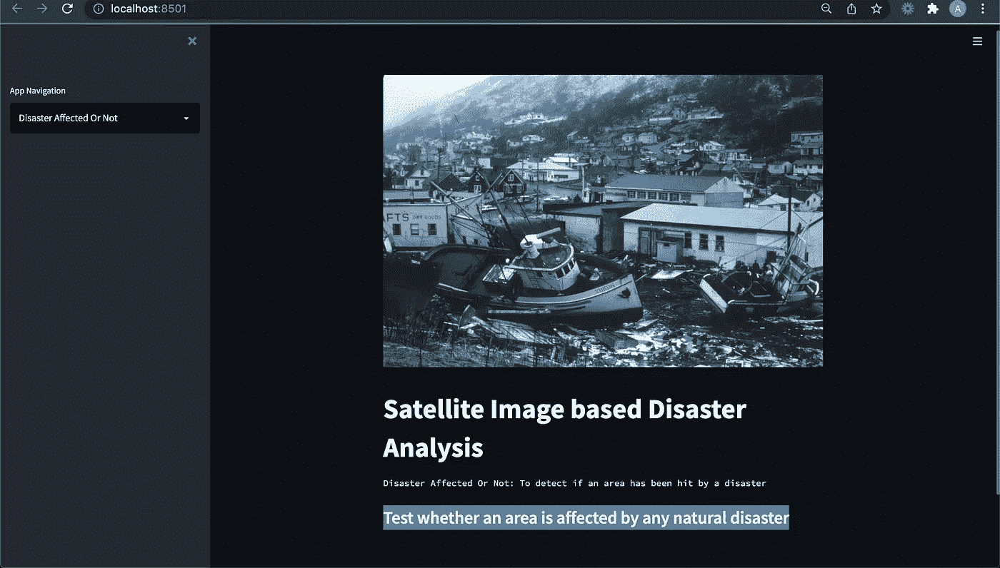

突出显示的部分来自新页面

您构建的所有页面的图像和标题都是固定的。突出显示的部分反映了新页面 disasterAnalysis.py 的内容

现在让我们添加代码的最后几位。首先，我们保存一个代码可以阅读和分类的静态图像。稍后，用户上传的图像将替换这个静态图像。

## 添加一个单独的 python 实用程序文件来处理图像和模型

添加一个名为 lib 的新文件夹，在其中创建一个名为 common.py 的新文件。

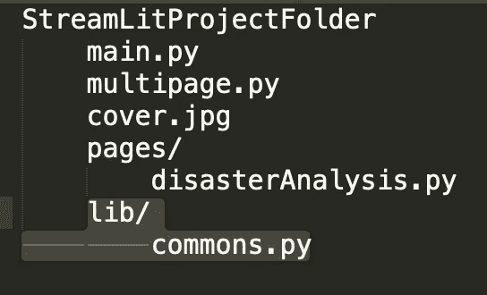

突出显示了新文件夹和 python 文件。

下面是 commons.py 文件的内容。这段代码重复了我们之前在训练和测试模型时使用的代码。它仍然保存在这里等待完工。

commons.py 文件中的功能

commons.py 文件是一个实用程序文件，将在 disasterAnalysis.py 文件中使用。

**对静态图像进行分类的代码**

创建一个名为 data 的文件夹，并将测试或训练集中的任何图像文件放入其中。

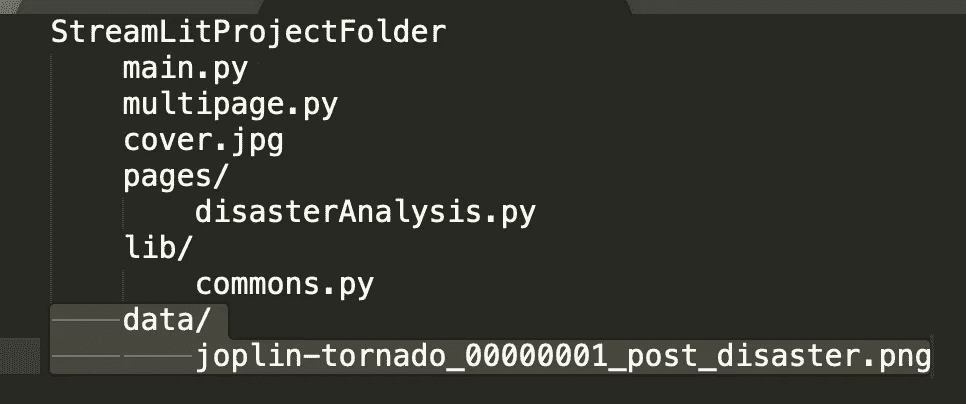

高亮显示包含图像文件的新文件夹

这是将对其执行初始分类的静态图像文件。现在让我们向 **disasterAnalysis.py** 文件添加一些代码来显示图像。

添加了加载静态图像的代码

上面的代码从文件系统中加载一个静态图像，并显示如下。

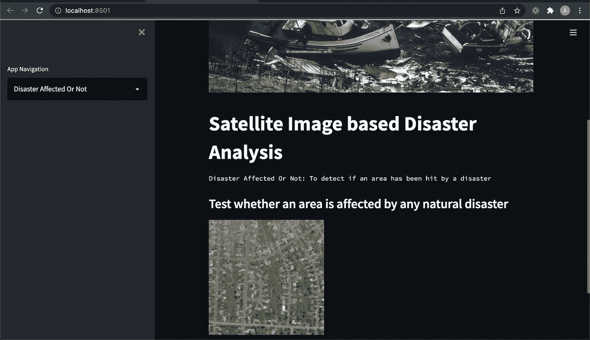

显示静态图像

请注意前面代码片段的第 10 行，我们还使用 commons.py 文件中的函数对图像进行了预处理。我们可以马上进行分类，但是让我们先添加上传图片的功能。

**上传图像**

我们向 **disasterAnalysis.py 文件**添加一些代码，以允许上传图像。

允许用户上传图像的代码

上面的代码现在处理两种情况。最初，当用户没有上传任何图像时，它从文件系统中读取静态图像，并将其显示在页面上。一旦用户上传文件，它会更改图像并使用上传的图像。效果如下图。

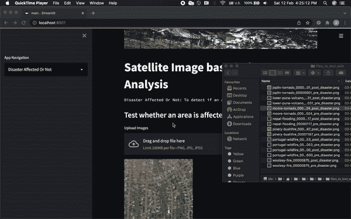

**上传图像分类**

我们就要到达终点了。现在，让我们使用我们在上一节中训练的模型来根据图像是否受到自然灾害的影响对其进行分类。我们需要创建一个名为 models 的文件夹，我们将在其中放置 squeezenet 模型。

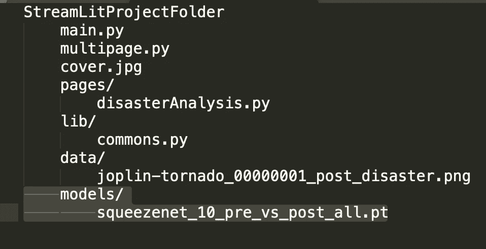

添加了一个名为“模型”的文件夹，我们在其中放置我们已经训练好的模型

如果您已经训练了任何其他模型，这是很好的—您只需要确保您将它放置在模型的文件夹中，并在 disasterAnalysis.py 文件中链接它。

**注:**由于 streamlit 服务器的限制为 **500MB** (截至 2022 年 2 月 12 日)，建议使用 squeezenet 和 resnet 等轻量级型号。**不要**使用像 **VGG** 那样笨重的模型——把它们载入 GitHub 会很痛苦，最终应用可能会失败。

有了模型，现在让我们编写最后一段代码，它将使模型能够预测图像的类别。

对图像执行分类的最后一段代码

现在我们知道了,“result_all”部分包含对图像进行分类的代码，并声明该区域是否遭受了灾难。下面是展示操作的 gif。

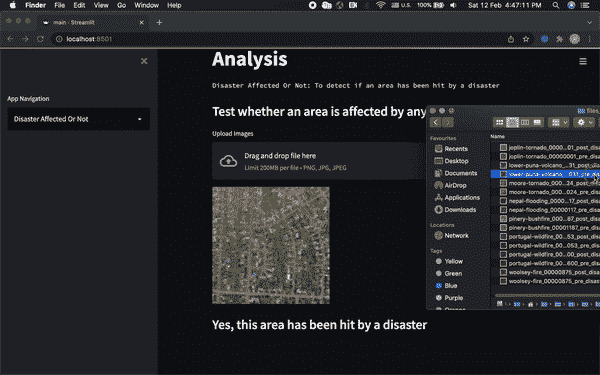

上传灾难前和灾难后的图像并检查输出

## 部署

本节重点介绍如何让应用程序在 streamlit 中运行。

**第一步:添加需求文件**

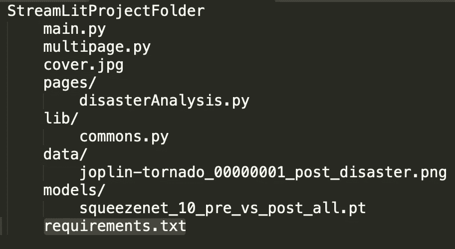

添加名为 requirements.txt 的文件

下面是需求文件的内容。

```
streamlit
pandas
plotly
numpy
torch 
torchvision
```

**第二步:推送文件到 GitHub**

有了这个文件，现在让我们创建一个 GitHub repo 并将内容放入其中。例如，对于这个项目，我将代码放入了 GitHub 仓库:[https://github.com/ashhadulislam/medium-disaster-analysis](https://github.com/ashhadulislam/medium-disaster-analysis)

**第三步:将 Streamlit 应用程序链接到 GitHub repo**

登录[https://share.streamlit.io/](https://share.streamlit.io/)。无论您之前是否发布过 streamlit 应用程序，您都会看到一个“新建应用程序”选项。

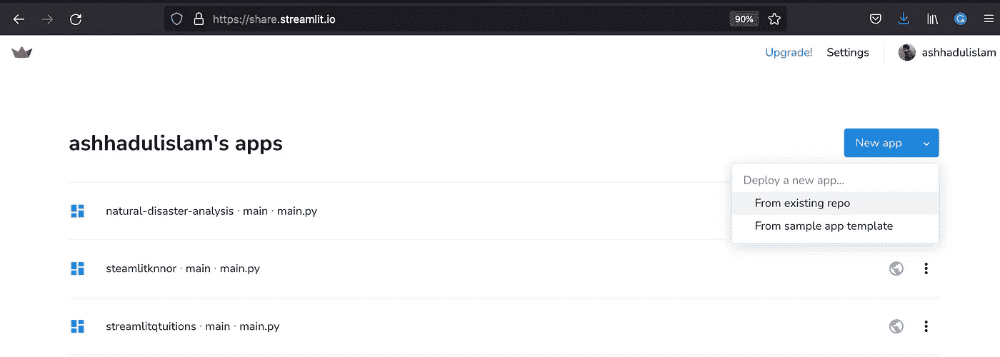

点击新应用并从现有回购中选择

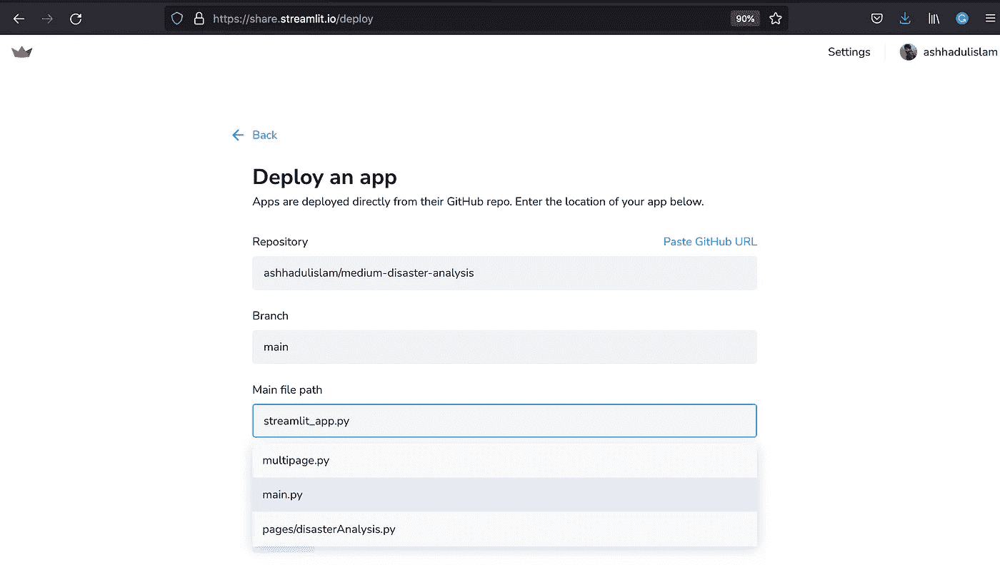

选择正确的分支

确保选择 main.py 作为主文件路径。streamlit 应用程序将从同一个。然后，单击部署。

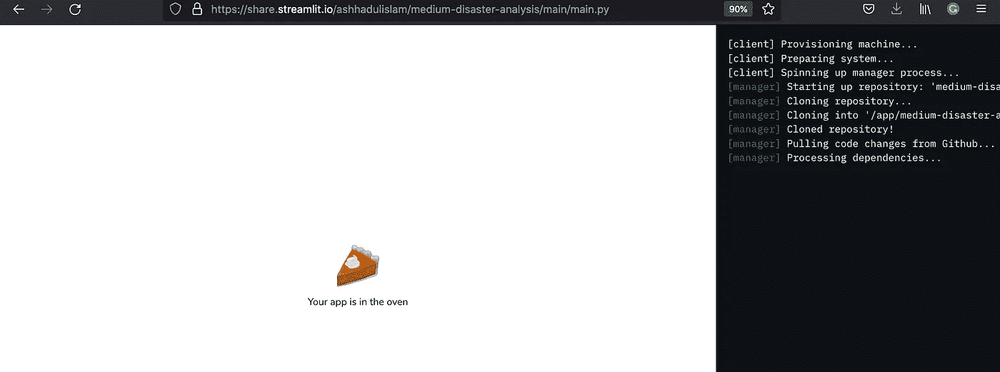

Streamlit 让部署变得有趣

给它几秒或几分钟。您可以在页面右侧看到正在进行的安装。

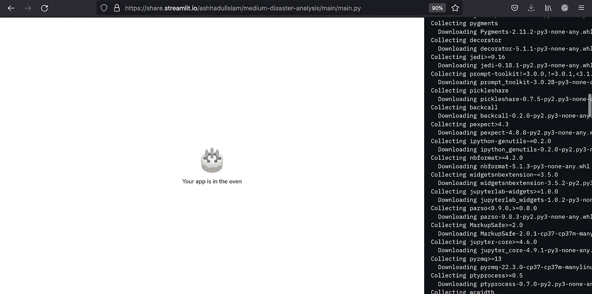

安装依赖项

一旦你的应用启动并运行，你可以看到类似这样的东西。

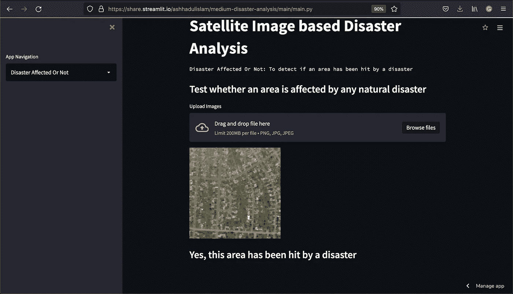

请注意，该 URL 不再是 localhost，您现在可以与您的朋友共享此应用程序。

您可以执行与您在本地尝试的操作相同的操作，上传卫星图像以检查它是灾前还是灾后图像。注意这是一个你可以使用的全局 URL，对我来说是[https://share . streamlit . io/ashhadulislam/medium-disaster-analysis/main/main . py](https://share.streamlit.io/ashhadulislam/medium-disaster-analysis/main/main.py)

**临别赠言**

因此，这是一个预处理图像、训练模型、在本地托管然后在云中托管它们的练习。如果你已经能够复制这一点，那么恭喜你——你已经能够端到端地覆盖深度学习应用。请在 LinkedIN 或 Instagram 上与我分享你的应用程序的网址。

如果你喜欢这个，并且想要更多这样的教程，让我们构建超越 jupyter notebook 界限的深度学习应用程序，并使其进入互联网世界，我邀请你加入我的[子堆栈简讯](https://mlnoticeboard.substack.com/)，在那里我们:

> 解决来自行业的不同机器学习问题的用例。我们不仅讨论了用例，还提供了样板代码，这样你就可以在你的研究/工作中开始实现它。

一个例子是你一直在读的文章。我们希望每个月解决一个用例。因此，如果有你一直在处理的机器/深度学习问题，请随时在子堆栈或任何频道上与我分享。

下次见。