# 基于深度学习的自动验证码求解器

> 原文：<https://pub.towardsai.net/deep-learning-based-automatic-captcha-solver-12cd49191c58?source=collection_archive---------0----------------------->

## [计算机视觉](https://towardsai.net/p/category/computer-vision)、[网络安全](https://towardsai.net/p/category/cybersecurity)、[深度学习](https://towardsai.net/p/category/machine-learning/deep-learning)

## 处理复杂的 10 字符验证码(带代码)

马库斯·斯皮斯克在 [Unsplash](https://unsplash.com/s/photos/cybersecurity?utm_source=unsplash&utm_medium=referral&utm_content=creditCopyText) 上拍摄的照片。

**免责声明**:以下作品为学术项目创作。该作品未被用于也无意用于任何有害或恶意的目的。尽情享受吧！

# 介绍

CAPTCHAs(区分计算机和人类的完全自动化的公共图灵测试)是几乎每个互联网用户都经历过的事情。在登录或创建帐户、进行在线购买、甚至发表评论的过程中，许多人会遇到看起来奇怪、拉伸、模糊、颜色和形状扭曲的图像，这些图像更像达利的画，而不是英文文本。

在很长一段时间里，10 个字符的模糊文本验证码被用于部署，因为当代的计算机视觉方法很难在不均匀的背景下识别字母，而人类在这方面没有问题。直到今天，这仍然是字符识别领域中的一个重要问题。

因此，为了开发一个能够在这种复杂的光学字符识别任务中读取字符的程序，我们将开发一个针对该问题的定制解决方案。在这篇文章中，我们将从头至尾为一个特定类别的验证码开发一个验证码求解器。

# 数据

10，000 张验证码图片来自 kaggle 数据集(由 Aadhav Vignesh 在[https://www.kaggle.com/aadhavvignesh/captcha-images](https://www.kaggle.com/aadhavvignesh/captcha-images)搜集)。每张图片都有 NAME.jpg 的名字，名字是谜题的答案。换句话说，该名称包含图像正确序列中的正确字母，例如 5OfaXDfpue。

让计算机程序读取图像中的字符是一个巨大的挑战。开源 OCR 软件，如 PyTesseract，在验证码上测试时失败，通常甚至不能从整个图像中提取一个字符。将原始图像作为输入，将解决方案作为输出来训练神经网络，这可能会在数千万的数据集上取得成功，但在 10，000 幅图像的数据集上不太可能取得成功。必须开发一种新方法。

通过一次分析一个字符，而不是一次分析整个图像，这个问题可以大大简化。如果可以获得字母数字及其相应标签的数据集，就可以训练一个简单的类似 MNIST 的神经网络来识别字符。因此，我们的管道看起来像这样:

1.  反转验证码，分割字符，并将每个字母数字字符单独保存到磁盘(带标签)。
2.  训练一个神经网络来识别每个类的字符。
3.  要使用我们的模型，输入任何验证码，反转图像，并分割字符。对每个字符应用机器学习模型，获得预测，并将它们连接成一个字符串。瞧。

# 预处理

对于那些在 ka ggle([https://github.com/sergeiissaev/kaggle_notebooks](https://www.kaggle.com/sergei416))上关注我的代码的人来说，下面的部分是指标题为 captchas_eda.ipynb 的笔记本。我们首先从数据集中加载一个随机图像，然后绘制它。

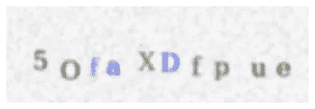

这是从我们的数据集中随机选择的验证码。

接下来，使用 OpenCV(Python 和 C++中非常有用的计算机视觉库)将图像转换为灰度，然后应用二进制阈值。这有助于将复杂的彩色图像转换为更简单的黑白图像。这是非常关键的一步——当文本背景不均匀时，现代 OCR 技术往往会失败。这个步骤解决了这个问题。然而，我们还没有做好 OCR 的准备。

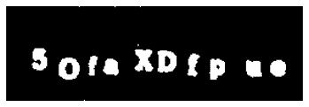

阈值和彩色倒置验证码图像。

下一步是定位图像的轮廓。我们希望将验证码分成 10 个独立的图像，每个图像包含一个字母数字，而不是将验证码作为一个整体来处理。因此，我们使用 OpenCV 的 findContours 函数来定位字母的轮廓。

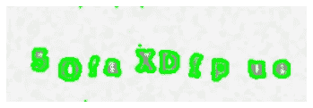

选中轮廓的图像。请注意图像顶部和底部边缘周围的绿色小点，它们被添加到我们的轮廓列表中。

不幸的是，尽管我们知道每个验证码精确地包含 10 个字母数字，但大多数图像最终都有超过 20 个轮廓。那么剩下的轮廓是什么呢？

答案是它们大多是方格背景的碎片。根据这些文件，“轮廓可以简单地解释为连接所有连续点(沿着边界)的曲线，具有相同的颜色或强度”。背景中的一些斑点符合这个定义。为了解析轮廓并只保留我们想要的字符，我们必须发挥创造力。

由于背景斑点比字母数字小得多，我确定了 10 个最大的轮廓(同样，每个验证码在图像中正好有 10 个字母数字)，并丢弃了其余的。

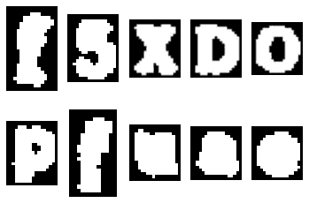

单独选择的字母数字。选择最大的 10 个轮廓，以便去除小的背景轮廓。注意字母数字的顺序不正确。

然而，有一个新的问题。我有 10 个轮廓按大小排序。当然，在求解验证码时，顺序很重要。我需要从左到右组织轮廓。因此，我对包含与轮廓编号相关联的每个轮廓的右下角的字典进行了排序，这允许我从左到右将轮廓绘制为一个图。

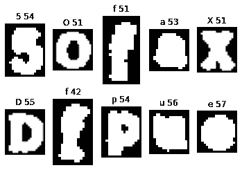

字母数字，每个都有自己的图像，而且顺序正确。正确的顺序使我们可以在每个图像上显示标签(真实类),以及白色像素占图像的百分比。

然而，我注意到许多输出是无意义的——图像与标签不符。更糟糕的是，由于一个图像与它的标签不对应，它经常会打乱所有下游字母的顺序，这意味着不是一个而是许多字母显示了错误的标签。这对训练神经网络可能是灾难性的，因为错误标记的数据会使学习更容易出错。想象一下，给 4 岁的孩子看字母，但偶尔会念错那个字母的音——这对孩子来说是一个巨大的挑战。

我实现了两个错误检查。第一个是完全没有意义的轮廓，我注意到它的黑白像素比例与普通字母非常不同。这里有一个例子:

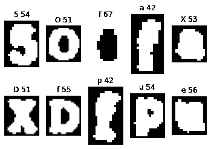

第一行中的第三个轮廓是我的第一个错误检查算法将跳过的图像示例。

顶行第三个轮廓其实是前面“O”的内圆。请注意，所有下游的字母现在都被错误地标注了。我们不能让这些错误标记的图像附加到我们的训练数据中。因此，我写了一个规则，说任何黑白比例高于 63%或低于 29%的字母数字都将被跳过。

下面是我的第二个错误检查的例子:

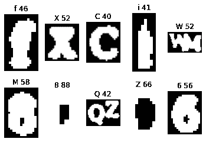

顶行最右边的图像以及底行中间的图像是错误类型#2 的例子。

有时，单独的字母数字彼此轻微接触，并作为一个字母数字被拾取。这是一个大问题，因为就像错误检查#1 一样，所有下游的字母数字都会受到影响。为了解决这个问题，我检查了每个图像是否明显宽于长。大多数字母数字都比较高，或者至少是正方形，很少有比高宽得多的，除非它们包含类型 2 的错误，这意味着它们包含不止一个字母数字。

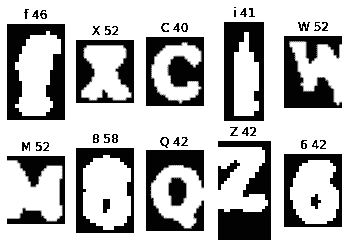

这和上面的验证码是一样的，只是这次使用了错误检查。

似乎错误检查工作很棒！即使是非常困难的验证码图片也能被成功标记。然而，现在出现了一个新的问题:

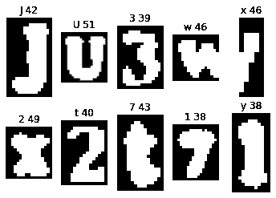

错误检查#2 获得的误报示例。

这里，顶行中的“w”符合错误检查#2 标准——它非常宽，所以程序分割了图像。我花了很长时间尝试不同的超参数设置，其中宽“w”和“m”图像不会被分割，但一个图像中两个字母数字的真实情况会被分割。然而，我发现这是一个不可能完成的任务。一些“w”字母非常宽，而一些包含两个字母数字的图像轮廓可能非常窄。

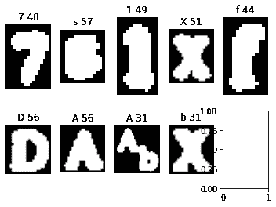

在最下面一行的中间图像中可以看到一个非常窄的错误案例#2。

没有秘密的公式来得到我想要做的事情，所以我(可耻地)不得不做一些我并不真正自豪的事情——手动处理事情。

# 获取训练数据

对于那些关注 Kaggle 的人来说，这是第二个文件，名为 captchas_save.ipynb。我将数据从 Kaggle 传输到我的本地计算机，建立一个循环，从头到尾进行所有的预处理步骤。在每个循环结束时，评估者被提示对数据和标签进行安全检查(“y”表示保留，“n”表示丢弃)。这通常不是作者喜欢的做事方式，但是在花了足够多的时间尝试自动化这个过程之后，效率天平开始向自动化和人工平衡倾斜。

在观看《社交网络》的过程中，我评估了 1000 个验证码(因此创建了一个大约有 10000 个字母数字的数据集)，在我和我的朋友之间切换，我付给他一瓶啤酒的薪水来换取他的帮助。

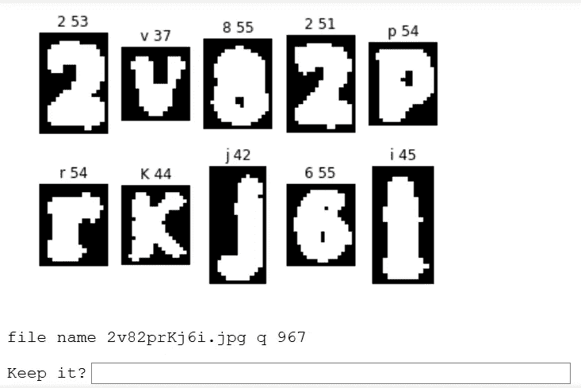

提示用户确认数据集的示例。

所有获得及格分数的文件都被附加到一个列表中。预处理管道遍历列表中的所有文件，将所有字母数字保存到各自的文件夹中，从而创建了训练集。这是最终的目录结构，我在 https://www.kaggle.com/sergei416/captchas-segmented 上传并发布了一个数据集。

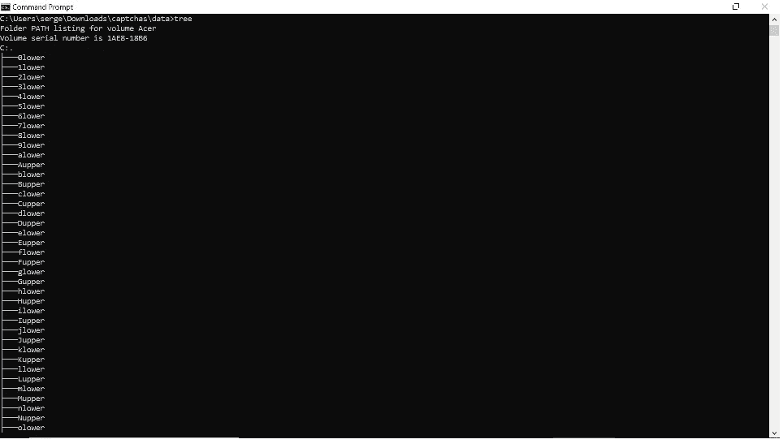

每一个字母数字都有“上”或“下”的后缀。所有的数字都以“lower”为后缀。

最终，我的训练数据集中只剩下 62 个目录和总共 5，854 个图像(意味着 10，000–5854 = 4146 个字母数字被丢弃)。

最后，让我们开始流水线的机器学习部分！让我们回到 Kaggle，在那里我们将根据我们在训练集中收到的分段字母数字训练一个手写数字识别软件。同样，现有的开源 OCR 库无法处理我们目前获得的图像。

# 训练模型

为了构建机器学习系统，我们使用了一个普通的 PyTorch 神经网络。完整的代码可以在 https://www.kaggle.com/sergei416/captcha-ml 的 Kaggle 上找到。为了简洁起见，本文中我将只讨论机器学习代码中有趣/具有挑战性的部分。

由于 PyTorch 的 ImageFolder 功能，这些数据可以轻松地加载到作者的笔记本中。有 62 个可能的类别，这意味着预测完全随机标签的基线准确度是 1/62，或 1.61%的准确度。作者设置了 200 幅图像的测试和验证大小。所有图像都被调整为 128 x 128 像素，随后应用了通道标准化。特别是对于训练数据，随机应用 RandomCrop、ColorJitter、RandomRotation 和 RandomHorizontalFlip 来扩充训练数据集。这是一批训练数据的可视化:

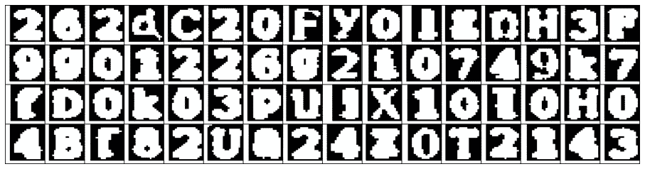

一批训练数据。

使用了 wide_resnet101 的迁移学习，使用 Kaggle 的免费 GPU 进行训练。使用超参数搜索来识别最佳超参数，这导致 99.61%的验证准确性。模型被保存，结果被可视化:

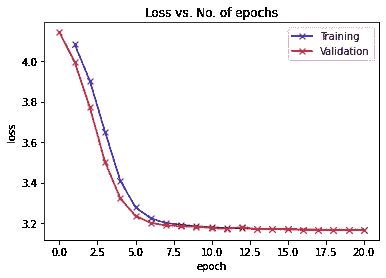

损失与历元数。

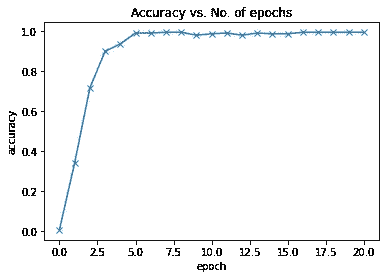

精度与历元数。

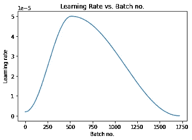

学习率调度程序的可视化。

最终结果表明验证准确率为 99.6%，测试准确率为 98.8%。老实说，这超出了我的预期，因为许多二进制的像素化图像甚至连人类都难以正确解读。快速浏览一下上面的一批训练图像，会发现至少有几个有问题的图像。

# 我们模型的评估

这条管道的最后一步是测试我们现成的机器学习模型的准确性。我们以前为我们的分类器导出了模型权重，现在该模型可以应用于任何新的、看不见的验证码(与我们原始数据集中的验证码类型相同)。为了完整起见，作者建立了一个代码来评估模型的准确性。

如果在求解验证码时，即使有一个字符不正确，整个验证码都会失败。换句话说，所有 10 个预测的字母数字必须完全匹配验证码的解决方案才能被认为是已解决的。为从数据集中随机获取的 500 幅图像设置一个简单的循环，比较解与预测的相等性，并检查预测是否与解相等。代码在第四个(也是最后一个)笔记本里，可以在[https://www.kaggle.com/sergei416/captchas-test/](https://www.kaggle.com/sergei416/captchas-test/output)找到。

这种等效性适用于 125/500 个测试的 CAPTCHA 图像，即 25%的测试集*。虽然这个数字似乎很低，但重要的是要记住，与许多其他机器学习任务不同，如果一个案例失败了，另一个案例会立即可用。我们的程序只需要成功一次，但可能会无限期地失败。由于我们的程序对于任何给定的尝试都有 1–0.25 = 0.75 的失败概率，那么给定 n 次尝试，只要我们不使所有 n 次尝试失败，我们将通过验证码。那么 n 次尝试内通过的可能性有多大？它是

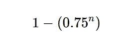

因此，n 次尝试的可能性如下:

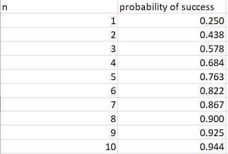

*编辑:kaggle 链接的准确率为 0.3，或任何单个验证码的 30%(n = 10 时为 97.1%)。

# 结论

总的来说，建立一个能够解决 10 个字符验证码的机器学习模型的尝试是成功的。最终的模型可以以 30%的准确率解决这些难题，这意味着有 97.1%的概率可以在前 10 次尝试中解决验证码图像。

感谢所有坚持到本教程结束的人！这个项目表明，10 个字符的验证码不适合区分人类和非人类用户，其他类别的验证码应该在生产中使用。

链接:

领英:【https://www.linkedin.com/in/sergei-issaev/ 

推特:【https://twitter.com/realSergAI 

github:[https://github.com/sergeiissaev](https://github.com/sergeiissaev)

https://www.kaggle.com/sergei416

威风凛凛:[https://jovian.ml/sergeiissaev/](https://jovian.ml/sergeiissaev/wildlife)

中:[https://medium.com/@sergei740](https://medium.com/@sergei740)