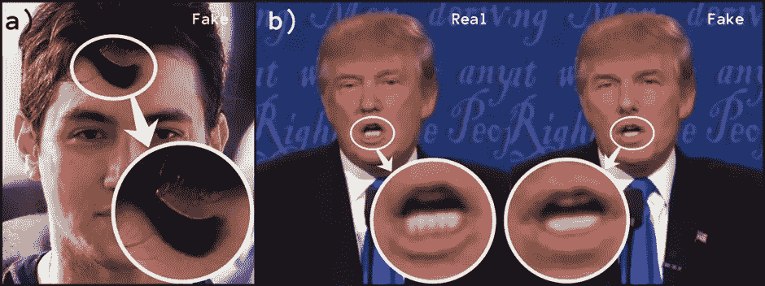

# 简而言之，基于深度学习的深度伪造检测

> 原文：<https://pub.towardsai.net/deep-learning-based-deepfake-detection-in-a-nutshell-fbcfb1815b68?source=collection_archive---------2----------------------->

## **基于深度学习的 Deepfake 检测概述**

图 1:作者[的作品](https://pawara73.medium.com/)

在人工智能(AI)的转折点上，深度学习(DL)已经成为计算机科学中最具影响力的领域之一，直接影响着当今人类的生活和社会。就像历史上的其他技术创新一样，深度学习也被用于高级和低级行为。深度学习的一个应用是 [Deepfakes](https://www.theguardian.com/technology/2020/jan/13/what-are-deepfakes-and-how-can-you-spot-them) ，它因在公共场合带来令人憎恶的后果而臭名昭著。在过去的几年里，已经进行了数百项研究，以发明和优化各种人工智能的 Deepfake 检测。因此，本文也讨论 Deepfake 检测，而不是 Deepfake 创建。

已经开发了深度学习方法以及机器学习(非深度学习/非 DL)方法来检测 Deepfakes。深度学习模型有大量的参数要考虑，因此需要大量的数据来训练这样的模型。这就是为什么 DL 方法比非 DL 方法具有更高的性能和更精确的结果。

为了便于参考，文章内容分为以下几部分:

1.  [什么是 Deepfake 检测](#c837)
2.  [Deepfake 检测管道](#1cf4)
3.  [数据预处理](#5c42)
4.  [特征提取](#45d0)
5.  [分类](#f472)
6.  [总结](#c467)
7.  [参考文献](#2f6d)

# **1。什么是 Deepfake 检测**

deepfake 创建管道不是一个完美的监控过程。因此，大多数 Deepfake 生成器都会在 Deepfake 中留下指纹，这些指纹特定于相关的 deep fake 创建架构或单个生成器。Deepfake 视频中的这些变化可以被分类为*空间不一致性:*视频的单个帧内出现的不兼容性，以及*时间* *不一致性:*视频的帧序列中出现的不兼容特征[【1】](#a1e3)。

空间不一致包括面部区域与视频帧的背景不兼容、分辨率变化以及部分渲染的器官和皮肤纹理(面部的所有人类特征可能不会被正确渲染)。大多数常见的 Deepfake 生成器无法呈现眨眼和牙齿等特征。有时，Deepfake 一代使用白色条纹，而不是静止帧上甚至肉眼可见的牙齿[图 2]。

图 Deepfakes 的空间不一致性。左图:头发的不完整渲染。右图:使用白条代替单个牙齿(插图由[作者](https://pawara73.medium.com/)创作)

时间不一致包括异常的眨眼、头部姿势、面部运动以及视频中帧序列的亮度变化。

幸运的是，deepfake 生成器留下的空间和时间指纹都可以被由[深度神经网络](https://towardsdatascience.com/the-basics-of-deep-neural-networks-4dc39bff2c96) (DNNs)制成的 deepfake 检测器识别，即 deepfake 检测过程背后的原理。然而，[生成对抗网络](https://towardsdatascience.com/understanding-generative-adversarial-networks-gans-cd6e4651a29) (GANs)在 Deepfake 生成器中的广泛应用已经挑战了 deepfake 检测和创建之间的平衡。

# **2。Deepfake 检测管道**

Deepfake 检测器是二进制分类系统，输出输入的数字媒体是真的还是假的。Deepfake 检测不是由一个单一的黑盒状模块执行的，而是由几个其他模块和步骤组成，它们共同作用来提供检测结果。Deepfake 检测流水线中常见的步骤如下[【2】](#d876)。

1.  深度伪造数字媒体的输入。
2.  预处理包括人脸检测和增强。
3.  处理后的帧的特征提取。
4.  分类/检测。
5.  输出图像的真实性。

通常，典型的基于 DL 的 Deepfake 检测器包括 03 个主要组件来执行上述任务。

1.  预处理模块。
2.  特征提取模块。
3.  评估器模块(深度学习分类器模型)。

在接下来的 3 章中，主要步骤:数据预处理、特征提取和检测/分类过程将被详细解释。

# **3。数据预处理**

在数据收集阶段之后，在用于 Deepfake 检测管道的训练和测试步骤之前，应该对数据进行预处理。数据预处理使用可用的库自动完成，如[*【OpenCV】*](https://towardsdatascience.com/opencv-complete-beginners-guide-to-master-the-basics-of-computer-vision-with-code-4a1cd0c687f9)*【python 库】*[*多任务级联卷积网络*](https://towardsdatascience.com/face-detection-using-mtcnn-a-guide-for-face-extraction-with-a-focus-on-speed-c6d59f82d49)*【mt CNN】*[*你只看一次*](https://towardsdatascience.com/yolo-you-only-look-once-17f9280a47b0)*【YOLO】*算法等。

训练模型的数据集的准备在 Deepfake 检测器的性能中也起着至关重要的作用。可以应用增强技术，例如重新缩放(拉伸)、剪切映射、放大缩放、旋转、亮度变化以及在适当范围内水平/垂直翻转，以提高数据集的概括[【3】](#e971)。

数据预处理的第一步包括从视频剪辑中提取单独的帧。提取帧后，接下来的步骤包括从提取的视频帧中检测人脸。由于异常经常出现在面部区域，仅选择面部区域有助于特征提取模型仅聚焦于感兴趣的[区域](https://towardsdatascience.com/understanding-region-of-interest-part-1-roi-pooling-e4f5dd65bb44) (ROI)，节省了用于全帧扫描的计算成本。一旦检测到面部区域，就将它们从帧的其余背景中裁剪出来，并遵循一系列步骤以使它们可用于模型训练和测试。裁剪面部区域的另一个原因是使模型的所有输入图像具有相同的尺寸。

# **4。特征提取**

预处理的帧然后被馈送到特征提取器。大多数特征提取器都是基于[卷积神经网络](https://towardsdatascience.com/a-comprehensive-guide-to-convolutional-neural-networks-the-eli5-way-3bd2b1164a53) (CNN)的。一个新的趋势是，一些最近的研究已经被执行来证明在特征提取过程上应用[胶囊网络](https://paperswithcode.com/paper/use-of-a-capsule-network-to-detect-fake)的改进的有效性和效率。

特征提取器提取预处理视频帧上可用的空间特征。特征提取能够提取视觉特征、局部特征/面部标志，例如眼睛、鼻子、嘴的位置、口型的动态、生物特征，例如眨眼等。提取的特征向量然后被发送到分类器网络以输出决策。

# **5。分类**

用于分类的深度学习模型通常被称为 Deepfake 检测器的主干。顾名思义，分类网络负责 Deepfake 检测管道中最严肃的任务:即分类确定输入视频是不是 Deepfake 的概率。大多数分类器是二元分类器，其中对于 Deepfakes 输出为(0 ),对于原始帧输出为(1)。

分类器也是另一个卷积层(CNN)或不同的深度学习架构，如[长期短期记忆](https://towardsdatascience.com/lstm-networks-a-detailed-explanation-8fae6aefc7f9) (LSTM)网络和[视觉变压器](https://towardsdatascience.com/transformers-in-computer-vision-farewell-convolutions-f083da6ef8ab) (ViTs)。分类模型的实际功能与所用的 DNN 不同。作为一个例子，在特征提取器模块中提取的眨眼特征可以被分类模块中的 LSTM 模块使用，以便确定帧的眨眼模式的时间不一致性，并且基于此，决定输入是否是深度伪造[【3】](#e971)。在大多数情况下，可以在 Deepfake 检测器网络中观察到完全连接的层。由于卷积图层的输出表示数据的高级要素，因此可以将这些输出展平并连接到单个输出图层，以得出最终决策。

# **6。总结**

在过去的几年里，Deepfake 的创建和检测都有了显著的竞争发展。与非 DL 方法相比，与深度学习技术的 Deepfake 检测相关的研究由于结果的准确性而受到严重影响。深度神经网络架构，如 CNN、RNNs、ViTs 和胶囊网络，广泛应用于深度伪造检测器的实现中。常见的 Deepfake 检测管道由数据预处理模块、基于 CNN 的特征提取器和主干分类模块组成。

此外，Deepfake 检测非常依赖于 Deepfake 生成器在 deep fake 上留下的指纹。由于目前基于 GAN 的 Deepfake 生成器能够以最小的不一致性合成更真实的 Deepfake，因此必须开发新的基于 DL 的方法来优化 deep fake 检测。基于 [*深度集成学习技术*](https://ieeexplore.ieee.org/document/9171002) 的 Deepfake 检测方法可以被认为是打击 Deep fake[【4】](#b856)的现代综合方法。尽管如此，有效且高效的 Deepfake 检测器仍然空缺。

# **7。参考文献**

[1] Ruben Tolosana，Ruben Vera-Rodriguez，Julian Fierrez，艾塔米·莫拉莱斯，Javier Ortega-Garcia，[deep fakes and Beyond:A Survey of Face Manipulation and Fake Detection](https://arxiv.org/abs/2001.00179v3)(2020)，信息融合，2020。

[2] Nguyen，Thanh & Nguyen，Cuong M. & Nguyen，Tien & Nguyen，Duc & Nahavandi，Saeid。[用于 Deepfakes 创建和检测的深度学习:一项调查](https://www.researchgate.net/publication/336055871_Deep_Learning_for_Deepfakes_Creation_and_Detection_A_Survey) (2019)。

[3] P. K. P. K. Sawinder Kaur， [Deepfakes:使用卷积长短期记忆检测人脸交换视频片段的时序分析](https://www.spiedigitallibrary.org/journals/journal-of-electronic-imaging/volume-29/issue-03/033013/Deepfakes--temporal-sequential-analysis-to-detect-face-swapped-video/10.1117/1.JEI.29.3.033013.full?SSO=1) (2020)，《电子成像杂志》，第 29 页(3)，2020。

[4] M. S. Rana 和 A. H. Sung， [DeepfakeStack:一种用于 Deepfake 检测的基于深度集成的学习技术](https://ieeexplore.ieee.org/document/9171002) ( *2020)，*第 7 届 IEEE 网络安全和云计算国际会议(CSCloud)/2020 年第 6 届 IEEE 边缘计算和可扩展云国际会议(EdgeCom)，2020 年。