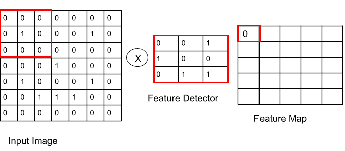
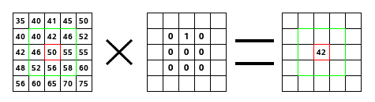
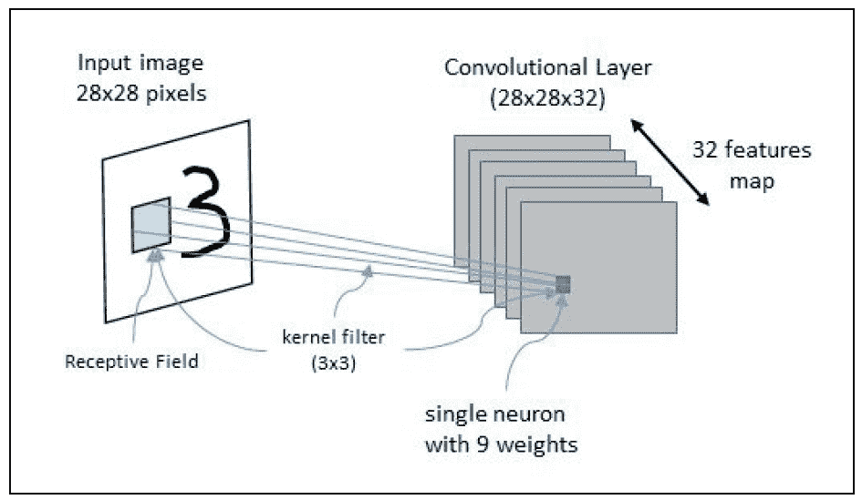
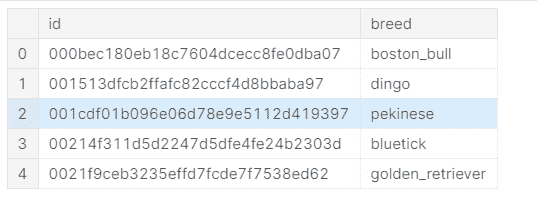
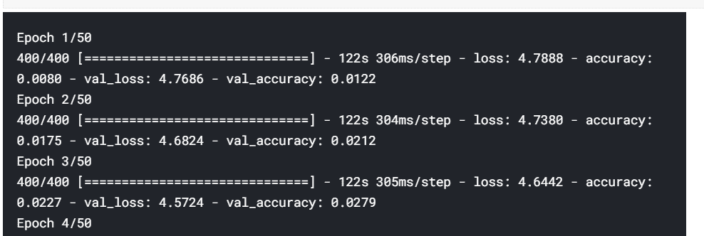
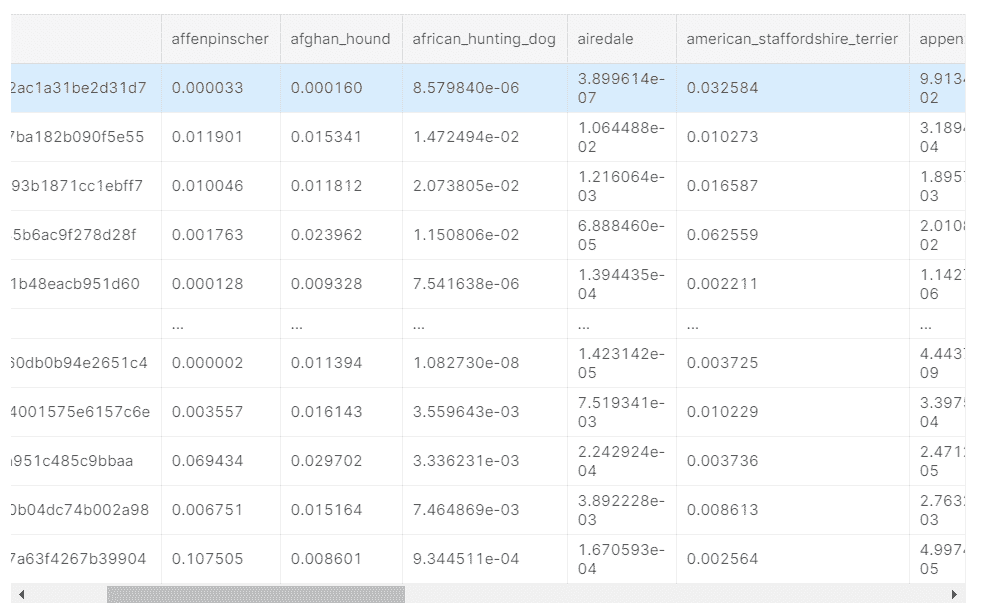
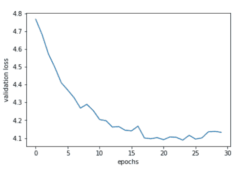
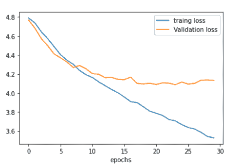

# 深度学习(CNN)——在图像中发现狗的品种

> 原文：<https://pub.towardsai.net/deep-learning-cnn-discover-the-breed-of-a-dog-in-an-image-f885dffaa4d0?source=collection_archive---------4----------------------->

## [深度学习](https://towardsai.net/p/category/machine-learning/deep-learning)

# 介绍

卷积神经网络(CNN)是深度学习网络，在图像的对象识别方面表现出色。它的设计灵感来自大脑中被称为视觉皮层的部分。视觉皮层的作用是处理视觉数据。它对高级人工智能产生了许多奇妙的影响，特别是在图像分类问题上取得了巨大的成功。

在学习 CNN 之前，理解图像识别中的基本概念是非常重要的:

*   特征检测
*   盘旋

# 特征检测

图像由许多小方块组成的网格组成。这叫做像素。每个像素都与[0–225]范围内的一个值相关联，其中 0 表示黑色，255 表示白色。最后，彩色图像由一组三个度量表示，每个度量对应一个颜色通道(红、绿、蓝)。这种表示如下所示:



因此，它创建了一个称为核过滤器或特征检测器的矩阵。

# 盘旋

在数学中，尤其是在泛函分析中，卷积是对两个函数的数学运算，它产生第三个函数，并在其他函数用药的情况下告知其中一个函数的形状。因此，核滤波器沿着输入矩阵移动，并在核值和它所应用的矩阵部分的值之间执行标量积。这个结果是一个新的矩阵，称为卷积矩阵。



# CNN 架构

我们取一张黑白图像(5*5 矩阵)，输入矩阵为 5*5。所以，这里 CNN 是由 25 个神经元组成的输入层(5*5 = 25)。其主要目的是获取对应于每个像素的输入值，并将其传递到下一个隐藏层。

在 CNN 中，每个神经元都连接到输入区的某个区域，该区域称为感受野。为了有效地识别图像，我们需要将不同的核滤波器应用于同一个感受野，因为每个滤波器应该识别不同特征的图像。识别相同特征的神经元集合定义了单个特征图。



CNN 架构

这张图片代表了 CNN 的架构。这里图像的输入尺寸是 28*28，并且将由尺寸为 28*28 的 32 个特征图组成的卷积层来分析。

该体系结构还显示了感受野和 3*3 大小的内核过滤器。

CNN 可以由级联的几个卷积层组成。每个卷积层的输出是一组特征图，所有这些矩阵定义了一个新的输入层，将被下一层使用。

在 CNN 中，每个神经元在激活阈值之后产生一个输出。CNN 还使用位于卷积层之后的池层。

卷积网络的最后一个隐藏层通常是全连接网络，其输出层具有 softmax 激活功能。

# 利用 CNN 进行犬种识别

美国有线电视新闻网可以很容易地识别好小狗的类型，品种等。

# 构建数据集

数据集:

*   测试:-狗的图像
*   训练:-不同狗的图像
*   label.csv:-不同类型的品种

```
import os
import seaborn as sns
import matplotlib
from shutil import copyfile
import matplotlib.pyplot as plt
```

读取品种标签数据:

```
labels = pd.read_csv('labels.csv')labels.head()
```



将品种分成不同的类别:

```
labels_dict = {i:j for i,j in zip(labels['id'],labels['breed'])}classes = set(labels_dict.values())classes
```

获取狗的所有训练图像:

```
images = [f for f in os.listdir('train/')]
```

将训练图像拆分为训练图像和验证图像:

```
split = int(len(images) * 0.85)training_images = images[:split]validation_images  = images[split:]
```

将 training_images 和 validation_images 保存在两个单独的目录中:

```
if  not os.path.exists('training_images'):
        os.makedirs('training_images')if  not os.path.exists('validation_images'):
         os.makedirs('validation_images')
```

为 training_images 创建类的子目录:

```
for curClass in classes:
     if  not os.path.exists(os.path.join('training_images', curClass)):
          os.makedirs(os.path.join('training_images', curClass))
```

为 validation_images 创建类的子目录:

```
for curClass in classes:
     if  not os.path.exists(os.path.join('validation_images', curClass)):
          os.makedirs(os.path.join('validation_images', curClass))
```

将分割的图像保存在两个不同的目录中:

```
count = 0destination_directory = 'training_images/'for item in images:
   if count >7999:
        destination_directory = 'validation_images/'
    filekey = os.path.splitext(item)[0]
    des = destination_directory + labels_dict[filekey]+'/'+item
    print(des)
    if  not os.path.exists(des):
        src = '/kaggle/input/dog-breed-identification/train/' + item
        copyfile(src, des)
    print(labels_dict[filekey])
    count +=1
```


# 预处理

导入 Keras 的预处理库:

```
from keras.preprocessing.image import ImageDataGenerator, array_to_img, img_to_array, load_imgdatagen = ImageDataGenerator(
        rotation_range=50,
        width_shift_range=0.3,
        height_shift_range=0.2,
        shear_range=0.3,
        zoom_range=0.3,
        horizontal_flip=True,
        fill_mode='nearest')
```

转换为数组:

```
x = img_to_array(img)x = x.reshape((1,) + x.shape)
```

导入更多库:

```
from keras.preprocessing.image import ImageDataGenerator
from keras.models import Sequential
from keras.layers import Convolution2D
from keras.layers import MaxPooling2D
from keras.layers import Flatten
from keras.layers import Densefrom keras.layers import Conv2D,Dropoutfrom keras.preprocessing.image import ImageDataGeneratortrain_datagen = ImageDataGenerator(
        rescale=1./255,
        shear_range=0.2,
        zoom_range=0.2,
        horizontal_flip=True)test_datagen = ImageDataGenerator(rescale=1./255)training_set = train_datagen.flow_from_directory(
        'training_images',
        target_size=(128, 128),
        batch_size=20,
        class_mode='categorical')test_datagen = ImageDataGenerator(rescale=1./255)training_set = train_datagen.flow_from_directory(
        'training_images',
        target_size=(128, 128),
        batch_size=20,
        class_mode='categorical')test_set = test_datagen.flow_from_directory(
        'validation_images',
        target_size=(128, 128),
        batch_size=20,
        class_mode='categorical')
```

# 构建层

```
from keras.layers import Dropout
clf = Sequential()
#Convolution
#32 is number of kernals of 3x3, we can use 64 128 256 etc in next layers
#input shape can be 128, 256 later
clf.add(Conv2D(32,(3,3),input_shape=(128,128,3),activation='relu'))
#Max Pooling size reduces divided by 2
clf.add(MaxPooling2D(pool_size=(2,2)))#clf.add(Dropout(0.5))clf.add(Conv2D(32,(3,3), activation='relu'))
clf.add(MaxPooling2D(pool_size=(2,2)))
#clf.add(Dropout(0.25))clf.add(Conv2D(64, (3, 3), activation='relu'))
clf.add(MaxPooling2D(pool_size=(2, 2)))
#clf.add(Dropout(0.10))
#Flattening
clf.add(Flatten())

#Adding An ANN
#lets take 128 hidden nodes in hidden layer
#clf.add(Dense(units=128,activation='relu'))
clf.add(Dense(units=64, activation='relu'))
clf.add(Dropout(0.5))
clf.add(Dense(units=120,activation='softmax'))
#stochastic gradient descent -Adam -optimizerclf.compile(optimizer='adam',loss='categorical_crossentropy',metrics=['accuracy'])
```

添加提前停止:

```
from keras.callbacks import EarlyStoppingearly_stopping_monitor=EarlyStopping(patience=6)
```

安装发电机:

```
hist=clf.fit_generator(
        training_set,
        steps_per_epoch=400,
        epochs=50,
        validation_data=test_set,
        validation_steps=2222,
callbacks=[early_stopping_monitor])
```



# 预测

导入测试数据进行预测。

```
import cv2test_set = []test_set_ids = []for curImage in os.listdir('/kaggle/input/dog-breed-identification/test'):
    test_set_ids.append(os.path.splitext(curImage)[0])
    curImage = cv2.imread('/kaggle/input/dog-breed-identification/test/'+curImage)

    test_set.append(cv2.resize(curImage,(128, 128)))test_set = np.array(test_set, np.float32)/255.0
```

预测:

```
predictions= clf.predict(test_set)
```

将预测数据与测试数据对应起来:

```
predictions_df = pd.DataFrame(predictions)predictions_df.columns = column_namespredictions_df.insert(0,'id', test_set_ids)predictions_df
```



# 情节

验证损失与时代:

```
plt.plot(hist.history['val_loss'])plt.xlabel('epochs')plt.ylabel('validation loss')plt.show()
```



培训损失与验证损失:

```
plt.plot(hist.history['loss'],label="traing loss")plt.plot(hist.history['val_loss'], label="Validation loss")plt.legend()plt.xlabel('epochs')plt.show()
```



# 结论

卷积神经网络的设计灵感来自视觉皮层——大脑中处理视觉输入的区域。可以肯定地说，CNN 正在支撑人工智能和机器学习领域许多最具影响力的最新进展。CNN 的变体被应用于现存的一些最复杂的视觉、语言和解决问题的应用程序中。