# 使用深度学习创建生物认证器

> 原文：<https://pub.towardsai.net/deep-learning-de50aeb8e6e0?source=collection_archive---------3----------------------->

## [深度学习](https://towardsai.net/p/category/machine-learning/deep-learning)

## 使用深度学习创建指纹认证器。

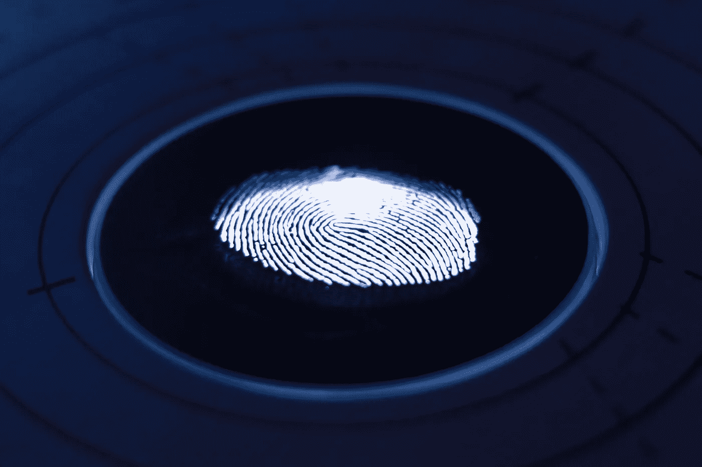

图片由[乔治·普伦萨斯](https://unsplash.com/@georgeprentzas)在 Unsplash 上拍摄

# **什么是生物认证？**

生物认证是基于用户身体特征的某一部分来验证用户的一种模式。身份验证不同于身份验证，身份验证采用指纹、面部、视网膜扫描等生物特征。用来识别一个人。在身份验证中，生物特征用于验证用户是否如其所声称的那样。

# **生物认证器的重要性**

就数字身份而言，这是最受欢迎的安全形式之一。例如，许多数字设备(如手机、笔记本电脑)使用某种形式的认证器(如指纹、面部识别)来验证用户。这是通常的密码保护之外的又一层安全措施。

# **如何使用一次性分类和连体网络创建指纹认证？**

在本文中，我们将尝试使用深度学习进行指纹认证。这是受吴恩达在 [Coursera](https://www.coursera.org/specializations/deep-learning) 上的深度学习专业化课程的启发

## 一次性分类

在标准识别方法的情况下，一组图像被输入到人工神经网络(ANN)中，以获得不同类别的输出概率。例如，如果我们想要识别猫和狗，我们想要收集大量的图像(每类可能超过 500 个图像)来提高模型的准确性。这种类型的网络在指纹识别方面的缺点是:

1.  几乎不可能获得大量图像，
2.  如果我们想在数据库中包含一个新用户，我们需要重新训练模型来识别新用户。

正是由于这些原因，一次性分类被证明是有用的，因为我们可以使用一些预先训练的模型(如 ImageNet)并将任务视为“*差异评估问题”*而不是分类问题。这就是暹罗网络出现的原因。

## 暹罗网络

连体网络(有时称为孪生神经网络)是一种人工神经网络，它学习区分两个输入，而不是分类。它采用两幅输入图像，同时通过相同的网络，并生成图像的两个矢量嵌入，这两个矢量嵌入通过逻辑损失来计算两幅图像之间的相似性得分。这非常有用，因为它不需要许多数据点来训练模型。其次，我们只需要存储用户的一个图像作为参考图像，并为呈现给网络的每个新实例计算相似性。

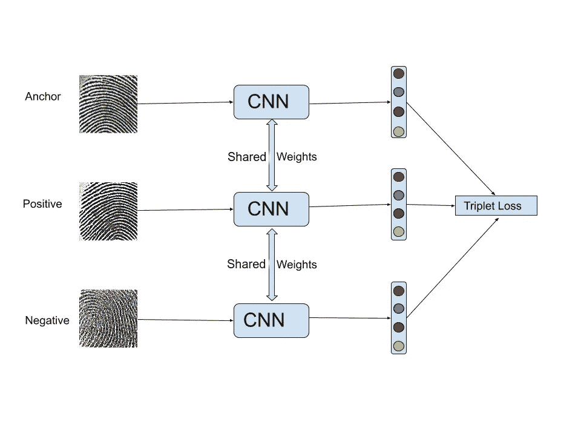

图片由作者提供。**具有连体网络的三重损失架构:**三个图像(“锚”、“正”、“负”)同时通过同一个 CNN，生成 128 维向量的最后一层。然后，所有三个向量都通过三元组损失函数，以最小化“锚”和“正”之间的距离，以及最大化“锚”和“负”之间的距离。

我们的暹罗网络架构如上图所示。

## 损失函数

尽管如此，物流损失在暹罗网络中运作良好。在这项工作中，我们使用了三重损失函数和连体网络。结合连体网络使用三联体损失函数(在下一小节中解释)的好处是双重的:
1 .它通过学习同时最大化两个相似图像之间的相似性(锚正)和两个不同图像之间的距离(锚负)来提取更多的特征。
2。它比逻辑损失产生更多的训练样本。如果我们有 P 个相似对和 N 个不相似对，那么对于逻辑损失，我们将有 P + N 个总训练样本。然而，我们将有 PN 三胞胎用于训练。这将提高模型精度。

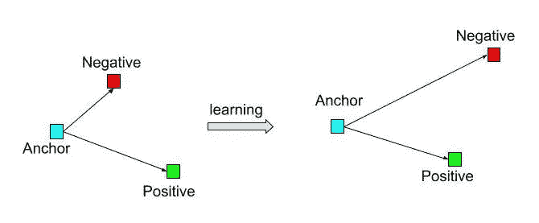

图片由作者提供。**三重损失架构:**架构试图最小化“锚”与“正”的距离，最大化“锚”与“负”的距离

三重态损耗架构如上图所示。

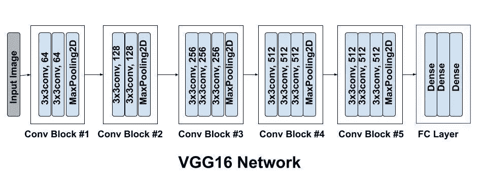

作者图片

最后，对于分类器，我们使用了一个改进的 VGG16 模型架构，并使用 Keras 在 ImageNet 上预先训练了权重。VGG16 的模型架构如上所示。

# 该设置

我们首先创建三重损失层，并将其附加到我们的模型。

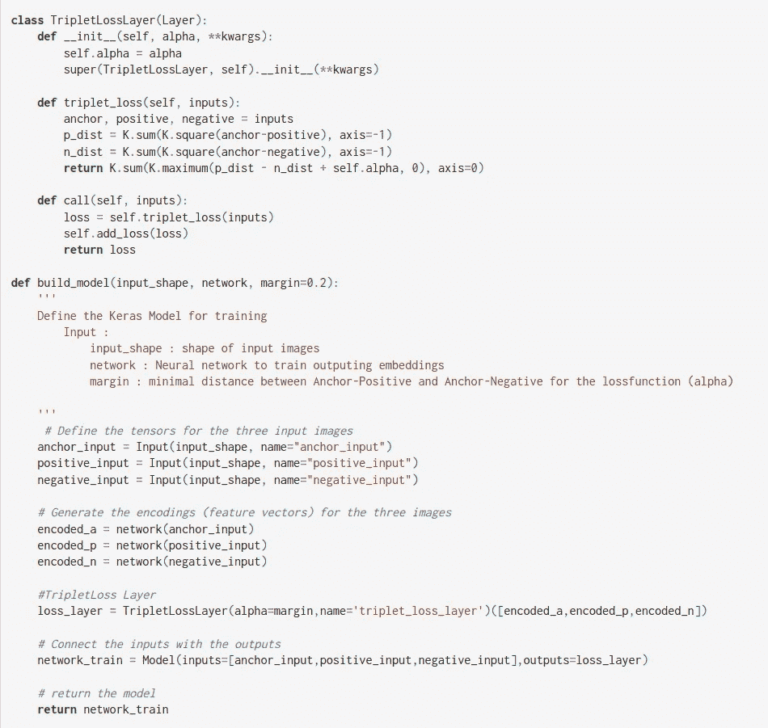

作者图片

根据上面的代码， **TripletLossLayer** 函数创建三重损失函数，而 **build_model** 函数将损失函数附加到神经网络(在我们的例子中是 VGG16)。

## 为培训准备批次

现在我们的模型已经构建好了，我们需要准备好三元组来馈入网络。我们决定生成 50% *随机/容易*三元组和 50% *困难*三元组，以防止网络过拟合。下面的代码显示了如何做到这一点。

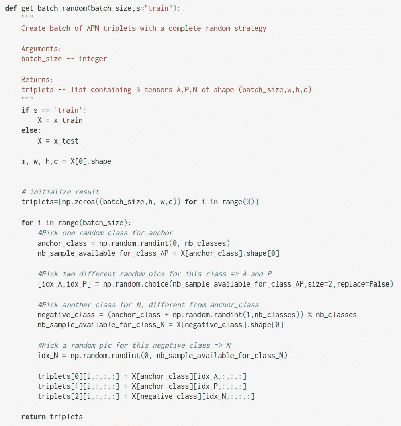

图片由作者提供。生成简单三元组的代码。

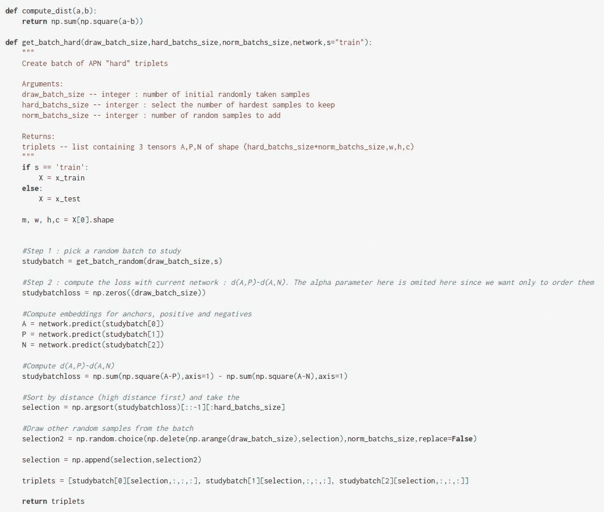

图片由作者提供。生成硬三元组的代码。

下面是“简单”和“困难”批处理的样子。

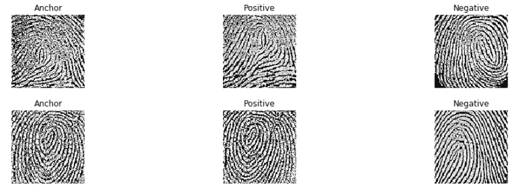

图片由作者提供。简易三联批

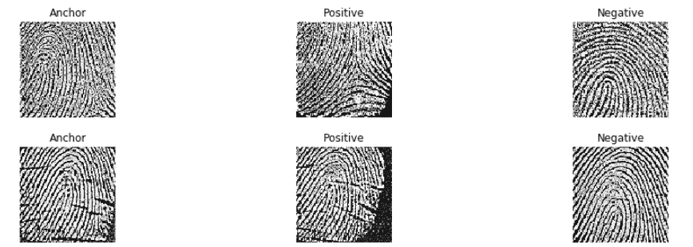

图片由作者提供。硬三份批料

# 估价

**数据集**:我们在这个项目中使用了[*FVC2006*](http://bias.csr.unibo.it/fvc2006/) 数据集。该数据库由 4 个不同的子集 DB1、DB2、DB3 和 DB4 组成。每个数据库由 150 个手指和每个手指 12 个印痕组成。每个子集进一步分为“集合 A”和“集合 B ”,其中“集合 A”包含 140×12 个图像，“集合 B”包含 10×12 个图像。我们只使用了 DB1，它的图像大小为 96x96，但我们预计其他数据库也会有类似的结果。

*训练数据:*为了训练，我们从 DB1-A(总共 140×10 个图像)取得每个手指的 10 个印痕，并生成三联体对。我们使用了 50%的“硬”和 50%的“易”三联体对。

*测试数据:*为了测试，我们使用了来自 DB1-A 的每个手指 2 个印痕(总共 140x2 个图像)。

一旦模型被训练，我们创建一个 140 张图片的数据库。为了验证，我们计算输入图像和来自数据库的图像之间的**范数距离**，如果该距离大于某个阈值距离，我们将它们计为“*不匹配*”，反之亦然。

**结果:**我们在测试数据上获得了 95.36%的准确度(280 个指纹印记中有 13 个不匹配)，所有用户的解码区域半径为 0.7。

# 结束语

仍然存在的一个问题是，我们是如何得出 0.7 的阈值距离的？

有两种方法可以确定这一点，

1.  一旦嵌入被存储在数据库中，我们选择任何阈值距离(在我们的例子中为 0.7)并缩放特定范围的数据，以找出[**【EER】**](https://en.wikipedia.org/wiki/Biometrics)**，并据此选择我们的缩放因子。**
2.  **或者，我们可以改变阈值距离并找到 **EER。****

**我们选择前一种方法，下面附上[**【FPR】**](https://en.wikipedia.org/wiki/False_positive_rate)**和** [**假阴性率(FNR)**](https://en.wikipedia.org/wiki/False_positives_and_false_negatives) **vs 比例因子**的曲线图。**

**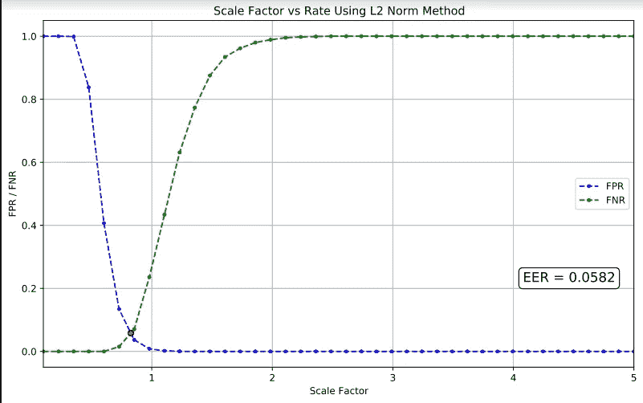**

**图片由作者提供。在红点处，EER 为 0.0582，大约等于比例因子= 0.85**

**为完整起见，我们展示了[**【ROC】**](https://en.wikipedia.org/wiki/Receiver_operating_characteristic)**的受试者工作特性来计算曲线下面积(AUC)。AUC 接近 1 意味着分类器接近完美。****

****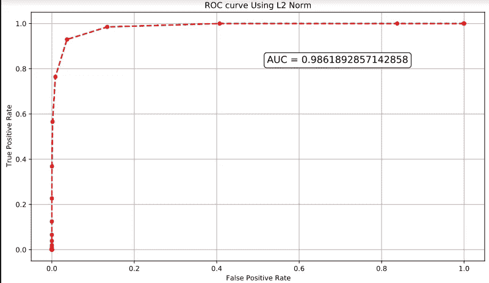****

****图片由作者提供。ROC 曲线显示 AUC = 0.986****

# ****结论****

****总之，连体网络的三联体丢失是创建指纹认证器的一个很好的方法。****

****对于某个阈值距离，我们可以缩放嵌入并计算 EER，以找到模型的最佳精度。****

# ****未来的工作****

****这项工作可以通过以下方式进一步扩展:****

1.  ****对其他生物特征进行类似的测试，如视网膜扫描、面部图像等。****
2.  ****由于 VGG16 是一个相对“沉重”的网络，它会有时间上的性能损失。我们可以尝试一些轻量级网络来测试准确性。****

****该项目的详细描述可以在[这里](https://github.com/abhishek-jana/Fingerprint-Recognition/blob/master/Fingerprint%20Verification%20Using%20Triplet%20loss%20function.ipynb)找到。与项目相关的文章可以在[这里](https://arxiv.org/pdf/2003.08433.pdf)找到。****

# ****参考资料:****

*   ****[Coursera 上的深度学习专业化。](https://www.coursera.org/specializations/deep-learning?utm_source=gg&utm_medium=sem&utm_campaign=17-DeepLearning-US&utm_content=B2C&campaignid=904733485&adgroupid=46370300620&device=c&keyword=coursera%20deep%20learning%20ai&matchtype=b&network=g&devicemodel=&adpostion=&creativeid=415429098219&hide_mobile_promo&gclid=Cj0KCQiA5aWOBhDMARIsAIXLlkeWUoeBGYRaILxiKlale8FN6Ic6dO1GUgcpquUrP4ObYwBWhNgsSlIaAvJpEALw_wcB)****
*   ****[https://arxiv.org/pdf/2003.08433.pdf](https://arxiv.org/pdf/2003.08433.pdf)****
*   ****[https://github . com/abhishek-Jana/Fingerprint-Recognition/blob/master/Fingerprint % 20 verification % 20 using % 20 triplet % 20 loss % 20 function . ipynb](https://github.com/abhishek-jana/Fingerprint-Recognition/blob/master/Fingerprint%20Verification%20Using%20Triplet%20loss%20function.ipynb)****
*   ****[http://bias.csr.unibo.it/fvc2006/](http://bias.csr.unibo.it/fvc2006/)****
*   ****[https://en . Wikipedia . org/wiki/False _ positives _ and _ False _ negatives](https://en.wikipedia.org/wiki/False_positives_and_false_negatives)****
*   ****[https://en.wikipedia.org/wiki/False_positive_rate](https://en.wikipedia.org/wiki/False_positive_rate)****
*   ****[https://en.wikipedia.org/wiki/Biometrics](https://en.wikipedia.org/wiki/Biometrics)****