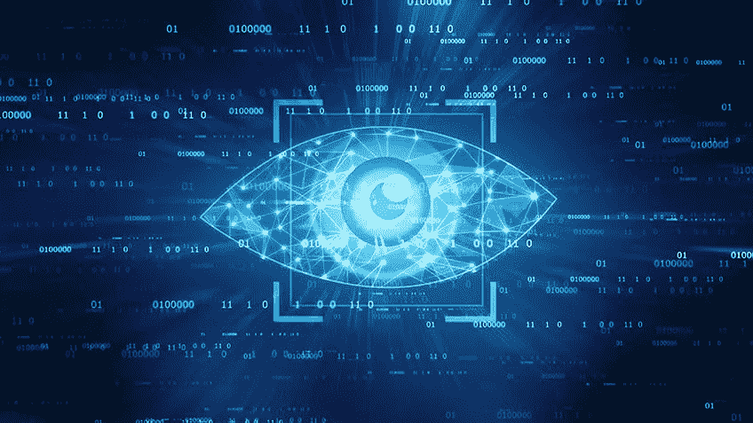
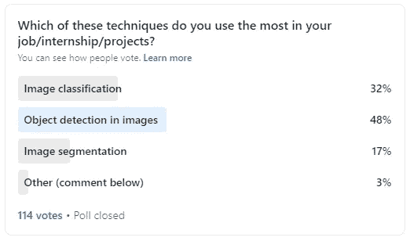

# 计算机视觉的深度学习

> 原文：<https://pub.towardsai.net/deep-learning-for-computer-vision-6e4d2e36de07?source=collection_archive---------1----------------------->

## [计算机视觉](https://towardsai.net/p/category/computer-vision)

来自一位 AI 工程师的行业常见趋势和技术

深度学习在不同行业中被大量采用。深度学习显示出巨大潜力的一个特定领域是计算机视觉。

我个人是计算机视觉硕士毕业，马上就进入行业工作了。所以接下来是*对不同趋势的看法*，我在使用深度学习来解决具有挑战性的计算机视觉问题的公司中看到了这些趋势。

所以回到我的学业上，在硕士课程进行到一半的时候，我在卢森堡的一家制造大型木材扫描仪的公司实习！在这家公司，他们试图在扫描仪上增加一个检测系统，这样就可以快速检测出木板上的缺陷。我和他们的工作包括做两件事:给他们的软件添加一个注释工具，并对将要使用前面提到的注释工具收集的数据做一些实验。

硕士课程结束时，我在另一家公司实习了 6 个月，该公司也从事视觉检测问题的研究。但是这一次，检查的种类多种多样。在这家公司，他们正在建立一个系统来检查许多类型的机器和机械零件，例如，直升机的发动机，飞机的底盘，…等。我与他们的合作包括帮助他们将机器学习砖块添加到不同的检查过程中。完成硕士学位后，我继续从事这项工作，在那里我们建立了一些强大的视觉检测系统。

在过去的几个月里，我一直在为一家做 OCR(光学字符识别)和构建文档成像工具和 SDK 的公司工作。

虽然这些公司都在开发不同的产品，但我事实上注意到，一些深度学习工具和技术在这些行业中都有使用。

对这些行业(以及我在这里没有提到的其他行业)有用的三种深度学习技术是图像识别(图像分类)、对象检测(定位)和图像分割。

如果你像我一样是深度学习趋势的狂热追随者，你可能已经看到了这些天的其他新趋势，如 SSL(自我监督学习)和 GANs(生成对抗网络)。

但问题是，这些大多数都是研究趋势，它们仍然没有在解决计算机视觉相关问题的行业中广泛使用。

因此，虽然图像分类、对象检测和图像分割在研究中有些不流行，但它们在行业中得到广泛应用。

前几天，我在 LinkedIn 上做了一个调查，在那里我问我的社交网络，在这些技术中，他们用得最多的是哪一种。以下是民意调查的结果:

请记住，我的大部分网络都是由机器学习从业者和数据相关的角色组成的。所以看到这些结果证实了我所注意到的。

> **97%** 参与投票的人(所以 **110 人**，大部分如果不是全部都是人工智能工程师或研究人员)在图像分类、物体检测和图像分割之间做出选择。另外 3%的人没有提到他们最常用的另一种技术是什么。

现在，您可能已经非常熟悉这些技术，但在工业设置中应用它们可能会非常不同。作为一名人工智能从业者，你需要围绕这些技术建立完整的管道。

例如，你可能知道图像分类，但你知道如何训练一个用于分类的深度学习模型，然后使用 Docker 将其容器化，然后在其中一个云提供商(GCP、AWS、Azure 等)上运行你的训练吗？您知道如何快速部署您的应用程序以实现您公司正在尝试构建的原型吗？

您可能也熟悉 Tensorflow 2 对象检测 API，但是您知道如何在云上训练您的模型吗？您知道如何通过利用配置文件中的配置可能性将数据扩充添加到您的管道中吗？

如你所见，在这个行业中，很多事情都在变化。现在，你不只是在寻找建立和训练一个模型，然后用一些数据来测试它。现在，你正在建立完整的 ML 管道并维护它们。

因此，尽管从研究角度来看，这些深度学习技术可能不是非常“时髦”，但它们现在在行业中被广泛使用。为什么？

原因很简单，在计算机视觉行业，有太多的场景需要您识别对象(图像分类)或在图像中定位对象(对象检测)，甚至获得对象在图像中位置的像素级精度(图像分割)。

此外，这些技术在深度学习社区中已经众所周知有一段时间了。因此，有很多文件和调查显示，哪些方法工作得更好。也有许多开发良好的工具可以轻松使用这些技术，例如，对于对象检测，有 Tensorflow 的“对象检测 API”和 PyTorch 的“Detectron2”。

因此，如果你打算在一家处理计算机视觉问题的公司工作，那么学习并掌握这些技术对你来说是一笔巨大的财富。

作者制作的图像

我是一名机器学习工程师，致力于解决具有挑战性的计算机视觉问题。我想帮助你学习应用于计算机视觉问题的机器学习。以下是方法。

1.  通过帮助您了解该领域的最新动态。我几乎每天都在 [**、LinkedIn**](https://www.linkedin.com/in/nour-islam-mokhtari-07b521a5/) 和 [**、Twitter**](https://twitter.com/NourIslamMo)****上分享小型博客帖子。**那就跟我去吧！**
2.  **每周给你一份我的 [**时事通讯**](https://nourislam.ck.page/dc3e8b7e12) 上那些琐碎帖子的摘要。所以订阅吧！**
3.  **通过在 Medium 上写关于机器学习不同主题的文章。所以跟我来吧！**
4.  **给你一份免费的机器学习工作清单，帮助你检查你需要学习的所有要点，如果你计划在 ML，特别是在计算机视觉方面的职业生涯。你可以在这里 获得核对表 [**。**](https://www.aifee.co/free-resources)**

**5.最后但同样重要的是，通过与你分享我的 [**免费入门张量流课程**](https://aifee.teachable.com/p/introduction-to-tensorflow-2-for-computer-vision) ，它有超过 ***4 小时*的视频内容**，你可以在那里问我任何问题。**

**此外，如果您有任何问题或者您只是想聊聊 ML，请随时在 LinkedIn 或 Twitter 上联系我！**