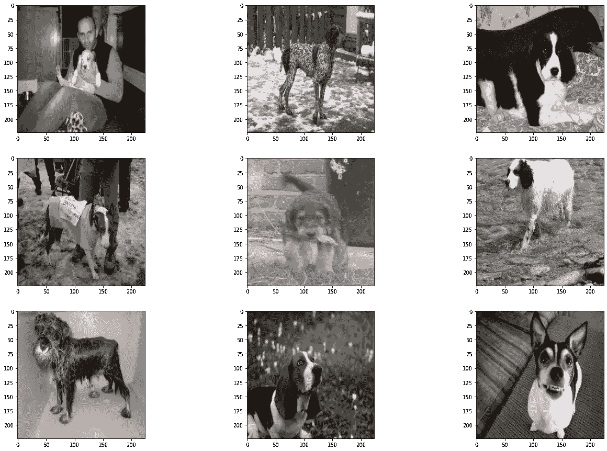
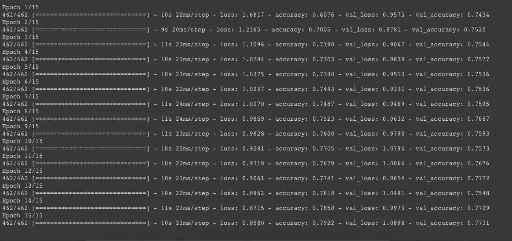
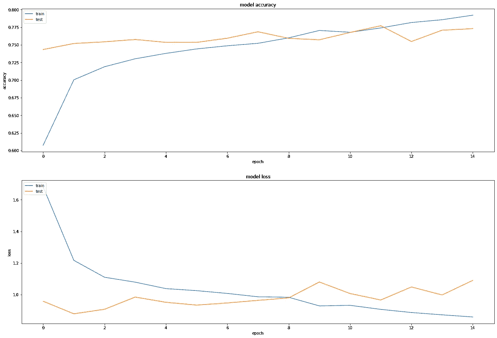
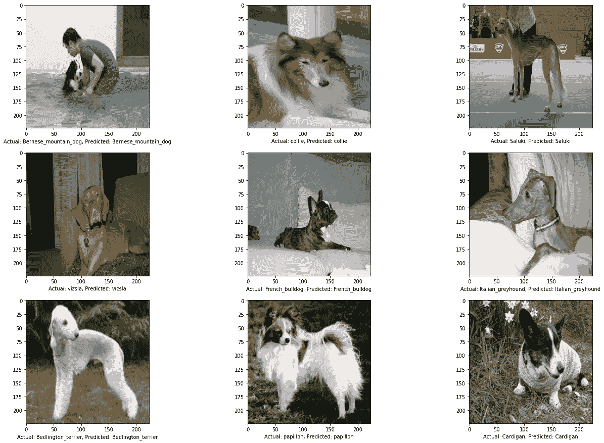

# 用于狗品种分类的深度学习

> 原文：<https://pub.towardsai.net/deep-learning-for-dog-breed-classification-77ef182a2509?source=collection_archive---------1----------------------->

## [深度学习](https://towardsai.net/p/category/machine-learning/deep-learning)

## 一步一步的指南来分类 115 个品种的狗图片！


被困在付费墙后面？点击[这里](https://medium.com/@D3nii/deep-learning-for-dog-breed-classification-77ef182a2509?sk=75f557ce9311099549cb8909a4dff6cb)阅读完整故事与我的朋友链接！

根据 dogtime.com[的说法，世界上有 266 种不同的狗，光是想想这个数字，我就害怕去区分它们。而大部分人，如果正常的话，只知道 5-10 个品种，因为你没有看到学士课程中的章节***【266 种不同犬种】*** 。](https://dogtime.com/dog-breeds/profiles)

# 概观

这个项目的主要目的是建立一个算法来从数据集中分类不同的狗品种。

这似乎是一个简单的任务，但当我们想到机器学习时，它就不是了！这些图像是随机排列的，在图像中的随机空间有狗，这些图像是以不同的亮度拍摄的，没有对数据进行预处理，它只是一个包含简单狗图片的数据集。

所以，第一步是看一下数据集。

# 环境和工具

*   [scikit-learn](https://scikit-learn.org/stable/)
*   [Keras](https://keras.io/)
*   [数字价格](https://www.numpy.org/)
*   [熊猫](https://pandas.pydata.org/)
*   [matplotlib](https://matplotlib.org/)

# 数据

这个项目使用的数据集是[斯坦福狗数据集](http://vision.stanford.edu/aditya86/ImageNetDogs/main.html)。该数据集包含 120 种不同狗品种的总共 20，580 张图像。

> 斯坦福狗数据集包含来自世界各地的 120 种狗的图像。这个数据集是使用 ImageNet 中的图像和注释构建的，用于细粒度的图像分类任务。

## 导入库

```
import os
import sys
import keras
import tarfile
import numpy as np
import tensorflow as tf
import matplotlib.pyplot as pltfrom keras.models import Sequential
from keras.engine.training import Model
from sklearn.preprocessing import LabelBinarizer
from keras.preprocessing.image import ImageDataGenerator
from keras.layers import Add, Dropout, Flatten, Dense, Activation
```

## 数据预处理

我发现 5 个目录是不可用的，因此，没有使用它们。所以，我一共进口了 115 个品种。

```
import cv2BASEPATH = './Images'
LABELS = set()
paths = []for d in os.listdir(BASEPATH):
LABELS.add(d)
paths.append((BASEPATH + '/' + d, d))# resizing and converting to RGB
def load_and_preprocess_image(path):
image = cv2.imread(path)
image = cv2.resize(image, (224, 224))
image = cv2.cvtColor(image, cv2.COLOR_BGR2RGB)
return imageX, y = [], []
i = 0for path, label in paths:
i += 1# Faulty Directories
if i == 18 or i == 23 or i == 41 or i == 49 or i == 90: continue 
if path == "./Images/.DS_Store": continuefor image_path in os.listdir(path):
image = load_and_preprocess_image(path + "/" + image_path)
X.append(image)
y.append(label)
```

现在，文件夹的名称是这个模式*‘n 8725563753-Husky’*，因此，我们需要清理它，以保留名称的*‘Husky’*部分。

```
Y = []# Cleaning the names of the directories/targets
for i in y:
Y.append(i.split('-')[1])
```

## 标签二值化器

这个依赖来自于 *sklearn.preprocessing* ，用于获得字符串的二进制表示。*我们为什么要在这里使用它？*我们不能在模型中使用*‘哈士奇’*作为目标，我们需要把它转换成可用的数据类型，*数字*。因此，我们使用这个。

```
encoder = LabelBinarizer()y = encoder.fit_transform(np.array(y))
```

## 拆分数据

我们正在使用来自*sk learn . model _ selection*的[*train _ test _ split*](https://www.google.com/url?sa=t&rct=j&q=&esrc=s&source=web&cd=&cad=rja&uact=8&ved=2ahUKEwjNl_SCxq_rAhXkzIUKHUdoA1kQFjAAegQIAxAB&url=http%3A%2F%2Fscikit-learn.org%2Fstable%2Fmodules%2Fgenerated%2Fsklearn.model_selection.train_test_split.html&usg=AOvVaw0VvM_hdQkS03aadJz9AKKA)依赖项。

> `*train_test_split*`是 **Sklearn 模型选择**中的一个函数，用于将数据组分成**两个子集**:训练数据和测试数据。有了这个函数，就不需要手动划分数据集了。
> 
> 默认情况下，sk learn**train _ test _ split**会对这两个子集进行随机分区。但是，您也可以为操作指定随机状态。

```
from sklearn.model_selection import train_test_splitX = np.array(X)x_train, x_test, y_train, y_test = train_test_split(X, Y, test_size=0.25, random_state=87)
```

现在，在此之后，我们将 *x_train* 和 *x_test* 设置转换为' [float32](https://www.google.com/url?sa=t&rct=j&q=&esrc=s&source=web&cd=&cad=rja&uact=8&ved=2ahUKEwim7frZxq_rAhUHxoUKHS8KAG0QFjAAegQIAhAB&url=https%3A%2F%2Fen.wikipedia.org%2Fwiki%2FSingle-precision_floating-point_format&usg=AOvVaw3DqSYfqL4CmisjyXTtDMSU) '和 [normalize](https://www.google.com/url?sa=t&rct=j&q=&esrc=s&source=web&cd=&cad=rja&uact=8&ved=2ahUKEwiq543fxq_rAhUKyxoKHXItBdgQFjABegQIERAE&url=https%3A%2F%2Fwww.merriam-webster.com%2Fdictionary%2Fnormalize&usg=AOvVaw2iiqm4mxvTiS1Q-BZelFQ2) 。

```
x_train = x_train.astype("float32") / 255.0
x_test = x_test.astype("float32") / 255.0
```

## 最初查看数据

这些是我们要让我们的模型学习的图片。



# 迁移学习

现在，迁移学习可能是一个需要单独解释的完整主题，但我在这里只触及冰山一角。

> 迁移学习是一种机器学习技术，其中在一个任务上训练的模型被重新用于第二个相关的任务。

***我们为什么要使用迁移学习？*** 你不想训练一个有数百万节点的模型，一次又一次地在你的项目中使用，因此你有这个概念。迁移学习的概念是，你使用一个预先训练好的模型，只需重新训练一些层来适应你的要求。

```
from keras.applications import inception_v3input_size = 224
num_classes = 115inception_bottleneck = inception_v3.InceptionV3(weights='imagenet', include_top=False, pooling='avg')temp_train = inception_bottleneck.predict(x_train, batch_size=32, verbose=1)
temp_test = inception_bottleneck.predict(x_test, batch_size=32, verbose=1)print('InceptionV3 train bottleneck features shape: {} size: {:,}'.format(temp_train.shape, temp_train.size))
print('InceptionV3 test bottleneck features shape: {} size: {:,}'.format(temp_test.shape, temp_test.size))
```

我们将`*include_top*` 参数设置为 False，这意味着我们不会导入最后一层，即密集层，我们会使用自己的层来调整模型以适应我们的数据集。

[](https://medium.com/analytics-vidhya/what-is-transfer-learning-weight-initialization-a997d83963bb) [## 什么是迁移学习和权重初始化？

### 欢迎大家！这是我在一个月内完成深度学习 Nanodegree 的旅程中的第七篇文章！我已经…

medium.com](https://medium.com/analytics-vidhya/what-is-transfer-learning-weight-initialization-a997d83963bb) 

## 致密层

在这之后，我们添加 3 个[密集层](https://www.google.com/url?sa=t&rct=j&q=&esrc=s&source=web&cd=&cad=rja&uact=8&ved=2ahUKEwjy_vqcya_rAhWQzIUKHRSMAugQFjABegQIDRAD&url=https%3A%2F%2Fwww.tutorialspoint.com%2Fkeras%2Fkeras_dense_layer.htm&usg=AOvVaw0URJwEDmeThpxsnyoLRBA-)到深度为 1024、512 和 115 的模型中，类别数。

```
model = Sequential()model.add(Flatten())model.add(Dense(1024, activation='elu'))
model.add(Dropout(0.45))
model.add(Dense(512, activation='elu'))
model.add(Dropout(0.35))model.add(Dense(num_classes, activation='softmax'))
```

然后，我们编译这个。

```
model.compile(optimizer=’adam’,
loss=’categorical_crossentropy’, metrics=[‘accuracy’])
```

然后，最后，训练。

```
history = model.fit(temp_train, Y_train,
epochs = 15,
batch_size = 32,
validation_data = (temp_test, Y_test))
```

***现在，你看到了吗？*** 我们这里用`*temp_train*` 和`*temp_test*` 代替`*x_train*` 和`*x_test*` *。这是因为我们想扩展我们的初始模型，不使用这种顺序模型从零开始训练。*



## 损失图

```
score = model.evaluate(temp_test, Y_test, verbose=0)
print("%s: %.2f%%" % (model.metrics_names[1], score[1]*100))# summarize history for accuracyplt.subplot(211)
plt.plot(history.history['accuracy'])
plt.plot(history.history['val_accuracy'])
plt.title('model accuracy')
plt.ylabel('accuracy')
plt.xlabel('epoch')
plt.legend(['train', 'test'], loc='upper left')# summarize history for lossplt.subplot(212)
plt.plot(history.history['loss'])
plt.plot(history.history['val_loss'])
plt.title('model loss')
plt.ylabel('loss')
plt.xlabel('epoch')
plt.legend(['train', 'test'], loc='upper left')plt.subplots_adjust(right=3, top=3)plt.show()
```



# 结果和结论

所以，经过这一切，我们达到了 ***77.31%*** 的准确率，老实说，考虑到有 115 个不同的类，这个模型做得相当不错。

## 可视化结果

```
for i in range(9):
pyplot.subplot(330 + 1 + i)
pyplot.xlabel("Actual: " + y_test[i] + ", Predicted: " + results[i])
pyplot.imshow(x_test[i], cmap=pyplot.get_cmap('gray'))plt.subplots_adjust(right=3, top=3)pyplot.show()
```



幸运的是，这是数据的一个子集，没有分类错误。*呵呵*

## 可以做出的改进

我仍然认为，增加一个更密集的层可以有所不同，预处理数据肯定会有所帮助，但我们稍后会尝试一下。:D

好了，我希望这篇文章能帮助你。我们上 [*Linkedin*](https://www.linkedin.com/in/d3ni/) 连线吧！

# 进一步阅读

[](https://medium.com/towards-artificial-intelligence/deep-learning-for-house-number-detection-25a45e62c8e5) [## 用于门牌号检测的深度学习

### 让我带你走一遍。

medium.com](https://medium.com/towards-artificial-intelligence/deep-learning-for-house-number-detection-25a45e62c8e5) [](https://medium.com/swlh/a-guide-to-generative-adversarial-networks-gans-b3e445c34933) [## 生成对抗网络指南

### 第 18 天

medium.com](https://medium.com/swlh/a-guide-to-generative-adversarial-networks-gans-b3e445c34933) [](https://medium.com/analytics-vidhya/lets-discuss-encoders-and-style-transfer-c0494aca6090) [## 让我们讨论编码器和风格转换

### 自动编码器和风格转移小指南。

medium.com](https://medium.com/analytics-vidhya/lets-discuss-encoders-and-style-transfer-c0494aca6090) 

# 联系人

如果你想了解我最新的文章和项目[，请关注我的媒体](/@D3nii)。以下是我的一些联系人详细信息:

*   [领英](https://www.linkedin.com/in/d3ni/)
*   [GitHub](https://github.com/D3nii?tab=repositories)
*   [推特](https://twitter.com/danyal0_o)

> 快乐学习。:)