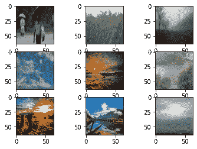
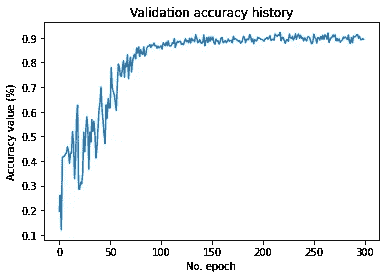

# 用于天气分类的深度学习

> 原文：<https://pub.towardsai.net/deep-learning-for-weather-classification-fe877cdc721c?source=collection_archive---------2----------------------->

## [深度学习](https://towardsai.net/p/category/machine-learning/deep-learning)

## 在不同的天气状态之间分类！


由 [NOAA](https://unsplash.com/@noaa?utm_source=medium&utm_medium=referral) 在 [Unsplash](https://unsplash.com?utm_source=medium&utm_medium=referral) 上拍摄的照片

被困在付费墙后面？点击[这里](https://medium.com/@D3nii/deep-learning-for-weather-classification-fe877cdc721c?sk=34216c1b9b4ed199feda20c7510d76f3)阅读完整故事与我的朋友链接！

谁不喜欢日落？但你有没有想过，它们为什么这么美？是什么让那些云突然显得超级好看？仅仅是那团巨大的热物质发出的光束吗？嗯，这篇文章不是要回答这个问题，而是试图根据提供的图片对不同的天气状况进行分类。

# 概观

这个项目的主要目的是制作一个模型，在它看到的图像上正确地分类天气状态。

这看起来很简单，但是模型面临的主要挑战是它不需要了解图像中物体的形状，例如云等等。相反，它需要了解图像中天空的颜色。但是它也需要知道哪里的云实际上代表了多云的天气或者只是在那里。

# 密码？

该项目可在 [my Github Repo](https://github.com/D3nii/Keras-Projects/tree/master/Whether%20Classification) 上获得。

# 环境和工具

*   [scikit-learn](https://scikit-learn.org/stable/)
*   [Keras](https://keras.io/)
*   [数字价格](https://www.numpy.org/)
*   [熊猫](https://pandas.pydata.org/)
*   [matplotlib](https://matplotlib.org/)

# 数据

所以，第一步是看一下数据集。

本项目使用的数据集是[多类天气数据集](https://data.mendeley.com/datasets/4drtyfjtfy/1)。

> 用于图像分类的多类天气数据集(MWD)是一个有价值的数据集，用于题为“使用非均匀集成方法从静止图像进行多类天气识别”的研究论文中。该数据集通过提取各种特征来识别不同的天气条件，从而为户外天气分析提供了一个平台。

# 导入库

```
**import** **os**
**import** **sys**
**import** **keras**
**import** **tarfile**
**import** **numpy** **as** **np**
**import** **tensorflow** **as** **tf**
**import** **urllib.request** **as** **urllib**
**import** **matplotlib.pyplot** **as** **plt**
**from** **keras.regularizers** **import** l2
**from** **keras.models** **import** Sequential
**from** **keras.optimizers** **import** Adam, SGD
**from** **keras.engine.training** **import** Model
**from** **keras** **import** backend **as** K, regularizers
**from** **keras.callbacks** **import** LearningRateScheduler
**from** **keras.preprocessing.image** **import** ImageDataGenerator
**from** **keras.layers** **import** Add, Conv2D, MaxPooling2D, Dropout, Flatten, Dense, BatchNormalization, Activation
```

# 数据预处理

共有 2631 幅图像，分属 7 种类型。

```
**from** **PIL** **import** Image
**import** **os**, **glob**
**import** **numpy** **as** **np**
**from** **sklearn.model_selection** **import** train_test_splitdir = '/content/gdrive/My Drive/Temp/Whether/dataset'
categories = sorted(os.listdir(dir))
nb_classes = len(categories)X = []
Y = []
image_w = 64
image_h = 64**for** idx, f **in** enumerate(categories):
    label = [0 **for** i **in** range(nb_classes)] 
    label[idx] = 1
    image_dir = dir + "/" + f 
    files = glob.glob(image_dir + "/*.jpg")**for** i, fname **in** enumerate(files):
        img = Image.open(fname)
        img = img.convert("RGB")
        img = img.resize((image_w, image_h))
        data = np.asarray(img)
        X.append(data)
        Y.append(label)

**for** ang **in** range(-20, 20, 5):
    img2 = img.rotate(ang)
    data = np.asarray(img2) 
    X.append(data)
    Y.append(label)img2 = img2.transpose(Image.FLIP_LEFT_RIGHT)
    data = np.asarray(img2) 
    X.append(data)
    Y.append(label)
```

现在，让我们将数据转换为测试和训练分割。

```
X = np.array(X)
Y = np.array(Y)x_train, x_test, y_train, y_test = train_test_split(X, Y)
```

接下来，标准化数据。

```
x_train = x_train.astype("float32") / 255.0
x_test = x_test.astype("float32") / 255.0print('X_train shape: ', x_train.shape[0]) # X_train shape: 1973
print('Y_train shape: ', y_train.shape)    # Y_train shape:(1973, 7)
```

让我们来看看数据集。

```
**from** **matplotlib** **import** pyplot*# summarize loaded dataset*
print('Train: X=**%s**, y=**%s**' % (x_train.shape, y_train.shape))
print('Test: X=**%s**, y=**%s**' % (x_test.shape, y_test.shape))*# plot first few images*
**for** i **in** range(9):
	*# define subplot*
	pyplot.subplot(330 + 1 + i)*# plot raw pixel data*
	pyplot.imshow(x_train[i], cmap=pyplot.get_cmap('gray'))*# show the figure*
pyplot.show()
```



# 图像增强

我们将稍微改变一些图像，以获得更好的概括和更好的整体效果。

```
*# applying transformation to image* 
train_gen = ImageDataGenerator(         
rotation_range=20,           
zoom_range = 0.15,           
width_shift_range=0.5,          
height_shift_range=0.5,         
brightness_range=[0.25,1.5],         
horizontal_flip=**True**, )*# test_gen = ImageDataGenerator()*train_gen.fit(x_train)  
test_set = train_gen.flow(x_test, y_test, batch_size=256)
```

# 模型架构

有趣的部分来了！我在这里设计的架构由 6 个[卷积](https://en.wikipedia.org/wiki/Convolutional_neural_network)模块组成！

现在，我使用卷积层:

*   [内核大小](https://www.google.com/url?sa=t&rct=j&q=&esrc=s&source=web&cd=&cad=rja&uact=8&ved=2ahUKEwjWmNaWlP_qAhXC3YUKHZ5EDIIQFjAXegQIAhAB&url=https%3A%2F%2Fwww.sciencedirect.com%2Ftopics%2Fengineering%2Fkernel-size&usg=AOvVaw2o-WRxmZrPtY0R_gavIhr3) : 3
*   [内核初始化器](https://keras.io/api/layers/initializers/):[***he _ uniform***](https://www.google.com/url?sa=t&rct=j&q=&esrc=s&source=web&cd=&cad=rja&uact=8&ved=2ahUKEwjN2-SNlf_qAhXFxoUKHaNACgUQFjAAegQIARAB&url=https%3A%2F%2Fwww.tensorflow.org%2Fapi_docs%2Fpython%2Ftf%2Fkeras%2Finitializers%2FHeUniform&usg=AOvVaw3JZZwRf8N4yIseWbjODgD6)
*   [内核正则化](https://keras.io/api/layers/regularizers/):[***L2***](https://www.google.com/url?sa=t&rct=j&q=&esrc=s&source=web&cd=&cad=rja&uact=8&ved=2ahUKEwir55LFlP_qAhUK9IUKHWuEDTkQFjABegQIBRAB&url=https%3A%2F%2Farxiv.org%2Fpdf%2F1205.2653&usg=AOvVaw2tza0OEnBAIJ19HrSEfM6m)
*   [激活](https://www.google.com/url?sa=t&rct=j&q=&esrc=s&source=web&cd=&cad=rja&uact=8&ved=2ahUKEwjX9Lr4lP_qAhXHxYUKHfy9DFQQFjAIegQIAhAB&url=https%3A%2F%2Fen.wikipedia.org%2Fwiki%2FActivation_function&usg=AOvVaw1mbqcQWcxK0bwZ0LpjldIN) : [***埃鲁***](https://www.google.com/url?sa=t&rct=j&q=&esrc=s&source=web&cd=&cad=rja&uact=8&ved=2ahUKEwjU1-mBlf_qAhUCy4UKHb5eCuEQFjAGegQIARAB&url=https%3A%2F%2Fsefiks.com%2F2018%2F01%2F02%2Felu-as-a-neural-networks-activation-function%2F&usg=AOvVaw3OnGX-Nu0Z-iPbWFQMBt3t)
*   [最大池](https://www.google.com/url?sa=t&rct=j&q=&esrc=s&source=web&cd=&cad=rja&uact=8&ved=2ahUKEwjj6r-elf_qAhUIfBoKHZ8GAm0QFjAAegQIBRAB&url=https%3A%2F%2Fkeras.io%2Fapi%2Flayers%2Fpooling_layers%2Fmax_pooling2d%2F&usg=AOvVaw0lrhZz3TwYno3YFpazYe5U) : (2，2)
*   [批量正常化](https://www.google.com/url?sa=t&rct=j&q=&esrc=s&source=web&cd=&cad=rja&uact=8&ved=2ahUKEwi__uTLlf_qAhVKzoUKHcMKAvMQFjAAegQIARAB&url=https%3A%2F%2Fkeras.io%2Fapi%2Flayers%2Fnormalization_layers%2Fbatch_normalization%2F&usg=AOvVaw2NT_Zm_P4hYX3yYxWZvzEb)

然后是两层[密密麻麻的](https://www.google.com/url?sa=t&rct=j&q=&esrc=s&source=web&cd=&cad=rja&uact=8&ved=2ahUKEwim8uz8lf_qAhXQy4UKHZJaDBYQFjAZegQIDBAQ&url=https%3A%2F%2Fwww.tutorialspoint.com%2Fkeras%2Fkeras_dense_layer.htm&usg=AOvVaw0URJwEDmeThpxsnyoLRBA-)跟:

*   [内核正则化](https://keras.io/api/layers/regularizers/):[***L2***](https://www.google.com/url?sa=t&rct=j&q=&esrc=s&source=web&cd=&cad=rja&uact=8&ved=2ahUKEwir55LFlP_qAhUK9IUKHWuEDTkQFjABegQIBRAB&url=https%3A%2F%2Farxiv.org%2Fpdf%2F1205.2653&usg=AOvVaw2tza0OEnBAIJ19HrSEfM6m)
*   [激活](https://www.google.com/url?sa=t&rct=j&q=&esrc=s&source=web&cd=&cad=rja&uact=8&ved=2ahUKEwjX9Lr4lP_qAhXHxYUKHfy9DFQQFjAIegQIAhAB&url=https%3A%2F%2Fen.wikipedia.org%2Fwiki%2FActivation_function&usg=AOvVaw1mbqcQWcxK0bwZ0LpjldIN):[r***elu***](https://r.search.yahoo.com/_ylt=AwrIAX5sRVlfq4IAiw53Bwx.;_ylu=X3oDMTByaW11dnNvBGNvbG8DaXIyBHBvcwMxBHZ0aWQDBHNlYwNzcg--/RV=2/RE=1599714797/RO=10/RU=https%3a%2f%2fmachinelearningmastery.com%2frectified-linear-activation-function-for-deep-learning-neural-networks%2f/RK=2/RS=eOa0gUzVvFwrRiCWJFRlne7fxU0-)
*   [批量正常化](https://www.google.com/url?sa=t&rct=j&q=&esrc=s&source=web&cd=&cad=rja&uact=8&ved=2ahUKEwi__uTLlf_qAhVKzoUKHcMKAvMQFjAAegQIARAB&url=https%3A%2F%2Fkeras.io%2Fapi%2Flayers%2Fnormalization_layers%2Fbatch_normalization%2F&usg=AOvVaw2NT_Zm_P4hYX3yYxWZvzEb)` 1

```
model = Sequential() *# Block 1* model.add(Conv2D(32, kernel_size=3, kernel_initializer='he_uniform', kernel_regularizer=l2(0.0005), padding='same', input_shape=(64, 64, 3))) 
model.add(Activation('elu')) 
model.add(BatchNormalization()) 
model.add(MaxPooling2D(2, 2))*# Block 2* 
model.add(Conv2D(64, kernel_size=3, kernel_initializer='he_uniform', kernel_regularizer=l2(0.0005), padding='same')) model.add(Activation('elu')) 
model.add(BatchNormalization()) 
*# model.add(MaxPooling2D(2, 2))**# Block 3* 
model.add(Conv2D(128, kernel_size=3, kernel_initializer='he_uniform', kernel_regularizer=l2(0.0005), padding='same')) 
model.add(Activation('elu')) model.add(BatchNormalization()) 
model.add(MaxPooling2D(2, 2))*# Block 4* 
model.add(Conv2D(256, kernel_size=3, kernel_initializer='he_uniform', kernel_regularizer=l2(0.0005), padding='same')) 
model.add(Activation('elu')) 
model.add(BatchNormalization()) 
*# model.add(MaxPooling2D(2, 2))**# Block 5* 
model.add(Conv2D(512, kernel_size=3, kernel_initializer='he_uniform', kernel_regularizer=l2(0.0005), padding='same')) 
model.add(Activation('elu')) 
model.add(BatchNormalization()) 
model.add(MaxPooling2D(2, 2))*# Block 6* 
model.add(Conv2D(1024, kernel_size=3, kernel_initializer='he_uniform', kernel_regularizer=l2(0.0005), padding='same')) 
model.add(Activation('elu')) 
model.add(BatchNormalization()) 
*# model.add(MaxPooling2D(2, 2))*model.add(Flatten())*# Dense 1* model.add(Dense(1400, kernel_regularizer=l2(0.0005))) model.add(Activation('relu')) 
model.add(BatchNormalization())*# Dense 2* 
model.add(Dense(7, kernel_regularizer=l2(0.0005), activation='softmax'))*# Visualize Model* 
model.summary()
```

# 超级参数设置

> *在机器学习中，* ***超参数*** *优化或调优就是为一个学习算法选择一个* ***集合*** *的最优超参数的问题。一个* ***超参数*** *是一个* ***参数*** *，其值用于控制学习过程。相比之下，学习其他* ***参数*** *(通常为节点权重)的值。[3]*

我使用了一个定制的学习率修改函数:initial_lr = 1e-2

```
**def** lr_scheduler(epoch):
    **if** epoch < 20:
        **return** initial_lr
    **elif** epoch < 40:
        **return** initial_lr / 20
    **elif** epoch < 50:
        **return** initial_lr / 40
    **elif** epoch < 60:
        **return** initial_lr / 80
    **elif** epoch < 70:
        **return** initial_lr / 160
    **elif** epoch < 80:
        **return** initial_lr / 320
    **elif** epoch < 90:
        **return** initial_lr / 640
    **else**:
        **return** initial_lr / 1280model.compile(
    loss = 'categorical_crossentropy',
    optimizer = Adam(initial_lr),
    metrics = ['accuracy']
)
```

参数:

*   [损失函数](https://www.google.com/url?sa=t&rct=j&q=&esrc=s&source=web&cd=&cad=rja&uact=8&ved=2ahUKEwi1h4DPmP_qAhVlyoUKHYa3DGIQFjAAegQIAxAB&url=https%3A%2F%2Fen.wikipedia.org%2Fwiki%2FLoss_function&usg=AOvVaw3ExpvDmdNsYsL2BHwgxNrI) : [分类交叉熵](https://www.google.com/url?sa=t&rct=j&q=&esrc=s&source=web&cd=&cad=rja&uact=8&ved=2ahUKEwi5msTomP_qAhXoxoUKHYQADVsQFjACegQIAxAB&url=https%3A%2F%2Fpeltarion.com%2Fknowledge-center%2Fdocumentation%2Fmodeling-view%2Fbuild-an-ai-model%2Floss-functions%2Fcategorical-crossentropy&usg=AOvVaw2Jn0FaQesQ8uuPWqlUrhHU)
*   [优化器](https://www.google.com/url?sa=t&rct=j&q=&esrc=s&source=web&cd=&cad=rja&uact=8&ved=2ahUKEwjXwoGow__qAhU98uAKHVJLDxwQFjABegQIARAB&url=https%3A%2F%2Fkeras.io%2Fapi%2Foptimizers%2F&usg=AOvVaw0FAGroezYYk-tZ5VFEZDDa) : [亚当](https://www.google.com/url?sa=t&rct=j&q=&esrc=s&source=web&cd=&cad=rja&uact=8&ved=2ahUKEwjzrfC1w__qAhVN4eAKHaGkDu8QFjAQegQICxAR&url=https%3A%2F%2Fmachinelearningmastery.com%2Fadam-optimization-algorithm-for-deep-learning%2F&usg=AOvVaw3DyIH6zRqOJ31iqVVAy1z-)
*   度量= ['准确性']

# 培养

所以，我训练了 300 个纪元的网络。

```
history = model.fit(   
x_train, y_train,   
epochs=300,   
verbose=1,   
validation_data=(x_test, y_test),   
callbacks=[keras.callbacks.LearningRateScheduler(lr_scheduler)],   shuffle=**True** 
)
```

# 失败

```
score = model.evaluate(x_test, y_test, verbose=0)
print(f'Test loss: **{score[0]}** / Test accuracy: {score[1]*100}')*# Visualize history*
*# Plot history: Loss*
plt.plot(history.history['val_loss'])
plt.title('Validation loss history')
plt.ylabel('Loss value')
plt.xlabel('No. epoch')
plt.show()*# Plot history: Accuracy*
plt.plot(history.history['val_accuracy'])
plt.title('Validation accuracy history')
plt.ylabel('Accuracy value (%)')
plt.xlabel('No. epoch')
plt.show()
```


验证损失

很明显，该模型在第一个<50 epochs.



Validation Accuracy

But we see a different trend in the Accuracy side of things. Here, the model started to get to 90% in the later 70–80 epochs.

# Results & Conclusion

So, after all this, we reached *中迅速将损失值降低到几乎为零 94.52%准确度，老实说，因为有 7 个不同的类别，但训练图像的数量很少，该模型做得相当好。*

# *可以做出的改进*

*我试图用一个较低的学习率来训练这个模型，但是一无所获。我得出的结论是，数据集比得到合理结果所需的要少得多。*

*好了，我希望这篇文章能帮助你。我们上 [*Linkedin*](https://www.linkedin.com/in/d3ni/) 连线吧！*

# *进一步阅读*

*[](https://medium.com/towards-artificial-intelligence/deep-learning-for-dog-breed-classification-7a6752e02f23) [## 用于狗品种分类的深度学习

### 一步一步的指南来分类 115 个品种的狗图片！

medium.com](https://medium.com/towards-artificial-intelligence/deep-learning-for-dog-breed-classification-7a6752e02f23) [](https://medium.com/@D3nii/convolution-neural-network-9320fa32fe9c) [## 卷积神经网络？

### 欢迎大家！这是我在一个月内完成深度学习 Nanodegree 的旅程中的第六篇写作！我已经…

medium.com](https://medium.com/@D3nii/convolution-neural-network-9320fa32fe9c) [](https://medium.com/@D3nii/tackling-common-neural-network-problems-e08b30775100) [## 解决常见的神经网络问题

### 大家好！这是我开始攻读纳米学位并完成第一个学位后的第四篇文章

medium.com](https://medium.com/@D3nii/tackling-common-neural-network-problems-e08b30775100) 

# 联系人

如果你想了解我最新的文章和项目[，请关注我的媒体](https://medium.com/@D3nii)。以下是我的一些联系人详细信息:

*   [领英](https://www.linkedin.com/in/d3ni/)
*   [GitHub](https://github.com/D3nii?tab=repositories)
*   [推特](https://twitter.com/danyal0_o)

> 快乐学习。:)*