# 深度学习:使用 LSTM 预测确诊的新冠肺炎阳性病例

> 原文：<https://pub.towardsai.net/deep-learning-forecasting-of-confirmed-covid-19-positive-cases-using-lstm-8100fa230c7d?source=collection_archive---------1----------------------->

## 描述用于预测印度尼西亚新冠肺炎阳性病例的深度学习方法中的每个步骤

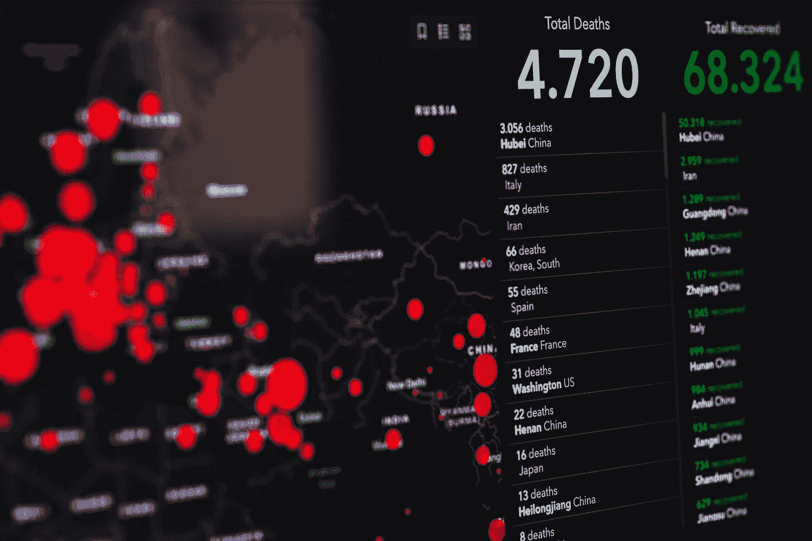

马库斯·斯皮斯克摄于 [Pexels](https://www.pexels.com/photo/coronavirus-statistics-on-screen-3970330/)

# 介绍

几乎世界所有地区都被感染了许多人的新冠肺炎疫情所震惊；甚至有数百万人在这次疫情中丧生。2019 年 12 月，中国湖北省武汉市发现首例新冠肺炎病例。2020 年 1 月 30 日，世界卫生组织(世卫组织)宣布全球进入卫生紧急状态。新冠肺炎传播很快，因为它可以通过半径 2 米内的空气直接传播，也可以在直接接触或感染者打喷嚏或咳嗽时传播[ [3](https://doi.org/10.1016/B978-0-12-824536-1.00027-7) ]。

新冠肺炎疫情在经济、卫生、教育等各个领域对人们的生活产生了重大影响。印度尼西亚政府实施的一些政策包括在公共场所戴口罩、小范围的社会限制、社交距离(2 米)、在线学习、在家工作、关闭各种吸引人群的场所等。[2].然而，并非印尼政府实施的所有政策都能有效防止新冠肺炎病毒的传播。拥有一个可靠的预警方法是非常重要的，以估计这种疾病会对社区造成多大的影响，在此基础上，人们希望政府能够在应对新冠肺炎疫情时实施正确的政策。

我们如何在应对新冠肺炎时找到一个合适的预警方法？*通过机器学习或深度学习，我们可以估计/预测/预测感染新冠肺炎病毒的病例数量*。在我们知道感染新冠肺炎病毒的估计病例有多大后，我们可以通过考虑这些数据来制定应对这种疫情的政策。

> 你可以在这里访问我们使用的[谷歌合作实验室](https://colab.research.google.com/drive/13cCQfZQVmNMY-GzZKA9Qjfa72hBT0Fbe?usp=sharing)

# 工作

我们将分析印度尼西亚的新冠肺炎数据，并创建一个深度学习模型来预测感染新冠肺炎病毒的病例数量。我们的流程包括数据清理和预处理、探索性数据分析、建模和得出结论。

> 我们使用[https://tiny.cc/Datacovidjakarta](https://tiny.cc/Datacovidjakarta)上的数据集

# 导入库

因为我们使用 python 编程语言，所以在本文中我们将使用几个库。我们要做的第一件事是导入所有需要的库。

我们导入 Numpy 来执行计算。用于数据处理的熊猫。用于数据可视化的 Matplotlib、Seaborn 和 Plotly。sci kit-学习在数据预处理、机器学习等方面有用的算法。TensorFlow 用于构建神经网络。

# 数据清理和预处理

在准备或清理数据之前，我们必须使用 pandas 将数据集加载到数据框中。为此，我们可以使用`pd.read_excel()`函数。

我们还使用`.head()`显示数据集的前五行。

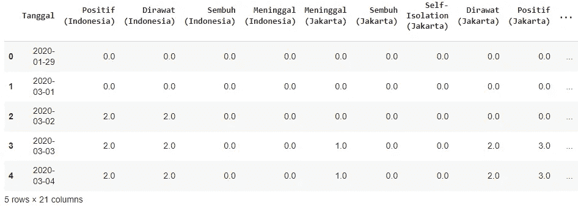

以防我们的数据集在数据清理期间被破坏，我们使用`.copy()`方法来复制我们的数据集。

```
df = data.copy()
```

嗯，这里可能有一些列名无法理解，因为他们使用巴哈萨语，所以我们将使用英语重命名列名。同样，这里我们将只关注分析列`['Positif (Indonesia)', 'Sembuh (Indonesia)', Meninggal (Indonesia)']`。因此，我们将删除不使用的列。

要查看数据集中的信息，我们可以使用`df.info()`。

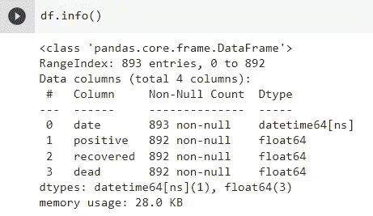

我们使用的数据集有 893 行和 4 列。在`date`列中，有一个`datetime64`数据类型，另一列有一个`float64`数据类型。但是，问题出在日期列，它比其他 3 列有更多的行，因此我们可以假设除了`date`列之外的 3 列中有缺失值。

在代码`df.dropna(inplace=True)`中，我们删除了缺少值的列。然后，在代码`df.drop(index=0, inplace=True)`中，我们删除了第一行，因为它与下面的行相比有不一致的时间差。接下来，我们重置数据集`df.reset_index(drop=True, inplace=True)`的索引。

我们要做的下一件事是检查数据中是否有任何重复和缺失的值，如果有，我们应该删除它们。

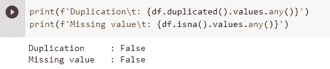

如果结果证明我们的数据中没有重复，那么我们的数据清理过程将到此结束。接下来，我们将进入探索性数据分析过程，但在此之前，我们将再次查看我们的数据框信息，以确保我们的数据清理过程完全完成。

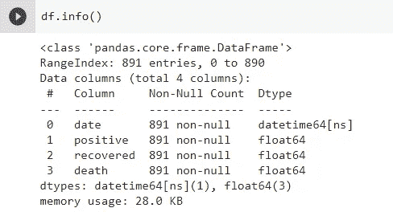

最后，我们应该再次呈现数据集的概述。

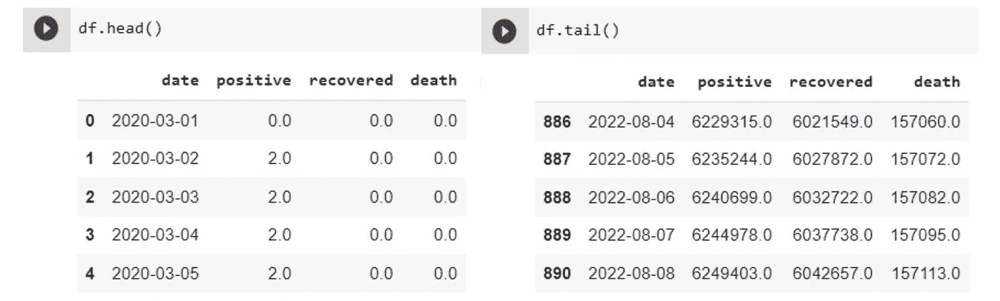

# 探索性数据分析

在这个阶段，我们将探索我们的数据集，并试图了解更多。我们想知道数据集的描述性统计的摘要，为此，我们可以使用`.describe()`和`.transpose()`将行转换成列。

```
df.describe().transpose()
```


接下来想知道阳性确诊病例总数，死亡病例数，痊愈病例数的对比。为此，我们可以将数据可视化，以便更容易理解。

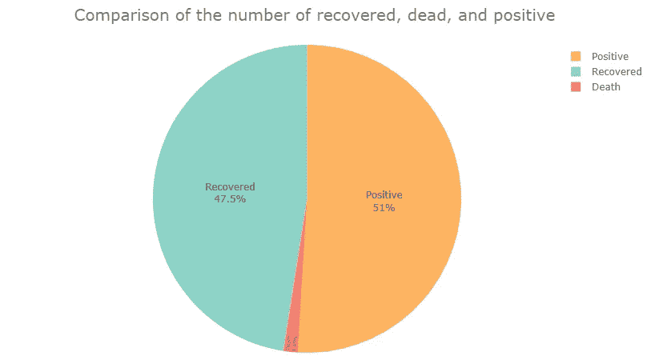

图片由作者提供。

根据上面的饼图，我们可以看出，恢复病例和阳性病例的比较几乎相等。这表明由于感染了新冠肺炎病毒，恢复率很高，但传播率也很高。然后，可以看出，与康复和死亡病例相比，死亡病例的面积较小，这表明由于新冠肺炎病毒，存活率较高。

然后，我们还希望使用折线图查看前一段时间的新冠肺炎案例历史。

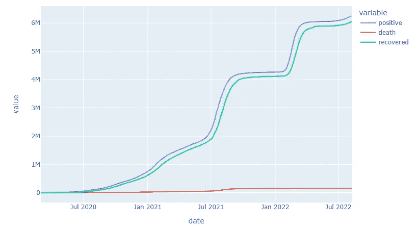

图片由作者提供。

根据上面的折线图，我们可以看到，阳性病例偶尔会快速上升，但新冠肺炎的恢复率也相当高，与非常高的传播率相比，新冠肺炎的死亡人数非常少。

探索数据之间的相关性将是我们探索性数据分析过程的最后一步。


使用热图可视化数据之间的相关性(图片由作者提供)。

这里，我们使用*皮尔逊相关*方法计算数据之间的相关性，这是两个变量之间线性相关性的一种度量。所有这些数据彼此之间有很高的正相关性。我们可以理解为，一个变量值增加，另一个变量值也会增加。就像如果阳性病例上升，回收率也会上升。

# 建模

在创建深度学习模型之前，我们要做的就是先准备好预处理的数据。因为我们关注的是正列，所以我们将删除其他列。

这里，我们还将数据类型更改为`int64`，并将数据帧转换为一维 NumPy 数组。那么，数据一定是经过缩放的。

这里我们使用 Scikit-learn 中的`MinMaxScaler`方法缩放数据。我们也只对总数据集的 80%应用缩放，准确地说，我们只缩放用于模型训练过程的数据。

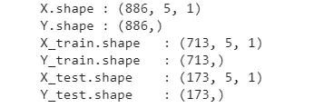

接下来，我们创建一个函数，用于将数据集分为训练数据和测试数据。我们将 80%的训练数据和 20%的测试数据分开。

接下来，我们设计一个用于时间序列数据预测(预报)的神经网络架构。


图片由作者提供。

我们设计了一个神经网络模型使用 Conv1d，LSTM 和辍学层。LSTM 神经元在用于时间序列数据时非常有效。在这里，我们还添加了一个辍学层作为正则化。我们模型中的总参数是 99.521。

在完成构建神经网络架构之后，我们必须定义损失函数的矩阵以及优化器。我们选择均方误差作为损失函数和优化器 Adam(自适应矩估计)。我们基于考虑选择了 Adam，因为它是自适应的，并且需要较少的学习率超参数调整。

```
model.compile(loss= 'mse', optimizer= 'adam')
```

下一步我们将使用已经准备好的数据来训练我们的模型。

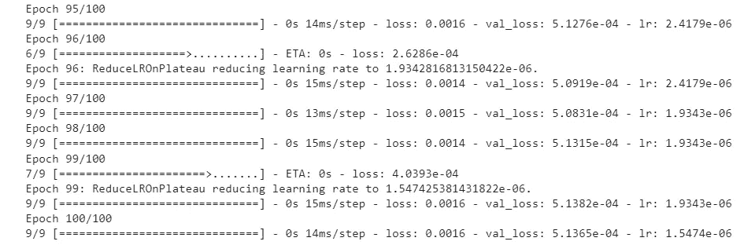

模型训练结果(图片由作者提供)。

当进行模型训练过程时，我们还确定学习速率并执行早期停止。对于学习速率我们选择了`ReduceLROnPlateau`算法，因为学习速率可以根据矩阵自适应(矩阵不增长时学习速率会降低)。

在我们完成对模型的训练后，我们将评估我们训练的模型的性能。

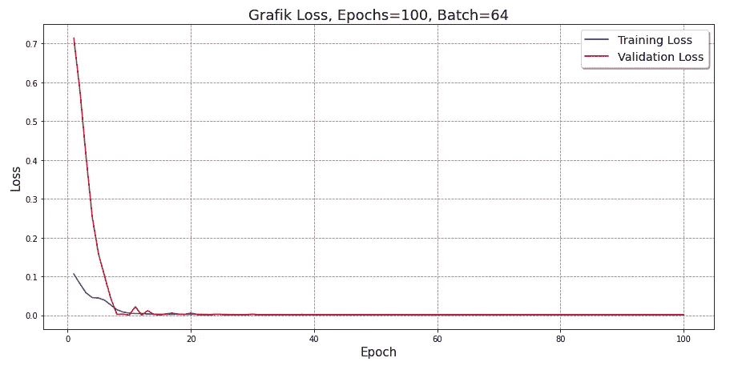

培训和验证损失的可视化(图片由作者提供)。

为了让我们更容易评估模型，我们使用折线图来可视化训练损失和验证损失。从图中可以看出，测试数据中的误差随着时期数的增加而减小。

我们还将比较模型的实际值和预测值。为了便于观察，我们也将它形象化。

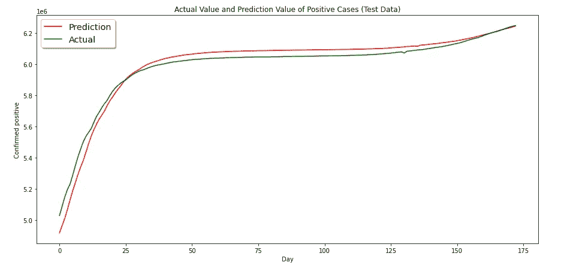

实际值与预测值(图片由作者提供)。

可以看出，模型预测的值接近实际值。然后，我们假设我们的模型表现得相当好。

接下来，我们准备用于预测的数据。

接下来，我们将绘制全部数据，并将其与模型的预测结果进行比较。实际上，它和上面的差不多，但是这里包括了我们所有的数据。

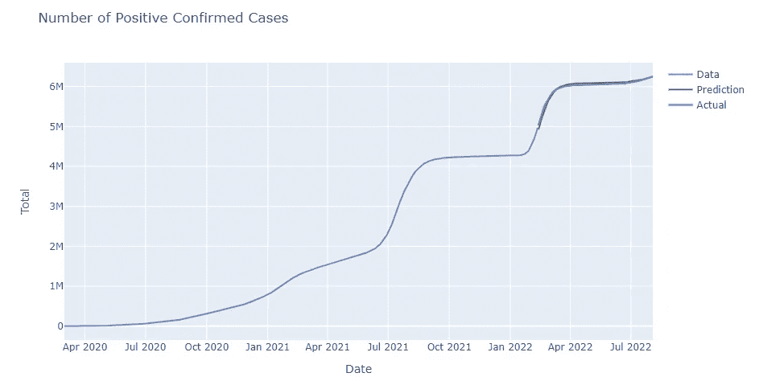

在折线图中，可以看到模型的预测值与实际值几乎相等。

现在我们将预测未来 30 天的新冠肺炎病例。

最后，我们将预测的数据可视化。这也让我们更容易分析和理解数据。

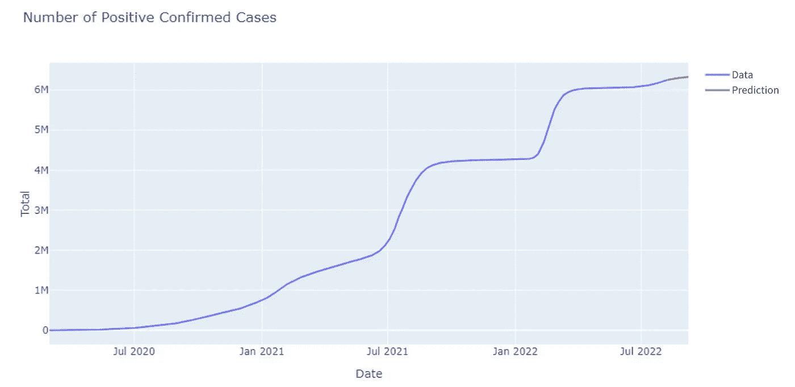

可视化预测输出(作者提供的图片)。

我们使用自己设计和训练的模型对未来 30 天进行预测。之后，我们使用折线图进行了可视化，以查看预测结果。可以看出，未来 30 天，我们的模型预测印尼的新冠肺炎病例将继续增加。

# 摘要

新冠肺炎是今天仍在发生的疫情。明智的决策是基于现有的数据，通过使用这些数据，我们可以预测未来的事件。根据我们所做的过程，我们了解到印尼的新冠肺炎疫情并不太差。这是基于对阳性、康复和死亡病例的比较。

我们专注于正面案例，并建立深度学习模型来预测未来的案例。因此，我们预测新冠肺炎阳性病例在未来 30 天内将继续增加。然而，这也是基于不确定性，我们的模型也不能 100%预测真实的结果。在此基础上，我们还将根据未来的情况做出决定。

# 参考资料:

[1]库尔尼亚万，a .，&库尔尼亚万，F. (202 *1)。利用曲线拟合对新冠肺炎在印度尼西亚传播的时间序列预测。2021 年第三届东印度尼西亚计算机和信息技术会议。*[](https://doi.org/10.1109/eiconcit)

*[2]ge Ron，A. (2019)。*使用 Scikit-Learn、Keras 和 TensorFlow 进行动手机器学习，第二版*(第二版。).奥莱利媒体。*

*[3] Painuli 博士、Mishra 博士、Bhardwaj 博士和 Aggarwal 博士(2021 年)。基于机器学习的新冠肺炎预测预报。*新冠肺炎数据科学*，381–397 页。[https://doi.org/10.1016/b978-0-12-824536-1.00027-7](https://doi.org/10.1016/b978-0-12-824536-1.00027-7)*

*[4]塞蒂亚提，西提&阿兹瓦尔，穆罕默德。(2020).新冠肺炎和印尼。印度尼西亚医学学报。52.84–89.*