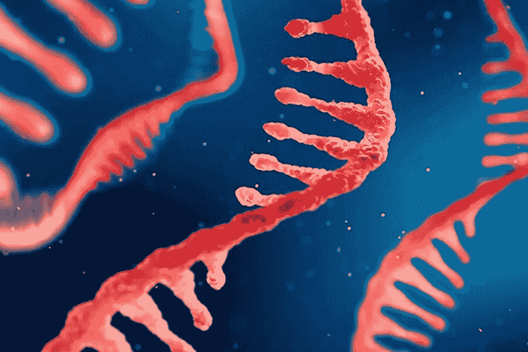
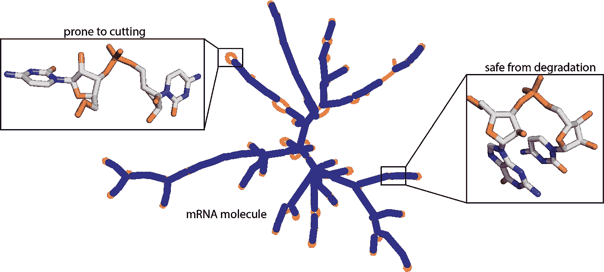
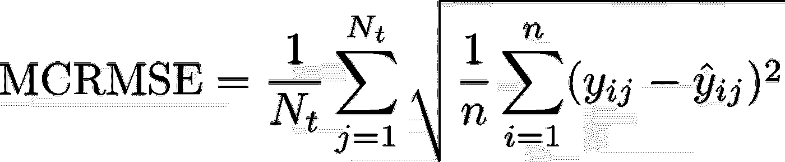
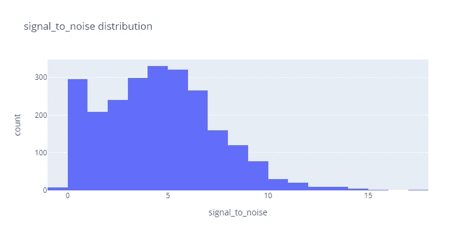
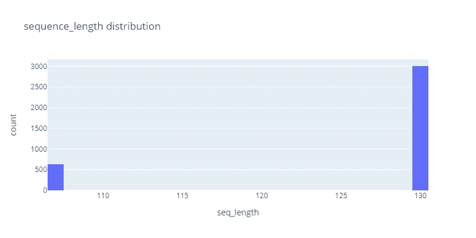
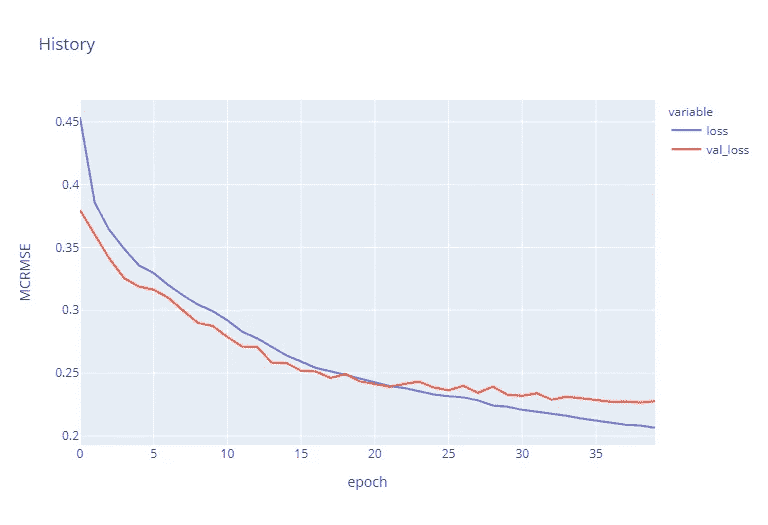

# 预测 mRNA 降解的深度学习模型

> 原文：<https://pub.towardsai.net/deep-learning-model-to-predict-mrna-degradation-1533a7f32ad4?source=collection_archive---------0----------------------->

## [深度学习](https://towardsai.net/p/category/machine-learning/deep-learning)

设计一个深度学习模型，该模型将使用包含 3000 多个 rna 分子的 Eterna 数据集来预测 RNA 分子每个碱基的降解率。



图片 1

mRNA 疫苗处于抗击新冠肺炎疫情病毒的最前沿，但它们也有局限性。信使 RNA (mRNA)分子的稳定性问题限制了我们将其包装在一次性注射器中，并使用制冷系统【nih.gov 将其分发到世界各地。主要的挑战是设计一种稳定的 mRNA 疫苗，这种疫苗可以在全球范围内运输，因为一次切割可以使整个疫苗失效。研究人员还发现，mRNA 分子往往会快速降解，在这个项目中，我们将设计一个模型来预测降解率，这可以帮助科学家和研究人员在未来设计更稳定的疫苗。目前，为了克服这一问题，我们将这些疫苗冷藏，但这也是有限的，因为这些疫苗在世界上可供更少的人使用。 *OpenVaccine:新冠肺炎 mRNA 疫苗降解预测*



图片 2

# 项目目标

在这个项目中，我们将探索我们的数据集，然后预处理序列、结构和预测循环类型特征，以便它们可以用于训练我们的深度学习 GRU 模型。最后预测公共数据集和测试数据集上的退化记录。

# 做好准备

我们将使用 **TensorFlow** 作为我们的主库来构建和训练我们的模型，并使用 JSON/Pandas 来接收数据。为了可视化，我们将使用 Plotly 和 Numpy 进行数据操作。

```
# Dataframe
import json
import pandas as pd
import numpy as np# Visualization
import plotly.express as px# Deeplearning
import tensorflow.keras.layers as L
import tensorflow as tf# Sklearn
from sklearn.model_selection import train_test_split#Setting seeds
tf.random.set_seed(2021)
np.random.seed(2021)
```

# 训练参数

*   目标列:反应性，度毫克 pH10，度毫克 50C，度 pH10，度 50C
*   Model_Train:如果要训练一个需要 1 小时训练的模型，则为 True。

```
# This will tell us the columns we are predicting
target_cols = ['reactivity', 'deg_Mg_pH10', 'deg_Mg_50C', 'deg_pH10', 'deg_50C']
Model_Train = True # True if you want to Train model which take 1 hour to train.
```

我们的模型性能度量是 **MCRMSE** (平均列式均方根误差)，它采用所有目标列的真实值的均方根误差。



其中，和分别是实际值和预测值。

```
def MCRMSE(y_true, y_pred):## Monte Carlo root mean squared errors 
    colwise_mse = tf.reduce_mean(tf.square(y_true - y_pred), axis=1)
    return tf.reduce_mean(tf.sqrt(colwise_mse), axis=1)
```

mRNA 降解数据可在 Kaggle 上获得。

# 列详细说明

*   **id** —样本的唯一标识符。
*   **seq_scored** —这应该与反应性、deg_*和*错误*栏的长度相匹配。
*   **序列长度** —序列的长度。
*   **序列** —描述 RNA 序列，每个样本的 A、G、U 和 C 的组合。
*   **结构** —由(，)和组成的数组。捐献给基地的人物是成对的还是不成对的。
*   **反应性** —这些数字是用于确定 RNA 样品可能的二级结构的前 68 个碱基的反应性值。
*   **deg _ pH10**—pH10 在碱基或连接处无镁孵育后降解的可能性。
*   **deg_Mg_pH10** —在碱基或连接处与 pH10 的镁孵育后降解的可能性。
*   **deg_50C** —底座或连杆在 50 摄氏度下无镁培养后的降解可能性。
*   **deg_Mg_50C** —在底座或连杆处与镁在 50 摄氏度下孵育后降解的可能性。
*   *****_ error _*****—反应性和 deg_*栏中获得的实验值的计算误差。
*   **predicted_loop_type** —维也纳 bpRNA 指定的环类型，建议 S:成对茎，M:多环，I:内环，B:凸起，H:发夹环，E:悬空端，X:外环

# 观察数据

```
data_dir = "stanford-covid-vaccine/"
train = pd.read_json(data_dir + "train.json", lines=True)
test = pd.read_json(data_dir + "test.json", lines=True)
sample_df = pd.read_csv(data_dir + "sample_submission.csv")
```

我们有文本格式的序列、结构和预测循环类型。我们将把它们转换成数字符号，以便它们可以用于训练深度学习模型。然后，我们在从反应性 _ 误差到度数 _50C 的列中有数组，我们将使用它们作为目标。

```
train.head(2)print('Train shapes: ', train.shape) print('Test shapes: ', test.shape)Train shapes:  (2400, 19)
Test shapes:  (3634, 7)
```

测试数据集只有序列、结构、预测循环类型、序列长度、序列得分和 id。我们将使用一个测试数据集来预测公共排行榜分数的下降率。

# 信噪比分布

我们可以看到信噪比分布在 0 到 15 之间，大多数样本位于 0 到 6 之间。我们也有需要摆脱的负面价值观。

```
fig = px.histogram(
    train, 
    "signal_to_noise", 
    nbins=25, 
    title='signal_to_noise distribution', 
    width=800,
    height=400
)
fig.show()
```



```
train = train.query("signal_to_noise >= 1")
```

# 序列测试长度

在观察序列长度分布后，我们知道我们有两个不同的序列长度，一个在 107，另一个在 130。

```
fig = px.histogram(
    test, 
    "seq_length", 
    nbins=25, 
    title='sequence_length distribution', 
    width=800,
    height=400
)
fig.show()
```



# 将测试分为公共和私有数据帧

让我们根据序列长度分割我们的测试数据集。这样做将提高我们的 GRU 模型的整体性能。

```
public_df = test.query("seq_length == 107")private_df = test.query("seq_length == 130")
```

创建一个字符到整数的字典，我们将使用它来转换我们的 RNA 序列，结构和预测循环类型为整数。

```
token2int = {x: i for i, x in enumerate("().ACGUBEHIMSX")}
token2int**{'(': 0, ')': 1, '.': 2, 'A': 3, 'C': 4, 'G': 5, 'U': 6, 'B': 7, 'E': 8, 'H': 9, 'I': 10, 'M': 11, 'S': 12, 'X': 13}**
```

# 将数据帧转换为 3D 数组

下面的函数获取 Pandas 数据框并将其转换为 3D NumPy 数组。我们将使用它来转换培训功能和目标。

```
def dataframe_to_array(df):
   return np.transpose(np.array(df.values.tolist()), (0, 2, 1))
```

# 序列的符号化

下面的函数使用我们之前创建的字符串到整数字典，将训练特征转换为包含整数的数组。然后，我们将使用 dataframe_to_array 将数据集转换为 3D NumPy 数组。

```
def dataframe_label_encoding(
    df, token2int, cols=["sequence", "structure", "predicted_loop_type"]
):
    return dataframe_to_array(
        df[cols].applymap(lambda seq: [token2int[x] for x in seq])
    ) ## tokenization of Sequence, Structure, Predicted loop
```

# 预处理要素和标签

*   在我们的培训功能上使用标签认可功能。
*   将目标数据帧转换为 3D 数组。

```
train_inputs = dataframe_label_encoding(train, token2int) ## Label encoding
train_labels = dataframe_to_array(train[target_cols]) ## dataframe to 3D array to
```

# 培训和验证分离

将我们的训练数据分成训练集和验证集。我们使用信噪比过滤器来平均分配我们的数据集。

```
x_train, x_val, y_train, y_val = train_test_split(
    train_inputs, train_labels, test_size=0.1, random_state=34, stratify=train.SN_filter
)
```

# 预处理公共和私有数据帧

之前，我们根据序列长度将测试数据集分为公共数据集和私有数据集，现在我们将使用 dataframe_label_encoding 对其进行标记化和整形，使其成为 NumPy 数组，就像我们对训练数据集所做的一样。

```
public_inputs = dataframe_label_encoding(public_df, token2int)
private_inputs = dataframe_label_encoding(private_df, token2int)
```

# 培训/评估模型

## 建立模型

在直接进入深度学习模型之前，我们已经测试了其他梯度增强，如 Light GBM 和 CatBoost。当我们处理这个序列时，我用 BiLSTM 模型进行了实验，但是与线性激活的三重 GRU 模型相比，它们的表现都是最差的。

这个模型受到了最初模型的影响，我惊讶地发现，在不使用数据增强或特征工程的情况下，简单的 GRU 图层可以产生尽可能好的结果。

要了解更多关于 RNNs、LSTM 和 GRU 的信息，请参见[这篇博文](https://colah.github.io/posts/2015-08-Understanding-LSTMs/)。

```
def build_model(
    embed_size, # Length of unique tokens 
    seq_len=107, # public dataset seq_len
    pred_len=68, # pred_len for public data
    dropout=0.5, # trying best dropout (general)
    sp_dropout=0.2, # Spatial Dropout
    embed_dim=200, # embedding dimension
    hidden_dim=256, # hidden layer units
):
    inputs = L.Input(shape=(seq_len, 3)) 
    embed = L.Embedding(input_dim=embed_size, output_dim=embed_dim)(inputs)
    reshaped = tf.reshape(
        embed, shape=(-1, embed.shape[1], embed.shape[2] * embed.shape[3])
    )
    hidden = L.SpatialDropout1D(sp_dropout)(reshaped)
     # 3X BiGRU layers
    hidden = L.Bidirectional(
        L.GRU(
            hidden_dim,
            dropout=dropout,
            return_sequences=True,
            kernel_initializer="orthogonal",
        )
    )(hidden)
    hidden = L.Bidirectional(
        L.GRU(
            hidden_dim,
            dropout=dropout,
            return_sequences=True,
            kernel_initializer="orthogonal",
        )
    )(hidden)
    hidden = L.Bidirectional(
        L.GRU(
            hidden_dim,
            dropout=dropout,
            return_sequences=True,
            kernel_initializer="orthogonal",
        )
    )(hidden)
    # Since we are only making predictions on the first part of each sequence,
    # we have to truncate it
    truncated = hidden[:, :pred_len]
    out = L.Dense(5, activation="linear")(truncated)
    model = tf.keras.Model(inputs=inputs, outputs=out)
    model.compile(optimizer="Adam", loss=MCRMSE) # loss function as of Eval Metric
    return model
```

# 建筑模型

通过添加嵌入大小(14)来构建我们的模型，我们将使用其他参数的默认值。

*   序列长度:107
*   预测长度:68
*   退学率:0.5
*   空间落差:0.2
*   嵌入尺寸:200
*   隐藏层尺寸:256

```
model = build_model(
    embed_size=len(token2int) ## embed_size = 14
)  ## uniquie token in sequence, structure, predicted_loop_type
model.summary()Model: "model"
_________________________________________________________________
Layer (type)                 Output Shape              Param #   
=================================================================
input_1 (InputLayer)         [(None, 107, 3)]          0         
_________________________________________________________________
embedding (Embedding)        (None, 107, 3, 200)       2800      
_________________________________________________________________
tf.reshape (TFOpLambda)      (None, 107, 600)          0         
_________________________________________________________________
spatial_dropout1d (SpatialDr (None, 107, 600)          0         
_________________________________________________________________
bidirectional (Bidirectional (None, 107, 512)          1317888   
_________________________________________________________________
bidirectional_1 (Bidirection (None, 107, 512)          1182720   
_________________________________________________________________
bidirectional_2 (Bidirection (None, 107, 512)          1182720   
_________________________________________________________________
tf.__operators__.getitem (Sl (None, 68, 512)           0         
_________________________________________________________________
dense (Dense)                (None, 68, 5)             2565      
=================================================================
Total params: 3,688,693
Trainable params: 3,688,693
Non-trainable params: 0
_________________________________________________________________
```

# 培训模式

我们将为 40 个时期训练我们的模型，并将模型检查点保存在模型文件夹中。我用 16、32、64 的批量大小进行了实验，到目前为止，64 的批量大小产生了更好的结果和更快的收敛。

正如我们可以观察到的，训练和验证损失(MCRMSE)随着每一次迭代而减少，直到 20 个时期，并且从那里它们开始发散。在接下来的实验中，我们将把历元的数量限制在 20 个以内，以获得更快更好的结果。

```
if Model_Train:    
    history = model.fit(
        x_train,
        y_train,
        validation_data=(x_val, y_val),
        batch_size=64,
        epochs=40,
        verbose=2,
        callbacks=[
            tf.keras.callbacks.ReduceLROnPlateau(patience=5),
            tf.keras.callbacks.ModelCheckpoint("Model/model.h5"),
        ],
    )
Epoch 1/40
30/30 - 69s - loss: 0.4536 - val_loss: 0.3796
Epoch 2/40
30/30 - 57s - loss: 0.3856 - val_loss: 0.3601
Epoch 3/40
30/30 - 57s - loss: 0.3637 - val_loss: 0.3410
Epoch 4/40
30/30 - 57s - loss: 0.3488 - val_loss: 0.3255
Epoch 5/40
30/30 - 57s - loss: 0.3357 - val_loss: 0.3188
Epoch 6/40
30/30 - 57s - loss: 0.3295 - val_loss: 0.3163
Epoch 7/40
30/30 - 57s - loss: 0.3200 - val_loss: 0.3098
Epoch 8/40
30/30 - 57s - loss: 0.3117 - val_loss: 0.2997
Epoch 9/40
30/30 - 57s - loss: 0.3046 - val_loss: 0.2899
Epoch 10/40
30/30 - 57s - loss: 0.2993 - val_loss: 0.2875
Epoch 11/40
30/30 - 57s - loss: 0.2919 - val_loss: 0.2786
Epoch 12/40
30/30 - 57s - loss: 0.2830 - val_loss: 0.2711
Epoch 13/40
30/30 - 57s - loss: 0.2777 - val_loss: 0.2710
Epoch 14/40
30/30 - 57s - loss: 0.2712 - val_loss: 0.2584
Epoch 15/40
30/30 - 57s - loss: 0.2640 - val_loss: 0.2580
Epoch 16/40
30/30 - 57s - loss: 0.2592 - val_loss: 0.2518
Epoch 17/40
30/30 - 57s - loss: 0.2540 - val_loss: 0.2512
Epoch 18/40
30/30 - 57s - loss: 0.2514 - val_loss: 0.2461
Epoch 19/40
30/30 - 57s - loss: 0.2485 - val_loss: 0.2492
Epoch 20/40
30/30 - 57s - loss: 0.2453 - val_loss: 0.2434
Epoch 21/40
30/30 - 57s - loss: 0.2424 - val_loss: 0.2411
Epoch 22/40
30/30 - 57s - loss: 0.2397 - val_loss: 0.2391
Epoch 23/40
30/30 - 57s - loss: 0.2380 - val_loss: 0.2412
Epoch 24/40
30/30 - 57s - loss: 0.2357 - val_loss: 0.2432
Epoch 25/40
30/30 - 57s - loss: 0.2330 - val_loss: 0.2384
Epoch 26/40
30/30 - 57s - loss: 0.2316 - val_loss: 0.2364
Epoch 27/40
30/30 - 57s - loss: 0.2306 - val_loss: 0.2397
Epoch 28/40
30/30 - 57s - loss: 0.2282 - val_loss: 0.2343
Epoch 29/40
30/30 - 57s - loss: 0.2242 - val_loss: 0.2392
Epoch 30/40
30/30 - 57s - loss: 0.2232 - val_loss: 0.2326
Epoch 31/40
30/30 - 57s - loss: 0.2207 - val_loss: 0.2318
Epoch 32/40
30/30 - 57s - loss: 0.2192 - val_loss: 0.2339
Epoch 33/40
30/30 - 57s - loss: 0.2175 - val_loss: 0.2287
Epoch 34/40
30/30 - 57s - loss: 0.2160 - val_loss: 0.2310
Epoch 35/40
30/30 - 57s - loss: 0.2137 - val_loss: 0.2299
Epoch 36/40
30/30 - 57s - loss: 0.2119 - val_loss: 0.2288
Epoch 37/40
30/30 - 57s - loss: 0.2101 - val_loss: 0.2271
Epoch 38/40
30/30 - 57s - loss: 0.2088 - val_loss: 0.2274
Epoch 39/40
30/30 - 57s - loss: 0.2082 - val_loss: 0.2265
Epoch 40/40
30/30 - 57s - loss: 0.2064 - val_loss: 0.2276
```

# 评估培训历史

验证和训练损失都减少了，直到 20 个时期。验证损失在 35 年后变得平缓，所以在我看来，我们应该在 20 和 35 个时期测试结果。

```
if Model_Train:     
    fig = px.line(
        history.history,
        y=["loss", "val_loss"],
        labels={"index": "epoch", "value": "MCRMSE"},
        title="History",
    )
    fig.show()
```



# 加载模型并进行预测

测试数据集被分为具有不同序列长度的公共和私有集，因此为了预测不同长度上的降级，我们需要构建两个不同的模型并加载我们保存的检查点。这是可能的，因为 RNN 模型可以接受不同长度的序列作为输入。人工智能(https://ai . stack exchange . com/questions/2008/how-can-neural-networks-process-with-varying-input-size)

我们将建立两个具有不同序列和预测长度的独特模型。我们的公共模型包含 107 个序列长度，而我们的私有模型包含 130 个序列长度。我们将把我们节省下来的重量加载到两个模型中，以预测 mRNA 的降解。

```
model_public = build_model(seq_len=107, pred_len=107, embed_size=len(token2int))
model_private = build_model(seq_len=130, pred_len=130, embed_size=len(token2int))
model_public.load_weights("Model/model.h5")
model_private.load_weights("Model/model.h5")
```

## 预言；预测；预告

我们已经成功地预测了公共和私有数据集。在下一步中，我们将使用 test id 来组合它们。

```
public_preds = model_public.predict(public_inputs)
private_preds = model_private.predict(private_inputs)private_preds.shape(3005, 130, 5)
```

# 后处理和提交

**将三维数字阵列转换成数据帧:**

*   组合私有和公共数据帧。
*   基于单个预测序列在 id 前添加一系列整数，例如`[id_00073f8be_0,id_00073f8be_1,id_00073f8be_2 ..]`
*   将所有数据连接成 Pandas 数据框架并准备提交。

```
preds_ls = []
for df, preds in [(public_df, public_preds), (private_df, private_preds)]:
    for i, uid in enumerate(df.id):
        single_pred = preds[i]
        single_df = pd.DataFrame(single_pred, columns=target_cols)
        single_df["id_seqpos"] = [f"{uid}_{x}" for x in range(single_df.shape[0])]
        preds_ls.append(single_df)
preds_df = pd.concat(preds_ls)
```

`preds_df.head()`

```
reactivity deg_Mg_pH10 deg_Mg_50C deg_pH10 deg_50C         id_seqpos
0 0.685760 0.703746 0.585288 1.857178 0.808561 id_00073f8be_0
1 2.158555 3.243329 3.443042 4.394709 3.012130 id_00073f8be_1
2 1.432280 0.674404 0.672512 0.662341 0.718279 id_00073f8be_2
3 1.296234 1.306208 1.898748 1.324560 1.827133 id_00073f8be_3
4 0.851104 0.670810 0.971952 0.573919 0.962205 id_00073f8be_4
```

## 提交

将样本数据帧与`id_seqpos`上的预测数据帧合并，以避免重复，并确保其遵循提交格式。最后，将我们的数据框保存到。csv 文件。

```
submission = sample_df[["id_seqpos"]].merge(preds_df, on=["id_seqpos"])
submission.to_csv("Submission/submission.csv", index=False)submission.head() id_seqpos reactivity deg_Mg_pH10 deg_Mg_50C deg_pH10 deg_50C
0 id_00073f8be_0 0.685760 0.703746 0.585288 1.857178 0.808561
1 id_00073f8be_1 2.158555 3.243329 3.443042 4.394709 3.012130
2 id_00073f8be_2 1.432280 0.674404 0.672512 0.662341 0.718279
3 id_00073f8be_3 1.296234 1.306208 1.898748 1.324560 1.827133
4 id_00073f8be_4 0.851104 0.670810 0.971952 0.573919 0.962205
```


作者图片| Kaggle 排行榜

# 结论

这对我来说是一次独特的经历，因为我在单个样本中处理多个数组的 JSON 文件。在弄清楚如何使用数据后，挑战变得非常简单，Kaggle 社区在帮助我实现这一目标方面发挥了更大的作用。本文完全基于模型，除了构建模型之外，我还研究了数据集，并使用数据分析来理解一些常见的模式。我想包括我的其他梯度推进和 LSTM 模型的实验，但后来我决定提出最好的可能模型。

我们使用 JSON 文件并将其转换成标记化的 3D Numpy 阵列，然后使用 3X GRU 模型来预测 mRNA 的降解率。最后，我们用节省下来的重量为不同长度的 RNA 序列创建了不同的模型。我会建议你使用我的代码，到处玩，看看你是否能在排行榜上击败我的分数。

# 源代码

[](https://dagshub.com/kingabzpro/mRNA-Vaccine-Degradation-Prediction) [## kingabzpro/mRNA-疫苗-降解-预测

### 我尝试了多种传统模型，包括 Light GBM、Catboost 和 BiLSTM，但结果是…

dagshub.com](https://dagshub.com/kingabzpro/mRNA-Vaccine-Degradation-Prediction) [](https://deepnote.com/project/mRNA-Vaccine-Degradation-Prediction-ZbqWvkGcQXGU3-1fDqb-fQ/%2FmRNA-Vaccine-Degradation-Prediction%2F.dvc%2Fconfig.local) [## mRNA 疫苗降解预测

### 面向数据科学家和研究人员的托管笔记本电脑。

deepnote.com](https://deepnote.com/project/mRNA-Vaccine-Degradation-Prediction-ZbqWvkGcQXGU3-1fDqb-fQ/%2FmRNA-Vaccine-Degradation-Prediction%2F.dvc%2Fconfig.local) 

# 附加数据

**RNA 疫苗的工作原理及其问题:**[https://www . PBS . org/wgbh/nova/video/RNA-coronavirus-vaccine/](https://www.pbs.org/wgbh/nova/video/rna-coronavirus-vaccine/)

**open vaccine 挑战赛启动:**[https://scope blog . Stanford . edu/2020/05/20/Stanford-biochemist-works-with-gamers-to-develop-新冠肺炎疫苗/](https://scopeblog.stanford.edu/2020/05/20/stanford-biochemist-works-with-gamers-to-develop-covid-19-vaccine/)

**大规模免疫接种的不可能性:**[https://www . wsj . com/articles/from-freezer-farms-to-jets-logistics-operators-prepare-for-a-新冠肺炎-vaccine-11598639012](https://www.wsj.com/articles/from-freezer-farms-to-jets-logistics-operators-prepare-for-a-covid-19-vaccine-11598639012)

**Eterna，rna 设计众包平台:**【https://eternagame.org 

# 参考

1.  图片 1—[https://news . Harvard . edu/gazette/story/news plus/Harvard-established-mrna-免疫疗法-研究-协作-与-moderna/](https://news.harvard.edu/gazette/story/newsplus/harvard-establishes-mrna-immunotherapy-research-collaboration-with-moderna/)
2.  图片 2-https://news . Harvard . edu/gazette/story/news plus/Harvard-established-mrna-免疫疗法-研究-协作-与-moderna/
3.  数据—[https://www.kaggle.com/c/stanford-covid-vaccine/data](https://www.kaggle.com/c/stanford-covid-vaccine/data)

# 作者

**Abid Ali Awan** 我是一名认证数据科学家专业人士，热爱构建机器学习模型和研究最新的人工智能技术。我目前正在 PEC-PITC 测试人工智能产品，这些产品后来被批准用于人体试验，例如乳腺癌分类器。

**你可以关注我的**[**LinkedIn**](https://www.linkedin.com/in/1abidaliawan/)**，**[**Twitter**](https://twitter.com/1abidaliawan)**，以及**[**Polywork**](https://www.polywork.com/kingabzpro)**，我每周都会在这里发布我的文章。**

> 本文中显示的媒体不归 Analytics Vidhya 所有，由作者自行决定使用。

*原载于 2021 年 9 月 4 日 https://www.analyticsvidhya.com*[](https://www.analyticsvidhya.com/blog/2021/09/deep-learning-model-to-predict-mrna-degradation)**。**