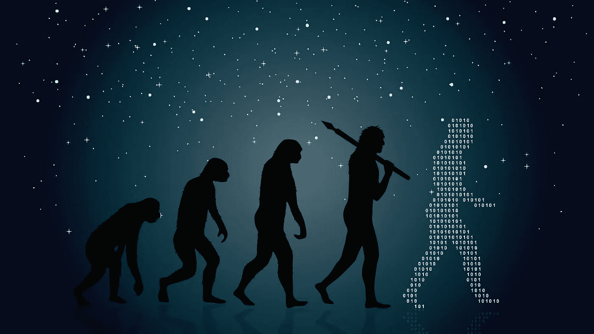
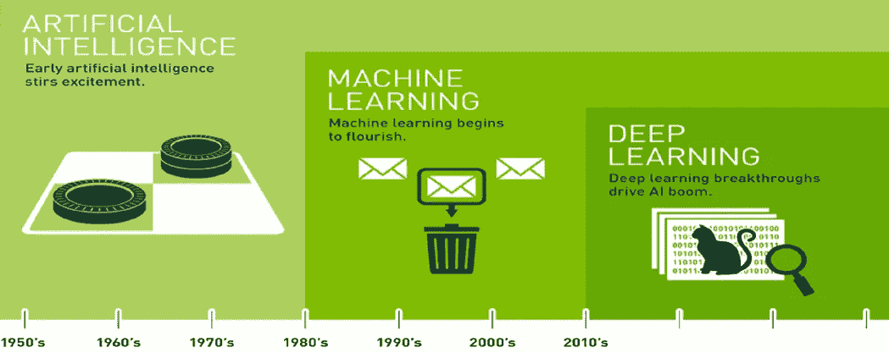
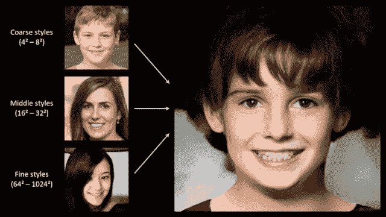
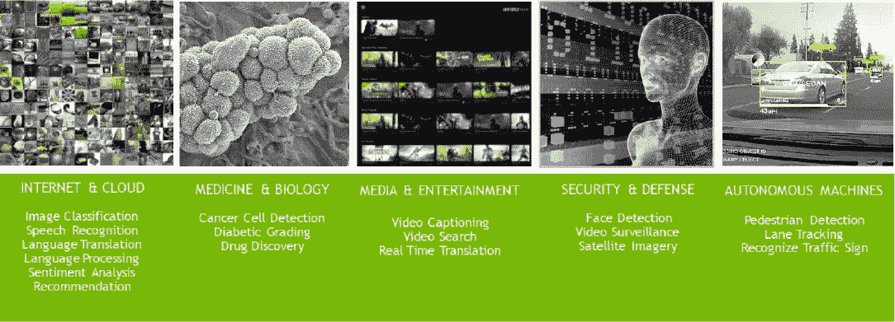
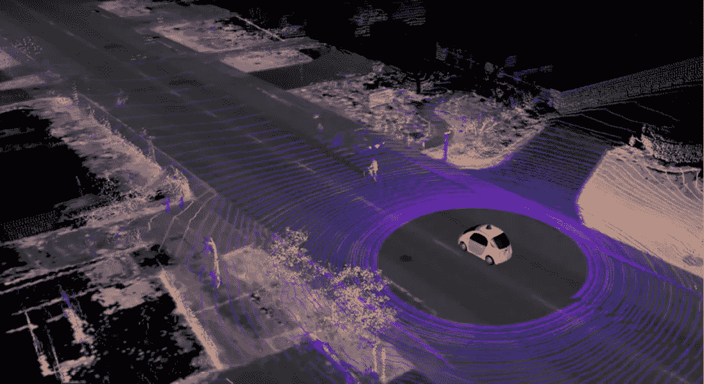
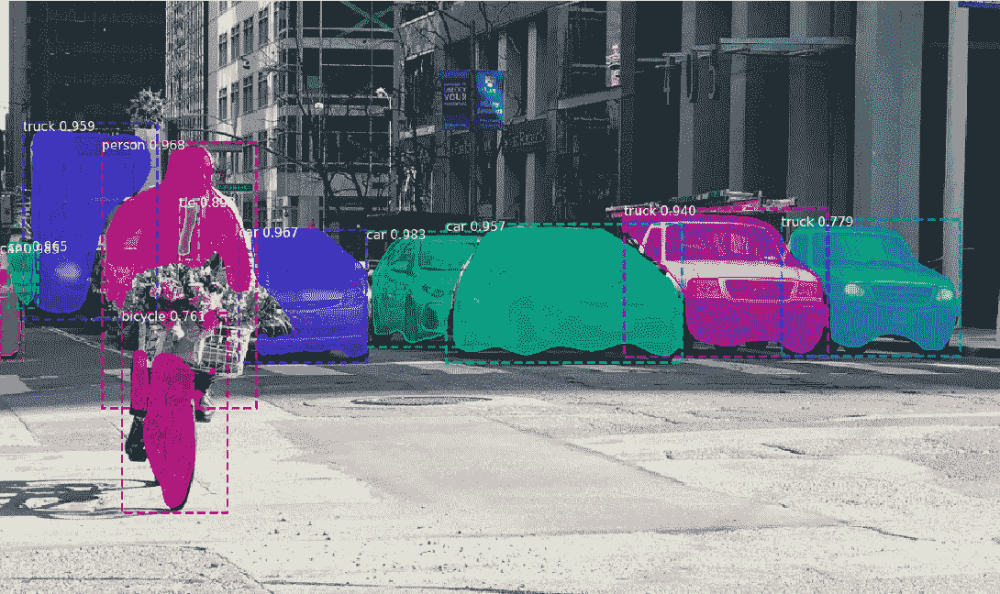

# 深度学习:过去、现在和未来…

> 原文：<https://pub.towardsai.net/deep-learning-past-present-and-future-b6316253cad8?source=collection_archive---------3----------------------->

“一切可能都要求存在”——戈特弗里德·威廉·莱布尼茨

# 介绍

深度学习是人工智能的一个子集，属于机器学习的范畴。它的灵感来自于人类大脑的结构和功能。深度学习是一种使计算机能够在没有任何人类干预的情况下执行需要人类智能的特定任务的方法。人脑由连接在一起的复杂神经元网络组成，这个神经元网络(也称为神经网络)负责人脑的复杂功能。深度学习的核心思想是模仿人脑的复杂过程，使机器能够独立思考，即具有人工智能的机器。

## 人工神经网络

人工神经网络处于深度学习革命的中心，这些算法松散地基于生物大脑的结构，生物大脑由通过携带信号的突触相互连接的神经元网络组成。人工神经网络由一个输入层(人脑通过不同的感官接收输入)、多个隐藏层(所有处理都在这里进行)和一个输出层(决策通过一些动作传达)组成。在人工神经网络中，当数据穿过这个人工网格时，每一层处理数据的一个方面，过滤离群值，发现熟悉的实体，并产生最终输出。

“经验表明，很大一部分真相来自于看似不相关的东西”——**埃德加·爱伦·坡**

## 深度学习的根源

深度学习可以追溯到 20 世纪 50 年代，当时发明了第一个神经网络。在 20 世纪 60 年代和 70 年代，在这个领域出现了许多令人兴奋的事情，导致了各种各样的新颖研究。在 20 世纪 80 年代和 90 年代，深度学习方面的一些突破性研究，如卷积神经网络(用于图像处理和计算机视觉)和递归神经网络(用于分析时间序列数据)的发展，导致了该领域的进一步分支。这是每年都有一些新的突破性研究改变深度学习过程的时候，这个领域都将呈指数级增长。但是当深度学习应用于现实生活场景时，人们很快意识到有两个主要挑战—

*   第一个也是最突出的挑战是缺乏计算能力。
*   另一个挑战是数据可用性有限。

这导致了一个**人工智能冬天**，由于上述限制，该领域的研究受到了抑制，人们认为这是一个在未来遥遥领先的想法。

深度学习的进化(人工智能→机器学习→深度学习)

## 重大突破

同样，二十年后，在 2010 年，随着 Image Net competition 的推出(一个约 1400 万张带标签图像的非常大的数据集开源，旨在开发最先进的图像分类器)，深度学习领域加快了速度，这一次，随着充足的计算能力和过多的可用数字数据，它将会爆炸。2011 年，Alex-net 的开发开启了深度学习社区中卷积神经网络的复兴。2014 年，生成对抗网络(GAN)的开发是现代深度学习时代的最大突破。

基于生成对抗网络的人工人脸生成

## 当前情景

目前，深度学习就在我们身边。它用于确定实时显示哪些在线广告，识别和标记照片中的朋友，将你的语音翻译成文本，在网页上将文本翻译成不同的语言，以及驾驶自动驾驶汽车。这是一项关键技术，它正在取得前所未有的成果。深度学习的最新进展已经提高到了这样一个程度，即深度学习在一些任务上优于人类，如对图像中的对象进行分类。

深度学习也存在于不太显眼的地方，如信用卡公司使用深度学习进行欺诈检测，企业使用它来预测您是否会取消订阅并提供个性化的客户建议，银行使用它来预测破产和贷款违约风险，医院使用它来检测、诊断和治疗疾病。它被广泛用于自动化流程、提高性能、检测模式和解决问题，其应用范围几乎是无限的。

深度学习的当前应用

## 深度学习的可行性

深度学习的性能取决于两个关键因素——首先是密集计算能力的可用性，另一个是海量数据。在计算能力方面，我们的发展速度比摩尔定律所描述的要快得多(计算能力每两年将翻一番)，随着数字技术的广泛采用，我们正在产生比以往任何时候都多的数据，使应用深度学习成为可能。

> “计算机能否思考的问题并不比潜艇能否游泳的问题更有趣。”— **埃德格·w·迪杰斯特拉**

## 深度学习:前进的道路...

在深度学习的当前状态下，它可以模仿婴儿的大脑。婴儿的大脑就像一块海绵，其中的神经网络需要几年时间才能成熟，才能像成年人一样进行推理。

谷歌的自动驾驶汽车项目

但是随着新的神经网络架构的发展，如生成对立网络(能够像人类一样生成艺术、音乐)、暹罗网络(通过一次性学习对图像进行分类)、OpenAI 的 GPT-2 模型(能够以人类水平的准确性生成连贯的文本段落、阅读理解和文本摘要)，我们越来越接近于建立基于深度学习的系统，这些系统可以充分模仿成熟人脑的复杂功能。

图像分割和场景理解

在未来的深度学习中，系统可以远远超过人类的智能，从而产生能够智能、流畅地与人类交互的高级认知系统。

如果你想了解更多，或者想让我写更多关于这个主题的东西，请随时联系…

我的社交链接:[LinkedIn](https://www.linkedin.com/in/shubhamsaboo/)|[Twitter](https://twitter.com/Saboo_Shubham_)|[Github](https://github.com/Shubhamsaboo)

如果你喜欢这篇文章或觉得它有帮助，请花一分钟按一下拍手按钮，它增加了文章对其他媒体用户的可见性。

## 参考

*   [https://www . kdnugges . com/2017/05/deep-learning-big-deal . html](https://www.kdnuggets.com/2017/05/deep-learning-big-deal.html)
*   [https://data floq . com/read/deep-learning-past-and-future/6479](https://datafloq.com/read/deep-learning-past-and-future/6479)
*   [https://krzakala.github.io/cargese.io/LeCun.pdf](https://krzakala.github.io/cargese.io/LeCun.pdf)