# 唐纳德·特朗普推文的深度学习情感分析

> 原文：<https://pub.towardsai.net/deep-learning-sentiment-analysis-of-donald-trumps-tweets-fc34ed73b7f6?source=collection_archive---------1----------------------->

## 用情感分析和深度学习理解唐纳德·J·特朗普的推文

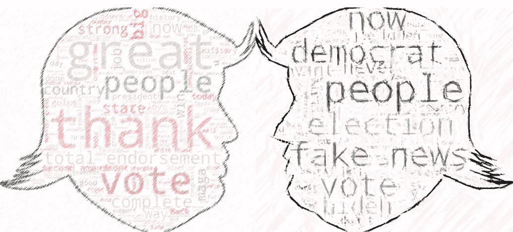

作者图片

众所周知，美利坚合众国第 46 任总统唐纳德·J·特朗普经常使用推特，从谴责他的政治对手到宣布他的政府实施的新措施。他对 Twitter 的争议性使用最终导致他的账户在 2021 年 1 月被暂停。在本文中，我们将尝试使用深度学习的情感分析来理解特朗普总统在 2012 年至 2021 年 1 月之间的推文[1]。本文中的代码写在两个独立的 Kaggle 笔记本中，链接在文章的末尾。

# 设置

在这一节中，我们将研究如何使用拥抱脸转换器的库来获取推文的情感极性和得分。

让我们安装拥抱脸的变形金刚库。

```
pip install transformers
```

首先，我们导入必要的库

```
from transformers import pipeline
import pandas as pd
import seaborn as sns
import matplotlib.pyplot as plt
import numpy as np
import re
import emoji
import html.parser
```

# 数据清理

我们对推文进行数据清理，并提取推文中提到的信息，如标签和句柄，以供进一步分析。这些推文可以在“文本”栏中找到。

```
df = pd.read_csv('/kaggle/input/donald-trump-tweets-dataset/tweets.csv')
```

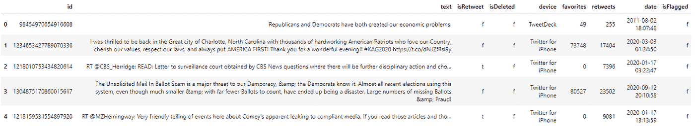

作者图片

我们使用 Pandas 的`.pipe()`函数将不同的函数依次应用于数据帧。

本节的剩余部分将描述这些功能中的每一个。

```
df = (df
      .pipe(clean_column_names)
      .pipe(clean_tweet)
      .pipe(get_date_attr)
      .pipe(get_hashtag)
      .pipe(get_mention_handle)
      .pipe(format_flags)
      .pipe(get_retweets)
      .pipe(drop_tweets))
```

**标准化列名**

所有列名都改为小写

```
def clean_column_names(df):

    df.columns = [i.lower() for i in df.columns]

    return df
```

**清理推文内容**

1.  删除推文中提到的网址
2.  移除表情符号
3.  删除多个空格
4.  转义 HTML

```
def _clean_tweet(text):

    output = re.sub('http[\\w\\d\\D./]+', '', output).strip() #remove url
    output = emoji.get_emoji_regexp().sub('', output) # remove emoji
    output = re.sub('\\s\\s+', ' ', output).strip() # remove white spaces
    output = html.unescape(output) # escape html return outputdef clean_tweet(df):

    df['text'] = df['text'].apply(lambda x: _clean_tweet(x))

    return df
```

**创建日期属性**

每条 tweet 都有一个时间戳，我们可以从中提取日期属性，如年、月、星期几和一天中的小时。

```
def get_date_attr(df):

    df['date'] = pd.to_datetime(df['date'])
    df['year'] = df['date'].dt.year
    df['month'] = df['date'].dt.month
    df['day_of_week'] = df['date'].dt.day_name()
    df['hour'] = df['date'].dt.hour

    return df
```

**识别哈希标签**

通过查找推文中的`#`符号来识别推文中出现的标签。该函数创建了一个名为`hashtags`的新列，其中标识的 hashtags 以列表格式存储。

```
def _get_hashtag(text):

    output = list(set(re.findall('#\\w+', text)))

    return outputdef get_hashtag(df):

    df['hashtags'] = df['text'].apply(lambda x: _get_hashtag(x))

    return df
```

**识别 Twitter 句柄**

通过在推文中找到`@`符号来识别推文中提到的 twitter 句柄。该函数创建一个名为`handles_mentioned`的新列，其中标识的 Twitter 句柄以列表格式存储。

```
def _get_mention_handle(text):

    output = list(set(re.findall('@\\w+', text)))

    return outputdef get_mention_handle(df):

    df['handles_mentioned'] = df['text'].apply(lambda x: _get_mention_handle(x))

    return df
```

**格式标志**

将 3 个指示器栏中的值分别从`t`和`f`重命名为`True`和`False`。

```
def format_flags(df):

    df['isflagged'] = df['isflagged'].apply(lambda x: True if x == 't' else False)
    df['isdeleted'] = df['isdeleted'].apply(lambda x: True if x == 't' else False)
    df['isretweet'] = df['isretweet'].apply(lambda x: True if x == 't' else False)

    return df
```

**识别转发**

虽然数据带有`isretweet`标志列来识别该推文是否是转发，但仍有一些转发没有被正确标记。“RT @handle”格式通常放在推文的开头，表示推文被转发。我们使用这些信息来识别没有被正确标记的转发。

```
def get_retweets(df):

    df.loc[(df['text'].str.contains('^RT @|^\\"RT @')), 'isretweet'] = True

    return df
```

**降记录**

最后，我们删除了 2012 年之前的推文，转发推文，以及清理后不包含文本的推文。通常，这些推文只包含一个 URL、表情符号、提及或标签，没有任何其他内容。我们还会删除包含“@realDonaldTrump”的推文。这些推文提到了特朗普总统的把柄，但不是特朗普总统本人发的。

```
def drop_tweets(df): df = (df
          .loc[(df['clean_text'] != '') 
               & (df['year'].between(2012,2021))
               & (df['isretweet'] == False)
               & ~(df['handles_mentioned'].apply(lambda x: '@realDonaldTrump' in x))
              ]
          .reset_index(drop = True))

    return df
```

这是数据帧现在的样子。从 2012 年 1 月到 2021 年 1 月，特朗普总统发了大约 3.6 万条推文。

```
df.head()
```

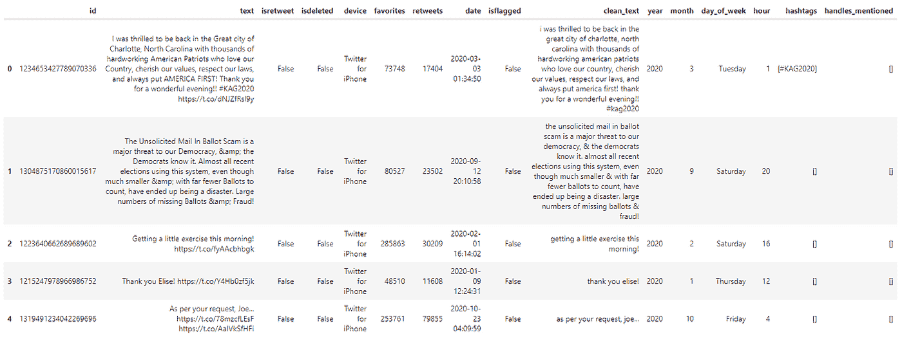

作者图片

我们将列转换为列表，列表中的每个元素都是一条 tweet。

```
tweets = df['text'].to_list()
```

# 情感分析模型管道

让我们建立我们的情感分析管道。我们将使用`RoBERTa-Large`模型[2]，该模型经过微调，使用 15 个不同的数据集进行情感分析，其中包括短文本类推文。我们必须在“设备”参数中指定 GPU 设备 id，以便在 GPU 上运行推理。请注意，这里不涉及培训，我们只是使用一个微调的模型来执行推理。

```
sentiment = pipeline(task = 'sentiment-analysis',
                     model = 'siebert/sentiment-roberta-large-english',
                     tokenizer = 'siebert/sentiment-roberta-large-english',
                     device = 0)
```

为了避免 CUDA 内存不足的问题，我们在 200 条 tweets 的较小批次中执行推理，并在最后连接结果

```
BATCH_SIZE = 200
results = []
for  batch_no in range(int(np.ceil(len(tweets)/BATCH_SIZE))): 
    results.extend(sentiment(tweets[batch_no*BATCH_SIZE: (batch_no+1)*BATCH_SIZE]))

df_results = pd.DataFrame(results)
df = pd.concat([df,df_results], axis = 1)
```

这是最终的数据帧现在的样子。`label`和`score`列是由情感模型提供的结果。

```
df.head()
```

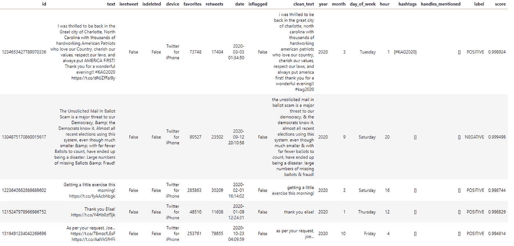

作者图片

让我们为下游任务保存输出。

```
df.to_csv('/kaggle/working/donald-trump-tweets-sentiment.csv', index = False)
```

# 词云

让我们使用 WordCloud 库来可视化特朗普推文中的常用词(unigrams)。

```
import pandas as pd
import seaborn as sns
import matplotlib.pyplot as plt
import numpy as np
import re
from ast import literal_eval
from wordcloud import WordCloud, STOPWORDS
from PIL import Image
import astsns.set(style='darkgrid')
pd.set_option('display.max_colwidth', None)
```

对特朗普推文的后续分析是在情绪评分的单独笔记本中进行的，因此我们必须加载之前保存的情绪评分数据。

```
df_tweets = pd.read_csv('/kaggle/input/donald-trump-tweets-sentiment/donald-trump-tweets-sentiment.csv', dtype = {'id':'object'})
df_tweets['label'] = df_tweets['label'].str.lower()
df_tweets['clean_text'] = df_tweets['clean_text'].apply(lambda x: str(x))
df_tweets['hashtags'] = df_tweets['hashtags'].apply(lambda x: ast.literal_eval(x))
df_tweets['handles_mentioned'] = df_tweets['handles_mentioned'].apply(lambda x: ast.literal_eval(x))
```

我们将基于 2 种不同的情绪极性(积极和消极)和 4 个不同的时间段创建 8 个不同的单词云。选择的时间段是

1.  2012 年至 2015 年:特朗普上台前
2.  2016 年:特朗普正在竞选，并最终当选他的第一个任期
3.  2017-2019:特朗普在任期间
4.  2020-2021 年 1 月:特朗普正在竞选他的第二个任期

```
STOPWORDS.update({'will', 's'})
stopwords = set(STOPWORDS)
year_range = [(2012,2015), (2016,2016), (2017,2019), (2020,2021)]# word clouds for positive sentiments
for start, end in year_range:
    wordcloud = WordCloud(stopwords=stopwords, background_color="white")
    text = ' '.join(df_tweets.loc[(df_tweets['label'] == 'positive') & (df_tweets['year'].between(start,end)), 'clean_text'].values.tolist())
    wordcloud.generate(text)
    plt.imshow(wordcloud, interpolation='bilinear')
    plt.axis("off")
    plt.show()# word clouds for negative sentiments
for start, end in year_range:
    wordcloud = WordCloud(stopwords=stopwords, background_color="white", width = 800, height = 400)
    text = ' '.join(df_tweets.loc[(df_tweets['label'] == 'negative') & (df_tweets['year'].between(start, end)), 'clean_text'].values.tolist())
    wordcloud.generate(text)
    plt.imshow(wordcloud, interpolation='bilinear')
    plt.axis("off")
    plt.show()
```

结果汇总如下。这些被频繁提及的话让我们看到了特朗普当时的想法。

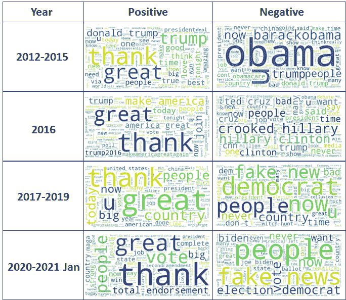

作者图片

在这四个阶段中，积极情绪的最常见单字似乎相对稳定，主要是“谢谢”和“太好了”。然而，负面情绪的常见单词会随着时间而变化。

在 2021-2015 年间，包含奥巴马总统名字和奥巴马医改的负面推文出现得相当频繁，可能是批评奥巴马总统的政府。以下是这类推文的一些例子。

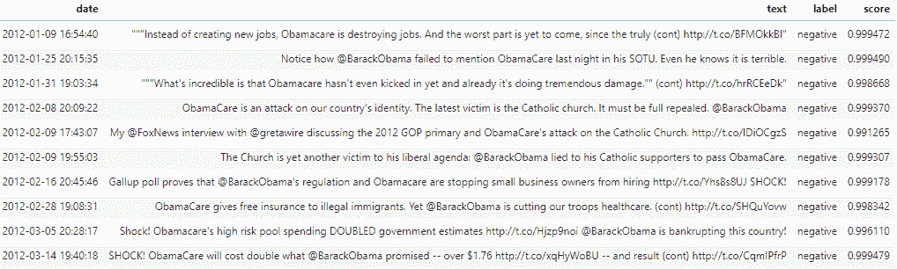

作者图片

2016 年是选举年，民主党总统候选人希拉里·克林顿的名字频繁出现在与负面情绪相关的推文中。这些是特朗普总统与希拉里·克林顿有关的顶级负面情绪推文，一般旨在谴责他的政治对手。

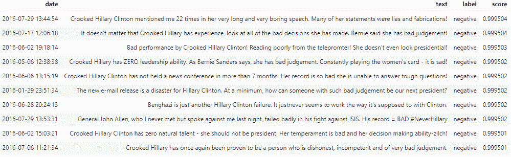

作者图片

在 2017 年至 2021 年期间，“假新闻”在与负面情绪相关的推文中出现得相当频繁。这些推文中有许多是针对媒体报道特朗普认为是关于他的政府的假新闻。

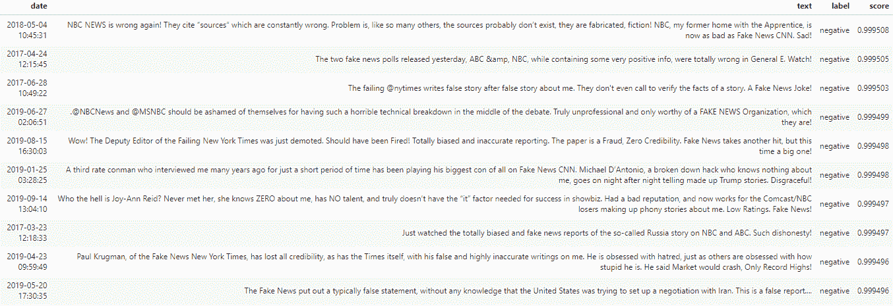

作者图片

# 转发和收藏

让我们更深入地看看特朗普推文的各种属性。

```
summary_data = df_tweets.groupby('label', as_index = False).agg({'id':'count', 'retweets':'median', 'favorites':'median', 'isflagged':'mean', 'isdeleted':'mean'})
summary_data['pct_isflagged'] = summary_data['isflagged'].apply(lambda x: round(x*100, 2))
summary_data['pct_isdeleted'] = summary_data['isdeleted'].apply(lambda x: round(x*100, 2))
```

在 2012 年至 2021 年间，大约 60%的推文是正面的。

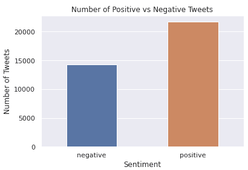

作者图片

```
fig, ax = plt.subplots()
ax = sns.barplot(data = summary_data, x = 'label', y = 'id')
ax.set_title('Number of Positive vs Negative Tweets')
ax.set_xlabel('Sentiment')
ax.set_ylabel('Number of Tweets')
change_width(ax, 0.5)
```

与情绪积极的推文相比，情绪消极的推文的转发量和受欢迎程度分别是前者的 2.7 倍和 2.6 倍。一个可能的解释是，与正面推文相比，负面推文往往会引发读者更深层次的情绪，从而导致更多的分享和喜欢。

```
fig, ax = plt.subplots()
ax = sns.barplot(data = summary_data, x = 'label', y = 'retweets')
ax.set_title('Median Number of Retweets Per Tweet by Sentiment Polarity')
ax.set_xlabel('Sentiment')
ax.set_ylabel('Number of Retweets')
change_width(ax, 0.5)fig, ax = plt.subplots()
ax = sns.barplot(data = summary_data, x = 'label', y = 'favorites')
ax.set_title('Median Number of Favourites Per Tweet by Sentiment Polarity')
ax.set_xlabel('Sentiment')
ax.set_ylabel('Number of Favorites')
change_width(ax, 0.5)
```

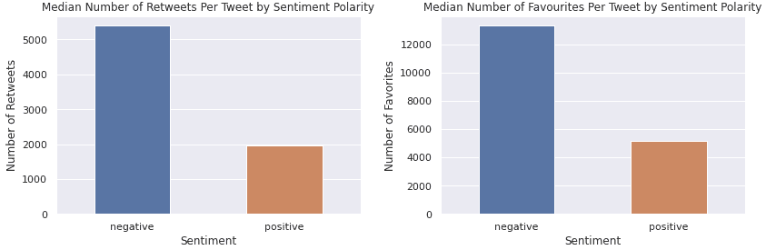

作者图片

# 情绪在一周内如何变化

下图显示了 2017 年至 2020 年期间一周中每天积极情绪推文的百分比。看起来周五积极情绪的推特比例最高。我猜连总统都喜欢 TGIF！而周日的积极情绪推特比例最低。可能是周一忧郁？

```
data = pd.pivot_table(df_tweets,
                               index = ['day_of_week'],
                               columns = 'label',
                               aggfunc = {'id':'count', 'score':'mean'},
                               fill_value = 0)
data.columns = data.columns.map('_'.join).str.strip('_')
data['tweet_pct_pos'] = data.apply(lambda x: round(x['id_positive']/(x['id_positive'] + x['id_negative'])*100,2), axis = 1)
data.reset_index(inplace = True)fig, ax = plt.subplots(figsize=(10,5))
ax = sns.barplot(data = data,
                 x = 'day_of_week',
                 y = 'tweet_pct_pos',
                 order = ['Monday', 'Tuesday', 'Wednesday', 'Thursday', 'Friday', 'Saturday', 'Sunday'])
ax.set_title("% of Positive Tweets")
ax.set_xlabel('Day of Week')
ax.set_ylabel('% Postitive Tweets')
ax.set_ylim(50,65)
plt.xticks(rotation=90, ha='right')
plt.show()
```

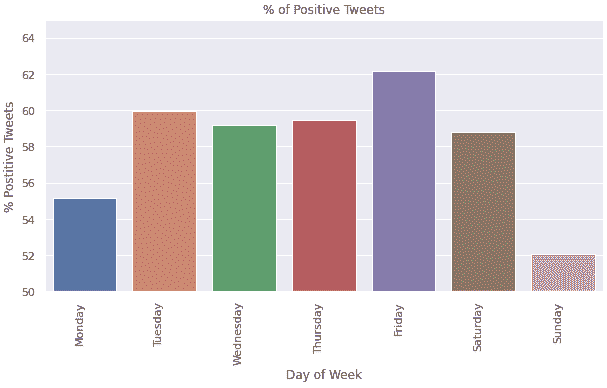

作者图片

# 情绪在一天中如何变化

下图显示了 2017 年至 2020 年期间每天一小时内积极情绪的百分比。早上有很高比例的正面推文，然而，正面推文的比例随着一天的进展而下降，中午达到低点，晚上则反弹。

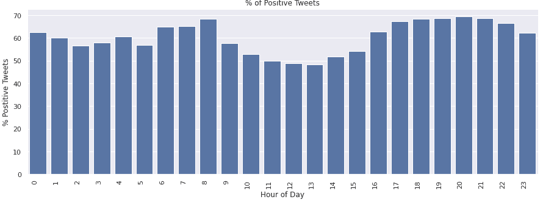

作者图片

# 情感 vs 散列标签

让我们来看看哪些标签经常与情感的极性联系在一起。

```
df_tweets_hashtag_explode = df_tweets.explode('hashtags')
data = pd.pivot_table(df_tweets_hashtag_explode,
                      index = ['hashtags'],
                      columns = 'label',
                      aggfunc = {'id':'count', 'score':'mean'},
                      fill_value = 0)
data.columns = data.columns.map('_'.join).str.strip('_')
data['tweet_pct_pos'] = data.apply(lambda x: round(x['id_positive']/(x['id_positive'] + x['id_negative'])*100,2), axis = 1)
data.reset_index(inplace = True)
data = data[(data['id_negative'] + data['id_positive']) >= 20]
data.sort_values('tweet_pct_pos', ascending = False).loc[:, ['hashtags', 'id_negative', 'id_positive', 'tweet_pct_pos']].head()
```

只考虑至少有 20 条记录的 hashtags。这些标签与积极情绪推特的比例最高。

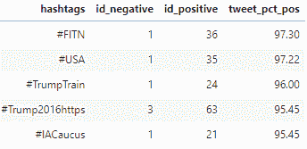

作者图片

这些标签与负面情绪推特的比例最低。

```
data.sort_values('tweet_pct_pos', ascending = True).loc[:, ['hashtags', 'id_negative', 'id_positive', 'tweet_pct_pos']].head()
```

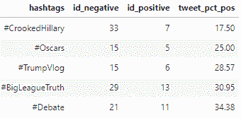

作者图片

# 情感 vs 手柄

我们可以对特朗普推文中提到的手柄做同样的事情。正面推文比例最高的句柄。

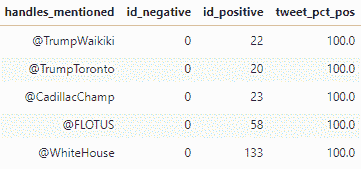

作者图片

正面推文数量最少的句柄。

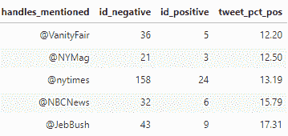

作者图片

# 结论

在本文中，我们研究了以下内容:

1.  使用来自拥抱脸的预训练模型来获得情绪极性，并在特朗普总统的推文中评分
2.  创建单词云来可视化不同时间的高频单词
3.  转发和收藏如何基于情感极性而有所不同
4.  如何在推特上发布一天或一周的情绪变化
5.  与不同标签和句柄相关联的 Tweet 情感

包含代码的 Kaggle 笔记本可以在这里找到:

*   [第一部分:使用预训练模型的情感分析推断](https://www.kaggle.com/edwintyh/donald-trump-s-tweets-sentiment-analysis-model)
*   [第二部分:川普推文的数据分析](https://www.kaggle.com/edwintyh/donald-trump-s-tweets-sentiment-analysis)

*   [加入灵媒](https://medium.com/@edwin.tan/membership)阅读更多这样的故事
*   关注我获取更多类似的帖子

# 参考

[1]数据来自[唐纳德·特朗普的推特档案](https://www.thetrumparchive.com/)，经许可使用。

[2]“不仅仅是一种感觉:情绪分析准确性的基准”，作者:Heitmann，Mark 和 Siebert，Christian 和 Hartmann，Jochen 和 Schamp，Christina。