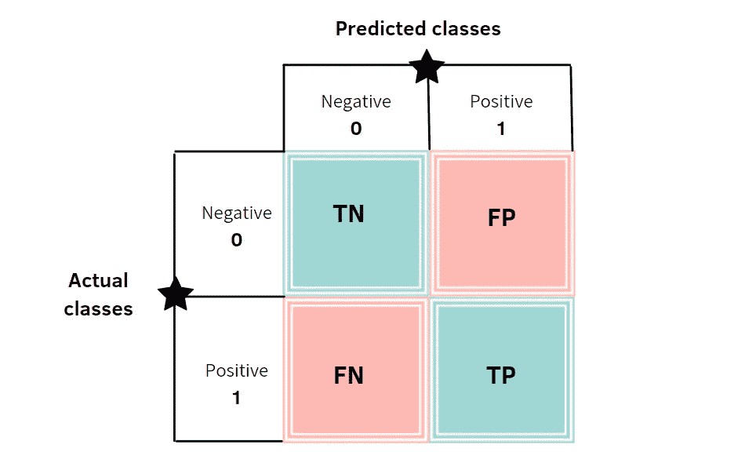
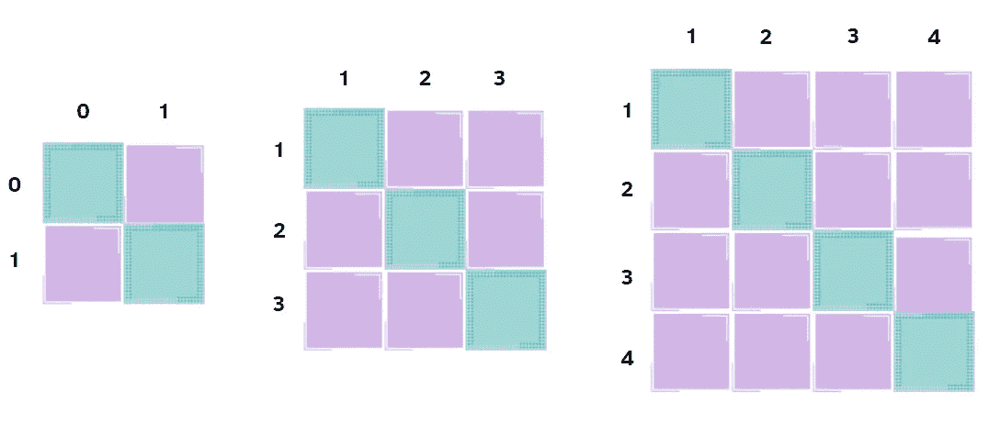
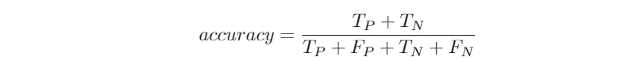
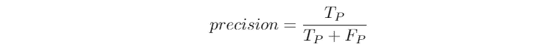
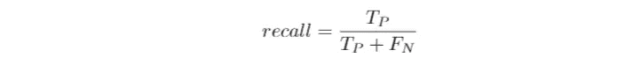
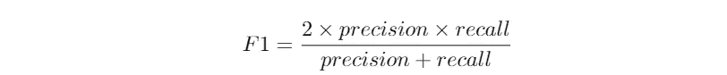
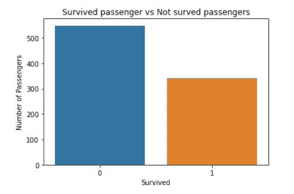
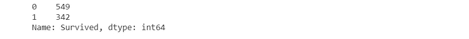
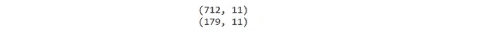
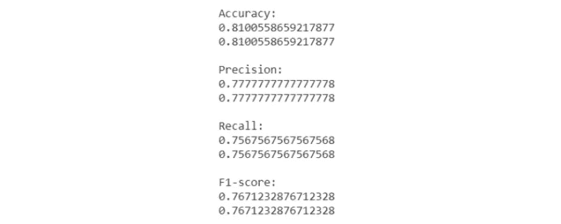

# 如何使用混淆矩阵评估你的模型

> 原文：<https://pub.towardsai.net/deep-understanding-of-confusion-matrix-6ab1f88a267e?source=collection_archive---------1----------------------->

## [数据科学](https://towardsai.net/p/category/data-science)

作者图片

在我攻读数据科学硕士学位的第一年，我遇到过混淆矩阵。教授第一次讲解的时候，我没什么感觉，但是**困惑**！由于这个原因，我想用简单的语言解释这个矩阵之外的概念，那将是你每次需要评估模型性能时的伙伴。

那么，什么是混淆矩阵呢？我们为什么需要它？一般来说，这是一个有助于了解模型是否运行良好的工具。而且从中可以衍生出很多评价指标，比如准确率、精确度、召回率等。这是基于这样一个事实，即我们需要将分类器预测的**类别**与每次观察的**实际类别**进行比较。

所以，一个模型的效率可以用这个惊人的矩阵来看。每一列对应于预测的类别，而每一行表示实际的类别。例如，如果我们有一个包含 3 个类的分类器，我们将有一个 3x3 的矩阵。当类别为 4 时，矩阵将由 4×4 的单元构成，依此类推。在任何情况下，**类都是按照排序顺序**使用的。由于这个原因，阳性类位于第二列和第二行，这与许多将真阳性的数量放在矩阵的第一个单元格中的例子形成了对比。

混淆矩阵的例子。作者图片

在值为 0 和 1 的二元分类器的情况下，预测分为四类:

*   **真阳性**:预测类与实际类相同。在本例中，预测值为 1，与该特定观察的实际类别相符。
*   **假阴性**:预测类别为阴性，但与实际类别不一致，实际类别为阳性*。在示例中，预测值为 0，但该观察的实际类为 1！所以，预测是错误的。*
*   ***误报**:预测类为正，实际类为*负*。在本例中，预测类别为 1，而该观察的实际类别为 0。预测又错了！*
*   ***真阴性**:预测类为阴性，与实际相符，也为阴性。在示例中，我们预测了类 0，而该观察的实际类是 0！最后，我们发现了其他正确的预测，而不仅仅是真阳性。*

*正如我之前所说的，我们可以从这个工具中获得许多指标。*

# *准确(性)*

*评估模型时最常用的衡量标准是准确性。让我们记住我所说的矩阵的四个类别。哪些值构成了正确的预测？真阳性(例如:1 正确分类)和真阴性(例如:0 正确分类)。所以，我们需要将真阳性和真阴性相加，然后除以总数，这是混淆矩阵所有单元的总和。*

**

*在每一类都有相同数量的观察值的情况下，精确度似乎还可以。但在大多数情况下，我们有不平衡的类，所以我们需要其他的评价措施。*

# *精确*

*精度的计算方法是将真阳性除以被 ***标记为阳性*** 的观察总数。*

**

# *回忆*

*回忆表明有多少阳性类别的观察结果被正确分类为阳性。将真阳性除以正确属于阳性类别 的***的观察总数。****

**

# *f1-分数*

*我们可以将精确度和召回率合并为一个度量，称为 F1-score。这是精确和回忆的调和平均值:*

**

*当准确率和召回率接近 0 时，F1-score 也接近 0。如果两个测量值都接近 1，这意味着 F1 得分将会很高。*

# *示例:*

*让我们使用 Kaggle 的 Titanic 数据集来看一个二进制分类问题。完整的 Github 代码在这里是。我们需要预测乘客是否能生还。正如我们所知，大部分乘客没能保住自己的性命，所以班级是不平衡的。目标变量称为 survivet:如果乘客幸存，则为 1，否则为 0。*

****

*我们将分析训练集，因为测试集不包括目标标签。让我们将训练数据分成 80%用于训练，20%用于验证。*

**

*数据分割完成后，我们训练决策树分类器，并在验证集中对其进行评估。为了获得混淆矩阵，sklearn 中已经提供了一个函数:*

**

*混淆矩阵*

*现在，我将手动获取评估指标。每一次计算之后都是 sklearn 库中已经实现的函数:*

**

*从结果中，我们可以观察到:*

*   *81%被预测为**幸存和**未幸存的人被决策树正确分类。*
*   *77.8%预测为幸存的人真的幸存了！总的来说，我们认为被分类器标记的所有人**都是阳性类别**(幸存)。*
*   *幸存的人有 75.6%的几率被正确预测！分母考虑数据集的所有**正类。***
*   *76.7%是准确率和召回率的调和平均值。这很重要，因为它考虑到了 **FP** (预测为存活，但他们没有存活的人数)和 **FN** (预测为没有存活，但他们设法保住了自己生命的人数)。*

# *最终想法:*

*恭喜你！我希望这篇教程能让你对混淆矩阵的关键概念有所了解。准确性是评估模型最常见的方式，但这还不够。您需要其他措施来确保经过训练的模型运行良好。还有许多其他可能的评估指标可以使用，您只需要搜索它们。谢谢你阅读它。*

*有兴趣看其他文章吗？下面我给你推荐另一个故事:*

* [## 机器学习模型的 k 重交叉验证

### 使用 sklearn 的交叉验证技术概述

pub.towardsai.net](/k-fold-cross-validation-for-machine-learning-models-918f6ccfd6d)* 

***你喜欢我的文章吗？** [***成为会员***](https://eugenia-anello.medium.com/membership) ***每天无限获取数据科学新帖！这是一种间接的支持我的方式，不会给你带来任何额外的费用。如果您已经是会员，*** [***订阅***](https://eugenia-anello.medium.com/subscribe) ***每当我发布新的数据科学和 python 指南时，您都可以收到电子邮件！****