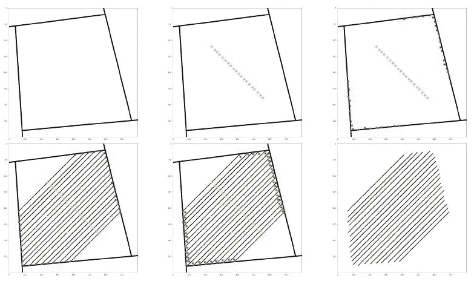
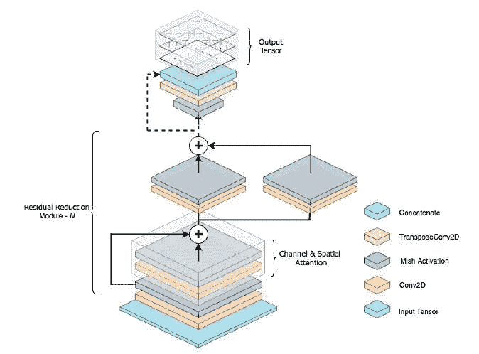
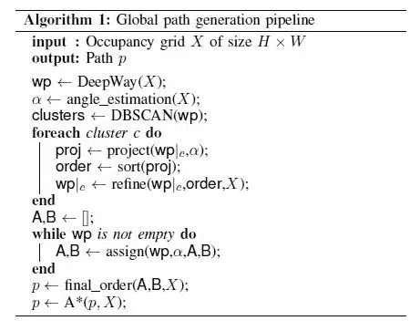

# Deep-Way:无人驾驶地面车辆路径规划的神经网络体系结构——综述

> 原文：<https://pub.towardsai.net/deep-way-a-neural-network-architecture-for-unmanned-ground-vehicle-path-planning-a-review-c1a4beecb190?source=collection_archive---------1----------------------->

## [深度学习](https://towardsai.net/p/category/machine-learning/deep-learning)

农业是人类文明的支柱，自从人类智能以机器人的形式出现以来，农业领域的可能性呈指数增长，随着人工智能现在为技术和非技术领域的每个部分提供动力，应用现在达到了新的高度。研究人员正在提出新的想法和方法，以纳入该领域的一些必要变化。其中之一就是“深度方式”的引入。让我们进入深度学习的旅程部分，这将解决农业领域的一些重要措施。

> 执行全局路径规划自动化的早期过程之一是**聚集生成的数据，然后执行某种形式的动作**。基于来自无人机的 ariel 足迹，将基于作物形成集群，分割特定土地上的各种作物，然后必须执行规划迭代…

现在，有一个补救办法。**引进‘深闺之道’。**一种新的深度学习算法，可以根据行状作物环境进行路径规划。我将讨论这些研究的一些重要方面以及它们的应用方法。我会用一种不那么数学化的方式，让读者(任何层次的研究)生动地理解其中隐含的方法。

# **数据集:**

由于实验中没有这样的数据集，作者构建了他们自己的数据集[在[1，2]中提到]。他们设计了一种生成形状为 *H * W，*的网格的算法，网格的行数是随机的，用 *N* 表示(行的最大值被认为是 50，最小值被认为是 20) *。*除了生成的数据集，他们还使用了一些来自谷歌卫星图像的图像，包括基于行的作物场景。这些图像经过人工处理，用于提取网格和航路点。这说明了该算法在现实生活中的应用。

使用上述算法的占用网格生成。首先生成随机边界，然后从图像中心开始识别 N 个行中心(黄色)。起点(蓝色)和终点(红色)位于与边界的相交处，有一些随机位移以增加可变性。然后生成实际的行线，以一定的概率添加孔。最后，使用该方法找到目标航路点(绿色)。

Google 卫星图片用于算法的测试

# 方法:

因此，给定行作物的栅格地图，Deep-Way 从图像数据集本身估计系统中不同端点的位置。作者声称，早期的方法大多是硬核的，Deep-way 的一个关键点是*它使用深度学习方法来学习作物的网格地图，并使用整个图像的特征同时预测所有的路点及其校正*。

## a.**航路点估计:**

首先，他们将输入图像分成几个小的部分。如果没有这种划分，置信度得分将趋于零(算法不会理解图片中的任何内容)。较小的划分会小 k 倍，并且会导致与像素的较小的相互作用。现在，算法已经被设计成他们把问题作为回归问题来计算。它分析输入地图(来自 google 数据集和生成的粗线)以及叠加的格网单元，并以 x 轴和 y 轴上的小距离形式计算航路点位置和对应坐标补偿的概率。

为了从概率范围中获得最终的航路点估计，他们实现了一个置信阈值(tc ),并使用该阈值找到超过该阈值的所有概率。最后，使用抑制算法，选择所有概率中最高的概率，并选择航路点。

## b.网络设计:

全卷积神经网络(DeepWay)直接操作到场景中。输入将是网格图(显然是张量)。然后，DeepWay 会计算我们必须遵循的路径上的其他路点值。每个模块由一系列卷积 2D 层组成，激活函数为 *Mish* 。为了减少空间维度，每个模块都以一层两跨结束。

在 N 维应用之后，前两维将减少 *(k+1)* 维。为了匹配维度，步长为 2 的转置卷积层被插入到最终输出中。最后，在连接之后，分别对第一个和最后两个通道使用 sigmoid 和 tanh 函数进行 1X1 卷积运算来计算输出层。

DeepWay 的示意性建筑

## c.航路点细化和路径生成:

从上面的算法中，我们实现了空间中的点。现在，我们需要找到路径。我们使用 DBSCAN 对预测点进行聚类(最适合对彼此接近的组进行聚类)。有些甚至可能保持不集中，因为情节的形状非常小。对于它们，我们垂直于行投影点(就像 PCA)。行角度:使用霍夫变换技术(经典计算机视觉-用于画线)测量。

**【快速提问】:如果一条直线可以用霍夫变换，那么为什么还要用神经网络呢？**

**Ans:** 嗯，Hough 变换需要一些之前定义好的参数，但当我们考虑大量数据和这种不规则性时，这是不可能的。为了方便起见，我们需要 DeepWay。

在对点进行排序之后，执行一种细化方法，以便移除所有重复的点并放置缺失的点。然后，为了得到最终的顺序，可以将这两个组聚集成 A 和 B，分别代表行的开始和结束。一旦获得最后一组，它们的存储模式是 A-B-B-A。现在，为了计算从一个航路点到另一个航路点的全局路径，他们采用了 A*算法。这将确定从集群 A 到 b 的最短路径

单次拍摄的总算法

还有问题吗？查看参考资料！

[ **注:** *我把博客的架构和研究论文的架构保持得很相似，这样即使你想看完整篇论文，你也会熟悉论文的结构。* ]

# 参考资料:

1.  arXiv:2010.16322 [cs。RO] ( [链接](https://arxiv.org/abs/2010.16322))
2.  GitHub 代码为 Deep-Way ( [Link](https://github.com/fsalv/DeepWay) )