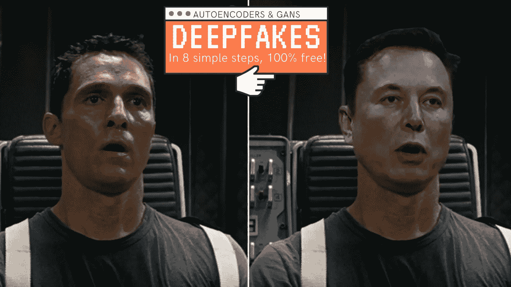
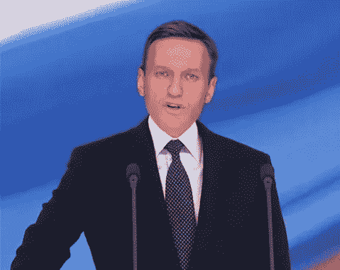
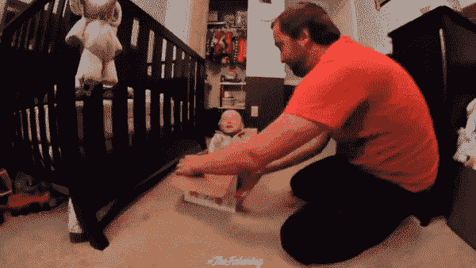
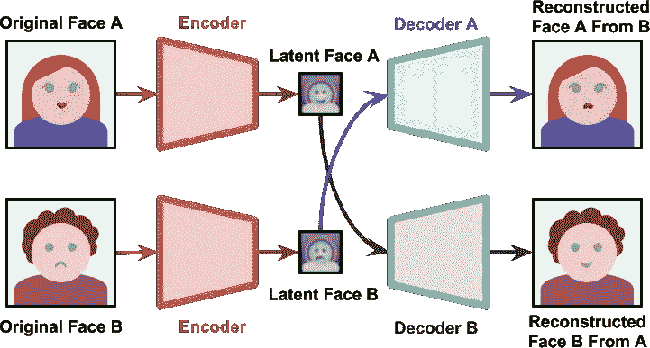
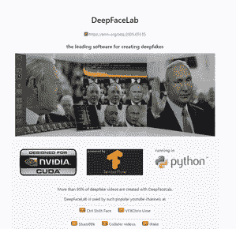
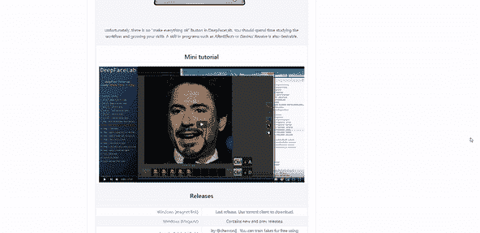

# 5 分钟后 DeepFakes

> 原文：<https://pub.towardsai.net/deepfakes-in-5-minutes-155c13d48fa3?source=collection_archive---------1----------------------->

## [计算机视觉](https://towardsai.net/p/category/computer-vision)

## 了解 deepfakes 如何工作，并创建您自己的！

> 原载于 [louisbouchard.ai](https://www.louisbouchard.ai/deepfakes-in-5-minutes/) ，前两天在[我的博客](https://www.louisbouchard.ai/tag/artificial-intelligence/)上看到的！

作者图片

好像一直都有，但是 deepfakes 最早出现在 2018 年，才两年！

从那以后，它以一种无人能想象的方式发展。正如你所看到的，你可以很容易地使一个视频看起来真实，而一个人甚至不在那里！现实是你再也不能相信你看到的东西了，DeepFakes 在这其中有很大的作用。

**图片来自 DeepFaceLab，**[https://github.com/iperov/DeepFaceLab](https://github.com/iperov/DeepFaceLab)

事实上，DeepFake 技术可以将文字放入任何人的嘴里，同时还可以创建一个人说话的假视频。

它既是一项令人敬畏的新技术，也是一种危险的工具。

## 什么是 DeepFake &它是如何工作的？

deepfake 是一种合成媒体，其中图像或视频中的一个人的身份被替换为另一个人。他们的声音，他们的脸或者两者都有。

DeepFakes 使用机器学习算法来操纵或生成此类视频的视觉和/或音频内容，以模仿他人的声音和/或面部。

随着过去几年 GPU 的进步，研究人员能够开发深度学习技术，使这些应用成为可能，如自动编码器和 GANs。如果你有兴趣了解更多关于机器学习框架的知识，我已经在之前的视频中介绍过了。

现在你可能想知道，它们是如何工作的？

嗯，答案没那么简单。Deepfake 应用程序以多种方式工作。就像在这张 gif 中，一些人试图绘制目标人物的脸，比如将埃隆·马斯克的脸放在一个婴儿玩耍的目标视频上。

婴儿伊隆马斯克蒙太奇 deep fake:[https://www.youtube.com/watch?v=WHwQeetjLwk&ab _ channel = the fake ning](https://www.youtube.com/watch?v=WHwQeetjLwk&ab_channel=TheFakening)

## 假货是如何制造的

图片来自[https://www . alanzucconi . com/2018/03/14/understanding-the-technology-behind-deep fakes/](https://www.alanzucconi.com/2018/03/14/understanding-the-technology-behind-deepfakes/)

像最近大多数基于人工智能的应用程序一样，它使用深度神经网络架构来实现这一点。正如我所说的，它使用自动编码器，与 GANs 合并，这对像这样的计算机视觉应用特别好。

它由一个编码器和一个解码器组成，前者将图像缩减到一个低维的潜在空间，后者从潜在表示中重建图像。

编码器是用来把我们要模仿的人编码进潜在空间的。这个潜在的空间然后包含他们的面部特征和身体姿势的关键特征来再现他的面部和身体动作。

图片来自[https://www . slide share . net/Ian McCarthy/deep fakes-trick-or-treat](https://www.slideshare.net/IanMcCarthy/deepfakes-trick-or-treat)

然后，使用专门为目标视频训练的模型来解码该潜在空间。这意味着目标的详细信息将叠加在原始视频的基本面部和身体特征上，在先前编码的潜在空间中表示。

GANs 可以与这种自动编码器合并，以改进这种算法的结果。它使得 deepfake 在现实中不断进化和完善。

## 制作您自己的 DeepFake

对我们来说幸运的是，有许多在线工具可以用来生产 deepfakes。

**DeepFaceLab**:【https://github.com/iperov/DeepFaceLab】T4

DeepFaceLab 是完全免费的，其代码可以公开获得，并且有许多资源可以用来在你的图像和视频上训练你自己的 deepfake。你可以使用它们的代码做很多事情，比如替换图片或视频中的一张脸，替换整个头部，甚至操纵特定人的声音。

查看[他们的 GitHub](https://github.com/iperov/DeepFaceLab) 了解更多信息，一切都解释得很清楚，如果你没有在自己的电脑上训练如此大的网络的计算能力，你甚至可以直接在 google colab 上运行代码。他们甚至分享了一个完整的视频教程来帮助你创建自己的 deepfakes！

**DeepFaceLab**:[https://github.com/iperov/DeepFaceLab](https://github.com/iperov/DeepFaceLab)

当然，这里引用的每个资源都是完全免费的。如果你对 deepfakes 感兴趣，你绝对应该试一试！

**DeepFaceLab**:[https://github.com/iperov/DeepFaceLab](https://github.com/iperov/DeepFaceLab)

## 如果你喜欢我的工作，并想与人工智能保持同步，你绝对应该关注我的其他社交媒体账户( [LinkedIn](https://www.linkedin.com/in/whats-ai/) 、 [Twitter](https://twitter.com/Whats_AI) )并订阅我的每周人工智能[简讯](http://eepurl.com/huGLT5) ！

## 支持我:

*   支持我的最好方式是在[**Medium**](https://medium.com/@whats-ai)**上关注我，或者如果你喜欢视频格式，在[**YouTube**](https://www.youtube.com/channel/UCUzGQrN-lyyc0BWTYoJM_Sg)**上订阅我的频道。****
*   ****支持我在 [**上的工作**](https://www.patreon.com/whatsai)****
*   ****加入我们的 [**Discord 社区:** **一起学 AI**](https://discord.gg/learnaitogether)和*分享你的项目、论文、最佳课程、寻找 Kaggle 队友等等！*****

## ****结论****

****正如我所说，这是一项既令人敬畏又危险的新技术。请不要滥用这项技术，保持道德上的正确。这里的目标是帮助改进这项技术，而不是出于错误的原因使用它。另外，有许多检测 deepfakes 的技术，这将是另一个完整视频的主题。****

****如果你喜欢我的工作并想支持我，如果你在**上关注我，我会非常感激。******