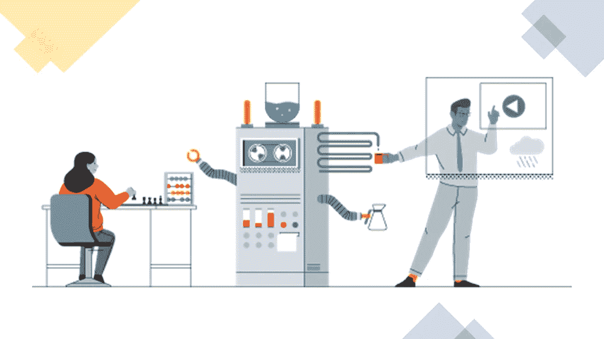
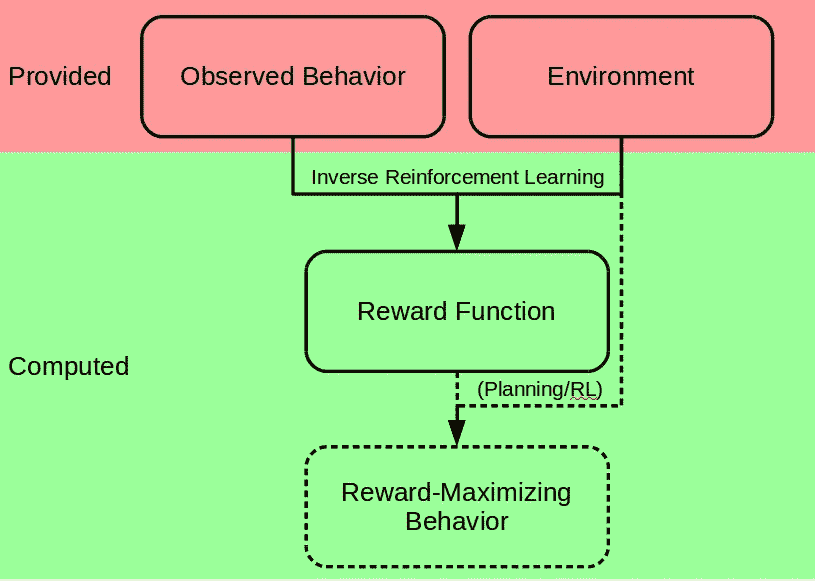
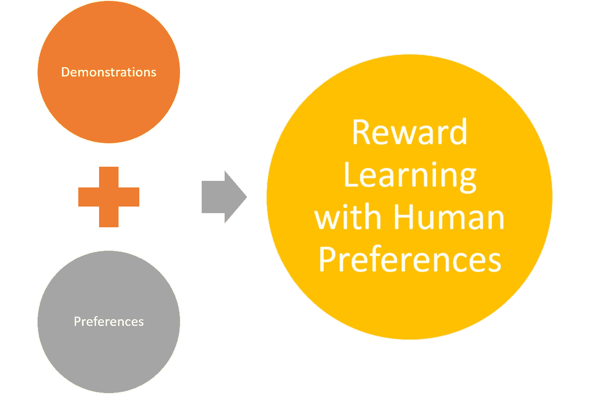
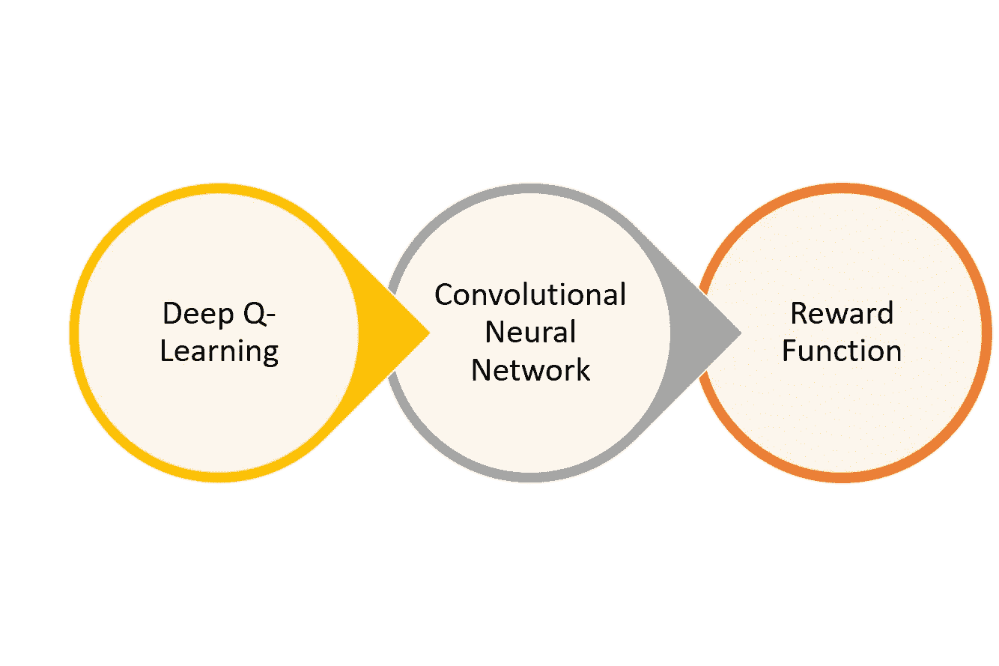
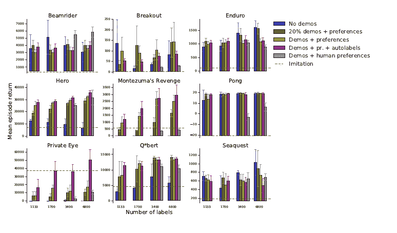

# DeepMind 和 OpenAI 使用人类反馈来最大化强化学习代理的性能

> 原文：<https://pub.towardsai.net/deepmind-and-openai-use-human-feedback-to-maximize-the-performance-of-reinforcement-learning-agents-50069cce8111?source=collection_archive---------1----------------------->

## [人工智能](https://towardsai.net/p/category/artificial-intelligence)

## 2018 年的一篇研究论文介绍了一种结合人类反馈和奖励优化的训练模型，以最大化 RL 代理的知识。

图片来源:[https://cloud . with Google . com/build/data-analytics/explore-history-machine-learning/](https://cloud.withgoogle.com/build/data-analytics/explore-history-machine-learning/)

> 我最近创办了一份专注于人工智能的教育时事通讯，已经有超过 10 万名订户。《序列》是一份无废话(意思是没有炒作，没有新闻等)的 ML 导向时事通讯，需要 5 分钟阅读。目标是让你与机器学习项目、研究论文和概念保持同步。请通过订阅以下内容来尝试一下:

 [## 序列

### 订阅人工智能世界中最相关的项目和研究论文。受到 102，000 多人的信任…

thesequence.substack.com](https://thesequence.substack.com/) 

DeepMind 和 OpenAI 是两家人工智能(AI)公司，处于强化学习(RL)进步的中心。从 AlphaGo 到 Dota2 Five，DeepMind 和 OpenAI 都在推动 RL 应用的边界，以在复杂的认知任务中超越人类。2018 年，这两个研究巨头决定[在一篇新论文](https://arxiv.org/abs/1811.06521)中合作，该论文提出了一种新的方法来训练 RL 代理，使他们能够实现超人的性能。

标题为[“奖励从人类偏好和 Atari 演示中学习”](https://arxiv.org/abs/1811.06521)的新研究论文介绍了一种结合人类反馈和奖励优化的训练模型，以最大化 RL 代理的知识。本文的核心论点是试图解决现代 RL 应用的一个主要限制。大多数成功的 RL 应用程序在诸如多人游戏的环境中运行，这些环境具有可以硬编码到 RL 代理中的良好建立的奖励模型。然而，我们在现实生活中面临的许多任务都没有给出明确的回报。考虑在室内环境中寻找物体的任务。在这种情况下，很难预先决定在执行了特定任务(如在床底下搜索，但没有找到目标对象)后如何奖励代理人？我们应该把代理送到隔壁房间还是房子的对面？在这些情况下，人类依靠直觉来解决复杂的任务，但我们对直觉在 RL 代理中的复制知之甚少。因此，RL 依赖于下一个最好的东西:人类反馈。

反向强化学习(IRL)或模仿学习是一种 RL 变体，它专注于从人类反馈中学习奖励函数。虽然 IRL 克服了传统 RL 在回报稀少的环境中的一些限制，但它有一些基本的可伸缩性限制，因为它需要领域专家来训练代理。此外，如果一个 RL 代理只是简单地模仿人类法官，它怎么可能超越人类的表现？

图片鸣谢:OpenAI，DeepMind

# 奖励从人类偏好中学习

为了解决 RL 和 IRL 模型的一些限制，DeepMind 和 OpenAI 提出了一种结合人类反馈和 RL 优化的方法，以实现 RL 任务的超人性能。所提出的技术通过利用两个主要反馈渠道来学习奖励函数，而不是假设特定的奖励模型:

1) **演示:**任务上人类行为的几种轨迹。

2) **偏好:**人类成对比较智能体行为的短轨迹段，并偏好那些更接近预定目标的轨迹段。

在一个典型的环境中，演示从实验开始就可用，而首选项是在训练期间动态构建的。步骤 1 允许 RL 代理近似人类训练者的行为，而步骤 2 优化从偏好和演示推断的奖励函数。从这个意义上来说，第二步提供了一个窗口来超越人类在 RL 任务中的表现。

带有人类偏好的奖励学习模型有两个主要组成部分:

A)深度 Q 学习网络，其从给定的一组观察中学习动作值函数。动作-值对是从演示和代理的偏好中学习的。在预培训阶段，代理仅从专家演示中学习行动价值。在训练期间，代理的经验被添加到奖励函数中。

b)卷积神经网络(CNN ),其将观察值作为输入，并输出相应回报的估计值。CNN 使用模型的偏好进行训练，并优化奖励函数。

使用这种简单的架构，具有人类偏好模型的奖励学习不仅可以匹配使用深度 Q 学习网络学习的人类表现，还可以使用 CNN 来优化它。换句话说，使用这个模型允许 RL 代理不仅从演示(像传统的 RL)中学习，而且从经验中学习。

# 从头开始学习玩雅达利游戏

Atari 游戏是 RL 模型的经典基准测试环境，因为它们非常多样化，而且还包括众所周知的奖励功能。从这个角度来看，Atari 游戏中的大多数 RL 代理都在模型本身中指定了奖励函数。然而，如果 RL 代理不能访问奖励功能，会发生什么呢？它如何能够处理 Atari 环境的多样性？这是 DeepMind 和 OpenAI 决定通过在 Arcade Learning Environment 上测试人类偏好模型的奖励学习来应对的挑战，Arcade Learning Environment 是一个用于设计可以玩 Atari 2600 游戏的 AI 代理的开源框架。实验使用了四种基本设置:

1) **模仿学习(第一基线):**纯粹从示范中学习，没有强化学习。在这种设置中，不向代理提供偏好反馈。

2) **没有演示(第二基线):**从偏好中学习，没有专家演示。

3) **演示+偏好:**从偏好和专家演示中学习。

4) **演示+偏好+自动标记:**从偏好和专家演示中学习，通过偏好演示片段而非来自初始轨迹的片段来自动收集附加偏好。

不同的配置是针对 9 个雅达利游戏进行评估的，如 Beamrider、Breakout、Enduro、Pong、Q*bert、Seaquest、Hero、Montezuma 的复仇和 Private Eye。后三款游戏是专门因为探索难度而选的。实验的结果是显著的:在 5000 万个步骤和 6800 个标签的完整时间表之后，人类偏好模型的奖励学习在所有游戏中的表现都优于替代方案，除了《私人眼睛》,这是一个众所周知的有利于模仿的游戏环境。不足为奇的是，实验表明，当有完整的反馈和演示时，大多数配置都达到了最佳性能。更值得注意的事实是，在大多数情况下，代理人学习的奖励函数与游戏的真实奖励函数一致，在某些情况下，甚至优于游戏的真实奖励函数。

图片鸣谢:OpenAI，DeepMind

OpenAI 和 DeepMind 的工作表明，结合演示和偏好是在缺乏明确奖励的环境中引导 RL 代理的有效方法。实验表明，即使少量的偏好反馈也有助于 RL 模型胜过传统的模仿学习技术。这是结合人类和机器如何产生更好的人工智能的另一个例子。