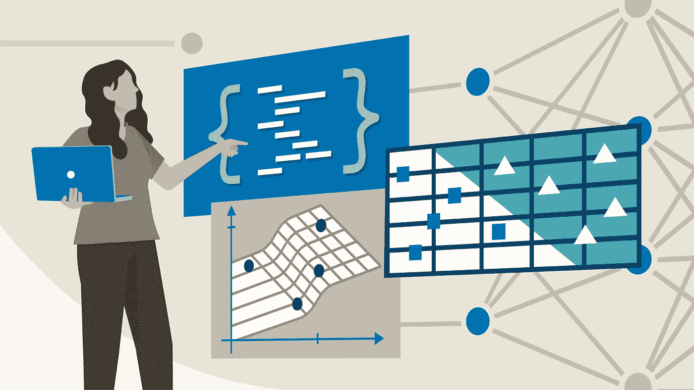
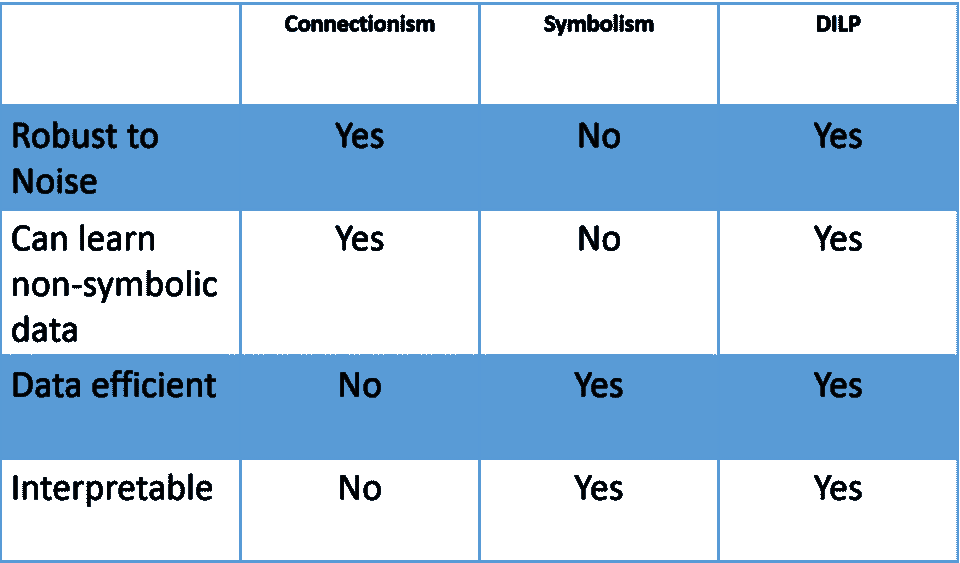
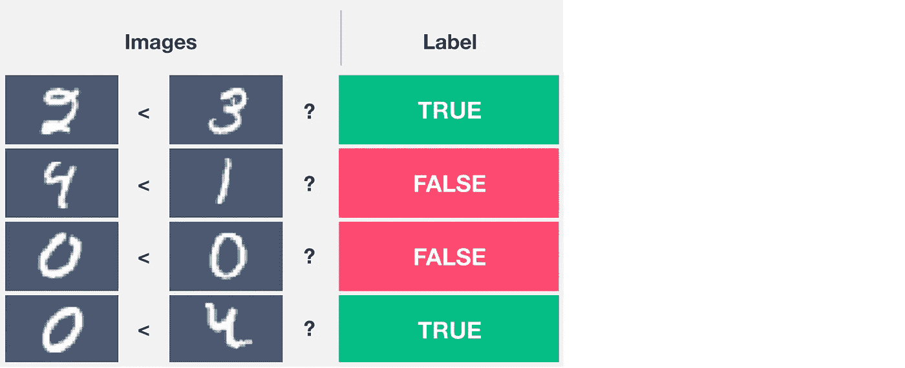
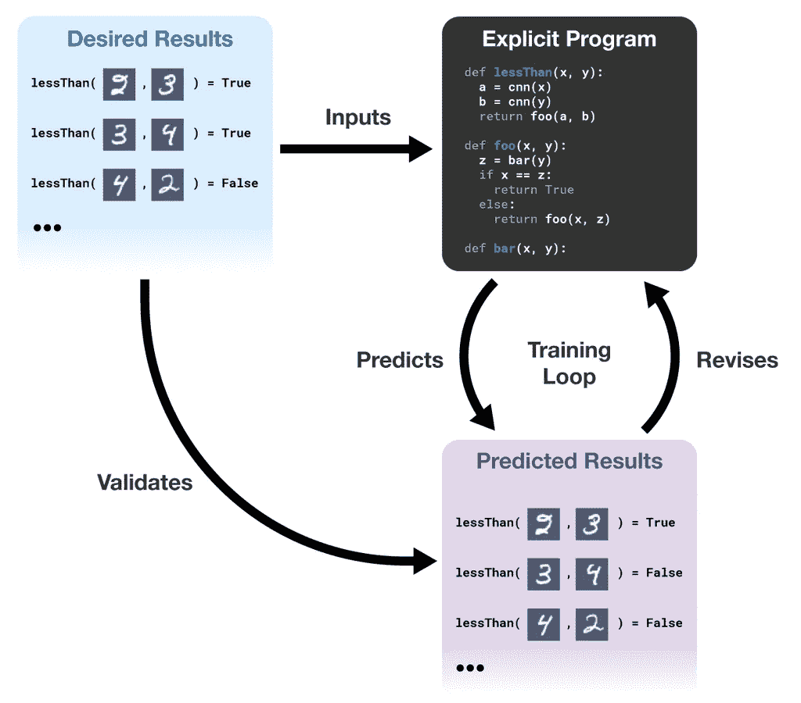
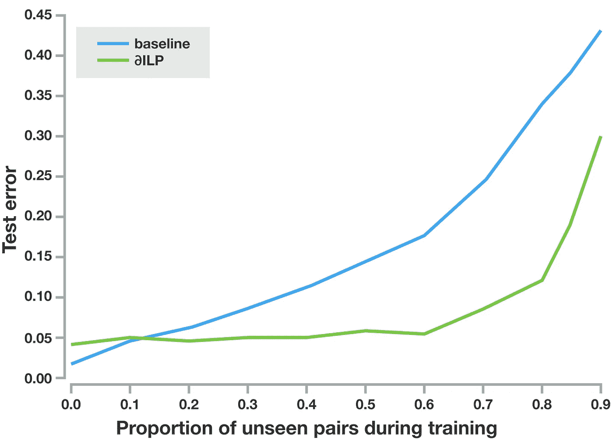

# DeepMind 结合逻辑和神经网络，从嘈杂的数据中提取规则

> 原文：<https://pub.towardsai.net/deepmind-combines-logic-and-neural-networks-to-extract-rules-from-noisy-data-aad17dab9859?source=collection_archive---------0----------------------->

## [人工智能](https://towardsai.net/p/category/artificial-intelligence)

## 新模型结合了两种不同的范式来解决数据科学中的一个主要问题。

来源:[https://www . Lynda . com/C-tutorials/Logic-gates/2841617/2400155-4 . html](https://www.lynda.com/C-tutorials/Logic-gates/2841617/2400155-4.html)

> 我最近创办了一份专注于人工智能的教育时事通讯，已经有超过 80，000 名订户。《序列》是一份无废话(意思是没有炒作，没有新闻等)的 ML 导向时事通讯，需要 5 分钟阅读。目标是让你与机器学习项目、研究论文和概念保持同步。请通过订阅以下内容来尝试一下:

 [## 序列

### 订阅人工智能世界中最相关的项目和研究论文。受到 85，000 多人的信任…

thesequence.substack.com](https://thesequence.substack.com/) 

[人工智能研究员佩德罗·多明戈斯(Pedro Domingos)在他的书《大师算法》(The Master Algorithm)](https://www.amazon.com/Master-Algorithm-Ultimate-Learning-Machine/dp/1501299387)中，探索了一种可以结合机器学习主要流派的单一算法的想法。这个想法，毫无疑问，是非常雄心勃勃的，但我们已经看到了它的一些迭代。去年，谷歌发表了一篇研究论文，标题很吸引人[“一个模型来学习所有的知识”](https://arxiv.org/abs/1706.05137)，在一个单一的机器学习模型下结合了异构学习技术。几年前，Alphabet 的子公司 DeepMind 通过[引入一种称为可微分归纳逻辑 Programming(∂ILP 的新技术](https://arxiv.org/pdf/1711.04574.pdf)向多模型算法迈出了另一步，这种新技术将逻辑和神经网络结合到一个模型中，从嘈杂的数据中提取规则。

∂ILP 汇集了两个主要的机器学习学校。连接主义者试图通过模仿神经网络形式的大脑表示来对知识进行建模，并且一直是深度学习等运动的驱动力。符号主义者依靠逻辑，根据充分理解的规则对知识进行建模。这两所学校都有众所周知的优点和缺点。基于归纳逻辑编程(ILP)的符号系统倾向于有效地概括知识，并且它们对过拟合是半免疫的。此外，ILP 系统往往非常适合迁移学习场景，在这种场景中，经过训练的模型可以被复制并在其他模型中重用。ILP 系统的主要限制是它们与噪音或模糊数据的斗争，这在深度学习场景中很常见。

连接主义系统倾向于在有噪声数据的环境中工作良好，并且可以有效地处理不确定性和模糊性。然而，它们的培训和版本化往往很昂贵。此外，从联结主义系统中学习到的知识很难理解，这与符号主义模型的清晰形成对比。多年来，许多专家强调了将鲁棒连接主义学习和符号关系学习相结合的理论价值。∂ILP 无疑是朝着正确方向迈出的一步。

从概念上讲，∂ILP 将神经网络与 ILP 结合起来，提供了一个可以处理有噪声和模糊数据的模型，同时还可以很好地概括和避免恶化。通过结合两个世界的优点，∂ILP 是一种不同于连接主义模型的技术，它可以象征性地概括知识，同时也不同于传统的象征主义模型，它可以直观地概括知识。下面的矩阵可能有助于说明这三个思想流派之间的比较。

来源:https://arxiv.org/pdf/1711.04574.pdf

为了解释∂ILP 的能力，让我们使用一个基本的归纳任务，其中一对图像代表数字，并且必须输出一个标签(0 或 1 ),指示左图像的数字是否小于右图像的数字。解决这个问题需要两种思维:你需要直觉的感性思维来识别图像是一个特定数字的表示，你需要概念思维来理解小于关系的全部一般性。

来源:https://arxiv.org/pdf/1711.04574.pdf

下面说明的任务不是什么特别新的东西，可以使用标准的深度学习模型来解决，如卷积神经网络(CNN)。虽然 CNN 模型完全能够识别数字的新图像，但它很可能无法识别数字本身。换句话说，深度学习策略如 CNN 能够实现视觉概括，但不能实现符号概括。

∂ILP 不同于标准的神经网络，因为它能够符号化地概括，它也不同于标准的符号程序，因为它能够可视化地概括。它从可读、可解释和可验证的例子中学习明确的程序。∂ILP 得到了一部分例子，并编写了一个满足这些例子的程序。它使用梯度下降搜索程序空间。如果程序的输出与来自参考数据的期望输出冲突，则系统修改程序以更好地匹配数据。

来源:https://arxiv.org/pdf/1711.04574.pdf

之前实验的结果表明，∂ILP 能够在象征性和视觉上超越其他逻辑和深度学习模型建立的基线。

来源:https://arxiv.org/pdf/1711.04574.pdf

∂ILP 非常有创意地将机器学习领域的两个主要部落聚集在一起。将联结主义系统的直觉知识与符号主义者的概念知识结合起来，就更接近于模拟人类的认知，也许，就更接近于多明戈的主算法。