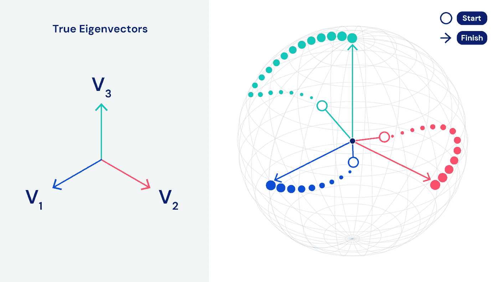
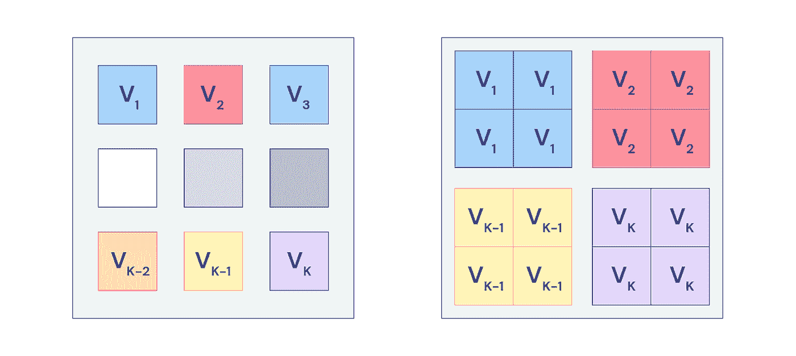

# DeepMind 希望重新想象机器学习中最重要的算法之一

> 原文：<https://pub.towardsai.net/deepmind-wants-to-reimagine-one-of-the-most-important-algorithms-in-machine-learning-381884d42de?source=collection_archive---------0----------------------->

## [人工智能](https://towardsai.net/p/category/artificial-intelligence)

## 在今年最重要的论文之一中，DeepMind 提出了一个多智能体结构来重新定义 PCA。

来源:[https://www . kdnugges . com/2020/03/crash-course-game-theory-machine-learning . html](https://www.kdnuggets.com/2020/03/crash-course-game-theory-machine-learning.html)

> 我最近创办了一份专注于人工智能的教育时事通讯，已经有超过 80，000 名订户。《序列》是一份无废话(意思是没有炒作，没有新闻等)的 ML 导向时事通讯，需要 5 分钟阅读。目标是让你与机器学习项目、研究论文和概念保持同步。请通过订阅以下内容来尝试一下:

 [## 序列

### 订阅人工智能世界中最相关的项目和研究论文。受到 85，000 多人的信任…

thesequence.substack.com](https://thesequence.substack.com/) 

[主成分分析(PCA)](https://en.wikipedia.org/wiki/Principal_component_analysis) 是任何机器学习课程的一部分的关键算法之一。PCA 最初创建于 20 世纪初，是理解深度学习问题中常见的高维空间数据的基本算法。在发明一个多世纪后，PCA 是现代深度学习框架的一个关键部分，很少有人质疑可能有更好的方法。就在几天前，DeepMind 发表了一篇有趣的论文，试图将 PCA 重新定义为一种名为 EigenGame 的竞争性多智能体游戏。

名为“ [EigenGame: PCA 作为纳什均衡](https://openreview.net/forum?id=NzTU59SYbNq)”的 DeepMind 著作是那些仅凭标题就忍不住要读的论文之一。重新定义 PCA 听起来很可笑。然而，DeepMind 的论文在你深入研究的那一刻就非常有意义。

近年来，PCA 技术在大规模深度学习场景中遇到了瓶颈。传统的 PCA 最初是为机械设备设计的，被公式化为一个优化问题，很难在大型计算集群上扩展。PCA 的多代理方法可能能够利用大量的计算资源，并在现代 dep 学习问题中产生更好的优化。

# 本格游戏

为了将 PCA 改造成一个多代理游戏，DeepMind 需要一些基本规则，讽刺的是，这些规则来自 PCA 本身。DeepMind 最重要的贡献是将 PCA 重新表述为一种在合适的博弈中寻找纳什均衡的方法。目标游戏本身由捕捉数据集中相关性差异的特征向量组成。每个玩家控制一个特征向量，并可以通过解释数据中的差异来增加他们的分数。然而，如果球员与其他球员过于接近，他们就会受到处罚。从这个角度来看，一些玩家关心最小化差异，而另一些玩家关心最小化与环境中其他玩家的一致性。

DeepMind 的 EigenGame 游戏可以实现一个纳什均衡，即所有玩家都最优地试图最大化他们的效用。在下图中，你可以看到 EigenGame 是如何引导每个玩家从空心圆圈到箭头突出显示的最优解的。

**图片来源:DeepMind**

EigenGame 的多代理性质意味着优化问题可以分布在大型计算集群中。每个玩家可以在单独的设备中计算特定的优化，然后使用游戏动态进行汇总。

**图片来源:DeepMind**

EigeGame 代表了将机器学习问题设计为多智能体游戏系统的最著名的例子之一。将 PCA 重新表述为多主体动态是令人着迷的，但是该原理肯定扩展到机器学习中的许多其他优化问题。